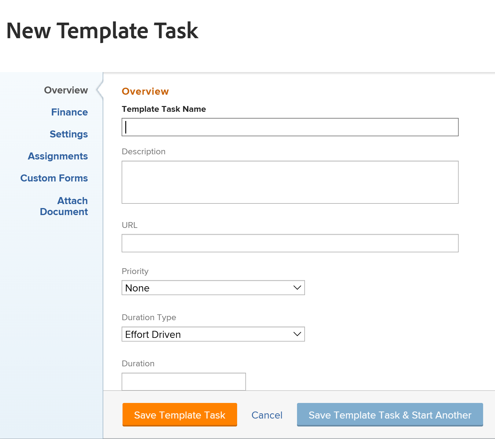

# Create a project template

<!-- Audited: 10/2025 -->

You can create and delete templates from the Templates area. When building a new template, you can enter the information for all of the tasks and for your future project settings. This information will then transfer to any project that you create from the template.

>[!NOTE]
>
>A template and its tasks do not have actual dates, but rather an indication of which day (from when the future project might start) a task might start and on which day the task might need to complete. When using templates to create the future projects, the projects will receive actual dates. For information, see [Create a project](../create-projects/create-project.md).

You can create a new template in the following ways:

* From scratch, as described in this article.
* From existing projects, by saving a project as a template.

  For more information about creating templates from existing projects, see [Save a project as a template](../../../manage-work/projects/manage-projects/save-project-as-template.md).

* By copying it from another template.

  For more information about copying an existing template, see [Copy a project template](../../../manage-work/projects/create-and-manage-templates/copy-template.md).

* By importing Blueprints. You must be a Workfront administrator to import Blueprints. For information, see [Configure a blueprint](../../../administration-and-setup/blueprints/configure-template-package.md).

## Access requirements

+++ Expand to view access requirements for the functionality in this article.

<table style="table-layout:auto"> 
 <col> 
 <col> 
 <tbody> 
  <tr> 
   <td role="rowheader">Adobe Workfront package</td> 
   <td> 
Any
 </td> 
  </tr> 
  <tr> 
   <td role="rowheader">Adobe Workfront license</td> 
   <td> 
Standard 

Plan
 
You must be a system administrator to import templates from Blueprints
 </td> 
  </tr> 
  <tr> 
   <td role="rowheader">Access level configurations</td> 
   <td> 
Edit access to Templates
 </td> 
  </tr> 
  <tr> 
   <td role="rowheader">Object permissions</td> 
   <td> 
You have Manage permissions to the templates you create, by default
  </td> 
  </tr> 
 </tbody> 
</table>

For more detail about the information in this table, see [Access requirements in Workfront documentation](/help/quicksilver/administration-and-setup/add-users/access-levels-and-object-permissions/access-level-requirements-in-documentation.md).

+++

<!--Old:
<table style="table-layout:auto"> 
 <col> 
 <col> 
 <tbody> 
  <tr> 
   <td role="rowheader">Adobe Workfront plan</td> 
   <td> 
Any
 </td> 
  </tr> 
  <tr> 
   <td role="rowheader">Adobe Workfront license</td> 
   <td> 
New: Standard 

Or 

Current: Plan 
 
You must be a system administrator to import templates from Blueprints
 </td> 
  </tr> 
  <tr> 
   <td role="rowheader">Access level configurations*</td> 
   <td> 
Edit access to Templates
 </td> 
  </tr> 
  <tr> 
   <td role="rowheader">Object permissions</td> 
   <td> 
You have Manage permissions to the templates you create, by default
  </td> 
  </tr> 
 </tbody> 
</table>-->

## Create a template

{{step1-to-templates}}

1. Click **New Template**.

   The template is untitled.

   

1. Specify a name for the new template in the template header, then press **Enter.**
1. Click the **Template Tasks** section in the left panel. 
1. Click **Start Adding Template Tasks** to add tasks inline

   Or

   Click **New Template Task** to start adding tasks to your template in the **New Template Task** box.

   

   <!--The Create Template Task opens in the new experience.-->

   <!--
   1. (Conditional) Using the new experience, update information in the following areas in the **Create Template Task** box:
   

   * Template Task Name
   * Overview
   * Assignments
   * Finance
   * Custom Forms
   * Documents
   * Settings 
   

   1. Click **Save**
   Or (*******remove the 1. from the step below and continue with those steps here*********)
   1. (Optional) Click **Switch back to old experience** at the bottom of the **Create Template Task** box.
   The **New Template Task** opens. (************add screen shot***********)-->

1. Update information in the following areas in the **New Template Task** box:

   * Overview
   * Finance
   * Settings
   * Assignments
   * Custom Forms
   * Attach Document

      Updating information for a template task is similar to editing tasks on a project. For more information, see [Edit tasks](/help/quicksilver/manage-work/tasks/manage-tasks/edit-tasks.md). <!--should this be relinked at preview/ prod release to say it's the same as Edit template tasks??-->

   >[!NOTE]
   >
   >You cannot add recurring tasks to a template.

1. Click one of the following:

   * **Save Template Task** to save the current template task and closes the New Template Task box.
   * **Save Template Task & Start Another** to save the current template task and open another New Template Task box to add another task.
   * **Cancel** to close the box without saving the template task.
1. (Optional) After adding the template tasks, in the Template Tasks section, click the **Gantt chart** icon in the upper-right corner of the Task List to see a visual representation of the template's task list.

   >[!TIP]
   >
   >You cannot edit tasks directly from this Gantt chart.

1. To add information to your new template, click the **More** menu  to the left of the template name in the header, then click **Edit**.

   For information about editing a template, see [Edit project templates](../../../manage-work/projects/create-and-manage-templates/edit-templates.md).

   >[!NOTE]
   >
   >   A project template's association with a group (or lack of a group) affects how project, task, and issue preferences determine certain settings in the template. 
   >
   >For more information, see the section "How preferences apply to templates and template tasks" in the article [Create and modify a group's project templates](../../../administration-and-setup/manage-groups/work-with-group-objects/create-and-modify-a-groups-templates.md).

1. Click **Save**.
1. (Optional) Add the following items to the template

   * Documents
   * Risks
   * Approval processes
   * Billing Rates
   * Expenses
   * Queue Details
   * Topic Groups and Queue Topics

1. (Optional) Add the following items to the tasks in the template:

   * Documents
   * Expenses
   * Approvals

   For information, see the section "Add more items to a template" in the article [Edit project templates](../../../manage-work/projects/create-and-manage-templates/edit-templates.md).

