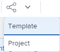

# Share project templates

You can share a template with users, or you can define how the projects that are created from a template will be shared with users by using the following sharing options at the template level.

When sharing an object in Adobe Workfront, you allow other users to view, contribute to, or edit that object.

For information about Workfront permissions, see [Overview of sharing permissions on objects](../../../workfront-basics/grant-and-request-access-to-objects/sharing-permissions-on-objects-overview.md).

For information about the permissions you can give users when sharing a template, see [Share a template](../../../workfront-basics/grant-and-request-access-to-objects/share-a-template.md).

## Access requirements

+++ Expand to view access requirements for the functionality in this article. 

<table style="table-layout:auto"> 
 <col> 
 <col> 
 <tbody> 
  <tr> 
   <td role="rowheader">Adobe Workfront package</td> 
   <td> 
Any
 </td> 
  </tr> 
  <tr> 
   <td role="rowheader">Adobe Workfront license</td> 
   <td> 
Standard

   
Plan
 </td> 
  </tr> 
  <tr> 
   <td role="rowheader">Access level configurations</td> 
   <td> 
Edit access to Templates
  </td> 
  </tr> 
  <tr> 
   <td role="rowheader">Object permissions</td> 
   <td> 
Manage permissions to a template
 </td> 
  </tr> 
 </tbody> 
</table>

For more information, see [Access requirements in Workfront documentation](/help/quicksilver/administration-and-setup/add-users/access-levels-and-object-permissions/access-level-requirements-in-documentation.md). 

+++

<!--Old:
<table style="table-layout:auto"> 
 <col> 
 <col> 
 <tbody> 
  <tr> 
   <td role="rowheader">Adobe Workfront plan*</td> 
   <td> 
Any 
 </td> 
  </tr> 
  <tr> 
   <td role="rowheader">Adobe Workfront license*</td> 
   <td> 
Plan 
 </td> 
  </tr> 
  <tr> 
   <td role="rowheader">Access level configurations*</td> 
   <td> 
Edit access to Templates
 
Note: If you still don't have access, ask your Workfront administrator if they set additional restrictions in your access level. For information on how a Workfront administrator can modify your access level, see <a href="../../../administration-and-setup/add-users/configure-and-grant-access/create-modify-access-levels.md" class="MCXref xref">Create or modify custom access levels</a>.
 </td> 
  </tr> 
  <tr> 
   <td role="rowheader">Object permissions</td> 
   <td> 
Manage permissions to a template
 
For information on requesting additional access, see <a href="../../../workfront-basics/grant-and-request-access-to-objects/request-access.md" class="MCXref xref">Request access to objects </a>.
 </td> 
  </tr> 
 </tbody> 
</table>-->

## Share a template {#share-a-template}

You can share your templates with other users using Template Sharing. This action defines who has permissions to the template.

>[!NOTE]
>
>When you designate an active user as the Template Owner, that user automatically receives Manage permissions on the template. For information about designating someone as the Template Owner, see [Edit project templates](../../../manage-work/projects/create-and-manage-templates/edit-templates.md).

To share a template:

1. From the **Main Menu** icon , click **Templates**.  

1. Do one of the following:  
   Click the name of a template to open it, then click the **More** menu , then **Template Sharing**.

   Or

   Select a template from the list, click the Share icon , then click**Template.**

   >[!TIP]
   >
   >You can share an object only with active users, teams, roles, or companies.

1. In the **Template Access** box, select the people, teams, roles, groups, or companies you want to share the template with.

   You can also click the **Options** icon to make the template available system-wide:

1. From the drop-down menu for each entity with which you are sharing, select from the following:

   * **View**: Users with these permissions are able to view the template and create a project using it, or attach it to an existing project.

     >[!TIP]
     >
     >Your Workfront administrator must give you Edit access to projects to be able to create projects.

   * **Manage**: Users with these permissions are able to edit or delete the template.

     For information about the Advanced Settings  available here, see the section [Advanced Settings for template sharing](../../../workfront-basics/grant-and-request-access-to-objects/share-a-template.md#template-permissions) in the article [Share a template](../../../workfront-basics/grant-and-request-access-to-objects/share-a-template.md).

1. Click **Save**.

## Share a project from a template {#share-a-project-from-a-template}

With template Project Sharing, you can define who has permissions on the projects created from the template at the template level.

To share future projects created from a template with users:

1. Do one of the following:  
   Click the name of a template to open it, then click the **More** menu , then **Template Sharing**.

   

   Or

   Select a template from the list, click **Share**, then click**Project.**

1. In the **Project Access** box, select the people, teams, roles, groups, or companies the template is shared with.

   >[!TIP]
   >
   >You can share an object only with active users, teams, roles, or companies.

1. From the drop-down menu for each entity, select from the following:

   * **No access**: You can specify which users will not have any access to the template.  
     This option is available only when bulk sharing projects from templates.&nbsp;
   * **View**: Users with these permissions can view projects created from the template.
   * **Contribute**: Users with these permissions can contribute to projects created from the template&nbsp;
   * **Manage**: Users with these permissions can manage or delete projects created from this template.

1. (Optional) Click the **Options** icon to make the projects available system-wide.
1. Click **Save**.

<!--

<h3>Overview of project sharing from other sources</h3>

You may already have been assigned access to projects from other areas of Workfront.  You may have been assigned access to projects from the following areas: 

<ul>
<li>When a project is created For more information about sharing projects when the project is created, see the "Access" section in <a href="../../../manage-work/projects/manage-projects/edit-projects.md" class="MCXref xref">Edit projects</a>.</li>
<li>When your Workfront administrator sets user access levels For more information about setting access levels, see <a href="../../../administration-and-setup/add-users/configure-and-grant-access/create-modify-access-levels.md" class="MCXref xref">Create or modify custom access levels</a>.</li>
<li>When using the project access template</li>
</ul>

When using the Template Project Sharing feature, if a user's access to a project is View, but you set the access permissions for Template Project Sharing to Manage, the user will have Manage permission for every project created using this specific template. The user will only have View permission for the other projects they are on.

-->

## Share templates and projects from templates in bulk

You can share multiple templates as well as projects from multiple templates at the same time.

>[!NOTE]
>
>When you select multiple templates, you cannot view who already has permissions to the individual templates.

1. Go to a list of templates.
1. Select multiple templates, then click .

   

   >[!TIP]
   >
   >You can share an object only with active users, teams, roles, or companies.

1. Click **Template** to share the selected templates.

   Or

   Click **Project** to share the projects that will be created from the selected templates. 

1. Continue sharing the templates or the projects, as described in the following sections in this article:

   * [Share a template](#share-a-template) 
   * [Share a project from a template](#share-a-project-from-a-template)
