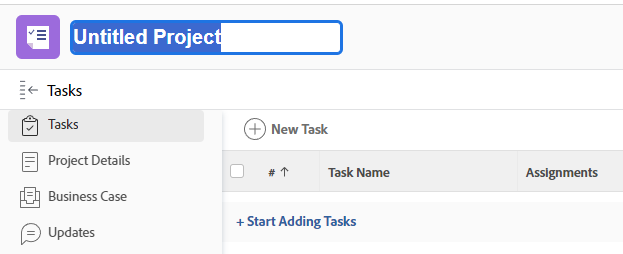

# Create a project connected with Frame.io

The Workfront and Frame.io integration allows you to create projects in Workfront that are mirrored in Frame.io providing a seamless review and approval experience. 

When a Workfront project is connected with Frame.io, you can 

* **Assign Frame.io users to tasks**: Frame.io enabled users are notified by email when they are assigned to a Workfront task, signaling there is work to complete. 
* **Share the project with Frame.io users**: When a project is shared with Frame.io enabled users, they have access to the project inside both Workfront and Frame.io.
* **Share creative materials with Frame.io**: Project coordinators can send instructions and materials from Workfront directly to the creative user in Frame.io using a one-way sync project folder. [!BADGE Coming soon]{type=Informative}
* **Track task progress**: Creatives can send finished assets and mark tasks complete--all without leaving Frame.io.

## Access requirements

>[!IMPORTANT]
>
>This functionality is available only to organization that have been onboarded to the [!DNL Adobe Admin Console].

You must have the following:

<table>
  <tr>
   <td><strong>[!DNL Adobe Workfront] plan</strong>
   </td>
   <td>Any
   </td>
  </tr>
  <tr>
   <td><strong>[!DNL Adobe Workfront] licenses</strong>
   </td>
   <td> New: [!UICONTROL Standard]
   </td>
  </tr>
  <tr>
   <td><strong>Product</strong>
   </td>
   <td>You must have Frame.io.
   </td>
  </tr>
  <tr>
   <td><strong>Access level configurations</strong>
   </td>
   <td>You must be a [!DNL Workfront] administrator.
   </td>
  </tr>
 
</table>

For more detail about the information in this table, see [Access requirements in Workfront documentation](/help/quicksilver/administration-and-setup/add-users/access-levels-and-object-permissions/access-level-requirements-in-documentation.md).

## Prerequisites

* Set up the default Frame.io account in the Workfront setup area
* Enable Frame.io users in the Workfornt user profile

For more information about the prerequisites above, see [Configure the [!DNL Workfront] and [!DNL Frame.io] integration](/help/quicksilver/administration-and-setup/configure-integrations/configure-wf-and-frame.md).

## Create a new project

<!-- is there a way to access the frame connected project from workfront? -->

When you have a default Frame.io account set up in the Workfront setup area, any project created in Workfront has a mirror project in Frame.io.

>[!TIP]
>
>If most of your projects have similar tasks and requirements, we recommend creating a project template, so you can do the setup once and then easily create a project time after time. For more information, see [Create a new project template](#create-a-new-project-template) below.

{{step1-to-projects}}

1. Click **New project**. 

    >[!NOTE]
    >
    >Workfront has robust project management capabilities. For more detailed information on creating and configuring a project, see [Create a project](/help/quicksilver/manage-work/projects/create-projects/create-project.md). 

1. Type a name for your project. Press Enter to save the name.

   

   The header of the project page displays a quick overview of the current health and progress of a project. The information in the project header changes as the project information is updated.

### Add tasks and assign Frame.io enabled users

1. Click **Start Adding Tasks** and build out the project. 

1. Assign Frame.io enabled users or teams to the tasks your creative users need access to in Frame.io.

    >[!NOTE]
    >
    > For more detailed information about task configuration, see [Create tasks in a project](../../../manage-work/tasks/create-tasks/create-tasks-in-project.md).

### Share creative materials with Frame.io [!BADGE Coming soon]{type=Informative}

1. Go to Project Documents on the left-side 
1. in the folder, drop the documents

## Configure project details and set the status to current

1. (Optional) Edit the project details by clicking the **More** menu and then **Edit**  next to the name of the project.

   The **Edit Project** dialog box opens.

   For more information about editing a project, see [Edit projects](../../../manage-work/projects/manage-projects/edit-projects.md).

1. After configuring the project settings and adding the tasks, you can change the status of the project to **Current**.

   This indicates that the project is now ready to start and users assigned to the tasks can now start working on them.

### Initiate document approvals for connected assets

After the project is created and creatives upload finished assets, you can assign a review and approval workflow to the asset in Workfront. 

For more infomation, see [Create a document review or approval request](/help/quicksilver/review-and-approve-work/document-reviews-and-approvals/manage-document-approvals/create-a-document-approval.md). <!-- name may need to change -->

## Create a new project template

<!-- is there a way to access the frame connected project from workfront? -->

When you have a default Frame.io account set up in the Workfront setup area, any project created in Workfront has a mirror project in Frame.io.

The steps below outline how to either create a new project or a project template. If your projects have similar requirements, we recommend creating a project template, so you can do the setup once and then easily create a project time after time. 

{{step1-to-templates}}

1. Click **New project**. 

    >[!TIP]
    >
    >Workfront has robust project management capabilities. For more detailed information on creating and configuring a project, see [Create a project](/help/quicksilver/manage-work/projects/create-projects/create-project.md). 

1. Type a name for your project. Press Enter to save the name.

   

   The header of the project page displays a quick overview of the current health and progress of a project. The information in the project header changes as the project information is updated.

## Add tasks and assign Frame.io enabled users

1. Click **Start Adding Tasks** and build out the project. 

1. Assign Frame.io enabled users or teams to the tasks your creative users need access to in Frame.io.

    >[!NOTE]
    >
    > For more detailed information about task configuration, see [Create tasks in a project](../../../manage-work/tasks/create-tasks/create-tasks-in-project.md).

## Share creative materials with Frame.io [!BADGE Coming soon]{type=Informative}

This folder appears once the template is used to create an acutal project. 

## Create a project from the template

## Configure project details and set the status to current

<!-- normal procedure for templates?-->

1. (Optional) Edit the project details by clicking the **More** menu and then **Edit**  next to the name of the project.

   The **Edit Project** dialog box opens.

   For more information about editing a project, see [Edit projects](../../../manage-work/projects/manage-projects/edit-projects.md).

1. After configuring the project settings and adding the tasks, you can change the status of the project to **Current**.

   This indicates that the project is now ready to start and users assigned to the tasks can now start working on them.

## Initiate document approvals for connected assets

After the project is created and creatives upload finished assets, you can assign a review and approval workflow to the asset in Workfront. 

For more infomation, see [Create a document review or approval request](/help/quicksilver/review-and-approve-work/document-reviews-and-approvals/manage-document-approvals/create-a-document-approval.md). <!-- name may need to change -->