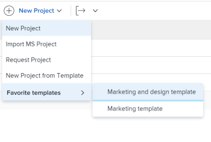
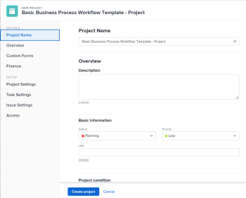

# Create a project using a template

You can use templates as a framework to create new projects. If you have projects that repeat often, using templates for the general timeline of the new project saves you from having to build the same projects repeatedly.

Templates provide you with a way to capture all of the repeatable processes, information, and settings associated with your projects. All of the information associated with a template is transferred to the project. This includes tasks, assignments, durations, documents, financial details, risks, and custom forms.

>[!TIP]
>
>The status of a new project created from a template corresponds with the status defined by your Workfront administrator in the main Project Preferences area or by a group administrator (or Workfront administrator) in the Project Preferences area for a group. For information about configuring project preferences, see [Configure system-wide project preferences](../../../administration-and-setup/set-up-workfront/configure-system-defaults/set-project-preferences.md) or [Configure project preferences for a group](../../../administration-and-setup/manage-groups/create-and-manage-groups/configure-project-preferences-group.md).

You have the following options for creating a project from a template:

* Create a project from a template in the Projects area
* Create a project from a template at the template level
* Attach a template to an existing project

  For information, see [Attach a template to a project](../../../manage-work/projects/create-and-manage-templates/attach-template-to-project.md).

* Create a project from a template in the Groups area

## Access requirements

You must have the following access to perform the steps in this article:

<table style="table-layout:auto"> 
 <col> 
 <col> 
 <tbody> 
  <tr> 
   <td role="rowheader">Adobe Workfront plan*</td> 
   <td> 
Any 
 </td> 
  </tr> 
  <tr> 
   <td role="rowheader">Workfront licenses overview*</td> 
   <td> 
Plan 
 </td> 
  </tr> 
  <tr> 
   <td role="rowheader">Access level*</td> 
   <td> 
Edit access to Projects and to Templates
 
Note: If you still don't have access, ask your Workfront administrator if they set additional restrictions in your access level. For information about access to projects, see <a href="../../../administration-and-setup/add-users/configure-and-grant-access/grant-access-projects.md" class="MCXref xref">Grant access to projects</a>. For information on how a Workfront administrator can change your access level, see <a href="../../../administration-and-setup/add-users/configure-and-grant-access/create-modify-access-levels.md" class="MCXref xref">Create or modify custom access levels</a>. 
 </td> 
  </tr> 
  <tr> 
   <td role="rowheader">Object permissions</td> 
   <td> 
View permissions to a template
 
When you create a project you automatically receive Manage permissions to the project 
 
 For information about project permissions, see <a href="../../../workfront-basics/grant-and-request-access-to-objects/share-a-project.md" class="MCXref xref">Share a project in Adobe Workfront</a>.
 
For information on requesting additional access, see <a href="../../../workfront-basics/grant-and-request-access-to-objects/request-access.md" class="MCXref xref">Request access to objects </a>.
 </td> 
  </tr> 
 </tbody> 
</table>

&#42;To find out what plan, license type, or access you have, contact your Workfront administrator.

## Create a project from a template in the Projects area

You can create a project from the Projects area in the Main Menu , or from the Projects area of a portfolio or a program.

1. Do one of the following:

   * Click the **Main Menu** , click **Projects**, then expand **New Project**. 
   * Go to a portfolio, then expand **New Project**.

     >[!TIP]
     >
     >When you create a project using a template from a portfolio, the Portfolio field of the new project updates to display the portfolio you chose to create the project from. This overwrites the Portfolio field on the template, if it is specified.

   * Go to a program, then expand **New Project**.

     >[!TIP]
     >
     >When you create a project using a template from a program, the Program field of the new projects updates to display the Program you chose to create the project from. The Portfolio field of the template updates to display the portfolio of the program you chose to create the project from. This overwrites the Program and Portfolio fields on the template, if they are specified.

   * If you are a group administrator, you can also create a project in the Projects section of a group you manage. For more information, see [Create and modify a group's projects](../../../administration-and-setup/manage-groups/work-with-group-objects/create-and-modify-a-groups-projects.md).

     >[!TIP]
     >
     >When you create a project using a template from a group, the group you create the project from displays in the Group field of the new project only when the Group field of the template is not specified. If the template Group field is specified, the Group field of the new project is that of the template.

   <!--
   
(NOTE: this, above, is hyperlinked to the classic version of this article; the Milestone View steps are similar to creating a project in Classic than to the way you do it in NWE)

   -->

   

   * In the Preview environment, go to a **Campaign** and expand **New Project**.

    >[!NOTE]
    >
    >    Campaigns are available only in the Preview environment when you participate in the [!UICONTROL Campaigns] beta program. The functionality described here might not be fully available yet. For more information about current available features and how to enroll, see [Campaigns beta](../../../product-announcements/betas/campaign-object-beta.md). For information about adding projects to a campaign, see [Add objects to a campaign](../../campaigns/add-objects-to-a-campaign.md). 

1. Click the name of a template in the **Favorite templates** list

   

   Or

   Do the following:

   1. Select **New Project from Template**.
   1. In the **Search Templates** field, start typing the name of a template and click it when it displays in the list.
   1. Review template details on the right.
   
      The template details include the following:

      * Template duration
      * Template owner
      * The number of top-level tasks which includes the names of the top three tasks
      * The number of all tasks in the template
      * The names of the template custom forms

   1. (Optional)&nbsp;Hover over the name of a template name and click the **Favorites** **icon**  to mark it as a favorite for future use.

      Or

      Expand the **Favorite templates** list and select a template from the drop-down list.

      >[!TIP]
      >
      >You can have up to 40 Workfront items marked as favorites. This includes templates and other items.

   1. Click **Use template** when you have selected a template.

   

   >[!NOTE]
   >
   >If you have the Milestone View applied to the list of projects, click the name of a template in the **New from Template section**. 
   >
   >
   >   >
   >

1. The **New Project** box opens.

   

1. If a field is already populated in the template, the field is pre-populated in the **New Project** box. You can edit the pre-populated values to better match your project. For more information, see [Edit projects](../../../manage-work/projects/manage-projects/edit-projects.md).
1. Click **Create Project**.

   All details defined in the template associate automatically with the newly created project if you didn't change them in the previous step.

## Create a project from a template in the Templates area

Instead of starting in the Projects area, you can create a project from a template by starting with the template.

&nbsp;

1. From the **Main Menu**, click **Templates**.

1. Click the name of a template you want to use.
1. Click the **More** menu , then click **Create Project.**

   

   The **New Project** box opens.

1. Specify a name for the project, then review each section and make any necessary changes.

   

   If a field is already populated in the template, the field is pre-populated in the **New Project** box. You can edit the pre-populated values to better match your project. For more information, see [Edit projects](../../../manage-work/projects/manage-projects/edit-projects.md).

1. Click **Create Project.**

   All details defined in the template associate automatically with the newly created project if you didn't change them in the previous step.
