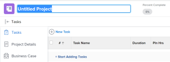

# Create a project

<!--

(NOTE:this is linked from the UI from the Projects global nav section in classic. Do not change/ remove)

-->

Projects represent a large amount of work that needs to be done in Adobe Workfront.

## Access requirements

You must have the following access to perform the steps in this article:

<table style="table-layout:auto"> 
 <col> 
 <col> 
 <tbody> 
  <tr> 
   <td role="rowheader">Workfrontplan*</td> 
   <td> 
Any
 </td> 
  </tr> 
  <tr> 
   <td role="rowheader">Workfront license*</td> 
   <td> 
Plan 
 </td> 
  </tr> 
  <tr> 
   <td role="rowheader">Access level*</td> 
   <td> 
Edit access to Projects
 
Note: If you still don't have access, ask your Workfront administrator if they set additional restrictions in your access level. For information about access to projects, see <a href="../../../administration-and-setup/add-users/configure-and-grant-access/grant-access-projects.md" class="MCXref xref">Grant access to projects</a>. For information on how a Workfront administrator can change your access level, see <a href="../../../administration-and-setup/add-users/configure-and-grant-access/create-modify-access-levels.md" class="MCXref xref">Create or modify custom access levels</a>. 
 </td> 
  </tr> 
  <tr> 
   <td role="rowheader">Object permissions</td> 
   <td> 
When you create a project you automatically receive Manage permissions to the project 
 
 For information about project permissions, see <a href="../../../workfront-basics/grant-and-request-access-to-objects/share-a-project.md" class="MCXref xref">Share a project in Adobe Workfront</a>.
 
For information on requesting additional access, see <a href="../../../workfront-basics/grant-and-request-access-to-objects/request-access.md" class="MCXref xref">Request access to objects </a>.
 </td> 
  </tr> 
 </tbody> 
</table>

&#42;To find out what plan, license type, or access you have, contact your Workfront administrator.

## Ways to create projects

You can create a project in Workfront by using one of the following methods:

* Create a project from scratch without using a template. This article describes how to create a project from scratch. 

* Copy an existing project.  
  For more information about copying project, see [Copy a project](../../../manage-work/projects/manage-projects/copy-project.md).

* Use a template.  
  For more information about using a template to create a new project, see [Create a project using a template](../../../manage-work/projects/create-projects/create-project-from-template.md).

* Import a project from Microsoft Project.  
  For more information about importing a project from MS Project, see [Import a project from Microsoft Project](../../../manage-work/projects/create-projects/import-project-from-ms-project.md).

* Import a project using kick-starts.

  As a Workfront administrator, you can import projects using a kick-start.

  For information about importing data using kick-starts in Workfront, see [Import data into Adobe Workfront using a Kick-Start template](../../../administration-and-setup/manage-workfront/using-kick-starts/import-data-via-kickstarts.md) .

  For information about importing projects using kick-starts, see [Kick-Starts scenario: simple project and task import preparation](../../../administration-and-setup/manage-workfront/using-kick-starts/kick-starts-scenario-simple-project-task-import-prep.md) .

* Publish an initiative from a scenario in the Adobe Workfront Scenario Planner. The Scenario Planner requires an additional license. For information about the Workfront Scenario Planner, see [The Scenario Planner overview](../../../scenario-planner/scenario-planner-overview.md). For information about creating projects from publishing initiatives, see  [Update or create projects by publishing initiatives in the Scenario Planner](../../../scenario-planner/publish-scenarios-update-projects.md).

## Prerequisites

Before you begin, ensure you have the following:

* Your system or group administrator enabled the Allow users to create projects without using a template preference in the Setup area. 
  
  For more information, see [Configure system-wide project preferences](../../../administration-and-setup/set-up-workfront/configure-system-defaults/set-project-preferences.md).

## New project default settings

When you create a project, Workfront applies a set of default settings to it. For example, the Status, Group, or Schedule Mode are preset when you create a project.

Consider the following:

* As a Workfront administrator or a group administrator, you can configure the default settings for a new project when configuring Project Preferences.
* Workfront applies the settings of the group, if there are any, before it applies those set by the Workfront administrator. 
* If you create a project using a template, the settings from the template take precedence over the settings established by the Workfront or group administrator.

>[!NOTE]
>
>We recommend that the default status for a new project is Planning. As you are making changes to the new project, this ensures that notifications do not trigger to the users assigned to the project.

For more information about setting up the default status and other default settings for a new project, see [Configure system-wide project preferences](../../../administration-and-setup/set-up-workfront/configure-system-defaults/set-project-preferences.md).

## Create a project from scratch

1. Do one of the following:

   * Click the **Main Menu** , click **Projects**, then expand **New Project**. 
   * Go to a portfolio, then expand **New Project**.

     >[!TIP]
     >
     >When you create a project using a template from a portfolio, the Portfolio field of the new project updates to display the portfolio you chose to create the project from. This overwrites the Portfolio field on the template, if it is specified.

   * Go to a program, then expand **New Project**.

     >[!TIP]
     >
     >When you create a project using a template from a program, the Program field of the new projects updates to display the Program you chose to create the project from. The Portfolio field of the template updates to display the portfolio of the program you chose to create the project from. This overwrites the Program and Portfolio fields on the template, if they are specified.

   * If you are a group administrator, you can also create a project in the Projects section of a group you manage. For more information, see [Create and modify a group's projects](../../../administration-and-setup/manage-groups/work-with-group-objects/create-and-modify-a-groups-projects.md).

     >[!TIP]
     >
     >When you create a project using a template from a group, the group you create the project from displays in the Group field of the new project only when the Group field of the template is not specified. If the template Group field is specified, the Group field of the new project is that of the template.

   

1. Click **New Project** if you want to create a project from scratch.
1. Enter a name for your project. Press Enter to save the name.

   

   The header of the project page displays a quick overview of the current health and progress of a project. The information in the project header changes as the project information is updated.

1. Click **Start Adding** **Tasks**.

   Or

   Click **New Task** to add tasks to the project and assign resources to them.   
   For more information about adding tasks to a project, see [Create tasks in a project](../../../manage-work/tasks/create-tasks/create-tasks-in-project.md).

1. Edit the project details, by clicking the**More menu** and then **Edit**  next to the name of the project.

   The **Edit Project** dialog box opens.

   For more information about editing a project, see [Edit projects](../../../manage-work/projects/manage-projects/edit-projects.md).

1. (Optional) After configuring the project settings and add the tasks, you can change the status of the project to **Current**.

   This indicates that the project is now ready to start and users assigned to the tasks can now start working on them.

   For more information about project statuses, see [Access the list of system project statuses](../../../administration-and-setup/customize-workfront/creating-custom-status-and-priority-labels/project-statuses.md).

