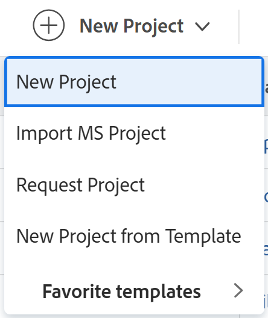

# Import a project from Microsoft Project

You can import projects from Microsoft Project into Adobe Workfront and manage all your projects in one application. Every time you import a project from Microsoft Project, a new project is created in Workfront.

>[!IMPORTANT]
>
>Not all Microsoft Project fields are transferred to Workfront. 
>
>For more information about the compatibility of fields between Workfront and Microsoft Project, see [Map Microsoft Project fields to Adobe Workfront projects](../../../manage-work/projects/manage-projects/map-ms-project-fields-to-workfront.md).

## Access requirements

<table style="table-layout:auto"> 
 <col> 
 <col> 
 <tbody> 
  <tr> 
   <td role="rowheader">Adobe Workfront plan*</td> 
   <td> 
Any
 </td> 
  </tr> 
  <tr> 
   <td role="rowheader">Adobe Workfront license*</td> 
   <td> 
New license: Standard 
 
   Or
   
Current license: Plan 

   </td> 
  </tr> 
  <tr> 
   <td role="rowheader">Access level*</td> 
   <td> 
Edit access to Projects
 
<b>NOTE</b>
   
   If you still don't have access, ask your Workfront administrator if they set additional restrictions in your access level. For information about access to projects, see <a href="../../../administration-and-setup/add-users/configure-and-grant-access/grant-access-projects.md" class="MCXref xref">Grant access to projects</a>. For information on how a Workfront administrator can change your access level, see <a href="../../../administration-and-setup/add-users/configure-and-grant-access/create-modify-access-levels.md" class="MCXref xref">Create or modify custom access levels</a>. 
 </td> 
  </tr> 
  <tr> 
   <td role="rowheader">Object permissions</td> 
   <td> 
When you create a project you automatically receive Manage permissions to the project 
 
 For information about project permissions, see <a href="../../../workfront-basics/grant-and-request-access-to-objects/share-a-project.md" class="MCXref xref">Share a project in Adobe Workfront</a>.
 
For information on requesting additional access, see <a href="../../../workfront-basics/grant-and-request-access-to-objects/request-access.md" class="MCXref xref">Request access to objects </a>.
 </td> 
  </tr> 
 </tbody> 
</table>

*To find out what plan, license type, or access you have, contact your Workfront administrator.

<!--old permissions model: 

You must have the following access to perform the steps in this article:

<table style="table-layout:auto"> 
 <col> 
 <col> 
 <tbody> 
  <tr> 
   <td role="rowheader">Adobe Workfront plan*</td> 
   <td> 
Any
 </td> 
  </tr> 
  <tr> 
   <td role="rowheader">Adobe Workfront license*</td> 
   <td> 
Plan 
 </td> 
  </tr> 
  <tr> 
   <td role="rowheader">Access level*</td> 
   <td> 
Edit access to Projects
 
<b>NOTE</b>
   
   If you still don't have access, ask your Workfront administrator if they set additional restrictions in your access level. For information about access to projects, see <a href="../../../administration-and-setup/add-users/configure-and-grant-access/grant-access-projects.md" class="MCXref xref">Grant access to projects</a>. For information on how a Workfront administrator can change your access level, see <a href="../../../administration-and-setup/add-users/configure-and-grant-access/create-modify-access-levels.md" class="MCXref xref">Create or modify custom access levels</a>. 
 </td> 
  </tr> 
  <tr> 
   <td role="rowheader">Object permissions</td> 
   <td> 
When you create a project you automatically receive Manage permissions to the project 
 
 For information about project permissions, see <a href="../../../workfront-basics/grant-and-request-access-to-objects/share-a-project.md" class="MCXref xref">Share a project in Adobe Workfront</a>.
 
For information on requesting additional access, see <a href="../../../workfront-basics/grant-and-request-access-to-objects/request-access.md" class="MCXref xref">Request access to objects </a>.
 </td> 
  </tr> 
 </tbody> 
</table>

-->

## Create a project from a MS&nbsp;Project

You can create a project from the Projects area in theMain Menu, or from the Projects area of a portfolio or a program.

1. Go to Microsoft Project and open a project that you want to import from in Workfront. 
1. Click **File**, then **Save As** to save the project as an .xml file. 

1. Log in to Workfront. 
1. Do one of the following:

   * Click the **Main Menu** , click **Projects**, then expand **New Project**.  
   * Go to a portfolio, then expand **New Project**. 
   * Go to a program, then expand **New Project**. 
   * If you are a group administrator, you can also create a project in the Projects section of a group you manage. For more information, see [Create and modify a group's projects](../../../administration-and-setup/manage-groups/work-with-group-objects/create-and-modify-a-groups-projects.md).

1. Choose the **Import MS Project** option.

   

1. Click **Select File**, then browse for the .xml file on your computer which you exported from Microsoft Project. 
1. Import the selected file.

   Workfront begins the import process and creates a new project based on the file exported from Microsoft Project.

   After the import process is complete, you are directed to the new project page that displays a confirmation that the import has completed successfully.

   >[!NOTE]
   >
   >Workfront has a 15-minute time limitation on file uploads. If the file upload takes longer than that, we recommend that you break out your project into smaller projects and import them separately. Once they have been imported into Workfront, move the tasks from one project to the other project to combine them into one project. For information on moving tasks, see [Move tasks](../../../manage-work/tasks/manage-tasks/move-tasks.md).

1. (Optional) Continue editing the project in Workfront. For information about editing projects, see [Edit projects](../../../manage-work/projects/manage-projects/edit-projects.md).

   The status of a new project created from a template corresponds with the status defined by your Workfront administrator in the Project Preferences area or by a group administrator in the Group Project Preferences area. For information about configuring project preferences, see [Configure system-wide project preferences](../../../administration-and-setup/set-up-workfront/configure-system-defaults/set-project-preferences.md).
