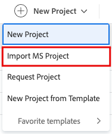

# Import a project from Microsoft Project

<!-- Audited: 4/2025 -->

You can import projects from Microsoft Project into Adobe Workfront and manage all your projects in one application. Every time you import a project from Microsoft Project, a new project is created in Workfront.

>[!IMPORTANT]
>
>Not all Microsoft Project fields are transferred to Workfront. 
>
>For more information about the compatibility of fields between Workfront and Microsoft Project, see [Map Microsoft Project fields to Adobe Workfront projects](../../../manage-work/projects/manage-projects/map-ms-project-fields-to-workfront.md).

## Access requirements

+++ Expand to view access requirements for the functionality in this article. 

<table style="table-layout:auto"> 
 <col> 
 <col> 
 <tbody> 
  <tr> 
   <td role="rowheader">Adobe Workfront package</td> 
   <td> 
Any
 </td> 
  </tr> 
  <tr> 
   <td role="rowheader">Adobe Workfront license</td> 
   <td> 
Standard
 
    
Plan

   </td> 
  </tr> 
  <tr> 
   <td role="rowheader">Access level configuration</td> 
   <td> 
Edit access to Projects
 
   
If you add a project to a portfolio or a program, you must have Edit access to Portfolios and Programs.

   </td> 
  </tr> 
  <tr> 
   <td role="rowheader">Object permissions</td> 
   <td> 
When you create a project you automatically receive Manage permissions to the project

   
If you add a project to a portfolio or a program, you must have Manage permissions to the portfolio and the program.

   </td> 
    </td> 
  </tr> 
 </tbody> 
</table>

For more detail about the information in this table, see [Access requirements in Workfront documentation](/help/quicksilver/administration-and-setup/add-users/access-levels-and-object-permissions/access-level-requirements-in-documentation.md).

+++

<!--old permissions model: 

<table style="table-layout:auto"> 
 <col> 
 <col> 
 <tbody> 
  <tr> 
   <td role="rowheader">Adobe Workfront plan</td> 
   <td> 
Any
 </td> 
  </tr> 
  <tr> 
   <td role="rowheader">Adobe Workfront license</td> 
   <td> 
New: Standard 
 
   Or
   
Current: Plan 

   </td> 
  </tr> 
  <tr> 
   <td role="rowheader">Access level</td> 
   <td> 
Edit access to Projects
 </td> 
  </tr> 
  <tr> 
   <td role="rowheader">Object permissions</td> 
   <td> 
When you create a project you automatically receive Manage permissions to the project 
 </td> 
  </tr> 
 </tbody> 
</table>

-->

## Create a project from a MS Project

You can create a project from the **Projects** area in the **Main Menu**, or from the **Projects** area of a portfolio or a program.

1. Log in to Microsoft Project and open a project that you want to import from in Workfront. 
1. Click **File**, then **Save As** to save the project as an .xml file. 

1. Log in to Workfront. 
1. Do one of the following:

   * Click the **Main Menu**  in the upper-right corner of Workfront, or click the **Main Menu**  in the upper-left corner, if available, click **Projects**, then expand **New Project**.  
   * Go to a portfolio, then expand **New Project**. 
   * Go to a program, then expand **New Project**. 
   * If you are a group administrator, you can create a project in the **Projects** section of a group you manage. For more information, see [Create and modify a group's projects](../../../administration-and-setup/manage-groups/work-with-group-objects/create-and-modify-a-groups-projects.md).

1. Click **Import MS Project**. The **Import MS File** dialog box appears.

   

1. Click **Select File**, then browse for the .xml file on your computer that you exported from Microsoft Project. 
1. Import the selected file. Workfront begins the import process and creates a new project based on the file exported from Microsoft Project.

   After the import process is complete, you are directed to the new project page that displays a confirmation that the import has completed successfully.

   >[!NOTE]
   >
   >Workfront has a 15-minute time limitation on file uploads. If the file upload takes longer than that, we recommend that you break out your project into smaller projects and import them separately. Once they have been imported into Workfront, move the tasks from one project to the other project to combine them into one project. For information on moving tasks, see [Move tasks](../../../manage-work/tasks/manage-tasks/move-tasks.md).

1. (Optional) Continue editing the project in Workfront. For information about editing projects, see [Edit projects](../../../manage-work/projects/manage-projects/edit-projects.md).

   
   >[!NOTE]
   >
   >The status of a new project created from a template corresponds with the status defined by your Workfront administrator in the **Project Preferences** area or by a group administrator in the **Group Project Preferences** area. For information about configuring project preferences, see [Configure system-wide project preferences](../../../administration-and-setup/set-up-workfront/configure-system-defaults/set-project-preferences.md).
