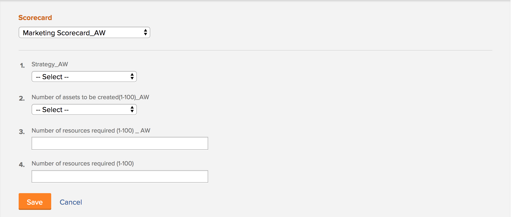
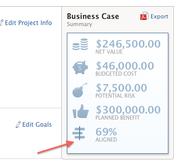
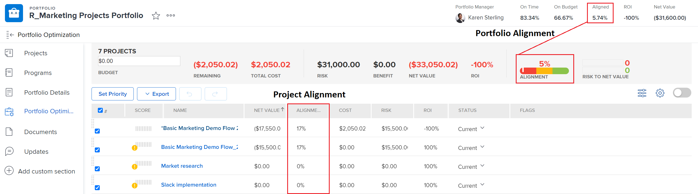

# Apply a scorecard to a project and generate an Alignment Score

<!-- Audited: 02/2024 -->

You can use a scorecard to measure how well a project aligns with the previously established criteria of a portfolio. A scorecard often reflects the mission, values, and strategic goals of an organization.

For more information about scorecards and how you can create one, see [Create a scorecard](../../../administration-and-setup/set-up-workfront/configure-system-defaults/create-scorecard.md).

## Access requirements

+++ Expand to view access requirements for the functionality in this article.

You must have the following access to perform the steps in this article:

<table style="table-layout:auto"> 
 <col> 
 <col> 
 <tbody> 
  <tr> 
   <td role="rowheader">Adobe Workfront plan</td> 
   <td>
   
New: Prime or higher

   
or

   
Current: Business or higher
 </td>
  </tr> 
  <tr> 
   <td role="rowheader">Adobe Workfront license</td> 
   <td>
   
New: Standard

   
or

   
Current: Plan
</td>  
  </tr> 
  <tr> 
   <td role="rowheader">Access level configurations</td> 
   <td> 
Edit access to Projects
 
View or higher access to Portfolios
 </td> 
  </tr> 
  <tr> 
   <td role="rowheader">Object permissions</td> 
   <td>
Manage permissions to a project
 
View or higher permissions to a portfolio
 </td> 
  </tr> 
 </tbody> 
</table>

For more detail about the information in this table, see [Access requirements in Workfront documentation](/help/quicksilver/administration-and-setup/add-users/access-levels-and-object-permissions/access-level-requirements-in-documentation.md).

+++

## Project scorecards {#project-scorecards}

* [Scorecards overview](#scorecards-overview) 
* [Apply a scorecard to a project](#apply-a-scorecard-to-a-project)

### Scorecards overview {#scorecards-overview}

Typically, a project manager completes the scorecard information to produce an alignment value between 0 and 100 for the project. The value produced is later used when the portfolio manager reviews the projects in the portfolio optimizer to compare them.

For more information about portfolio optimization, see [Portfolio Optimizer overview](../../../manage-work/portfolios/portfolio-optimizer/portfolio-optimizer-overview.md).

### Apply a scorecard to a project

As a user with a Standard or Plan license and Manage permissions to a project, you can attach a scorecard to the project.

For more information about project permissions, see [Share a project in Adobe Workfront](../../../workfront-basics/grant-and-request-access-to-objects/share-a-project.md).

You can add scorecards to a project as part of building the business case for the project.

For more information about building a business case, see [Create a Business Case for a project](../../../manage-work/projects/define-a-business-case/create-business-case.md).

Your Adobe Workfront administrator or group administrator must enable the Scorecard section in the Business Case area of your projects before you can access scorecards from the Business Case. For information about setting up project preferences and enabling areas of the Business Case, see [Configure system-wide project preferences](../../../administration-and-setup/set-up-workfront/configure-system-defaults/set-project-preferences.md).

To apply a scorecard to a project:

1. Go to a project to which you want to apply a scorecard.
1. Click **Business Case** in the left panel.
1. Find the **Scorecard** section of the Business Case.  
   You must create a scorecard before the **Scorecard** section displays on the Business Case.

   For information about creating a scorecard, see [Create a scorecard](../../../administration-and-setup/set-up-workfront/configure-system-defaults/create-scorecard.md).

1. Select a scorecard from the drop-down menu.

   

1. Enter an answer for all the questions in the scorecard.

   Workfront applies a score to each question answered and calculates an overall project score based on the individual score of every question.

   For more information about generating the project overall alignment score, see [Generate an Alignment Score for a project](#generate-an-alignment-score-for-a-project).

1. Click **Save** to save the scorecard and score the project.

   The scorecard is now associated with the project and the project is scored.

<!--This functionality was removed when we redesigned bulk editing projects with 23.2: 

1. (Conditional) When changes occur in the values of scorecard questions, you must recalculate the scorecard to reflect the new values for the project score. To recaulate the scorecard, do the following: 

   1. Go to a list of projects and select all projects in the list. 
   1. Click the **Edit** icon at the top of the list. 
   1. Click **Settings** in the left panel, then check the **Recalculate Scorecards** option at the end of the Settings area. 
   1. Click Save. This recalculates the score value based on the scorecards attached for all the selected projects.  

      >[!NOTE]
      >
      >   The option to recalculate scorecards has been removed from the Preview environment, when editing projects in bulk. 

-->

## Generate an Alignment Score

* [Generate an Alignment Score for a project](#generate-an-alignment-score-for-a-project) 
* [Generate an Alignment Score for a portfolio](#generate-an-alignment-score-for-a-portfolio)

### Generate an Alignment Score for a project {#generate-an-alignment-score-for-a-project}

The alignment score is the value produced after completing the scorecard.

Scorecards contain questions with answer choices that have been assigned numerical values, called alignment points. These points are used to determine how well the project aligns with your organization. The alignment points for each question contain a number between 0 and 100.

When the scorecard is completed, Workfront calculates the alignment score of the project as a percentage, using the following formula:

`Project Alignment Score = The sum of the question points from the scorecard met at a given time / The sum of the possible points on the scorecard`

For more information, see [Create a scorecard](../../../administration-and-setup/set-up-workfront/configure-system-defaults/create-scorecard.md).

### Generate an Alignment Score for a portfolio {#generate-an-alignment-score-for-a-portfolio}

The alignment score of the portfolio is an average of the alignment scores of all the projects in the portfolio.

When the scorecards of the projects are completed, Workfront uses those values to calculate the alignment score of the portfolio as a percentage, using the following formula:

`Portfolio Alignment Score = The sum of the percentages of the project alignment scores / Number of projects in the portfolio`

>[!NOTE]
>
>If a project does not have a scorecard associated with it, and therefore it does not have an alignment score, it is considered to have a 0% alignment in the portfolio. The project is taken into account in the number of projects in the portfolio.

## View the Alignment Score

You can view the alignment score of a project at the project level, or in the Portfolio Optimizer.

* [View the Alignment Score on a project](#view-the-alignment-score-on-a-project) 
* [View the Alignment Scores of the project and of the portfolio in the Portfolio Optimizer](#view-the-alignment-scores-of-the-project-and-of-the-portfolio-in-the-portfolio-optimizer)

### View the Alignment Score on a project

You can view the alignment score of a project at the project level if you have Contribute rights to the project.

1. Go to the project whose Alignment Score you want to view.  
1. Click **Business Case** in the left panel.
1. Go to the **Business Case Summary** on the right side of your screen.

   The Alignment Score is located in the Business Case Summary, in the **Aligned** value.

   

### View the Alignment Scores of the project and of the portfolio in the Portfolio Optimizer

You can view the alignment score of a project or of a portfolio in the Portfolio Optimizer, if you have Manage access to the portfolio.

For more information about the information displayed in the Portfolio Optimizer, see [Portfolio Optimizer overview](../../../manage-work/portfolios/portfolio-optimizer/portfolio-optimizer-overview.md).

* [Locate the Alignment Score of the project in the Portfolio Optimizer](#locate-the-alignment-score-of-the-project-in-the-portfolio-optimizer) 
* [Locate the Alignment Score of the portfolio in the Portfolio Optimizer](#locate-the-alignment-score-of-the-portfolio-in-the-portfolio-optimizer)

  

#### Locate the Alignment Score of the project in the Portfolio Optimizer {#locate-the-alignment-score-of-the-project-in-the-portfolio-optimizer}

{{step1-to-portfolios}}

1. Click the name of a portfolio.
1. Click **Portfolio Optimization** in the left panel.

   The Portfolio Optimizer displays. 

   The alignment score of a project is displayed as a percentage in the **Alignment** column of the Portfolio Optimizer.

   This is the alignment score of the project based on the scorecard associated with the project.

#### Locate the Alignment Score of the portfolio in the Portfolio Optimizer  {#locate-the-alignment-score-of-the-portfolio-in-the-portfolio-optimizer}

{{step1-to-portfolios}}

1. Click the name of a portfolio.
1. Click **Portfolio Optimization** in the left panel.
1. At the top of the Portfolio Optimizer find the **Aligned** value, as well as the **Alignment** gauge, which indicate the alignment score of the portfolio.

   This is the alignment score of the portfolio.

   For more information about how the alignment score of a portfolio is generated, see [Generate an Alignment Score for a portfolio](#generate-an-alignment-score-for-a-portfolio).

## Overview of the Portfolio Optimizer Score

There is a difference between the alignment score and the portfolio optimizer score of a project.

The alignment score of a project is calculated based on the points obtained after completing the scorecard. This score is then used to determine the portfolio alignment score. The alignment score is displayed as a percentage.

The alignment score of a project displays in the **Alignment** column of the Portfolio Optimizer.

The portfolio optimizer score is a ranking automatically calculated in the Portfolio Optimizer by which projects can be prioritized. The portfolio optimizer score is displayed as an indicator icon accompanied by a number and it displays in the **Score** column of the Portfolio Optimizer. A Portfolio Optimizer score is generated only when all the sections of the Business Case are completed, except for Goals.

For more information about creating a Business Case for a project, see [Create a Business Case for a project](../../../manage-work/projects/define-a-business-case/create-business-case.md).

For more information about calculating the portfolio optimizer score of a project, see [Overview of the Portfolio Optimizer Score](../../../manage-work/portfolios/portfolio-optimizer/portfolio-optimizer-score.md).
