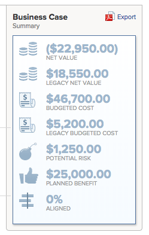

# Approve a Business Case

<!--Audit: 6/2025-->

After you complete and submit the Business Case for a project request, the Business Case must be approved. This depends on the workflow in your organization. A project can start without the Business Case having to be approved, but your Adobe Workfront administrator and project owners might not consider it ideal to do so. 

For more information about completing and submitting a Business Case, see the article [Create a Business Case for a project](../../../manage-work/projects/define-a-business-case/create-business-case.md).

## Access requirements

+++ Expand to view access requirements for the functionality in this article.

<table style="table-layout:auto"> 
 <col> 
 <col> 
 <tbody> 
  <tr> 
   <td role="rowheader"><p>Adobe Workfront plan*</p></td> 
   <td> 
   <p>Current: Prime or higher</p>
   <p>or</p>
   <p>Legacy: Business or higher</p> 
   </td> 
  </tr> 
  <tr> 
   <td role="rowheader">Adobe Workfront license*</td> 
   <td> 
   <p>Current: Standard </p> 
   <p>Legacy: Plan </p> </td> 
  </tr> 
  <tr> 
   <td role="rowheader">Access level configurations</td> 
   <td> <p>Edit access to Projects</p> </td> 
  </tr> 
  <tr> 
   <td role="rowheader"><p>Object permissions</p></td> 
   <td> <p>Manage permissions to a project</p> <p>View or higher permissions to a portfolio</p>  </td> 
  </tr> 
 </tbody> 
</table>

*For information, see [Access requirements in Workfront documentation](/help/quicksilver/administration-and-setup/add-users/access-levels-and-object-permissions/access-level-requirements-in-documentation.md).

+++

## Overview of Business Case approval

Consider the following when approving a Business Case of a project:

* You must have Manage permissions to a project to approve the Business Case for it. 
* You will not be able to see the projects which are waiting for the Business Case to be approved under the My Approvals widget in Home.
* You must manually go to the individual projects that need Business Case approval to see that they are pending approval. There is no Workfront notification mechanism that alerts someone that they must approve the Business Case of a project. 
* You can find the projects waiting for the approval of the Business Case either by building a project report, or by accessing the portfolio they are associated with. 

  For more information about Portfolios, see the article [Portfolio overview in Adobe Workfront](../../../manage-work/portfolios/portfolios-overview/portfolio-overview.md).

## Approve the Business Case by building a project report

You can build a report for projects to see what projects need their Business Case approved. 

To build a report for projects which are pending approval of their Business Cases:

1. Create a report for projects.

   For more information about creating reports, see the article [Create a custom report](../../../reports-and-dashboards/reports/creating-and-managing-reports/create-custom-report.md).

1. Select the **View** tab of the report, then click **Add Column**.

1. Start typing *Status* in the **Show in this column** field, and select this field when it appears in the list.

    This column will display the status of the projects.

1. Select the **Filters** tab of the report, then click **Add a Filter Rule**.

1. Start typing *Status* in the **Only show me Projects in which the ...** field, and select it when it appears in the list.
1. Select **Equal** for the filter modifier.
1. Start typing *Requested* in the available field. 

   This ensures that the report includes only projects which are in the Requested status.

     

1. (Optional) Click **Add another Filter Rule**.

   You can add additional filters, to show only projects where you are the Project Owner, or the Project Sponsor, or the Portfolio Owner.

   For example, you can use the following filter statements: 
   
     ```   
     Project Sponsor ID Equals $$USER.ID
     ```   
   
     to display projects where you are designated as the Project Sponsor
   
     ```   
     Project Owner ID Equals $$USER.ID
     ```   
   
     to display projects where you are designated as the Project owner
   
     ```   
     Project Portfolio Owner ID Equals $$USER. ID
     ```   
   
     to display where you are designated as the Portfolio Manager. 

1. Click **Save+Close**.

   Notice that all projects in the report are in the status of **Requested**.

1. Click the name of a project in the report to open it.
1. Click **Business Case** in the left panel. 
1. Click **Approve** or **Reject** in the Business Case Summary area to approve or reject the Business Case. 

  <!--  -->

   The project status is changed to **Approved** if the Business Case is approved.

   The project status is changed to **Rejected** if the Business case is rejected.

   >[!NOTE]
   >
   >There are no notifications that alert the user who submitted the approval of the business case whether their project request was approved or rejected.

## Approve the Business Case by accessing Requested projects in a portfolio

For more information about reviewing Requested projects, see the article [Review Requested Projects](../../../manage-work/portfolios/create-and-manage-portfolios/review-requested-projects.md).
