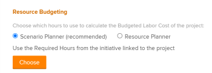

# Business Case Areas Overview

<!-- Audited: 4/2025 -->

This article describes the areas of the Business Case of a project.

For information about creating a Business Case for a project, see [Create a Business Case for a project](../../../manage-work/projects/define-a-business-case/create-business-case.md).

Your Adobe Workfront administrator or group administrator must enable all the sections in the Business Case before they are visible on the project, except for the Project Info section. The Project Info section is enabled by default.

For more information about enabling the areas of the Business Case, see the Business Cases section in the article [Configure system-wide project preferences](../../../administration-and-setup/set-up-workfront/configure-system-defaults/set-project-preferences.md).

The following are areas in the Business Case of a project:

* Project Info
* Goals
* Expenses
* Resource Budgeting
* Risks
* Scorecard
* Custom Forms
* Business Case Summary

## Project Info

The Project Info section of the Business Case includes the basic information of a project before the project has actually started.

All projects have a Project Info area in the Business Case with pre-set fields, meaning Workfront administrators can't configure which fields appear in this area. 

Consider editing the following fields:

* **Description**: Add a description for your project.

* **Project Owner**: By default, the user creating the project is also the Project Owner. Edit this field to select another active user as the owner of the project. 

* **Project Sponsor**: Select an active user that will be the Project Sponsor. The sponsor receives the Business Case's approval.

* **Portfolio**: Select a Portfolio for the project. You must create the Portfolio and place it in the Active status before it's available to select in this drop-down menu.

  For more information about portfolios, see [Portfolio overview in Adobe Workfront](../../../manage-work/portfolios/portfolios-overview/portfolio-overview.md).

  For more information about creating Portfolios, see [Create a portfolio](../../../manage-work/portfolios/create-and-manage-portfolios/create-portfolios.md).

* **Planned Benefit**: Estimate what the monetary benefit is planned to be for your organization when this project is completed. It can be any amount of currency, and it must be a positive value (e.g. $10,000).

* **Status**: By default, the Status for a project request is set to Idea. If you change the Status to anything other than Idea or Planning, the Submit button disappears from the Business Case Summary area, and you can no longer submit the Business Case for approval. 

* **Fixed Start Date**: Specify a date when you would like the project to start.

* **Fixed End Date**: Specify a date when you would like the project to end.

  >[!NOTE]
  >
  >The Fixed Start and End Date on the Business Case do not impact the Planned Start and Completion Dates of the project. These represent the dates requested by the project creator for when the project would ideally develop. Instead, the project's Planned Start and Planned Completion Dates show the planned timeline for the project, which is based on the project's tasks.

## Goals

Goals define the project's objectives. This area is enabled by default in the Business Case, but the Workfront administrator might choose to not display it. This field displays the goals in order of priority.

<!--

(NOTE: below snippet: NWE only, not classic)

-->

>[!TIP]
>
>You can create strategic goals for your organization that are not connected to a project's individual Business Case. You must have access to Adobe Workfront Goals to be able to create strategic goals. You can then connect them with projects outside of their Business Cases. For information about creating goals using Workfront Goals, see [Adobe Workfront Goals overview](../../../workfront-goals/goal-management/wf-goals-overview.md).

Defining the goals is optional for the project to receive a Score in the Portfolio Optimizer. This section is the only optional section in the Business Case. All other sections of the Business Case must be completed before the project is scored in the Portfolio Optimizer. You can indicate a priority level for a goal as you create the goal.

For more information, see [Create Business Case goals](../../../manage-work/projects/define-a-business-case/create-business-case-goals.md).

## Expenses

Expenses represent the non-labor costs that might be incurred during the life of a project. This area is enabled by default in the Business Case, but the Workfront administrator can choose not to display it. 

Any expenses that you enter on the Business Case are also entered as Planned Expenses on the Expenses tab of the project.

Expenses affect the following fields on the project:

* Budgeted Cost
* Net Value

Your Workfront administrator can set up custom Expense Types.

For more information about the Budgeted Costs and Net Values, see [Overview of Business Case financial fields](../../../manage-work/projects/define-a-business-case/business-case-finances.md).

For more information about expenses, see [Manage project expenses](../../../manage-work/projects/project-finances/manage-project-expenses.md).

For more information about creating custom Expense Types, see [Create custom expense types](../../../administration-and-setup/set-up-workfront/configure-system-defaults/create-custom-expense-types.md).

## Resource Budgeting

You can perform the following actions in the Resource Budgeting area of the Business case:

* Associate Resource Pools with the project.
* Budget your resources at the project level.

The hours budgeted for the project's resources display in the Resource Budgeting area of the Business Case, generating the Budgeted Labor Cost of the project. This area is enabled by default.

For more information about budgeting resources for the project in the Business Case, see [Budget resources in the Business Case](../../../manage-work/projects/define-a-business-case/budget-resources-in-business-case.md).

<!---->

Consider the following when viewing the Resource Budgeting section of the Business Case:

* You can budget resource information here using the following tools:

   * The Resource Planner

     For information, see [Budget resources in the Business Case using the Resource Planner](../../../manage-work/projects/define-a-business-case/budget-resources-in-business-case-use-resource-planner.md). 
   
   * The Scenario Planner

     For more information, see [Budget resources in the Business Case using the Scenario Planner](../../../manage-work/projects/define-a-business-case/budget-resources-in-business-case-use-scenario-planner.md).

     The Scenario Planner is available only in the new Adobe Workfront experience and requires an additional license. For information about the Workfront Scenario Planner, see [The Scenario Planner overview](../../../scenario-planner/scenario-planner-overview.md).

* The information displayed here also displays in the system-level Resource Planner or Scenario Planner.

  <!--
  
(NOTE: the "or" stays in&nbsp;NWE&nbsp;only) 

  -->

* After budgeting your resources, the project's Budgeted Labor Cost displays in the Resource Budgeting area if the roles are associated with Cost per Hour rates. The Budgeted Labor Cost displays in the project's currency.

  >[!IMPORTANT]
  >
  >The Budgeted Labor Cost is the cost associated with the roles on the project, and not with the users. The sum of all Budgeted Labor Costs for the users may or may not equal the Budgeted Labor Cost of the job role associated with the users. 

  For more information about Budgeted Labor Cost, see [Overview of Business Case financial fields](../../../manage-work/projects/define-a-business-case/business-case-finances.md).

  For more information about creating job roles and associating Cost per Hour rates with them, see [Create and manage job roles](../../../administration-and-setup/set-up-workfront/organizational-setup/create-manage-job-roles.md).

## Risks

Risks are factors that might prevent a project from finishing on time or on budget. Defining these factors is important for the Portfolio Manager or Project Sponsor to make an educated decision on the project's approval. This area is enabled by default in the Business Case, but the Workfront administrator can choose not to display it.

You can associate a potential cost with the risks you are defining in case they occur. The cost of the risks affects the Net Value of the project. 

Your Workfront administrator can set up custom Risk Types.

For more information about the project Net Value, see [Overview of Business Case financial fields](../../../manage-work/projects/define-a-business-case/business-case-finances.md).

For more information about creating risks, see [Create and edit risks on projects](../../../manage-work/projects/define-a-business-case/create-edit-risks-on-projects.md).

For more information about creating and editing custom Risk Types, see [Edit and create risk types](../../../administration-and-setup/set-up-workfront/configure-system-defaults/edit-create-risk-types.md).

## Scorecard

Scorecards measure the Alignment of the project. This area is enabled by default in the Business Case, but the Workfront administrator can choose not to display it.

To apply a scorecard, your Workfront administrator must first create one. The Scorecard area of the Business Case won't display unless a scorecard is created.

For more information about applying a scorecard to a project and generating an alignment score, see [Apply a scorecard to a project and generate an Alignment Score](../../../manage-work/projects/define-a-business-case/apply-scorecard-to-project-to-generate-alignment-score.md).

For more information about creating a scorecard, see [Create a scorecard](../../../administration-and-setup/set-up-workfront/configure-system-defaults/create-scorecard.md).

## Custom Forms

You can attach Custom Forms to a project when defining a Business Case. This area is not enabled by default in the Business Case and the Workfront administrator must enable it to display it in the Business Case.

To apply a custom form, your Workfront administrator must first create one.

You can use custom forms to collect additional information that is not displayed in the other fields of the Business Case.

For more information about enabling the areas of the Business Case, see [Configure system-wide project preferences](../../../administration-and-setup/set-up-workfront/configure-system-defaults/set-project-preferences.md).

For more information about creating a custom form, see [Create a custom form](/help/quicksilver/administration-and-setup/customize-workfront/create-manage-custom-forms/form-designer/design-a-form/design-a-form.md).

For more information about applying a custom form, see [Attach a Custom Form to a Business Case](../../../manage-work/projects/define-a-business-case/attach-custom-form-to-business-case.md). 

## Business Case Summary

* [Overview of the Business Case Summary](#overview-of-the-business-case-summary) 
* [Export the Business Case](#export-the-business-case)

### Overview of the Business Case Summary {#overview-of-the-business-case-summary}

You can see a summary of the main project finances and whether a project is aligned or not with a Scorecard in the Business Case Summary panel, which is located in the upper-right corner of the Business Case.

 The Business Case Summary is only a quick view of the state of the project as it relates to financial fields and the Scorecard, and it can't be edited.

The following fields display in the Business Case Summary:

* The Project Net Value
* The Project Budgeted Cost
* The Potential Risk Cost
* The Planned Benefit
* The Alignment Score

For more information about these fields, see [Overview of Business Case financial fields](../../../manage-work/projects/define-a-business-case/business-case-finances.md).

### Export the Business Case {#export-the-business-case}

<!--

(NOTE: made this into a standalone article, linked in the first paragraph of this section)

-->

You can export the Business Case to a PDF file if you need to print it or attach it to an email in a more condensed format.

For information, see [Export the Business Case of a project](../../../manage-work/projects/define-a-business-case/export-business-case.md).

<!--

To export a Business Case:

<ol>
<li value="1">Go to the <strong>Business Case</strong> area of a project. </li>
<li value="2"> 
In the<strong>Business Case Summary</strong> area, click <strong>Export</strong>. A PDF file is downloaded to your computer. The file contains all areas of the Business Case in an easy to read format.
 
  
 </li>
<li value="3">(Optional) You can attach the PDF file to an email, or print it.&nbsp;</li>
</ol>

-->

<!--

You can export the Business Case to a PDF file, in case you need to print it or attach it to an email in a more condensed format.&nbsp; The file contains all areas of the Business Case in an easy to read format.

For information about how to export the Business Case, see <a href="../../../manage-work/projects/define-a-business-case/export-business-case.md" class="MCXref xref">Export the Business Case of a project </a>
 <!--

(NOTE: drafted and will replace the info above, when the standalone arrticle is live >> Becky!)

-->

