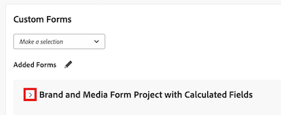

# Attach a Custom Form to a Business Case

Custom Forms are used to collect information that is not displayed in existing Adobe Workfront fields.&nbsp;

For more information about creating Custom Forms, see the article [Create a custom form](/help/quicksilver/administration-and-setup/customize-workfront/create-manage-custom-forms/form-designer/design-a-form/design-a-form.md).

## Access requirements

<!--Audit: 06/2025-->

+++ Expand to view access requirements for the functionality in this article.

<table style="table-layout:auto"> 
 <col> 
 <col> 
 <tbody> 
  <tr> 
   <td role="rowheader">
Adobe Workfront package
</td> 
   <td> 
Prime or higher

  </tr> 
  <tr> 
   <td role="rowheader">
Adobe Workfront license/p></td> 
   <td> 
   
Standard 
 
   
Plan 
 </td> 
  </tr> 
  <tr> 
   <td role="rowheader">Access level configurations</td> 
   <td> 
Edit access to Projects
  </td> 
  </tr> 
  <tr> 
   <td role="rowheader">
Object permissions
</td> 
   <td> 
Manage permissions or higher to the project
  </td> 
  </tr> 
 </tbody> 
</table>

For information, see [Access requirements in Workfront documentation](/help/quicksilver/administration-and-setup/add-users/access-levels-and-object-permissions/access-level-requirements-in-documentation.md). 

+++

## Attach Custom Forms to projects

You can attach Custom Forms to a project in the following areas:

* When editing a project, in the Project Details section.
* When editing a project, in the Edit Project box.
* When editing multiple projects in bulk, from a list of projects.

  For information about attaching custom forms to projects while editing one or multiple projects, see the article [Edit projects](../../../manage-work/projects/manage-projects/edit-projects.md).

* When building the Business Case of a project, in the Business Case as described in this article.

For information about attaching custom forms to objects, see [Add a custom form to an object](../../../workfront-basics/work-with-custom-forms/add-a-custom-form-to-an-object.md).

## Attach Custom Forms to the Business Case

To add a custom from to a Business Case, your Workfront administrator needs to select this option in Setup. For more information about enabling custom forms in Setup, see [Configure system-wide project preferences](../../../administration-and-setup/set-up-workfront/configure-system-defaults/set-project-preferences.md).

To attach a custom form:

1. Go to the project you want to attach the form to, then click **Business Case** in the left panel. The Business Case displays.

1. In the&nbsp;**Custom Form** section, select the custom form you want to attach from the drop-down menu. The custom form appears in the **Added forms** section below. 

1. (Optional) To expand the custom form details, click the arrow to the left of the custom form name.

      

<!--1. (Optional) Select&nbsp;**Edit Custom Form**.  
  

1. (Optional) Specify information in the fields of the custom form, then click&nbsp;**Save** . -->
