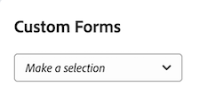

# Attach a Custom Form to a Business Case

Custom Forms are used to collect information that is not displayed in existing Adobe Workfront fields.&nbsp;

For more information about creating Custom Forms, see the article [Design a form with the form designer](/help/quicksilver/administration-and-setup/customize-workfront/create-manage-custom-forms/form-designer/design-a-form/design-a-form.md).

## Access requirements

You must have the following access to perform the steps in this article:

<table style="table-layout:auto"> 
 <col> 
 <col> 
 <tbody> 
  <tr> 
   <td role="rowheader">Adobe Workfront plan*</td> 
   <td> 
Pro or higher
 </td> 
  </tr> 
  <tr> 
   <td role="rowheader">Adobe Workfront license*</td> 
   <td> 
Plan 
 </td> 
  </tr> 
  <tr> 
   <td role="rowheader">Access level configurations*</td> 
   <td> 
Edit access to&nbsp;Projects
 
Note: If you still don't have access, ask your Workfront administrator if they set additional restrictions in your access level. For information on how a Workfront administrator can modify your access level, see <a href="../../../administration-and-setup/add-users/configure-and-grant-access/create-modify-access-levels.md" class="MCXref xref">Create or modify custom access levels</a>.
 </td> 
  </tr> 
  <tr> 
   <td role="rowheader">Object permissions</td> 
   <td> 
Manage permissions or higher to the project
 
For information on requesting additional access, see <a href="../../../workfront-basics/grant-and-request-access-to-objects/request-access.md" class="MCXref xref">Request access to objects </a>.
 </td> 
  </tr> 
 </tbody> 
</table>

&#42;To find out what plan, license type, or access you have, contact your Workfront administrator.

## Attach Custom Forms to projects

You can attach Custom Forms to a project in the following areas:

* When editing a project, in the Project Details section.
* When editing a project, in the Edit Project box.
* When editing multiple projects in bulk, from a list of projects.

  For information about attaching custom forms to projects while editing one or multiple projects, see the article [Edit projects](../../../manage-work/projects/manage-projects/edit-projects.md).

* When building the Business Case of a project, in the Business Case as described in this article.

For information about attaching custom forms to objects, see [Add a custom form to an object](../../../workfront-basics/work-with-custom-forms/add-a-custom-form-to-an-object.md).

## Attach Custom Forms to the Business Case

To add a custom from to a Business Case, your Workfront administrator needs to select this option in Setup. For more information about enabling custom forms in Setup, see the section [Configure system-wide project preferences](../../../administration-and-setup/set-up-workfront/configure-system-defaults/set-project-preferences.md) in the article [Configure system-wide project preferences](../../../administration-and-setup/set-up-workfront/configure-system-defaults/set-project-preferences.md).

To attach a custom form:

1. Go to the project you want to attach the form to, then click **Business Case** in the left panel.

   The Business Case displays.

1. In the&nbsp;**Custom Form** section, select the custom form you want to attach from the drop-down menu.

   

1. (Optional) Select&nbsp;**Edit Custom Form**.  
   

1. (Optional) Specify information in the fields of the custom form, then click&nbsp;**Save** .
