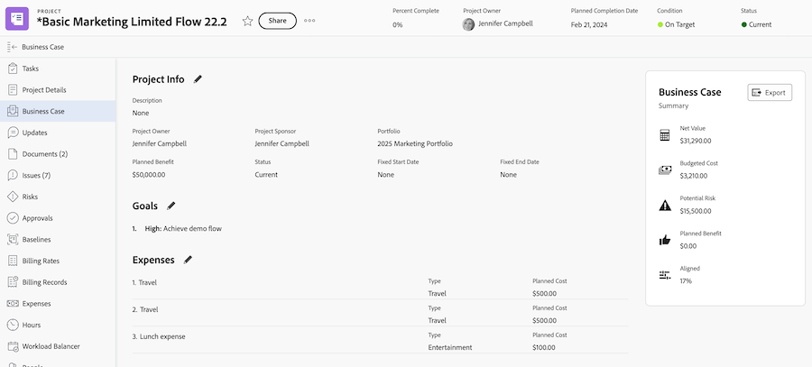
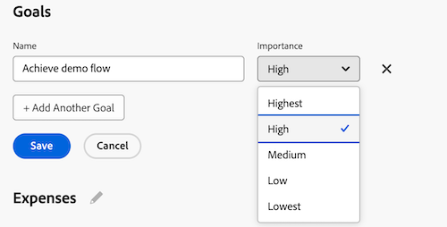

# Create Business Case goals

<!-- Audited: 6/2025 -->

As part of creating a Business Case, you can create a set of goals to define the objectives of a project. These goals are used to communicate the purpose of completing a project to the Portfolio Manager or the Project Sponsor.

<!--

(NOTE: below snippet: NWE only, not classic)

-->

>[!TIP]
>
>You can create strategic goals for your organization that are not connected to a project's individual Business Case. You must have access to Adobe Workfront Goals to be able to create strategic goals. You can then connect them with projects outside of their Business Cases. For information about creating goals using Workfront Goals, see [Adobe Workfront Goals overview](../../../workfront-goals/goal-management/wf-goals-overview.md).

Consider the following when creating Business Case goals for your projects:

* Business Case goals are project-specific. You can't copy goals from one project to another or establish goals at the system level; they must be defined at the level of each project. 
* Your Adobe Workfront administrator or group administrator must enable the project's Goals section before it displays in the Business Case. For information about enabling Business Case fields for projects, see [Configure system-wide project preferences](../../../administration-and-setup/set-up-workfront/configure-system-defaults/set-project-preferences.md).

* Goals aren't a mandatory section in the project's Business Case.

   A project can receive a score to be prioritized in the Portfolio Optimizer, even if the Goals section is not defined.

  For more information about the Portfolio Optimizer score, see [Apply a scorecard to a project and generate an Alignment Score](../../../manage-work/projects/define-a-business-case/apply-scorecard-to-project-to-generate-alignment-score.md).

* You can't report on Business Case goals.

## Access requirements

+++ Expand to view access requirements for the functionality in this article.

<table style="table-layout:auto"> 
 <col> 
 </col> 
 <col> 
 </col> 
 <tbody> 
  <tr> 
   <td role="rowheader">
Adobe Workfront plan*
</td> 
   <td> 
Current: Prime or higher

   
Legacy: Pro or higher
  </td> 
  </tr> 
  <tr> 
   <td role="rowheader">
Adobe Workfront license*
</td>
   <td> 
   
Current: Standard
 
   
Legacy: Plan 
 
   </td> 
  </tr> 
  <tr> 
   <td role="rowheader">Access level configurations</td> 
   <td> 
Edit access to Projects
 </td> 
  </tr> 
  <tr> 
   <td role="rowheader">
Object permissions
</td> 
   <td> 
Manage permissions or higher to the project
 </td> 
  </tr> 
 </tbody> 
</table>

*For more detail about the information in this table, see [Access requirements in Workfront documentation](/help/quicksilver/administration-and-setup/add-users/access-levels-and-object-permissions/access-level-requirements-in-documentation.md).

 +++

## Add a goal to the Business Case of a project

{{step1-to-projects}}

1. In the project list, select the project you want to define Business Case goals for.  

1. In the left panel, click **Business Case**. The **Business Case** section displays.

   

1. In the **Goals** section, click **Edit Goals**.

1. In the first field, enter the goal description. 

1. In the **Importance** drop-down menu, select the level of importance (or priority) for this goal:

   * Highest
   * High
   * Medium
   * Low
   * Lowest

   

      >[!NOTE]
      >
      >You can't customize the Importance levels of goals.

1. (Optional) To add another goal, click **Add Another Goal** and repeat steps 5-6.

1. Click **Save**.
