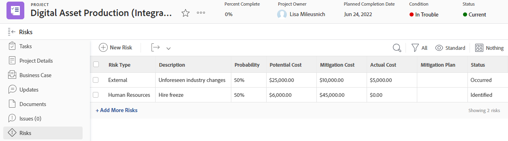
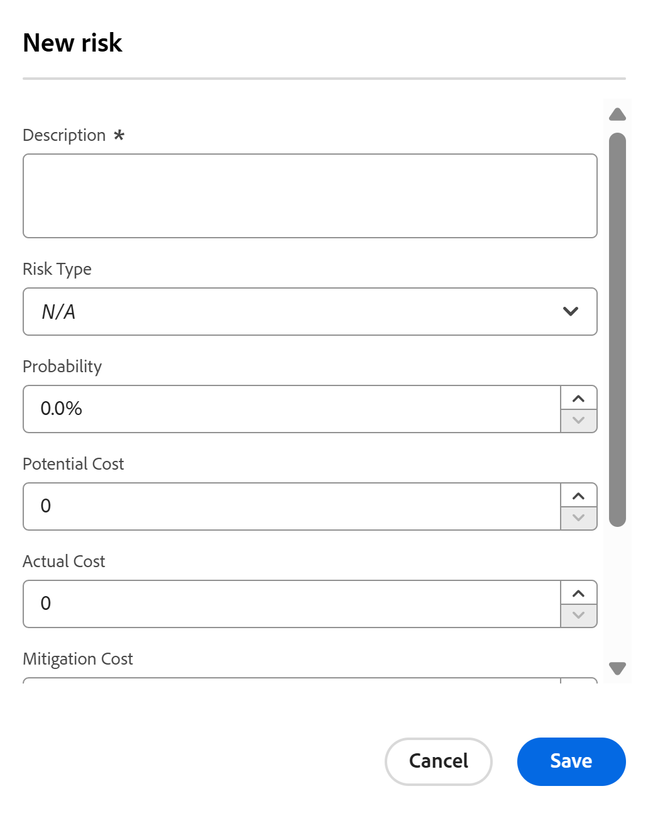

# Create and edit risks on projects

<!--Audited: 06/2025-->

<!--
The highlighted information on this page refers to functionality not yet generally available. It is available only in the Preview environment for all customers. The same features will also be available in the Production environment for all customers after a week from the Preview release.    

For more information, see [Interface modernization](/help/quicksilver/product-announcements/product-releases/interface-modernization/interface-modernization.md). 
-->

Risks are possible events or factors that prevent a project from finishing on time or within budget. You can record risks as part of creating the Business Case of a project or by using the Risks tab. 

You can create risks only on projects or templates. You cannot associate risks with tasks or issues.

Risks can be associated with cost, but Actual Risk Cost does not impact the Actual Cost of the Project.

>[!NOTE]
>
>This article defines the risks associated with the project as you define them in the Business Case of the project or as you add them in the Risks tab of the project. 
>
>For information about the Risk field that is available when editing a project, see [Edit projects](../../../manage-work/projects/manage-projects/edit-projects.md).

## Access requirements

+++ Expand to view access requirements for the functionality in this article. 

<table style="table-layout:auto"> 
 <col> 
 <col> 
 <tbody> 
  <tr> 
   <td role="rowheader">
Adobe Workfront package
</td> 
   <ul><li>Any plan, to add risks in the Risks area of the project
</li>
   <li>
Prime or higher, to add risks in the project's Business Case
</li></ul>
   </td> 
  </tr> 
  <tr> 
   <td role="rowheader">
Adobe Workfront license
</td> 
   <td> 
Standard 

   
Plan 
 </td> 
  </tr> 
  <tr> 
   <td role="rowheader">
Access level configurations
</td> 
   <td> 
Edit access to Projects and Financial  Data
 </td> 
  </tr> 
  <tr> 
   <td role="rowheader">
Object permissions
</td> 
   <td> 
 Manage permissions that include Manage Finance on the project for which you want to create or edit risks 
 </td> 
  </tr> 
 </tbody> 
</table>

For information, see [Access requirements in Workfront documentation](/help/quicksilver/administration-and-setup/add-users/access-levels-and-object-permissions/access-level-requirements-in-documentation.md). 

+++

## Create and edit risks in the Business Case

You can create risks as part of planning the Business Case of a project. You can later edit them in the Business Case, when changes occur to their probability, mitigation plan, or cost, for example. For information about creating a Business Case, see [Create a Business Case for a project](../../../manage-work/projects/define-a-business-case/create-business-case.md).

Your Workfront administrator or group administrator must enable the **Risks** section in your Business Case in the Project Preferences area before you can view it at the project level in the Business Case section. For information about setting project preferences, see [Configure system-wide project preferences](../../../administration-and-setup/set-up-workfront/configure-system-defaults/set-project-preferences.md).

Creating and editing risks in the Business Case is identical.

To create or edit a risk in the Business Case:

1. Go to the project for which you want to create risks. 
1. Click **Business Case** in the left panel.
1. In the **Risks** section, click the **Edit** icon 
1. Enter or edit the following information:

   * **Description:** Describe the risk.  
   
   * **Potential Cost**: Enter the estimated cost if the risk should occur.  
   
   * **Probability**: Enter the probability of the risk occurring as a percentage value.   
   
   * **Type:** Select what category the risk falls under.
   * **Mitigation Plan**: Update the description of the plan to mitigate the risk.  
   
   * **Mitigation Cost**: Enter the cost of the mitigation plan that you must put in place to prevent the risk from occurring.

   

1. (Optional) Click **Add Another Risk** to add more risks.
1. Click **Save**.

## Create and edit risks in the Risks area

In addition to creating and editing risks in the Business Case, you can do so using the **Risks** section of a project.

You can create and edit risks in the Risks section of a project or a template. Creating risks for templates is identical to creating risks for projects. 

1. Go to the project you want to create risks for.
1. Click **Risks** in the left panel.

   

1. Click **Add More Risks** and create risks by in-line editing their information. 

   Or

   Click **New Risk** to open the **New risk** box.

   

1. (Conditional) If you are adding a risk in the **New risk** box, enter the following information:

   * **Description**: Describe the risk. This is a required field. 
   * **Risk Type**: Indicate what category the risk falls under.  
     Your Workfront administrator defines the Risk Types available in your environment. For information about defining Risk Types, see the article [Edit and create risk types](../../../administration-and-setup/set-up-workfront/configure-system-defaults/edit-create-risk-types.md).  
   
   * **Probability**: Indicate the probability of the risk occurring as a percentage value.
   * **Potential Cost**: Indicate the estimated cost if the risk should occur.
   * **Actual Cost**: Indicate the actual cost of the risk if the risk occurred.
   * **Mitigation Cost**: Indicate the cost of the mitigation plan that you must put in place to prevent the risk from occurring.
   * **Mitigation Plan**: Update the description of the plan to mitigate the risk.  

1. Click **Save**.

1. (Optional) Select a different **Status** for the risk, in the **Status** drop-down menu, when applying the **Standard** view for the list of risks.

   By default, the **Status** of a risk is **Identified**.

### Edit risks in the Risks area {#edit-risks-in-the-risks-area}

You can edit risks during the life of a project or when changes occur (e.g. a change in their probability, potential cost, or status).

You can edit one risk at a time or edit multiple risks in bulk.

To edit risks:

1. Go to a project for which you want to edit existing risks.
1. Click **Risks** in the left panel.
1. Start in-line editing the fields for the risks you see in the list to edit one risk at a time.

   Or

   Select one or several risks, then click the **Edit** icon  to edit multiple risks at the same time.

   >[!NOTE]
   >
   >You are applying the same information to all the risks selected, when you edit multiple risks at the same time. The information associated with each risk prior to your changes is overwritten in a bulk edit.

1. If you have clicked the **Edit** icon, the **Edit risk** or **Edit risks** box opens.

   Update the following fields:

   * **Description**: Edit the description of the risk.
   * **Risk Type**: Update what category the risk falls under. 
   * **Probability**: Indicate the probability of the risk occurring as a percentage value.
   * **Potential Cost**: Indicate the estimated cost if the risk should occur.
   * **Actual Cost**: Indicate the actual cost of the risk if the risk occurred.
   * **Mitigation Cost**: Indicate the cost of the mitigation plan that you must put in place to prevent the risk from occurring.
   * **Mitigation Plan**: Update the description of the plan to mitigate the risk.

1. Click **Save**.
1. (Optional) Edit the **Status** for a risk, in the **Status** drop-down menu, when applying the **Standard** view for the list of risks.

   >[!NOTE]
   >
   >You cannot edit the **Status** of risks in the **Edit risk** dialog box. You can do so only in an in-line edit.
