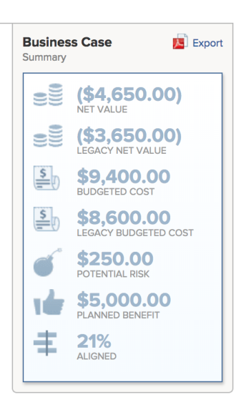

# Export the Business Case of a project

You can export the Business Case to a PDF file, in case you need to print it or attach it to an email in a more condensed format.  

## Access requirements

+++ Expand to view access requirements for the functionality in this article.

<table style="table-layout:auto"> 
 <col> 
 <col> 
 <tbody> 
  <tr> 
   <td role="rowheader">
Adobe Workfront package
</td> 
   <td> 
Prime or higher 
  </td> 
  </tr> 
  <tr> 
   <td role="rowheader">
Adobe Workfront license
</td> 
   <td> 
   
Light or higher

   
Review or higher
 </td> 
  </tr> 
  <tr> 
   <td role="rowheader">Access level configurations</td> 
   <td> 
View access to Projects, Financial Data, and Resource Management
 </td> 
  </tr> 
  <tr> 
   <td role="rowheader">Object permissions</td> 
   <td> 
View or higher permissions on the project
 </td> 
  </tr> 
 </tbody> 
</table>

For information, see [Access requirements in Workfront documentation](/help/quicksilver/administration-and-setup/add-users/access-levels-and-object-permissions/access-level-requirements-in-documentation.md). 

 +++

## Export the Business Case

1. Go to the project that you want to export the Business Case from.
1. Click **Business Case** in the left panel. 
1. In the upper-right **Business Case Summary** area, click **Export**.

   <!---->   
   A PDF   file is downloaded to your computer. The file contains all areas of the Business Case in an easy to read format.

   <!---->

1. (Optional) Attach the PDF file to an email, or print it to share it with others.  
