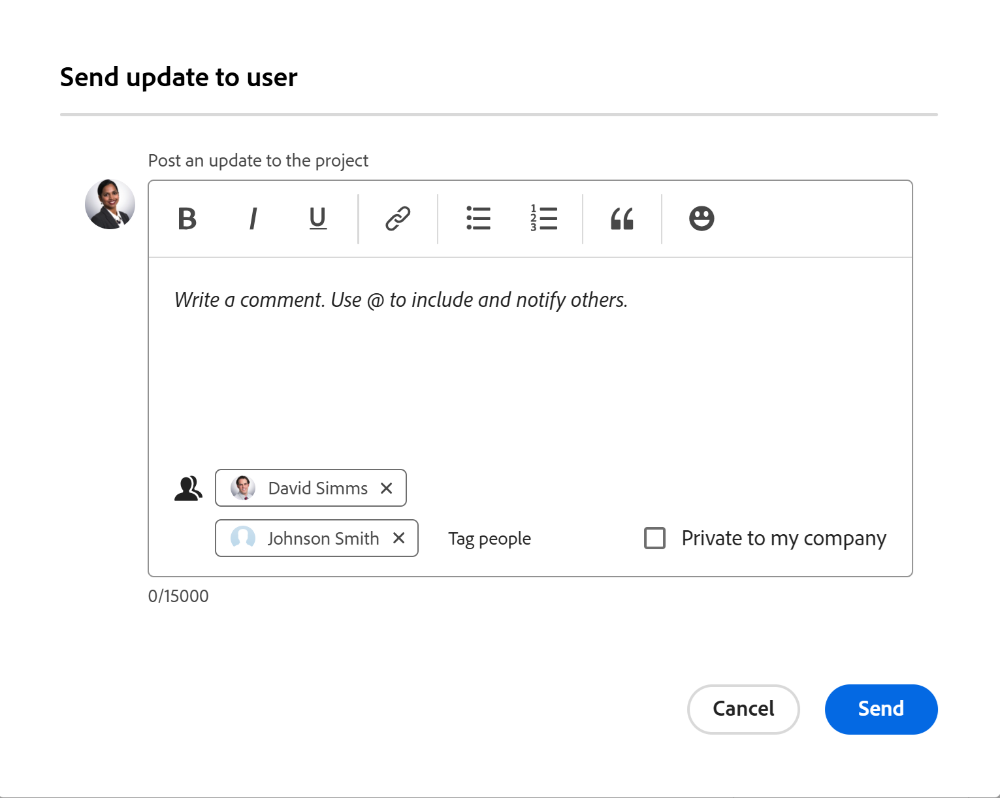

# Communicate with Project Team members

You can easily communicate with the members of your project team through Adobe Workfront.

All the users associated with a project form the Project Team. For information about the Project Team, see [Project Team overview](../../../manage-work/projects/planning-a-project/project-team-overview.md).

## Access requirements

+++ Expand to view access requirements for the functionality in this article.

<table style="table-layout:auto"> 
 <col> 
 </col> 
 <col> 
 </col> 
 <tbody> 
  <tr> 
   <td role="rowheader">Adobe Workfront packaging</td> 
   <td> 
Any
 </td> 
  </tr> 
  <tr> 
   <td role="rowheader">Adobe Workfront license</td> 
   <td>
Contributor or higher
 
   
Request or higher
 </td> 
  </tr> 
  <tr> 
   <td role="rowheader">Access level configurations</td> 
   <td> 
View or higher access to Projects
</td> 
  </tr> 
  <tr> 
   <td role="rowheader">Object permissions</td> 
   <td> 
View or higher permissions to the project
</td> 
  </tr> 
 </tbody> 
</table>

For more information, see [Access requirements in Workfront documentation](/help/quicksilver/administration-and-setup/add-users/access-levels-and-object-permissions/access-level-requirements-in-documentation.md).

+++

<!--Old:

<table style="table-layout:auto"> 
 <col> 
 </col> 
 <col> 
 </col> 
 <tbody> 
  <tr> 
   <td role="rowheader">Adobe Workfront plan*</td> 
   <td> 
Any
 </td> 
  </tr> 
  <tr> 
   <td role="rowheader">Adobe Workfront license*</td> 
   <td> 
Request or higher
 </td> 
  </tr> 
  <tr> 
   <td role="rowheader">Access level configurations*</td> 
   <td> 
View or higher access to Projects
 
Note: If you still don't have access, ask your Workfront administrator if they set additional restrictions in your access level. For information on how a Workfront administrator can modify your access level, see <a href="../../../administration-and-setup/add-users/configure-and-grant-access/create-modify-access-levels.md" class="MCXref xref">Create or modify custom access levels</a>.
 </td> 
  </tr> 
  <tr> 
   <td role="rowheader">Object permissions</td> 
   <td> 
View or higher permissions to the project
 
For information on requesting additional access, see <a href="../../../workfront-basics/grant-and-request-access-to-objects/request-access.md" class="MCXref xref">Request access to objects </a>.
 </td> 
  </tr> 
 </tbody> 
</table>-->

## Send an email to a Project Team member {#send-an-email-to-a-project-team-member}

1. Go to a project whose members of the project team you want to send an email to. 
1. Click **People** in the left panel. 

   To update all members of the project team, click **Update All** in the upper-left corner of the list of project team members.

   Or

   To update certain members of the project team, select one or several users in the list, then click **Send Update to User**.   

   

1. Type your update in the **Post an update to the project** area. 
1. (Optional) To make the update private, select the **Private to my company** option.

   Users outside the company cannot view a private update.

1. (Optional) Click **Tag people** to add more recipients that are not selected. 
1. Click **Send**.

   The update and the names of the users included display in the **Updates** section of the project.

## Send updates to Project Team members and others

You can send project updates to team members and to other users that might not be part of the project team. All users must have an active Workfront account. The update is sent as a notification in Workfront.

1. Go to a project from which you want to send updates to other users.
1. Click **People** in the left panel.
1. (Optional and conditional) If the users you want to send updates to are not on the project team, click **Add users** to add them to the project team.

   For information about adding users to the project team, see [Manage the Project Team](../../../manage-work/projects/planning-a-project/manage-project-team.md). 

1. Send an update to the members of the project team, as described in the section [Send an email to a Project Team member](#send-an-email-to-a-project-team-member) in this article.

   The update and the names of the users included in it display in the **Updates** section of the project.

<!--

 
(NOTE: drafted. No longer valid)

<ol>
<li value="1"> 
Go to a project whose members of the project team you want to send an email to. 
 </li>
<li value="2"> Click <strong>People</strong> in the left panel.</li>
<li value="3"> 
To update all members of the project team, click <strong>Update All</strong> in the upper-left corner of the list of project team members.
 
Or
 
To update certain members of the project team, select one or several users in the list, then click <strong>Update</strong>. 
 </li>
<li value="4">Type your update in the <strong>Post an update to this project</strong> field.</li>
<li value="5"> 
(Optional) To make the update private, click the <strong>Lock</strong> icon.
 
Users outside the company cannot view a private update.
 </li>
<li value="6"> 
(Optional) Add a user who is not part of the Project Team by typing their name in the people field, then selecting the user from the list when it displays. 
 </li>
<li value="7"> 
Click <strong>Send.</strong>
 
The update and the names of the users included in it display in the Updates tab of the project.
 </li>
</ol> 

-->
