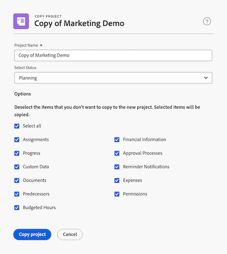

# Copy a project

<!--
<(LINKED TO THE PRODUCT IN THE COPY PROJECT BOX)

-->

<!-- Audited: 5/2025 -->

You can copy a project from an existing one rather than create one from scratch, which helps save you time. 

Please note that you can't copy projects in bulk.

>[!IMPORTANT]
>
>The following items are never copied from an existing project to a new one:   
>
>* Issues  
>* Billing Rates
>* Billing Records  
>* Notes  
>* Hours
>* Cross-project predecessors
>* Budgeted hours 
>
>The following items are always copied from an existing project to a new one:
>
>* Tasks
>* Template
>* Risks
>* Queue Setup information
>* Portfolio and Program
>* Scorecard
>* Task Default information (Task Default Approval Process, Task Default Custom Forms)
>
> The dates of the original project's tasks will copy to the new project. You must change the Start or Completion date of the project (depending on its Schedule Mode) to update the task dates. Task constrains might prevent you from changing the dates on the project.  

## Access requirements

+++ Expand to view access requirements for the functionality in this article.
You must have the following access to perform the steps in this article:

<table style="table-layout:auto"> 
 <col> 
 <col> 
 <tbody> 
  <tr> 
   <td> 
Adobe Workfront package
 </td>  
   <td>Any</td> 
  </tr> 
  <tr> 
   <td> 
Adobe Workfront license
 </td> 
   <td> 
Standard
 
   
Plan

      </td> 
  </tr> 
     <td>Access level configurations </td> 
   <td> 
Edit access to Projects with ability to Create and Copy projects
 </td> 
  </tr> 
  
   <td> 
Object permissions 
 </td> 
   <td> 
View permissions or higher to the project
  </td> 
  </tr> 
 </tbody> 
</table>

For more detail about the information in this table, see [Access requirements in Workfront documentation](/help/quicksilver/administration-and-setup/add-users/access-levels-and-object-permissions/access-level-requirements-in-documentation.md).

 +++

 <!--Old:
 
 <table style="table-layout:auto"> 
 <col> 
 <col> 
 <tbody> 
  <tr> 
   <td> 
Adobe Workfront plan
 </td> 
   <td>Any</td> 
  </tr> 
  <tr> 
   <td> 
Adobe Workfront license
 </td> 
   <td> 
New: Standard 
 
   
Or

   
Current: Plan 

   
   </td> 
  </tr> 
  <tr data-mc-conditions=""> 
   <td>Access level configurations </td> 
   <td> 
Edit access to Projects with ability to Create and Copy projects
 </td> 
  </tr> 
  <tr data-mc-conditions=""> 
   <td> 
Object permissions 
 </td> 
   <td> 
View permissions or higher to the project
  </td> 
  </tr> 
 </tbody> 
</table>-->

## Copy a single project

Copying a project also copies some information from the original project to the new project. You can also specify which items should not be copied to the new project during the copying process.

To copy a project:

{{step1-to-projects}}

1. Select the project that you want to copy from the project list, then click&nbsp;the **More** icon  to the right of the project name.

   Or

   Go to a project list or report and select a project, then click the **More** icon  at the top of the list.

1. In the **More** drop-down menu, click **Copy**. The **Copy of [Project Name]** dialog box appears.

1. (Optional) Update the **Project Name**. By default, the new name is **Copy of [Original project name]**.

   

1. Select a **Status**. By default, the original project's status is selected.

1. (Optional) Deselect the items that you don't want to copy to the new project. The following table describes what happens when you deselect the items:
      

   <table style="table-layout:auto"> 
    <col> 
    <col> 
    <tbody> 
     <tr> 
      <td role="rowheader">Select all</td> 
      <td> 
Selects all options and clears all the fields and objects listed from the new project. 
 
      
      
 Deselecting this option deselects all items. 
 </td> 
     </tr> 
     <tr> 
      <td role="rowheader">Assignments</td> 
      <td>Removes all the project and task assignments.</td> 
     </tr> 
     <tr> 
      <td role="rowheader">Progress</td> 
      <td>Removes the progress on all the tasks, displaying them as New. </td> 
     </tr> 
     <tr> 
      <td role="rowheader">Custom Data</td> 
      <td> 
Removes the information from the custom form on the project, as well as the information on the custom forms associated with the following items:
 
       <ul> 
        <li>Tasks</li> 
        <li>Expenses</li> 
        <li> Documents</li> 
       </ul> 
      
The custom forms remain attached to the tasks, expenses, documents, and project, but the information in the form's custom fields isn't copied to the new project. 
 </td> 
     </tr> 
     <tr> 
      <td role="rowheader">Documents</td> 
      <td> 
Removes everything in the Documents tab, including document versions, linked documents, and folders.
 
By default, document proofs and approvals cannot be copied to another project. 
 </td> 
     </tr> 
     <tr> 
      <td role="rowheader">All Predecessors</td> 
      <td> 
Removes all predecessor relationships between the tasks on the project. 
 

      
      Cross-project predecessors never transfer to the new project, regardless of whether this is selected or not. 
 </td> 
     </tr>

  <tr> 
      <td role="rowheader">Budgeted hours</td> 
      <td> 
Removes the hours budgeted in the Resource Planning area of the project's Business Case from the copied project.
 
    

   Hours budgeted using the Scenario Planner are never copied to the new project because the new project is not linked to an initiative in the Scenario Planner. For more information, see <a href="../../../manage-work/projects/define-a-business-case/budget-resources-in-business-case-use-scenario-planner.md">Budget resources in the Business Case using the Scenario Planner</a>

   </tr></td>
    <tr> 
      <td role="rowheader">Financial Information</td> 
      <td> 
Removes the information in the following areas: 
 
       <ul> 
        <li>Finance subtab of the project</li> 
        <li> Planned Benefit in the Business Case</li> 
        <li>Financial information from all tasks </li> 
       </ul> 
For more information about the project Finance subtab, see <a href="../../../manage-work/projects/project-finances/manage-project-finance-area.md" class="MCXref xref">Manage information in the project Finance area</a>.
 </td> 
     </tr> 
     <tr> 
      <td role="rowheader">Approval Process</td> 
      <td>Removes all approvals associated with the tasks or the project. </td> 
     </tr> 
     <tr> 
      <td role="rowheader">Reminder Notifications</td> 
      <td> Removes the Reminder Notifications associated with the tasks or the project. </td> 
     </tr> 
     <tr> 
      <td role="rowheader">Expenses</td> 
      <td>Removes expenses associated with the tasks or the project. </td> 
     </tr> 
     <tr> 
      <td role="rowheader">Permissions</td> 
      <td> Removes permissions to all the users on the tasks or the project.</td> 
     </tr> 
    </tbody> 
   </table>

1. Click **Copy project**. The copied project is created. 
