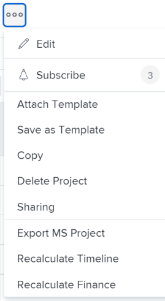

# Copy a project

<!--
<(LINKED TO THE PRODUCT IN THE COPY PROJECT BOX)

-->

You can copy a project rather than create one from scratch. You can copy only one project at a time. You cannot copy projects in bulk.

>[!IMPORTANT]
>
>The following items are never copied from an existing project to a new one:   
>
>* Issues  
>* Billing Rates
>* Billing Records  
>* Notes  
>* Hours
>* Cross-project predecessors
>* Budgeted hours 
>
>The following items are always copied from an existing project to a new one:
>
>* Tasks
>* Template
>* Risks
>* Queue Setup information
>* Portfolio and Program
>* Scorecard
>* Task Default information (Task Default Approval Process, Task Default Custom Forms)
>
> The dates of the original tasks on the projects copy to the new project. You must change the Start or Completion date of the project (depending on its Schedule Mode) to update the dates on the tasks. Task constrains might prevent you from changing the dates on the project.  

## Access requirements

<!-- drafted for P&P:
<table style="table-layout:auto"> 
 <col> 
 <col> 
 <tbody> 
  <tr> 
   <td> 
Adobe Workfront plan*
 </td> 
   <td>Any</td> 
  </tr> 
  <tr> 
   <td> 
Adobe Workfront license*
 </td> 
   <td> 
Current license: Standard 
 
   Or
   
Legacy license: Plan 

   </td> 
  </tr> 
  <tr data-mc-conditions=""> 
   <td><strong>Access level configurations*</strong> </td> 
   <td> 
Edit access to Projects with ability to Create and Copy projects
 
<b>NOTE</b>
   
   If you still don't have access, ask your Workfront administrator if they set additional restrictions in your access level. For information on how a Workfront administrator can change your access level, see <a href="../../../administration-and-setup/add-users/configure-and-grant-access/create-modify-access-levels.md" class="MCXref xref">Create or modify custom access levels</a>.
 </td> 
  </tr> 
  <tr data-mc-conditions=""> 
   <td> 
<strong>Object permissions</strong> 
 </td> 
   <td> 
View permissions or higher to the project
 
For information on requesting additional access, see <a href="../../../workfront-basics/grant-and-request-access-to-objects/request-access.md" class="MCXref xref">Request access to objects </a>.
 </td> 
  </tr> 
 </tbody> 
</table>
-->
You must have the following:

<table style="table-layout:auto"> 
 <col> 
 <col> 
 <tbody> 
  <tr> 
   <td> 
Adobe Workfront plan*
 </td> 
   <td>Any</td> 
  </tr> 
  <tr> 
   <td> 
Adobe Workfront license*
 </td> 
   <td> 
Plan 
 </td> 
  </tr> 
  <tr data-mc-conditions=""> 
   <td><strong>Access level configurations*</strong> </td> 
   <td> 
Edit access to Projects with ability to Create and Copy projects
 
<b>NOTE</b>
   
   If you still don't have access, ask your Workfront administrator if they set additional restrictions in your access level. For information on how a Workfront administrator can change your access level, see <a href="../../../administration-and-setup/add-users/configure-and-grant-access/create-modify-access-levels.md" class="MCXref xref">Create or modify custom access levels</a>.
 </td> 
  </tr> 
  <tr data-mc-conditions=""> 
   <td> 
<strong>Object permissions</strong> 
 </td> 
   <td> 
View permissions or higher to the project
 
For information on requesting additional access, see <a href="../../../workfront-basics/grant-and-request-access-to-objects/request-access.md" class="MCXref xref">Request access to objects </a>.
 </td> 
  </tr> 
 </tbody> 
</table>

&#42;To find out what plan, license type, or access you have, contact your Workfront administrator.

## Copy a single project

Copying a project also copies some information from the original project to the new project. You can also specify which items should not be copied to the new project during the copying process.

To copy a project:

1. Go to the project that you want to copy and click&nbsp;the **More** icon  to the right of the project name

   

   Or

   Go to a project list or report and select a project, then click the **More** icon  at the top of the list.

   

1. Click **Copy**.

1. Update the name of the new project.

   By default, the new name is **Copy of `<Original project name>`.**

   

1. Select the **Status** for the new project.

   By default, the **Status** matches that of the original project.

1. (Optional) Deselect the items that you don't want to copy to the new project. The following table describes what happens when you deselect the items:
      

   <table style="table-layout:auto"> 
    <col> 
    <col> 
    <tbody> 
     <tr> 
      <td role="rowheader">Select all</td> 
      <td> 
Selects all options and clears all the fields and objects listed from the new project.
 
<b>TIP</b>
      
    Deselecting <strong>Select all</strong> deselects all items. 
 </td> 
     </tr> 
     <tr> 
      <td role="rowheader">Assignments</td> 
      <td>Removes all the project and task assignments</td> 
     </tr> 
     <tr> 
      <td role="rowheader">Progress</td> 
      <td>Removes the progress on all the tasks and they display as New. </td> 
     </tr> 
     <tr> 
      <td role="rowheader">Custom Data</td> 
      <td> 
Removes the information from the custom form on the project, as well as the information on the custom forms associated with the following items:
 
       <ul> 
        <li>Tasks</li> 
        <li>Expenses</li> 
        <li> Documents</li> 
       </ul> 
<b>NOTE</b>
      
      The custom forms remain attached to the tasks, expenses, documents, and the project, but the information in the custom fields of the forms is not copied to the new project. 
 </td> 
     </tr> 
     <tr> 
      <td role="rowheader">Documents</td> 
      <td> 
Removes everything in the documents tab, including document versions, linked documents, and folders.
 
By default, document proofs and approvals cannot be copied to another project. 
 </td> 
     </tr> 
     <tr> 
      <td role="rowheader">All Predecessors</td> 
      <td> 
Removes all predecessor relationships between the tasks on the project. 
 
<b>TIP</b>
      
      Cross-project predecessors never transfer to the new project, regardless of whether this is selected or not. 
 </td> 
     </tr>

  <tr> 
      <td role="rowheader">Budgeted hours</td> 
      <td> 
Removes the hours budgeted in the Resource Planning area of the project's Business Case from the copied project.
 
    
   <b>NOTE</b>
    
   Hours budgeted using the Scenario Planner are never copied to the new project because the new project is not linked to an initiative in the Scenario Planner. For more information, see <a href="../../../manage-work/projects/define-a-business-case/budget-resources-in-business-case-use-scenario-planner.md">Budget resources in the Business Case using the Scenario Planner</a>
   </tr></td>
    <tr> 
      <td role="rowheader">Financial Information</td> 
      <td> 
Removes the information in the following areas: 
 
       <ul> 
        <li>Finance sub-tab of the project</li> 
        <li> Planned Benefit in the Business Case</li> 
        <li>Financial information from all tasks </li> 
       </ul> 
For more information about the project Finance sub-tab, see <a href="../../../manage-work/projects/project-finances/manage-project-finance-area.md" class="MCXref xref">Manage information in the project Finance area</a>.
 </td> 
     </tr> 
     <tr> 
      <td role="rowheader">Approval Process</td> 
      <td>Removes all approvals associated with the tasks or the project. </td> 
     </tr> 
     <tr> 
      <td role="rowheader">Reminder Notifications</td> 
      <td> Removes the Reminder Notifications associated with the tasks or the project. </td> 
     </tr> 
     <tr> 
      <td role="rowheader">Expenses</td> 
      <td>Removes expenses associated with the tasks or the project. </td> 
     </tr> 
     <tr> 
      <td role="rowheader">Permissions</td> 
      <td> Removes permissions to all the users on the tasks or the project.</td> 
     </tr> 
    </tbody> 
   </table>

1. Click **Copy** to create a copy of the project.

   This creates a new project which is similar to the project you copied.

   You can start making changes to the new copied project, like review task assignments or adjust timelines.
