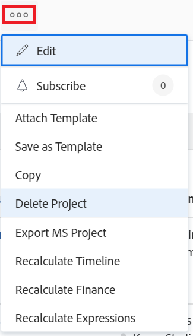

# Delete projects

<!--Audited: 01/2024-->

You can delete a project if the project and its data are no longer needed.

As an alternative to deleting a project, we recommend editing the project and changing the status to Complete or Dead. This removes all current tasks related to the project from a user's task list, but saves all data associated with the project.

You can delete a project in a project list or at the project level.

## Access requirements

<table style="table-layout:auto"> 
 <col> 
 <col> 
 <tbody> 
  <tr> 
   <td> 
Adobe Workfront plan
 </td> 
   <td>Any</td> 
  </tr> 
  <tr> 
   <td> 
Adobe Workfront license*
 </td> 
   <td> 
Current license: Plan 
 
   Or
   
New license: Standard 

   </td> 
  </tr> 
  <tr data-mc-conditions=""> 
   <td>Access level configuration</td> 
   <td> 
Edit access to Projects with ability to Create and Delete projects
 </td> 
  </tr> 
  <tr data-mc-conditions=""> 
   <td> 
Object permissions 
 </td> 
   <td> 
Edit access to Projects, Tasks, Issues with ability to Delete projects, tasks, and issues
 </td> 
  </tr> 
 </tbody> 
</table>

*To find out what plan, license type, or access you have, contact your Workfront administrator. For more information about access requirements, see [Access requirements in Workfront documentation](/help/quicksilver/administration-and-setup/add-users/access-levels-and-object-permissions/access-level-requirements-in-documentation.md). 

## Understand the process of deleting projects

* [Limitations for deleting projects](#limitations-for-deleting-projects) 
* [The impact of deleting projects](#the-impact-of-deleting-projects)

### Limitations for deleting projects  {#limitations-for-deleting-projects}

* Deleted items move to the Recycle Bin for 30 days and can be recovered only by the Workfront administrator.

  For more information about restoring objects, see the article [Restore deleted items](../../../administration-and-setup/manage-workfront/manage-deleted-items/restore-deleted-items.md).

* If the project has tasks or issues with logged hours, the Workfront or group administrator must allow the deletion of these tasks by configuring the Task & Issue Preferences in your Workfront instance for you to be able to delete the project that contains the tasks.

  For more information about enabling the deletion of tasks, issues , or projects where hours are logged, see the "Deletion" section in [Configure system-wide task and issue preferences](../../../administration-and-setup/set-up-workfront/configure-system-defaults/set-task-issue-preferences.md).

  <!--
  
(NOTE: this bullet stays in NWE only forever)

  -->

### The impact of deleting projects {#the-impact-of-deleting-projects}

* When you delete a project, you impact other objects linked to the project.

  The following objects attached to a project are also deleted when you delete a project:

   * Documents

     You cannot delete a project that has an attached document which has been checked out. For more information about checking out documents, see [Check out documents](../../../documents/managing-documents/check-out-documents.md).
   
   * Tasks 
   * Subtasks
   * Issues
   * Updates
   * Approvals
   * Expenses
   * Risks
   * Baselines
   * Business Case information
   * Queue Details information
   * Billing Rates
   * Billing Records

      You cannot delete a project that has Billing Records with a status of Billed. For more information, see [Create billing records](../../projects/project-finances/create-billing-records.md). 

* Depending on how your Workfront administrator configures the Project, Task, or Issue Deletion Preferences in the Timesheet & Hours Preferences of your Workfront instance, hours logged for the tasks, issues, or the project are handled in one of the following ways when deleting the project:

   * The hours stay on the timesheet as general time. 
   * The hours are deleted and will be restored if the project is ever restored.

  For more information about configuring the deletion preferences for hours logged on issues, see [Configure timesheet and hour preferences](../../../administration-and-setup/set-up-workfront/configure-timesheets-schedules/timesheet-and-hour-preferences.md).

* If the project you delete is linked to an initiative in the Workfront Scenario Planner:

   * The initiative remains on the plan, but the link to the project is removed. 
   * If the project you delete is linked to the only published initiative from a plan, the indication that the plan has been published is also removed. 
   * If you recover a deleted project, the project is recovered, but its link to the initiative is not restored and the Scenario Planner area no longer displays in Project Details.

     The Scenario Planner requires an additional license. For information about the Workfront Scenario Planner, see [The Scenario Planner overview](../../../scenario-planner/scenario-planner-overview.md).

     For information about projects linked to initiatives in the Scenario Planner, see [Update or create projects by publishing initiatives in the Scenario Planner](../../../scenario-planner/publish-scenarios-update-projects.md).

* If the project is also an activity for a goal in Workfront Goals:

   * The project is deleted from the goal. The progress indicated on the goal by the project is also removed.

   * If you recover the deleted project, the project is also restored as the goal's activity.

     This requires an additional license. For information about Workfront Goals, see [Adobe Workfront Goals overview](../../../workfront-goals/goal-management/wf-goals-overview.md).

     For information about associating projects with goals, see [Add projects to goals in Adobe Workfront Goals](../../../workfront-goals/results-and-activities/connect-projects-to-goals-overview.md).

## Delete a project in a list

You can delete projects from a list of projects.

1. Go to a list of projects or a project report.
1. Select the project or projects that you want to delete, then click the **Delete** icon  at the top of the list.  

1. Click **Yes, Delete It** to confirm the deletion.

   The projects are deleted and stored in the Recycle Bin for 30 days. Your Workfront administrator can restore deleted projects from the Recycle Bin during this time.

## Delete a project at the project level

1. Go to the project you want to delete. 
1. Click the **More** icon  to the right of the project name, then click **Delete Project**. 

    

1. Click **Yes, Delete it**. 

   The project is deleted and stored in the Recycle Bin for 30 days. Your Workfront administrator can restore it from the Recycle Bin during this time.

## Restoring Deleted Projects

A system or group administrator can restore projects within 30 days after they are deleted, as described in the article [Restore deleted items](../../../administration-and-setup/manage-workfront/manage-deleted-items/restore-deleted-items.md).
