# Edit projects

<!--Audited: 01/2024-->

<!--The highlighted information on this page refers to functionality not yet generally available. It is available for all customers in the Preview environment and for a select group of customers in the Production environment.-->

<!--

***Linked to many articles,

The Resource Pools part also duplicates in the "Working with Resource Pools" article 

The Update Type section is also documented in Selecting the Project Update Type article

Keep the reference link to the other article that also documents the Update Type) 

(NOTE 2: information described here also exists in these articles:

** Project Overview area

**Manage project Finance area

If you need to update just one field, check to see if that field is also listed there and update in both places.)

-->

You can edit a project in Adobe Workfront as often as needed. We recommend that you edit projects minimally after their status changes to Current, to avoid confusion by sending out notifications about the changes to the entire project team. 

Ideally, you should edit a project when the project is in the Planning status. For information about the project team, see [Project Team overview](../../../manage-work/projects/planning-a-project/project-team-overview.md).

## Access requirements

+++ Expand to view access requirements for the functionality in this article.

<table style="table-layout:auto"> 
 <col> 
 <col> 
 <tbody> 
  <tr> 
   <td role="rowheader">Adobe Workfront plan</td> 
   <td> 
Any
 </td> 
  </tr> 
  <tr> 
   <td role="rowheader">Adobe Workfront license</td> 
   <td>
New: Standard 
 
   Or
   
Current: Plan 
 </td> 
  </tr> 
  <tr> 
   <td role="rowheader">Access level configurations</td> 
   <td> 
Edit access to Projects
 </td> 
  </tr> 
  <tr> 
   <td role="rowheader">Object permissions</td> 
   <td> 
     
Manage permissions to a project 
 
     
 For information about project permissions, see <a href="../../../workfront-basics/grant-and-request-access-to-objects/share-a-project.md" class="MCXref xref">Share a project in Adobe Workfront</a>.
 
For information on requesting additional access, see <a href="../../../workfront-basics/grant-and-request-access-to-objects/request-access.md" class="MCXref xref">Request access to objects </a>.
 </td> 
  </tr> 
 </tbody> 
</table>

For more detail about the information in this table, see [Access requirements in Workfront documentation](/help/quicksilver/administration-and-setup/add-users/access-levels-and-object-permissions/access-level-requirements-in-documentation.md).

+++

## Limitations for editing projects

There are some limitations that might prevent you from editing projects.

Consider the following when editing projects:

* You cannot edit projects that are in an Approval Process, except for logging time and changing the Status. 
* You can attach documents or templates to a project that has a status of Complete, Dead, or is in Pending Approval only if your Workfront administrator or a group administrator enabled this functionality in the Project Preferences area. For information about setting project preferences, see [Configure system-wide project preferences](../../../administration-and-setup/set-up-workfront/configure-system-defaults/set-project-preferences.md). 
* You can only edit the following information on a project in a Dead or Complete status:

   * Modify existing expenses.
   * Add, remove, or edit custom forms.

## Edit a project

By editing a project you can modify information and settings for the project, as well as tasks and issues on the project.

Some settings mentioned in this article might be modified from their default status by their state in the template from which the project was created. 

For information about editing templates, see [Edit project templates](../../../manage-work/projects/create-and-manage-templates/edit-templates.md).

For information about creating a project from a template, see [Create a project using a template](/help/quicksilver/manage-work/projects/create-projects/create-project-from-template.md). 

{{step1-to-projects}}

1. (Optional) Click **Projects I'm On** or **Projects I Own** in the upper-right corner to display projects where you are the owner or projects where you are part of the project team.

   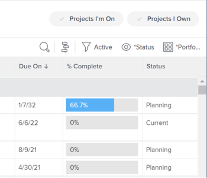

   >[!NOTE]
   >
   >If you are a group administrator, you can see and edit your group's projects in the Groups area as well as in the Projects area. For more information, see [Create and modify a group's projects](../../../administration-and-setup/manage-groups/work-with-group-objects/create-and-modify-a-groups-projects.md).

1. Click the name of the project you want to edit to open the project page.

1. (Optional) To edit limited information about a project, click **Project Details** in the left panel. If you want to edit all information about the project, proceed to Step 5. <!--accurate?!-->

   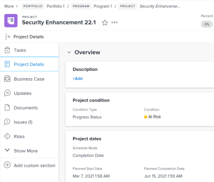

   >[!NOTE]
   >
   >Depending on how your Workfront administrator or Group administrator modified your Layout Template, the fields in the Project Details area might be rearranged or not display. For information, see [Customize the Details view using a layout template](../../../administration-and-setup/customize-workfront/use-layout-templates/customize-details-view-layout-template.md).

   To edit information in the Details section, do the following:

   1. (Optional) Click the **Collapse All** icon   in the upper-right corner to collapse all areas. 
   1. (Optional and conditional) When an area is collapsed, click the **right-pointing arrow**  next to each area to expand the area you want to edit. 
   1. For more information about editing information in the Project Details tab, see the following articles:

      * [Manage information in the project Overview area](../../../manage-work/projects/manage-projects/understand-project-overview-area.md) 
      * [Manage information in the project Finance area](../../../manage-work/projects/project-finances/manage-project-finance-area.md)

   1. (Optional) To attach a custom form, start typing the name of a form in the **Add custom form** field, then select it when it displays in the list, then click **Save Changes**.
   1. (Optional) Click the **Export** icon  to export the Overview and custom forms information to a PDF file, then click **Export**. Select from the following:

      * Select all (displays only when there is at least one custom form attached)
      * Overview
      * The name of one or multiple custom forms

      The PDF file downloads to your computer.

      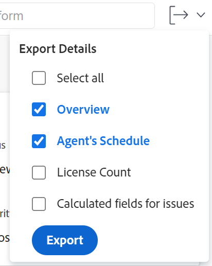

      For more information, see [Export custom forms and object details](../../../workfront-basics/work-with-custom-forms/export-custom-forms-details.md).

   For information about the fields visible in the Project Details section, continue with editing the project in the Edit Project box as described below.
1. To edit all information about the project, click the **More** menu  next to the name of the project, then click **Edit**.

   Or

   From a list of projects, select one or multiple projects, then click the **Edit** icon  at the top of the list.

   For more information about editing projects in bulk, see the section [Edit projects in bulk](#edit-projects-in-bulk) in this article. 

   The **Edit Project** box opens.

   >[!IMPORTANT]
   >
   >You must have Manage permissions to the project in order to see the Edit option.

   All project fields are available in the Edit Project box and are grouped by the areas listed in the left panel.

   >[!NOTE]
   >
   >Depending on how your Workfront administrator or Group administrator modified your Layout Template, the areas in the left panel of the Edit Project box or any fields listed in these areas might be rearranged or not display. For information, see [Customize the Details view using a layout template](../../../administration-and-setup/customize-workfront/use-layout-templates/customize-details-view-layout-template.md).

1. (Conditional) If you clicked the **More** menu and then **Edit**, update information in any of the following areas listed in the left panel:

   * [Project Name](#project-name) 
   * [Overview](#overview) 
   * [Custom Forms](#custom-forms) 
   * [Finance](#finance) 
   * [Project Settings](#project-settings) 
   * [Task Settings](#task-settings) 
   * [Issue Settings](#issue-settings) 
   * [Access](#access)

   >[!NOTE]
   >
   >Depending on how your Workfront administrator sets up our Layout Template for the Details area of the project, the sections and the fields in the Edit Project box might be different in your environment. For information, see [Customize the Details view using a layout template](../../../administration-and-setup/customize-workfront/use-layout-templates/customize-details-view-layout-template.md).

### Project Name {#project-name}

1. Begin editing your project as described above.
1. Click **Project Name** in the left panel.

   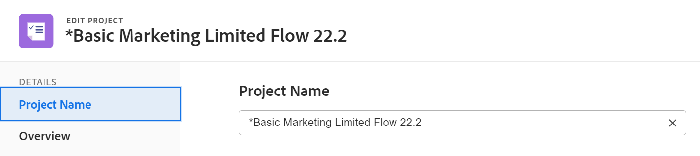

1. Update the name of the project.

   You cannot edit the project name when editing projects in bulk. 

### Overview {#overview}

1. Begin editing your project as described above.
1. Click **Overview** in the left panel.

   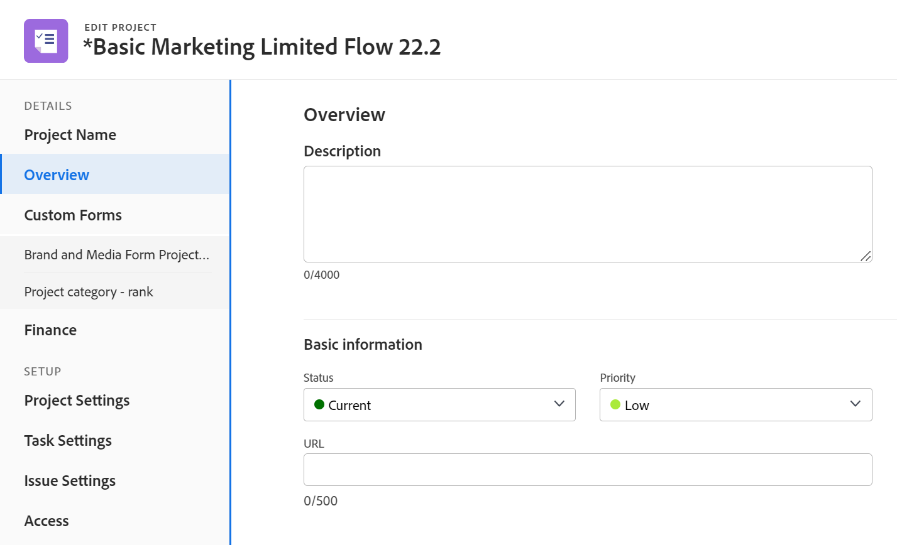

1. Update the following information about the project:

      <table style="table-layout:auto"> 
      <col> 
      <col> 
      <tbody> 
      <tr> 
         <td role="rowheader"><strong>Description</strong> </td> 
         <td> 
Add additional information about the project.
 </td> 
      </tr> 
      <tr> 
         <td role="rowheader"><strong>Status</strong> </td> 
         <td> 
Select the status of the project. You cannot mark a project Complete before all tasks and issues complete. For information about project statuses, see <a href="../../../administration-and-setup/customize-workfront/creating-custom-status-and-priority-labels/project-statuses.md" class="MCXref xref">Access the list of system project statuses</a>
 </td> 
      </tr> 
      <tr> 
         <td role="rowheader"><strong>Priority</strong> </td> 
         <td> 
 
This is just a visual flag for you which allows you to prioritize your projects.
 
Depending on the Project Preferences selected by your Workfront administrator, the names of priorities might be different for you. For more information about editing priorities, see <a href="../../../administration-and-setup/customize-workfront/creating-custom-status-and-priority-labels/create-customize-priorities.md" class="MCXref xref">Create and customize priorities</a>
 
 </td> 
      </tr> 
      <tr> 
         <td role="rowheader"><strong>URL</strong> </td> 
         <td> 
Specify a web link that relates to information about this project.
 </td> 
      </tr> 
      <tr> 
         <td role="rowheader"><strong>Condition Type</strong> </td> 
         <td> 
Select between the following Condition Types: 
         <ul> 
         <li><strong>Manual:</strong> The project owner sets the condition on the project manually.</li> 
         <li><strong>Progress Status:</strong> Workfront automatically sets the condition based on the Progress Status of tasks on the Critical Path. For more information about understanding Progress Status, see <a href="../../../manage-work/tasks/task-information/task-progress-status.md" class="MCXref xref">Task Progress Status overview</a>.</li> 
         </ul>
Your Workfront administrator or a group administrator selects the default for how the projects' condition is calculated for your system or your group. For information about setting project defaults, see <a href="../../../administration-and-setup/set-up-workfront/configure-system-defaults/set-project-preferences.md" class="MCXref xref">Configure system-wide project preferences</a>. 

 </td> 
      </tr> 
      <tr> 
         <td role="rowheader"><strong>Condition</strong> </td> 
         <td> 
 
(Displays only after you select <strong>Manual</strong> for the <strong>Condition Type</strong>): Select a Condition to indicate how the project is going. 
 
For information how project Conditions can be set automatically or manually, see <a href="../../../manage-work/projects/manage-projects/project-condition-and-condition-type.md" class="MCXref xref">Overview of Project Condition and Condition Type</a>
 
 </td> 
      </tr> 
      <tr> 
         <td role="rowheader"><strong>Schedule Mode</strong> </td> 
         <td> 
Specify whether the project is scheduled from the Start Date, or from the Completion Date. This selection determines the planned dates of the tasks on the project. 
         <ul> 
         <li><strong>Start Date</strong>: The first task of the project has the same Planned Start Date as the project by default. For information about the task Planned Start Date, see <a href="../../../manage-work/tasks/task-information/task-planned-start-date.md" class="MCXref xref">Overview of the task Planned Start Date</a>. The project timeline calculates from the Start Date and the Completion Date of the project is calculated by the system, based on the duration of all the tasks. </li> 
         <li><strong>Completion Date</strong>: The last task of the project has the same Planned Completion Date as the project. The project timeline calculates from the Completion Date and the Start Date of the project is calculated by the system, by subtracting the duration of all the tasks from the Completion Date of the project. </li> 
         </ul>
Your Workfront administrator or a group administrator selects the default Schedule Mode setting for your system or your group. For information about setting project defaults, see <a href="../../../administration-and-setup/set-up-workfront/configure-system-defaults/set-project-preferences.md" class="MCXref xref">Configure system-wide project preferences</a>.

 </td> 
      </tr> 
      <tr> 
         <td role="rowheader"><strong>Planned Start Date and time</strong> </td> 
         <td> 
 
Specify the date when you select <strong>Schedule From Start Date</strong>.  
 
This is a read-only field when you select <strong>Schedule from Completion Date</strong>. 
 
 </td> 
      </tr> 
      <tr> 
         <td role="rowheader"><strong>Planned Completion Date and time</strong> </td> 
         <td> 
Specify the date when you select <strong>Schedule from Completion Date</strong>. 
 
This is a read-only field when you select <strong>Schedule from Start Date</strong>. 
 </td> 
      </tr> 
      <tr> 
         <td role="rowheader"><strong>Portfolio</strong></td> 
         <td>Indicate a Portfolio that the project belongs to. You must create a Portfolio first, before it appears in the drop-down list. Only active portfolios can be associated with a project. For more information about creating portfolios, see <a href="../../../manage-work/portfolios/create-and-manage-portfolios/create-portfolios.md" class="MCXref xref">Create a portfolio </a>.</td> 
      </tr> 
      <tr> 
         <td role="rowheader"><strong>Program</strong></td> 
         <td> 
If you selected a Portfolio for the project, specify a Program for the project. Some Portfolios might not have Programs. You must create a Program first, before it appears in this drop-down list. Only active programs can be associated with a project. 
 
For more information about creating programs, see <a href="../../../manage-work/portfolios/create-and-manage-programs/create-program.md" class="MCXref xref">Create a program</a>.
 </td> 
      </tr> 
      <tr> 
         <td role="rowheader"><strong>Group</strong></td> 
         <td> 
 
Specify the name of the group associated with the project. 
This is a required field. You cannot have a project which is not associated with a group. 
 
You can make sure you are selecting the right group by hovering over it and clicking the information icon  that displays next to it. This displays a tooltip listing information about the group, such as the hierarchy of groups above it and its administrators.
 By default, one of the following groups is automatically associated with a project when it is created, unless you specify a different group:
 
         <ul> 
         <li> 
When the project is created from the Projects area, the Home Group of the project creator is associated with the project. 
 
This is also true when the project is created from the Projects  section  in a portfolio or program.
 </li> 
         <li> 
When the project is created from a group's main page in the Setup area, that group is associated with the project.
 </li> 
         </ul> 
 
  
 
         
<b>NOTES</b>

         <ul>
         <li>
If the project, or its tasks or issues are associated with a group-level custom Status, changing the Group of the project might cause the Status of the project, tasks, or issues to change to match the new group.
</li>
         <li>
If the project, or its tasks or issues are already associated with a group-level approval process using group-level custom statuses, changing the group might create a conflict between the approval statuses of the previous group and those existing at the system level.

         
Consider removing the group-level approval processes on the project, or its tasks or issues before updating the group.

         
For information about creating group-level approval processes, see <a href="../../../administration-and-setup/manage-groups/work-with-group-objects/create-and-modify-groups-approval-processes.md" class="MCXref xref">Group-level approval processes</a>.

         
For information about creating a group-level custom status, see <a href="../../../administration-and-setup/manage-groups/manage-group-statuses/create-or-edit-a-group-status.md" class="MCXref xref">Create or edit a group status</a>
</li></ul> </td> 
      </tr> 
      <tr> 
         <td role="rowheader"><strong>Company</strong> </td> 
         <td> 
Specify a company associated with the project. You must create a company before you can associate it with a project. Only active companies can be associated with a project. For information about creating companies, see <a href="../../../administration-and-setup/set-up-workfront/organizational-setup/create-and-edit-companies.md" class="MCXref xref">Create and edit companies</a>.
 </td> 
      </tr> 
      <tr> 
         <td role="rowheader"><strong>Project Owner</strong> </td> 
         <td> 
Start typing the name of a user to add them to the project, then select it when it displays in the list. The user is added to the project team and is automatically given Manage permissions to the project. The user who is designated as the Project Owner must be a Workfront active user.

         </td> 
      </tr> 
      <tr> 
         <td role="rowheader"><strong>Project Sponsor</strong> </td> 
         <td> 
Start typing the name of a user to add them to the project, then select it when it displays in the list. The user is added to the project team and is automatically given View permissions to the project. The user who is designated as the Project Sponsor must be a Workfront active user. 
 </td> 
      </tr> 
      <tr> 
         <td role="rowheader"><strong>Resource Manager</strong> </td> 
         <td> 
 Start typing the names of users to add them to the project, then select them when they display in the list. The users are added to the project team and are automatically given Manage permissions to the project and can assign resources to the tasks and issues on the project. Users maintain Manage permissions on the project even when they are removed from the Resource Manager field. You can specify more than one Resource Manager. 
 </td> 
      </tr> 

   <tr> 
         <td role="rowheader"><strong>Converted Issue Originator</strong> </td> 
         <td> 
 By default, this field is auto-populated with the name of the user who created the issue which the project was converted from. You can update this name with any other user's name in Workfront.  
 </td> 
      </tr> 

      </tbody> 
      </table>

      >[!TIP]
      >
      >When updating the Project Owner, Project Sponsor, and Resource Manager fields, notice the avatar, the user's Primary Role, or their email address to distinguish between users with identical names. 
      >
      >Users must be associated with at least one job role to view it as you add them.
      >
      >You must have the View Contact Info setting enabled in your access level for Users to view users' emails. For information, see [Grant access to users](../../../administration-and-setup/add-users/configure-and-grant-access/grant-access-other-users.md). 

1. (Optional) Continue editing the following sections, depending on the information you want to modify

   Or

   Click **Save**.

### Custom Forms {#custom-forms}

Depending on your access level and on your permission on the project, the following scenarios exist:

* If you don't have Edit Custom Form permissions on the project, you cannot edit the fields on any of the attached custom forms. You can only view the fields on the custom forms attached to the project. 
* If you have View (and not Edit) access to a section on a custom form, you cannot edit the fields in that section. 
* If you have no access to a section on one of the custom forms attached to the project, the section does not display in the Edit Project box. 

When selecting more than one project to edit them in bulk, the following scenarios exist:

* If you don't have Edit Custom Form permissions on at least one of the selected projects, you cannot edit the fields on any of the attached custom forms. You can only view the fields on the attached custom forms
* If you have View (and not Edit) access to a section on a custom form, you cannot edit the fields in that section. You can only view the fields in that section. 
* If you have no access to a section on one of the custom forms attached to at least one of the projects, the section does not display in the Edit Projects box. 
* If you have required fields on any of the custom forms attached to all the projects, and you select one field without actually editing it, you must discard your changes on that field or add information to it before you can save the projects you selected. If you don't select a required field at all, you can save the projects you selected even if the required field is blank. 

For information about custom form access, see the following articles: 

* [Share a custom form](../../../administration-and-setup/customize-workfront/create-manage-custom-forms/share-access-to-a-custom-form.md)
* [Add a section break to a custom form](../../../administration-and-setup/customize-workfront/create-manage-custom-forms/add-a-section-break-to-a-custom-form.md) 

To edit information on custom forms when editing a project:

1. Begin editing your project as described above.
1. Click **Custom Forms** in the left panel.

   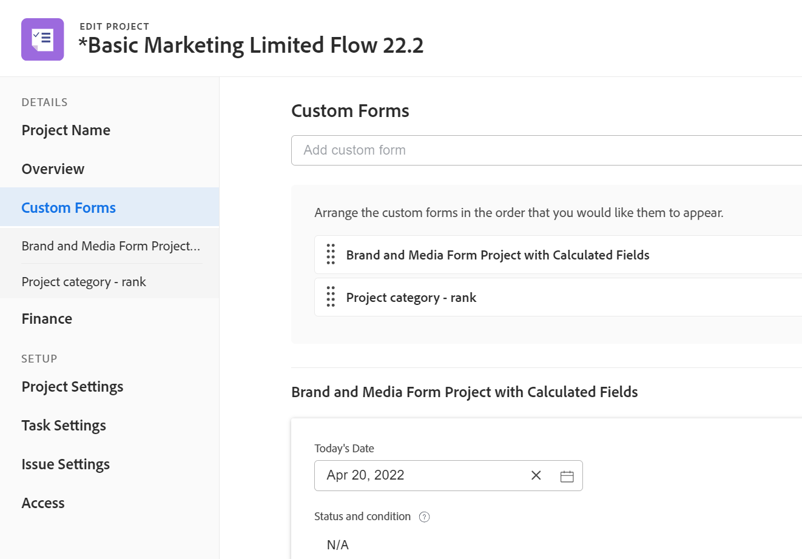

1. Click the **Add custom form** box and select a form from the list to attach it to the project. By default, the first 40 forms display in alphabetical order. If you don't see the form in the list, start typing its name, then select it when it appears in the list. 

   >[!NOTE]
   >
   >You must build the custom forms before they are available to select in this field. Only active custom forms appear in the list. For more information about building custom forms, see [Create or edit a custom form](../../../administration-and-setup/customize-workfront/create-manage-custom-forms/create-or-edit-a-custom-form.md). You can add up to ten custom forms to a project. 

1. (Conditional) If you attached a custom form to the project, edit any fields on the form. You must specify all required fields before you can save the project.
1. (Optional) Click the **X icon** to the right of the name of a custom form to remove it, then click **Remove**. 
1. (Optional) Continue editing the following sections, depending on the information you want to modify

   Or

   Click **Save**.

### Finance {#finance}

Depending on your access level and on your permission on the project, the following scenarios exist:

* If you have View access to Financial Data and View Finance permissions on the project, you can only view the fields in the Finance section. You cannot edit the fields in this section.
* If you have Edit access to Financial Data and Manage Finance permissions on the project, you can update the fields in this section. 

When selecting more than one project to edit them in bulk and, the following scenarios exist:

* If you select at least one project where you have View Finance (instead of Manage Finance) permissions, you can only view the fields in this section for all the selected projects. You cannot bulk-edit the fields in the Finance section.
* If you select at least one project where you have no finance permissions, this section does not display at all. 

To edit fields in the Finance area:

1. Begin editing your project as described above.
1. Click **Finance** in the left panel.

   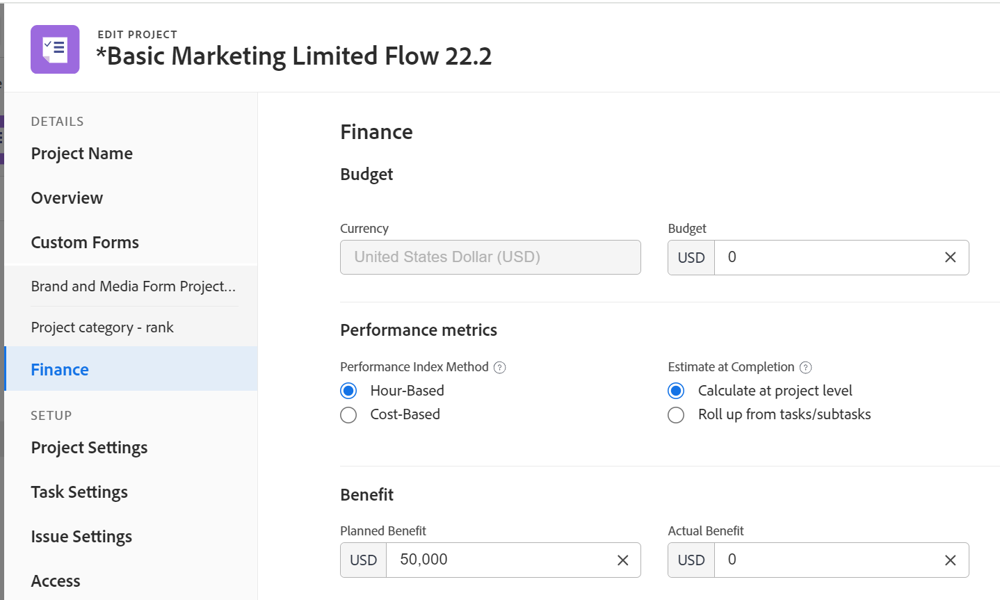

1. Update the following financial information for the project:

   <table style="table-layout:auto"> 
    <col> 
    <col> 
    <tbody> 
     <tr data-mc-conditions=""> 
      <td role="rowheader"><strong>Currency</strong> </td> 
      <td> 
 
Specify the currency for the project, if it is different than the default currency of your system. You cannot change the currency of a project if there is already financial information on the project. This field is not visible if you have only the default currency in the system. 
 
For more information about currency, see <a href="../../../administration-and-setup/manage-workfront/exchange-rates/set-up-exchange-rates.md" class="MCXref xref">Set up exchange rates</a>. 
 
 </td> 
     </tr> 
     <tr> 
      <td role="rowheader"><strong>Budget</strong> </td> 
      <td> Specify a Budget for the project. </td> 
     </tr> 
     <tr> 
      <td role="rowheader"><strong>Performance Index Method</strong> </td> 
      <td> 
Select <b>Hour-Based</b>, or <b>Cost-Based</b> to indicate whether the Earned Value metrics of the project (such as Cost Performance Index or Estimated Actual Cost) are calculated using hours or costs. 
 
For more information about the Performance Index Method, see <a href="../../../manage-work/projects/project-finances/set-pim.md" class="MCXref xref">Set the Performance Index Method (PIM)</a>. 
 
Your Workfront administrator or a group administrator selects the default Performance Index Method setting for your system or your group. For information about setting project defaults, see <a href="../../../administration-and-setup/set-up-workfront/configure-system-defaults/set-project-preferences.md" class="MCXref xref">Configure system-wide project preferences</a>.
 </td> 
     </tr> 
     <tr> 
      <td role="rowheader"><strong>Estimate at Completion</strong> </td> 
      <td> 
 
Specify how Workfront should calculate the Estimate at Completion (EAC). 

      Select from the following options: 
      <ul><li><b>Calculate at project level</b></li>
      <li><b>Roll up from tasks/ subtasks</b></li> </ul>
      
For more information about how the Estimate at Completion calculates, see <a href="../../../manage-work/projects/project-finances/calculate-eac.md" class="MCXref xref">Calculate Estimate At Completion (EAC)</a>.
 
Your Workfront or group administrator selects the default Estimate at Completion setting for your system or your group. For information about setting project defaults, see <a href="../../../administration-and-setup/set-up-workfront/configure-system-defaults/set-project-preferences.md" class="MCXref xref">Configure system-wide project preferences</a>.
 
 </td> 
     </tr> 
     <tr> 
      <td role="rowheader"><strong>Planned Benefit</strong> </td> 
      <td> 
Estimate what the Planned Benefit of the project is. This is used in the Business Case of the project and the Portfolio Optimizer. For more information about the Planned Benefit of a project, see <a href="../../../manage-work/projects/project-finances/project-planned-benefit.md" class="MCXref xref">Overview of project Planned Benefit</a>. The Planned Benefit of a project is taken into account when the Net Value of a project is calculated. 
 
For more information, see <a href="../../../manage-work/portfolios/portfolio-optimizer/manage-projects-in-portfolio-optimizer.md" class="MCXref xref">Manage projects in the Portfolio Optimizer</a> . 
 </td> 
     </tr> 
     <tr> 
      <td role="rowheader"><strong>Actual Benefit</strong> </td> 
      <td> 
Estimate the Actual Benefit of the project. This is a currency amount that represents the benefit that your company or department would gain after this project is complete. 
 </td> 
     </tr> 
      <tr> 
      <td role="rowheader"><strong>Fixed Cost</strong> </td> 
      <td> 
Specify the Fixed Cost for the project. This is different than the Labor Cost which comes from the hours on the project and the Expense Cost which comes from the amount of expenses on the project. The Fixed Cost of a project is taken into account when calculating the Net Value of a project and it is part of the Budgeted Cost. 
 </td> 
     </tr> 
     <tr> 
      <td role="rowheader"><strong>Fixed Revenue</strong> </td> 
      <td> 
Specify the Fixed Revenue for the project. 
 </td> 
     </tr> 
    </tbody> 
   </table>

1. (Optional) Continue editing the following sections, depending on the information you want to modify.

   Or

   Click **Save**.

### Project Settings {#project-settings}

1. Begin editing your project as described above.
1. Click **Project Settings** in the left panel.

   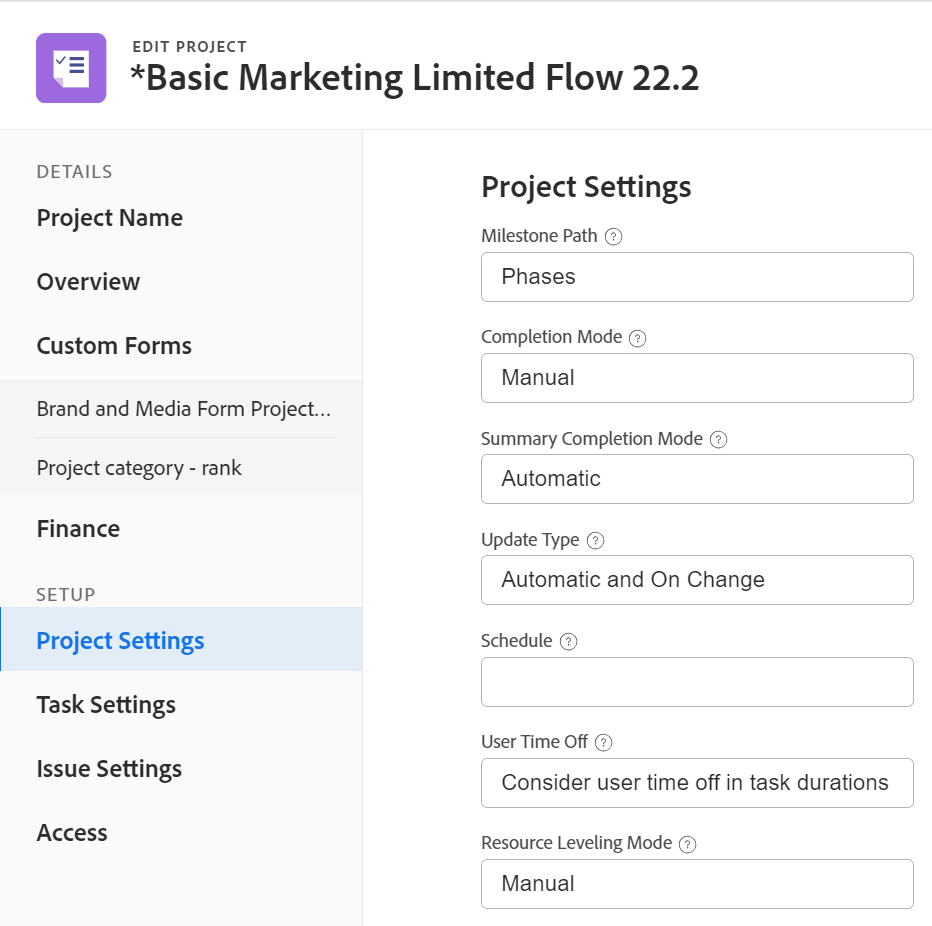

1. Update the following information:

      <table style="table-layout:auto"> 
      <col> 
      <col> 
      <tbody> 
      <tr> 
      <td role="rowheader"><strong>Milestone Path</strong> </td> 
       <td> 
Select a Milestone Path for the project. Only active milestone paths display in the list.
 
For more information about Milestone Paths, see <a href="../../../administration-and-setup/customize-workfront/configure-approval-milestone-processes/create-milestone-path.md" class="MCXref xref">Create a milestone path</a>.
 </td> 
      </tr> 
      <tr> 
      <td role="rowheader"><strong>Completion Mode</strong> </td> 
      <td> 
Controls how the project is marked as Complete. Select from the following options: 
       <ul> 
       <li>
<strong>Automatic</strong>: The project is marked Complete when all the tasks and issues are completed.

The project Status is automatically changed to Complete only when the project status is Current when the tasks are completed. 
</li> 
       <li><strong>Manual</strong>: You have to manually select the Complete status for the project, when all the tasks and issues are completed.</li> 
       </ul>
 </td> 
       </tr> 
       <tr> 
       <td role="rowheader"><strong>Summary Completion Mode</strong></td> 
       <td> 
Controls how the parent tasks are marked as Complete. Select from the following options: 
       <ul> 
       <li><strong>Automatic</strong>: The parent tasks are marked Complete and they update their percent complete automatically, as the children tasks are completed and the percent complete of the children is updated. </li> 
       <li><strong>Manual</strong>: You have to manually update the percent complete and the status of the parent tasks, independently of what changes are made to the children tasks. This allows you to mark a parent task completed even when the subtasks are incomplete. </li> 
       </ul>
 </td> 
       </tr> 
       <tr> 
       <td role="rowheader"><strong>Update Type</strong></td> 
       <td> 
Controls when the changes you make to the project timeline are saved on the project or the parent tasks. For example, the following changes to the project trigger an update to the timeline of the project: 
       <ul> 
       <li>Update the dates of tasks</li> 
       <li>Change predecessor relationships of tasks</li> 
       <li>
Change parent-child relationships, adding or removing assignments in addition to changing the task constraint or duration type.

When the tasks update, their parent objects (parent tasks or the project) update at the time indicated by the Update Type. 

If the parent objects do not update immediately after the change when selecting "Automatic and On Change" or "Change Only" Update Type, refresh the page

Select from the following options: 

- <strong>Automatic and On Change</strong> (Default setting): The project timeline is updated each time a change occurs in the project or in another project that the project is dependent on (On Change). The project timeline is also updated each night (Automatic).

This is the recommended setting for this field because it ensures that the project is always up to date.

When you perform an action on a task or project that triggers a timeline recalculation, all available dates are immediately displayed, allowing you to continue working. On projects with more than 100 tasks, dates that require longer recalculations display briefly as a question mark (between 1 and 5 seconds, or up to a minute for large projects). This indicates that the recalculation is not yet finished, and the dates are subject to change.

- <strong>Change Only</strong>: The project timeline is updated each time a change occurs in the project or in another project that the project is dependent on. You might want to select this option if changes rarely occur in the project or in other projects that the timeline is dependent on.

- <strong>Automatic Only</strong>: The project timeline is updated each night; the timeline is not updated immediately after changes are made.

You might want to select this option if many changes occur each day in the project or in other projects that the timeline is dependent on. However, be aware that you chose this setting, as the project will not update at the same time that the changes are made.

- <strong>Manual Only</strong>: The project timeline is updated only when you select the option to Recalculate Timeline. For more information about manually recalculating the project timeline, see <a href="../../../manage-work/projects/manage-projects/recalculate-project-timeline.md" class="MCXref xref">Recalculate project timelines</a>. 

You might want to select this option if you are making many changes to the project at one time, and you want the timeline recalculation to occur after all of the changes have been made (rather than after each individual change).
</li> 
       </ul>
 </td> 
       </tr> 
       <tr> 
       <td role="rowheader"><strong>Schedule</strong> </td> 
       <td> 
Select a schedule for your project. This should be the same schedule assigned to most people that are working on the project. You must create a schedule before you can assign it to a project or a user. If you have not created custom schedules in your system, the Default Schedule is selected.
 
For more information about creating schedules, see <a href="../../../administration-and-setup/set-up-workfront/configure-timesheets-schedules/create-schedules.md" class="MCXref xref">Create a schedule</a>. 
 </td> 
       </tr> 
       <tr> 
       <td role="rowheader"><strong>User Time Off</strong> </td> 
       <td> 
Determines whether the time off of the Primary Assignee of a task adjusts the task planned dates on the project. 

Your Workfront administrator or a group administrator selects the default for this setting for your system or your group. For information about setting project defaults, see <a href="../../../administration-and-setup/set-up-workfront/configure-system-defaults/set-project-preferences.md" class="MCXref xref">Configure system-wide project preferences</a>. 

Select from the following options: - <strong>Consider user time off in task durations</strong>: When selecting this option, the planned dates of the tasks adjust according to the time off of the Primary Assignee of the task, if the time off occurs during the duration of the task. 

For example, if a task with a constraint of As Soon As Possible is scheduled to start on June 1 and complete on June 3, and the Primary Assignee has June 2 marked for Time-off, when this selection is enabled the task planned dates are June 1 to June 4. Depending on the Task Constraint, the following scenarios exist: 
 
       <ul> 
       <li>For task constraints that relate to planning from a start date (As Soon As Possible, Earliest Available Time, Start No Earlier Than, Start No Later Than, Must Start On) the Planned Start Date does not change but the Planned Completion Date changes.</li> 
       <li>For task constraints that relate to planning from a completion date (As Late As Possible, Latest Available Time, Finish No Earlier Than, Finish No Later Than, Must Finish On), the Planned Completion Date does not change, but the Planned Start Date changes.</li> 
       <li>For tasks with a constraint of Fixed Dates, neither the Planned Start nor Completion Date changes. </li> 
       </ul>
The Duration of the task does not change when you select this setting. Only the planned dates change, depending on the Task Constraint. For information about task constraint, see <a href="../../../manage-work/tasks/task-constraints/task-constraint-overview.md" class="MCXref xref">Task Constraint overview</a>. 

- <strong>Ignore user time off in task durations</strong>: When selecting this option, the planned dates of the tasks on the project remain as originally planned, even if the Primary Assignee of the task has time off during the duration of the task. 

Consider the following when selecting options for this setting:
 
       <ul> 
       <li>
The default option for this setting for a new project is the same as the system-level project preference. 

For information about the project preferences at the System level, see <a href="../../../administration-and-setup/set-up-workfront/configure-system-defaults/set-project-preferences.md" class="MCXref xref">Configure system-wide project preferences</a>. 
</li> 
       <li>When you attach a template to an existing project, the setting on the project is updated to match the one of the template. </li> 
       <li>
Workfront decides which planned task dates to adjust according to the Task Constraint value of the task. Depending on what that is, either the Planned Start or the Planned Completion Date, or both could be affected, or might even remain the same. For example, if a task has a Constraint of Fixed Dates, the dates do not adjust when the Primary Assignee has time off, even when <strong>Consider user time off in task durations</strong> is selected. 
</li> 
       </ul></td> 
      </tr> 
      <tr> 
       <td role="rowheader"><strong>Resource Leveling Mode</strong> </td> 
       <td> 
 
Select from the following options:
 
- <strong>Manual</strong>: you must manually level your resources (this is the default setting)
 
- <strong>Automatic</strong>: Workfront levels your resources.
 
For more information about Resource Leveling, see <a href="../../../manage-work/gantt-chart/use-the-gantt-chart/level-resources-in-gantt.md" class="MCXref xref">Level Resources in the Gantt Chart </a>.
 
 </td> 
      </tr> 
      <tr> 
       <td role="rowheader"><strong>Risk</strong> </td> 
       <td> 
 
Define the level of risk of your project. The risk is just an indicator of how risky a project can be. You can prioritize the execution of your projects based on the level of risk.
 
 
Consider selecting from the following levels of risk:
 
- Very Low
 
- Low
 
- Medium
 
- High
 
- Very High
 
The levels of risks you indicate here cannot be customized.
 
These are not related to the potential Risks that could occur during the life of a project and which you should record in the Risks tab of the project, or in the Business Case. For information about potential project Risks, see <a href="../../../administration-and-setup/set-up-workfront/configure-system-defaults/edit-create-risk-types.md" class="MCXref xref">Edit and create risk types</a>. 
 
 
 </td> 
      </tr> 
      <tr> 
       <td role="rowheader"><strong>Resource Pools</strong> </td> 
       <td> 
 
Specify the Resource Pools associated with the project. Resource Pools are collections of users that are needed at the same time for the completion of a project and allow for project budgeting in the Resource Planner. For more information about Resource Pools, see <a href="../../../resource-mgmt/resource-planning/resource-pools/work-with-resource-pools.md" class="MCXref xref"> Resource pools overview </a>. 
 
When you edit projects in bulk, only the Resource Pools that are common to all the projects selected appear in this field. If the projects selected have no shared Resource Pools, this field will be empty. The Resource Pools you specify here will overwrite the projects' individual Resource Pools.
 
 </td> 
      </tr> 
      <tr> 
       <td role="rowheader"> <strong>Allow company-level billing rates to override project-level billing rates</strong></td> 
       <td>Select this option to allow company-level billing rates to override historical job role rates unless those rates are marked as billed. Enabling this option overrides historical job role rates unless they are marked as billed.  For more information, see <a href="../../../manage-work/projects/project-finances/override-project-level-with-company-level-billing-rates.md" class="MCXref xref">Override Project-Level Billing Rates with Company-Level Billing Rates</a>.</td> 
      </tr> 
      <tr> 
       <td role="rowheader"><strong>Require time to be approved for this project</strong></td> 
       <td> 
 Select this option to require the Project Owner to approve time logged on the project. If you are using Billing Records and you select this option, only the approved hours on the project appear as available billable hours for the Billing Records. Approving time on the project is independent of approving timesheets. 
 
For more information about requiring time to be approved on a project, see <a href="../../../manage-work/projects/manage-projects/require-time-approval-for-projects.md" class="MCXref xref">Require time to be approved for a project</a>.
 </td> 
      </tr> 
      <tr> 
       <td role="rowheader"><strong>Filter Hour Types</strong> and <strong>Hour Types</strong></td> 
       <td> 
 
Select from the following options:
 
       <ul> 
       <li> 
Select <strong>No</strong> to make all project-specific hour types available on the project. (This is the default selection)
 
Or
 </li> 
       <li>Select <strong>Yes</strong> to make only a subset of the project-specific hour types available on the project, then select the hour types you want to make available from the <b>Hour Types</b> field.</li> 
       
<b>TIP</b>

       
The <b>Hour Types</b> field is not editable when you select <b>No</b>.
 
       
If you select this option, only the hour types you select are made available to select when logging hours on the project (or on tasks and issues within the project). You must select at least one hour type; if you select this option and you do not select any hour types, all hour types are made available on the project.
 </ul>
       
      
The same hour type selections must be made at the individual user level in order for the user to see these hour type options on the project. For more information about defining hour types at the user level, see <a href="../../../timesheets/create-and-manage-timesheets/log-time.md" class="MCXref xref">Log time</a>. 
 
 </td> 
      </tr> 
      <tr data-mc-conditions=""> 
       <td role="rowheader"><strong>Reminder Notification</strong> </td> 
       <td> 
 
Select the Reminder Notification that should be associated with the project. You must configure Reminder Notifications for projects for this field to appear during editing a project. For more information about configuring Reminder Notifications, see <a href="../../../administration-and-setup/manage-workfront/emails/set-up-reminder-notifications.md"><a href="../../../administration-and-setup/manage-workfront/emails/set-up-reminder-notifications.md" class="MCXref xref">Set up reminder notifications</a> .</a>
 
 </td> 
      </tr> 
      <tr data-mc-conditions=""> 
       <td role="rowheader"><strong>Approval Process</strong></td> 
       <td> 
Select the approval process you want to associate with the project. Your Workfront administrator must define system-level Approval Processes before you can associate them with projects. A user with administrative access to Approval processes can also create group-specific approval processes. For more information about creating approval processes, see <a href="../../../administration-and-setup/customize-workfront/configure-approval-milestone-processes/create-approval-processes.md" class="MCXref xref">Create an approval process for work items</a>.
 
Consider the following when adding approval processes: 
 
       <ul> 
       <li>Only active approval processes display in the list. </li> 
       <li> 
System-wide and group-specific approval processes display in the list. An approval process associated with a group other than that of the project does not display in the list.
 
If the group associated with the project changes, the group-specific approval process becomes a single-use approval process. For more information about how changes to the group of the project or changes in the approval process affect approval settings, see <a href="../../../administration-and-setup/customize-workfront/configure-approval-milestone-processes/how-changes-affect-group-approvals.md" class="MCXref xref">How group and approval process changes affect assigned approval processes</a>. 
 </li> <!--(NOTE: this bullet stays here although the sections it might appear in are QS only, so we can use the snippet for both Qs and classic)-->
       
When bulk-editing projects, the following scenarios exist:
 
       <ul> 
       <li> 
When you select projects from the same group, both system-level and group-level approval processes display in this field.
 </li> 
       <li> 
When you select projects from different groups, only system-level approval processes display in this field.
 </li> 
       <li> 
When any of the projects have a single-use approval process attached, it is replaced by the system-level or group-level approval process you select. 
 </li> 
      </ul> </td> 
      </tr> 
      <tr> 
      </tr> 
      </tbody> 
      </table>

1. (Optional) Continue editing the following sections, depending on the information you want to modify.

   Or

   Click **Save**.

### Task Settings {#task-settings}

You can define the defaults that will be associated with all the new tasks when you add them to the project.

For information about how these settings affect creating new tasks, see the section [Task defaults when adding tasks to a project](../../../manage-work/tasks/create-tasks/create-tasks-overview.md#understa) in the article [Create tasks overview](../../../manage-work/tasks/create-tasks/create-tasks-overview.md).

1. Begin editing your project as described above.
1. Click **Task Settings** in the left panel.

   

1. In the **Task Default Approval Process** box, select the task Approval Process you want to associate with all new tasks when you add them to the project.

   Your Workfront administrator (or a user with administrative access to Approval processes) must create a system-level or group-level approval process for a task before you can associate it with a project. Only active approval processes display in the list. For information about creating Approval Processes, see [Create an approval process for work items](../../../administration-and-setup/customize-workfront/configure-approval-milestone-processes/create-approval-processes.md). For information about how changes to the group of the project or changes in the approval process affect approval settings, see [How group and approval process changes affect assigned approval processes](../../../administration-and-setup/customize-workfront/configure-approval-milestone-processes/how-changes-affect-group-approvals.md).

   When bulk-editing projects, the following scenarios exist:

   * When you select multiple projects from the same group, both system-level and group-specific task approval processes display in this field.
   * When you select multiple projects from different groups, only system-level task approval processes display in this field.

1. In the **Task Default Custom Forms** box, select the custom form or forms that you want to associate with all new tasks when you add them to the project. You must build the custom forms before they are available to select in this field. Only active custom forms display in the list. For more information about building custom forms, see [Create or edit a custom form](../../../administration-and-setup/customize-workfront/create-manage-custom-forms/create-or-edit-a-custom-form.md). You can associate up to ten custom forms with a task.
1. (Optional) Select **Use Work Effort to automatically calculate task Planned Hours** if you want to enable managing task effort by using Work Effort instead of Planned Hours.

   

1. (Conditional and optional) If you selected Use Work Effort to automatically calculate task Planned Hours, click the drop-down menu for each level of effort and select a percentage for each level. The following percentage values are defaults:

   | Size |Percentage |
   |---|---|
   | Small |25% |
   | Medium |50% |
   | Large |75% |

   >[!TIP]
   >
   >When the project Update Type is set to Automatic and you select this setting, the Planned Hours of the tasks update according to the task Duration and the Work Effort percentage, if they are set to zero. For more information about using Work Effort to plan effort for a task, see [Work Effort overview](../../../manage-work/tasks/task-information/work-effort.md).

1. (Optional) Continue editing the following sections, depending on the information you want to modify.

   Or

   Click **Save**.

### Issue Settings {#issue-settings}

1. Begin editing your project as described above.
1. Click **Issue Settings** in the left panel.

   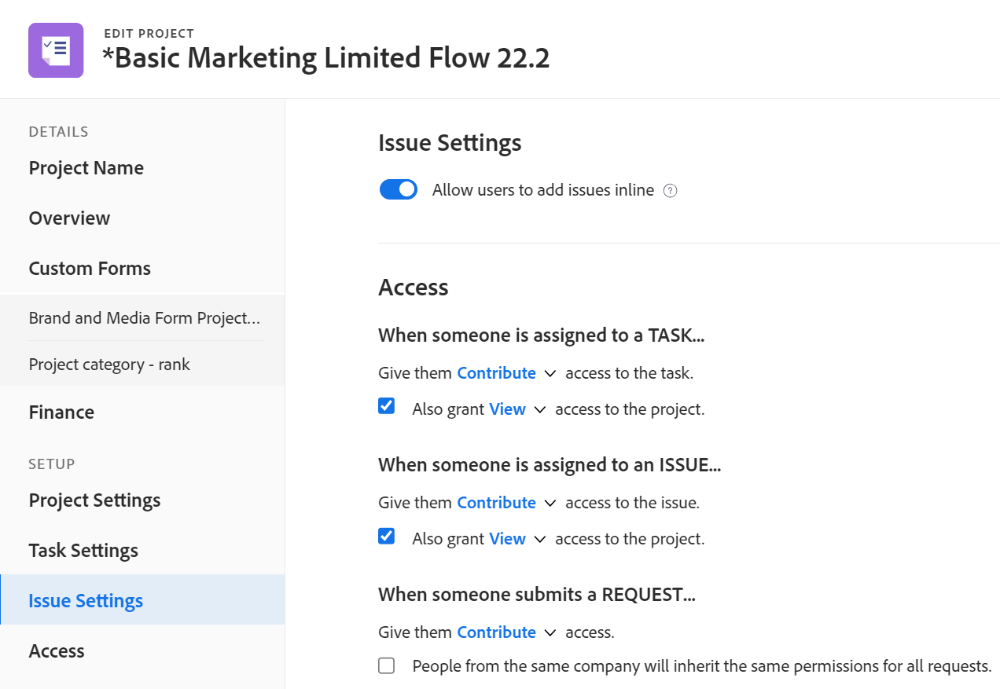

1. (Optional) Deselect the **Allow users to add issues inline** option. It is selected by default.

   When deselecting this option users cannot add issues inline to the project or the tasks in the Issues section.

   >[!TIP]
   >
   >Deselect this option if you want to enforce users to complete the New Issue Fields or the custom forms associated with new issues. Enabling users to enter issues inline allows them to bypass the New Issue fields and custom forms when creating issues. For information about setting fields and custom forms for new issues, see [Create a Request Queue](../../../manage-work/requests/create-and-manage-request-queues/create-request-queue.md).

   When deselecting this option, users with permissions to add issues to the project or the tasks can do so in the following ways:

   * Click New Issue at the top of the list of issues in the Issues section of the project or of the tasks. 
   * When the project is configured as a request queue, they can enter a new request in the Requests area.

   >[!NOTE]
   >
   >When editing projects in bulk this setting is enabled if at least one project has it enabled and it is disabled if all selected projects have it disabled.

   <!--drafted for bulk edit projects: the statement above needs to be corrected when the new UI for bulk edit projects is updated; not sure if we'll need to describe this at all or we can cover this in  a "Considerations" mini section inside the Editing in bulk section below- ??? -->

1. (Optional) Continue editing the following sections, depending on the information you want to modify.

   Or

   Click **Save**.

### Access {#access}

1. Begin editing your project as described above.
1. Click **Access** in the left panel.

   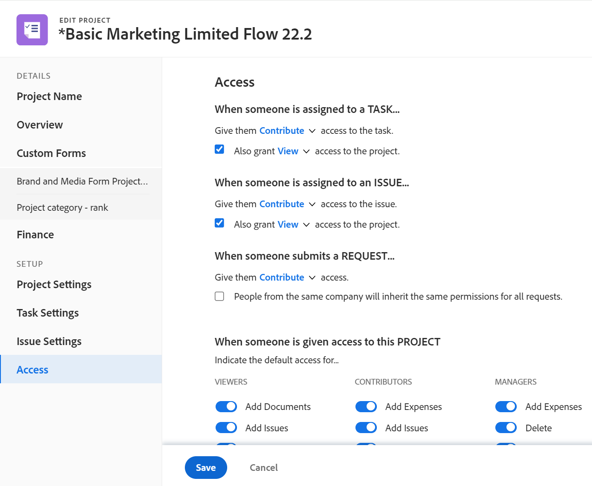

1. Specify the following **Access** information for the project:  

   <table style="table-layout:auto"> 
    <col> 
    <col> 
    <tbody> 
     <tr data-mc-conditions=""> 
      <td role="rowheader"><strong>When someone is assigned to a task</strong></td> 
      <td>
Select from <strong>View</strong>, <strong>Contribute,</strong> or <strong>Manage</strong> access to a task. The user assigned to a task is automatically granted this access to the task.
</td> 
     </tr> 
     <tr data-mc-conditions=""> 
      <td role="rowheader"><strong>Also grant access to the project</strong></td> 
      <td>
Select from <strong>View</strong>, <strong>Contribute</strong>, or <strong>Manage</strong> access to the project. The user assigned to a task is automatically granted this access to the project, as well. 
</td> 
     </tr> 
     <tr data-mc-conditions=""> 
      <td role="rowheader"><strong>When someone is assigned to an issue</strong></td> 
      <td>
Select from <strong>View</strong>, <strong>Contribute,</strong> or <strong>Manage</strong> access to an issue. The user assigned to an issue is automatically granted this access to the issue. For more information, see <a href="../../../workfront-basics/grant-and-request-access-to-objects/share-an-issue.md" class="MCXref xref">Share an issue </a>. 
</td> 
     </tr> 
     <tr data-mc-conditions=""> 
      <td role="rowheader"><strong>Also grant access to the project</strong></td> 
      <td>
Select from <strong>View</strong>, <strong>Contribute</strong>, or <strong>Manage</strong> access to the project. The user assigned to an issue is automatically granted this access to the project, as well. 
</td> 
     </tr> 
     <tr data-mc-conditions=""> 
      <td role="rowheader"><strong>When someone submits a request: Give them access</strong></td> 
      <td>
Select from <strong>View</strong>, <strong>Contribute</strong>, or <strong>Manage</strong> access to the request. When the project is also a request queue and a user submits a request to the project, they are granted this access to the request they submitted. For information about setting up a project as a request queue, see <a href="../../../manage-work/requests/create-and-manage-request-queues/create-request-queue.md" class="MCXref xref">Create a Request Queue</a>. 
</td> 
     </tr> 
     <tr data-mc-conditions=""> 
      <td role="rowheader"><strong>People from the same company will inherit the same permissions for all requests.</strong></td> 
      <td>
Select this field if you want people from the same company to have the same access to all the requests on the project, whether they submitted them or not. 
</td> 
     </tr> 
     <tr> 
      <td role="rowheader"><strong>When someone is given access to this project: Indicate the default access for ...</strong></td> 
      <td>
Select the access options that you want users to have on the project, if the project is shared with them. Select the specific options for their access if they are designated as <strong>Viewers</strong>, <strong>Contributors</strong>, or <strong>Managers</strong> when sharing the project with them. 

The <strong>Delete</strong> access in the <strong>Manage</strong> permission level determines whether users can&nbsp;delete the project itself. Users with <strong>Manage</strong> access to the project can delete tasks and issues within the project regardless of whether this option is selected, if they have <strong>Manage</strong> permissions to the tasks and issues.&nbsp;
</td> 
     </tr> 
    </tbody> 
   </table>

1. Click **Save**.

### Linked folders

Linked folder functionality automatically creates folders in Adobe Experience Manager Assets, and connects these folders to Workfront. 

This section appears only if all of the following apply:

* Your organization has been migrated to the Adobe Admin Console
* Your organization has enabled and configured an integration with Adobe Experience Manager
* The template used to create this project has enabled and configured linked folders.

For instructions on editing Linked folders, see [Edit workflow values in a project](/help/quicksilver/documents/adobe-workfront-for-experience-manager-assets-essentials/use-aem-workflows.md#edit-workflow-values-in-a-project) in the article Use workflows in the Experience Manager Assets integration.

>[!NOTE]
>
>Because linked folders are created when the project is created, editing the linked folder workflow on an existing project is ineffective. Editing these values when creating a project functions as expected.

## Edit a project in the project header (limited)

You can edit a limited amount of information in the project header.

Your system or group administrator can customize the fields you see in the project header. 

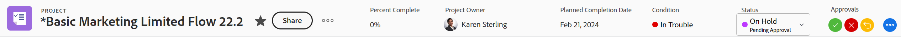

The following fields are included in the project header, by default.

* Project name
* Percent Complete
* Project Owner
* Planned Completion Date and time

  >[!NOTE]
  >
  >You can edit this field only when the project is scheduled from Completion Date. When the project is scheduled from Start Date, Workfront calculates the Planned Completion Date and time based on the duration of the tasks.

* Condition

  >[!NOTE]
  >
  >You can edit this field only when the Condition Type of the project is Manual. When the Condition Type is set to Progress Status, Workfront calculates the condition based on the progress of the tasks. For information, see [Overview of Project Condition and Condition Type](../../../manage-work/projects/manage-projects/project-condition-and-condition-type.md).

* Status
* Make approval decisions if you are set as the approver in a current approval process

## Edit projects in bulk

You can edit projects in bulk and update information for all selected projects at the same time.

Consider the following when editing projects in bulk:

* The information you are changing on all the projects selected overwrites the existing information on individual projects, except for the Resource Manager field. 

   Adding a new resource manager when editing projects in bulk adds that manager to all the selected projects. If other resource managers are associated with the selected projects, they remain on the projects in addition to the one added through bulk edit.

* When you select projects that have different values for the same field, the field displays a "Multiple values" indicator in the Edit projects box. Fields that are checkboxes, radio buttons, and toggles have a "Multiple values" indicator next to them.

   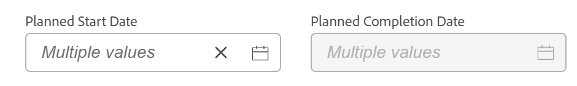

* In addition to the "Multiple values" indicator, when the chosen options are different on at least one of the selected projects, fields that have multiple options display in one of the following ways:  

    * Checkbox fields have a line instead of a checkbox for the option that is checked for some but not for all the selected projects.

      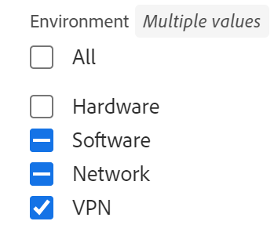

    * Toggle-type fields display dimmed, with the toggle in the middle for the option that is enabled for some but not for all the selected projects. 

    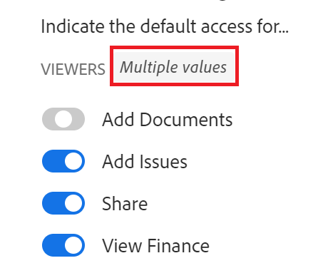

    * Radio button-type fields that have some options selected but not all, display all radio buttons as empty. 

      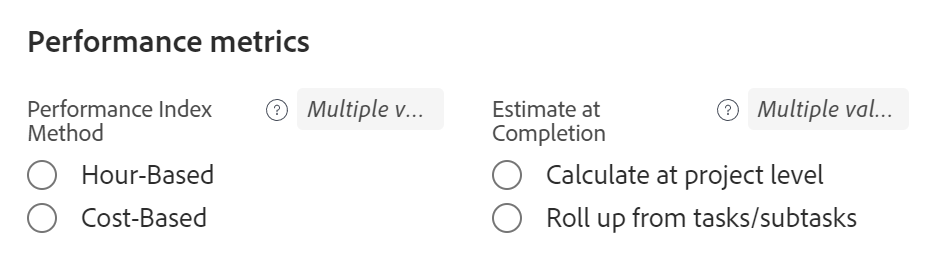

* When you update one option in a multiple-option field (such as a field that displays as a set of toggles or checkboxes), all other options must match between the selected projects. 

   >[!IMPORTANT]
   >
   >For example, you might have a checkbox field with three checkboxes (Option1, Option 2, and Option 3) and Option 1 is unchecked for all projects, and Option 2 and 3 are checked for some and unchecked for other projects that you selected. If you want to check Option 1 for all projects, you must also make Option 2 and 3 match for all the selected projects before you can save your changes, so you must either select them or deselect them so that they can match on all the selected projects. If you do not change any of the options, you can save the field as is, and the projects maintain their current selection for all options. 

* When you select multiple projects that belong to different groups, the statuses that display in the Status field are system-level statuses and not group-level statuses. 

To edit projects in bulk: 

{{step1-to-projects}}

1. Select several projects in the list.
1. Click the **Edit** icon  at the top of the list. 
The **Edit Projects** dialog box opens. 

   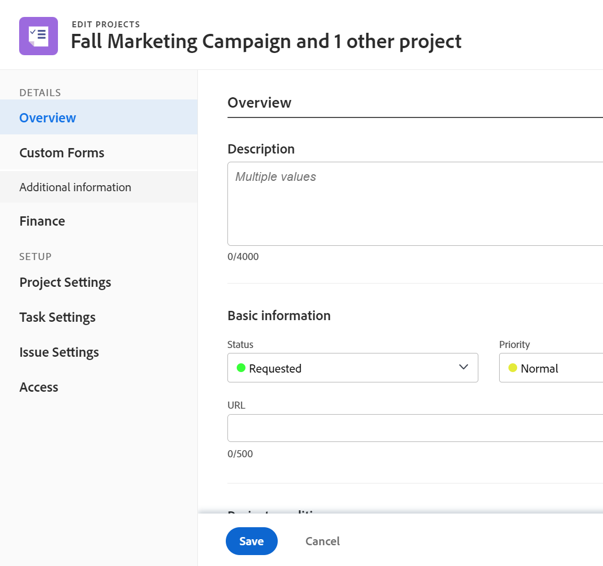

Depending on how your Workfront administrator or Group administrator modified your Layout Template, the areas in the left panel of the Edit Project box or any fields listed in these areas might be rearranged or not display. For information, see [Customize the Details view using a layout template](../../../administration-and-setup/customize-workfront/use-layout-templates/customize-details-view-layout-template.md). 

1. Click **Overview** to edit general information about the selected projects.  For more information about editing the Overview area, see the section [Overview](#overview) in this article.

   >[!TIP]
   >
   >Fields that you edit display with a light purple background.

1. Click **Custom Forms** to edit, add, or replace custom forms associated with the selected projects. 

   The custom forms that are attached to all the selected projects display in the **Custom forms in common** subsection in the **Custom Forms** area.

   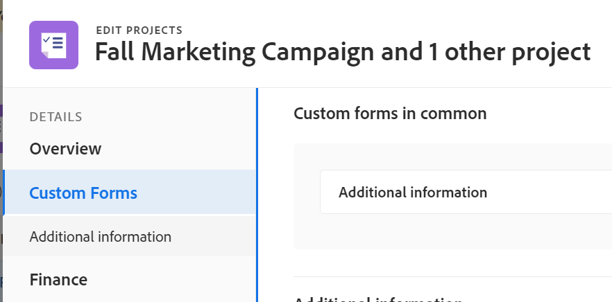 

   >[!TIP]
   >
   >   The names of the forms that are common to all selected projects display in the left panel of the Edit Projects box.

1. Start typing the name of a custom form in the **Add custom form** field.

   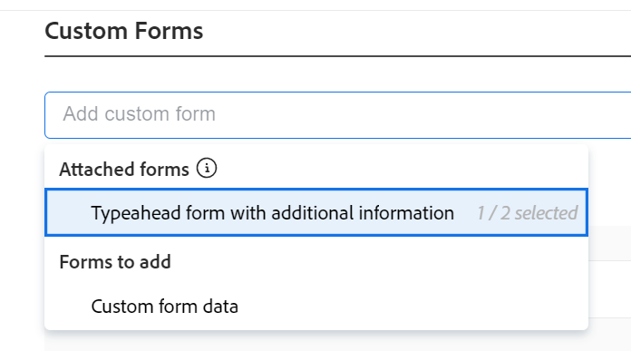

   The custom forms that are already attached to the selected projects display in the **Attached forms** subsection in the **Add custom form** field. 
   
   Additional custom forms that can be associated with projects but are not attached to any of the selected projects display in the **Forms to add** subsection in the **Add custom form** field. 
   
1. Click to select additional custom forms in the **Add custom form** or **Forms to add** subsections when it displays in the list. 

   When a custom form is already attached to some of the selected projects, there is an indication next to the name of the form about how many projects already have the form attached, when adding a form.  

1. (Optional) Click the **x** icon to the right of a custom form's name, then click **Remove** to remove it from all the selected projects.

   >[!CAUTION]
   >
   >Removing custom forms causes all existing custom field information on the forms to be lost. This cannot be recovered. 

   For more information about editing custom forms, see the section [Custom Forms](#custom-forms) in this article.

1. Click **Finance** to edit financial information for all selected projects.
For more information about editing the Finance area, see the section [Finance](#finance) in this article. 
1. Click **Project Settings** to edit the settings for all selected projects.
For more information about editing the Project Settings area, see the section [Project Settings](#project-settings) in this article. 
1. Click **Task Settings** to edit the task settings for all selected projects. 
For more information about editing the Task Settings area, see the section [Task Settings](#task-settings) in this article.
1. Click **Issue Settings** to edit the issue settings for all selected projects.
For more information about editing the Issue Settings area, see the section [Issue Settings](#issue-settings) in this article.
1. Click **Access** to edit the access settings for all selected projects.
For more information about editing the Access area, see the section [Access](#access) in this article.
1. (Optional) To remove any of the information you added in the Edit Projects box, hover over an edited field, then click the **x** discard icon to the upper-right of the field. 

   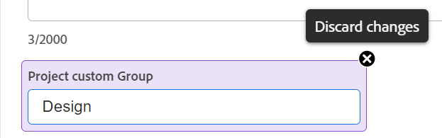

1. (Optional) Click **Cancel** at the bottom of the **Edit projects** page to remove all the changes made to all projects. 
1. Click **Save**. 

<!-- Old information for how to bulk edit in classic/ before project bulk edit redesign: 

### Edit projects in bulk in the Production environment

To edit projects in bulk:

1. Click the **Main Menu** icon  in the upper-right corner of Adobe Workfront.

1. Click **Projects**.  
1. Select several projects in the list.
1. Click **Edit**.

   The **Edit Projects** dialog box opens.

   

1. Specify the information on all selected projects in the following sections:

   * **Overview**

     For information, see the [Overview](#overview) section in this article.
   
   * **Finance**

     For information, see the [Finance](#finance) section in this article.
   
   * **Portfolio**

     For information, see the "Project association" section in the [Overview](#overview) section in this article.
   
   * **Settings**

     For information, see the [Project Settings](#project-settings) section in this article.
   
   * **Access**

     For information, see the [Access](#access) section in this article.
   
   * **Custom Forms**

     For information, continue with step 7 below.

     <!--   
     
(NOTE:&nbsp;make sure this stays accurate)
   
     

   * **Tasks**

     For information, see the [Task Settings](#task-settings) section in this article.
   
   * **Issues**

     For information, see the   [Issue Settings](#issue-settings) section in this article.
   
   * **Comment**

     For information, continue with step 9 below.

     <!--   
     
(NOTE: ensure this step stays accurate)
   
     

1. (Optional) In the Settings area, select any of the following options:

   * **Recalculate Costs and Revenues**: Select this option to recalculate Costs and Revenues on all projects selected.
   * **Recalculate Timelines**: Select this option to recalculate the Timelines of all projects selected.
   * **Recalculate Scorecards**: Select this option to recalculate the Scorecard values for all projects selected.

   

1. Click **Custom Forms** to edit the custom forms attached to all the projects selected.

   If the projects selected do not have any common custom forms, no forms are listed in this section.

   You can edit only the fields on the forms that are attached to all projects selected and which you have permissions to edit. 

1. (Optional) In the Custom Forms section, select the **Recalculate Custom Expressions** option to ensure that all Calculated Custom Fields that are on the Custom Forms attached to the projects selected are up to date.

   >[!IMPORTANT]
   >
   >We recommend not to select more than 500 projects at a time when you recalculate custom expressions.

1. (Optional) Click **Comment**, then select the Post an update to each project box and specify a comment that you want to display in the updates stream of the project in the available field and do one of the following:

   * Click the **People** icon  to tag a user who will be notified about your comment.
   * Click the **Lock** icon  to restrict your comment only to people within your company.

   This comment is visible for everyone with View access to the project and with access to view Notes.

1. Click **Save Changes**.

   All changes you made are now visible on all the selected projects.

-->