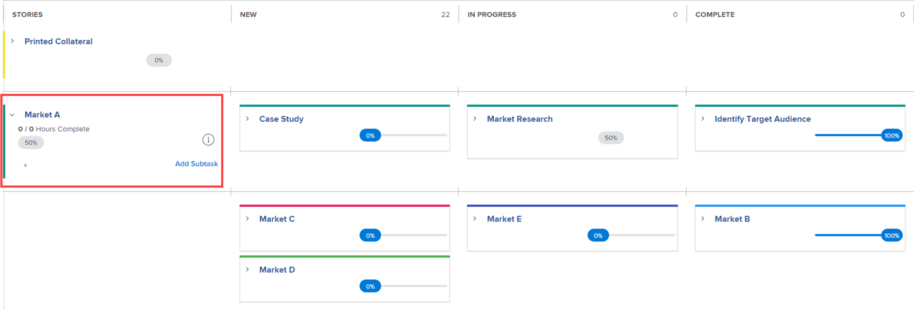

# Manage a project in the Agile View

<!--
Required plans, license types, and access

<table style="table-layout:auto"> 
 <col> 
 <col> 
 <tbody> 
  <tr> 
   <td> 
<a href="https://www.workfront.com/plans" target="_blank">Adobe Workfront Plan</a> 
 </td> 
   <td> 
Team, Pro, Business, or Enterprise 
 </td> 
  </tr> 
  <tr> 
   <td> 
Workfront License Type
 </td> 
   <td> 
Review, Work, or Plan 
 </td> 
  </tr> 
   <tr data-mc-conditions="QuicksilverOrClassic.Draft mode"> 
    <td> 
Permissions in the access model
 </td> 
    <td> <li>Edit access and ability to create reports, dashboards, and calendars</li> </td> 
   </tr>
 </tbody> 
</table>
-->

You can leverage agile functionality for your project without the administrative challenges that typically accompany agile practices (such as managing a team backlog or creating iterations).

If you want to work in an agile environment that uses a team backlog and allows you to create iterations from tasks on the backlog, follow the instructions in [Work in an agile environment](../../../agile/work-in-an-agile-environment/work-in-an-agile-environment.md).

## Access requirements

You must have the following access to perform the steps in this article:

<table style="table-layout:auto"> 
 <col> 
 <col> 
 <tbody> 
  <tr> 
   <td role="rowheader">Adobe Workfront plan*</td> 
   <td> 
Any
 </td> 
  </tr> 
  <tr> 
   <td role="rowheader">Adobe Workfront license*</td> 
   <td> 
Review or higher
 </td> 
  </tr> 
  <tr> 
   <td role="rowheader">Access level configurations*</td> 
   <td> 
Edit access to the following areas:
 
    <ul> 
     <li> 
Projects
 </li> 
     <li> 
Reports, Dashboards, Calendars
 </li> 
     <li> 
Filters, Views,&nbsp;Groupings
 </li> 
    </ul> 
Note: If you still don't have access, ask your Workfront administrator if they set additional restrictions in your access level. For information on how a Workfront administrator can modify your access level, see <a href="../../../administration-and-setup/add-users/configure-and-grant-access/create-modify-access-levels.md" class="MCXref xref">Create or modify custom access levels</a>.
 </td> 
  </tr> 
  <tr> 
   <td role="rowheader">Object permissions</td> 
   <td> 
View permissions to the project
 
For information on requesting additional access, see <a href="../../../workfront-basics/grant-and-request-access-to-objects/request-access.md" class="MCXref xref">Request access to objects </a>.
 </td> 
  </tr> 
 </tbody> 
</table>

&#42;To find out what plan, license type, or access you have, contact your Workfront administrator.

## Understand Agile projects

>[!NOTE]
>
>This section only applies to the legacy Agile view, not to the board view of a project.

* [Agile functionality in a project](#agile-functionality-in-a-project) 
* [Differences when using the Agile view on a project versus on an iteration](#differences-when-using-the-agile-view-on-a-project-versus-on-an-iteration)

### Agile functionality in a project {#agile-functionality-in-a-project}

The following agile functionality is available when managing a project in an agile view:

* Completion Status  
  For more detailed information about completion status, see [Iteration completion status overview](../../../agile/use-scrum-in-an-agile-team/burndown/iteration-completion-status-overview.md).

* Story board  
  For more detailed information about the story board, see the [Scrum board](../../../agile/use-scrum-in-an-agile-team/scrum-board/scrum-board.md) section.

There are some differences when using agile views on a project versus working in a pure agile environment (with backlogs and iterations). For more information, see [Differences when using the Agile view on a project versus on an iteration](#differences-when-using-the-agile-view-on-a-project-versus-on-an-iteration) in this article.

### Differences when using the Agile view on a project versus on an iteration {#differences-when-using-the-agile-view-on-a-project-versus-on-an-iteration}

* [Tasks and subtasks follow different display rules on the Story Board](#tasks-and-subtasks-follow-different-display-rules-on-the-story-board) 
* [Backlogs and iterations are not used](#backlogs-and-iterations-are-not-used) 
* [Task order is maintained in the Agile view and cannot be reordered](#task-order-is-maintained-in-the-agile-view-and-cannot-be-reordered) 
* [Tasks are measured only in Planned Hours](#tasks-are-measured-only-in-planned-hours) 
* [The Agile Team is not used](#the-agile-team-is-not-used) 
* [Each user on the project can view the project in a different Agile view](#each-user-on-the-project-can-view-the-project-in-a-different-agile-view)

#### Tasks and subtasks follow different display rules on the Story Board {#tasks-and-subtasks-follow-different-display-rules-on-the-story-board}

* Tasks that have neither a parent task nor a subtask are always displayed as a single story card on the story board.   
  For example, these tasks appear as follows in the project list view:   
  
   These tasks appear as follows in the project agile view:   
  
  

* Parent tasks that have subtasks are always displayed in the **Stories** column of the story board. Subtasks are displayed in the swimlane of the parent task.   
  For example, these tasks appear as follows in the project list view:   
  
    
  These tasks appear as follows in the project agile view:   
  
  

* Second-level subtasks (subtasks of subtasks) are displayed as a hanging gray card off the immediate parent task.
* Third-level subtasks (subtasks of subtasks of subtasks) are never displayed on the story board.

#### Backlogs and iterations are not used {#backlogs-and-iterations-are-not-used}

When viewing a project in an agile view, the following agile components are not used:

* **Backlog:** No backlog is used because any tasks in the project are automatically displayed as stories.
* **Iterations:** Rather than creating iterations to define the dates when work will be accomplished, the days currently designated on the project timeline become the working days.

#### Task order is maintained in the Agile view and cannot be reordered {#task-order-is-maintained-in-the-agile-view-and-cannot-be-reordered}

The order in which tasks appear in a project is maintained when you view the project in an agile story board.

You cannot reorder tasks in the project when viewing the project in an agile view. Because modifying the task order can affect other tasks that might have dependencies, you must view the project in a standard view in order to modify task order.

#### Tasks are measured only in Planned Hours {#tasks-are-measured-only-in-planned-hours}

Tasks on a project are always measured in Planned Hours.

In an iteration, tasks (stories) can be measured in hours or points.

#### The Agile Team is not used {#the-agile-team-is-not-used}

Because agile teams complete the work on iterations that are assigned to them, agile teams are not used when viewing a project in an agile view.

Instead, any users on the project essentially become the agile team for that project.

#### Each user on the project can view the project in a different Agile view {#each-user-on-the-project-can-view-the-project-in-a-different-agile-view}

Unlike an agile iteration, users on a project can customize the agile view for themselves, while other users use a different agile view.

In an agile iteration, the information that is available on the agile story board (such as status columns that are available) is determined on the team level.

For information about how to customize an agile view, see [Create or customize an Agile view](../../../reports-and-dashboards/reports/reporting-elements/views-overview.md#customizing-an-agile-view) in [Views overview in Adobe Workfront](../../../reports-and-dashboards/reports/reporting-elements/views-overview.md).

## View a project in the Agile view

1. Go to the project you want to view in an agile view.
1. Click the **Board** icon .

   The board view of the project displays by default.

   

   <!--(Legacy agile view only) If you previously viewed the project in a custom agile view, the project is displayed in that view rather than in the default agile view.-->

1. (Optional) Click **Configure** to set options for the columns and cards.

   For more information, see [Manage board columns](/help/quicksilver/agile/get-started-with-boards/manage-board-columns.md) and [Customize which fields are displayed on a card](/help/quicksilver/agile/get-started-with-boards/customize-fields-on-card.md). Note that you can't define column policies on the board view of a project.

1. (Optional) Click **Use legacy agile** to use the legacy agile view instead of the board view.

1. (Optional – legacy agile view only) If you have created a custom agile view, or if another user has created a custom agile view and shared it with you, you can view it instead of the default agile view.

   Click the **View** drop-down menu, then click the custom agile view you want to view.  
  
   The custom agile view is used the next time you click the **Agile** icon.

   For information about how to create a new agile view, see [Create and customize Agile views](#create-and-customize-agile-views).

   The project is displayed in the custom agile view.

1. (Conditional – legacy agile view only) If tasks in your project are using statuses other than "New," "In Progress," or "Complete" (the default statuses for the Agile view), you must add the additional statuses to the agile view for any tasks in those statuses to be displayed.

   If tasks are in a status that is not displayed on the agile story board, the task itself is not displayed on the agile story board (however, the Percent Complete of these tasks still contribute to the Percent Complete of any parent tasks and the Percent Complete of the overall project).

   To add statuses to the agile view, either create a new agile view or customize an existing agile view, as described in the "Create or customize an Agile view" section in the article [Views overview in Adobe Workfront](../../../reports-and-dashboards/reports/reporting-elements/views-overview.md).

1. (Optional) To return to the list view, click the **List** icon.

## Create and customize Agile views {#create-and-customize-agile-views}

>[!NOTE]
>
>This section only applies to the legacy Agile view, not to the board view of a project.

As with standard views in Workfront, you can customize existing agile Views or create new agile Views from scratch. Unlike standard views, you cannot create new agile Views based on existing agile Views.

For more information about creating and customizing agile views, see the "Create or customize an Agile view" section in the article [Views overview in Adobe Workfront](../../../reports-and-dashboards/reports/reporting-elements/views-overview.md).

## Share an existing Agile view

>[!NOTE]
>
>This section only applies to the legacy Agile view, not to the board view of a project.

For information about how to share an agile view, see [Share a filter, view, or grouping](../../../reports-and-dashboards/reports/reporting-elements/share-filter-view-grouping.md).

## Remove an existing Agile view

>[!NOTE]
>
>This section only applies to the legacy Agile view, not to the board view of a project.

For information about how to delete a view, see the "Remove a view" section in the article [Views overview in Adobe Workfront](../../../reports-and-dashboards/reports/reporting-elements/views-overview.md).
