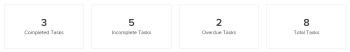

# Overview of project metrics

Project metrics give you a general view in chart format about how a project is performing.

## Access requirements

+++ Expand to view access requirements for the functionality in this article. 

<table style="table-layout:auto"> 
 <col> 
 <col> 
 <tbody> 
  <tr> 
   <td role="rowheader">Workfront plan</td> 
   <td> 
Any
 </td> 
  </tr> 
  <tr> 
   <td role="rowheader">Workfront license*</td> 
   <td> 
New: Light or higher 

   
Current: Review or higher 
 </td> 
  </tr> 
  <tr> 
   <td role="rowheader">Access level configuration</td> 
   <td> 
View access to Projects
  </td> 
  </tr> 
  <tr> 
   <td role="rowheader">Object permissions</td> 
   <td> 
View permissions to a project
 </td> 
  </tr> 
 </tbody> 
</table>

*For more information, see [Access requirements in Workfront documentation](/help/quicksilver/administration-and-setup/add-users/access-levels-and-object-permissions/access-level-requirements-in-documentation.md). 

+++

## Prerequisites

To access the Metrics area from the left panel of a project, you must:

* Have the Left panel option Metrics enabled in the Projects area of your Layout Template.  

  To learn how a Workfront administrator or group administrator can customize the left panel with a Layout Template, see [Customize the left panel using a layout template](../../../administration-and-setup/customize-workfront/use-layout-templates/customize-left-panel.md).  

## Overview of the project Metrics area

Project metrics give you a visualization of what is happening in a project, allowing you quickly assess the needs and status of a project.

In the Metrics area, you can see the overall health of a project, as well as:

* Where work is active or stalled
* Who has open work items assigned to them
* Details on tasks or issues that are overdue or close to the Planned Completion Date

You can also drill in to each chart to look more closely at tasks or issues in a specific category.

To learn more about looking at these tasks or issues, see [View Metrics details](#view-metrics-details).

<!--this was deprecated: 
>[!TIP]
>
>To see metrics at a higher level for a group of projects within a program, portfolio, etc., navigate to the Enhanced analytics area.  
>To learn more about Enhanced analytics, see [Enhanced analytics overview](../../../enhanced-analytics/enhanced-analytics-overview.md).-->

## Project KPIs

Key performance indicators (KPIs) display at the top of the Metrics area.

These KPIs are broken down into the following categories:

| Completed tasks |**Completed tasks** shows the number of tasks in a Complete status. This number also includes tasks that have a custom status that equates with Complete. |
|---|---|
| Incomplete tasks |**Incomplete tasks** shows the number of tasks that are not in a Complete or Closed status or a status that equates with Complete. |
| Overdue tasks |**Overdue tasks** shows the number of tasks that are past the Planned Completion Date and are not in a Complete or Closed status or a status that equates with Complete or Closed. |
| Total tasks |**Total tasks** shows the total number of tasks in the project. |

>[!TIP]
>
>To display a list of work items for a specific KPI, click that KPI. In that list, you can click a specific work item to view more details in a new tab.  
>  
>For more information, see [View Metrics details](#view-metrics-details).

## Task or issue bar chart

In the bar chart that appears below the project KPIs, you can look at the status or priority of work items in the project. The task view is selected by default.

When status is selected in this chart, you can view all statuses of tasks or issues in a project. Each status is grouped into a bar in the chart. All default system statuses and custom statuses display in this chart.

When priority is selected in this chart, you can view all priorities of tasks or issues in a project.

>[!TIP]
>
>To display a list of work items with a specific status or priority, click a bar in the chart. In that list, you can click a specific work item to view more details in a new tab.  
>  
>For more information, see [View Metrics details](#view-metrics-details).

## Donut chart

The donut chart located below the project KPIs allows you to look at the ratio of completed work items vs. incomplete work items in a project.

In the drop-down menu above the chart, you can select:

| All tasks |Selecting **tasks** shows you the total number of tasks in the project, as well as the ratio between completed and incomplete tasks. |
|---|---|
| All issues |Selecting **issues** shows you the total number of issues in the project, as well as the ratio between completed and incomplete issues. |

>[!TIP]
>
>To display a list of work items that are completed or incomplete, click that section in the donut chart. In that list, you can click a specific work item to view more details in a new tab.  
>  
>For more information, see [View Metrics details](#view-metrics-details).

## Assignee bar chart

The assignee bar chart shows you the number of tasks assigned to each person in the project. This number varies based on the category you select from the drop-down menu.

You can choose to look at task assignments for a project in the following categories:

| Complete |Selecting **Complete** shows the number of tasks assigned to each user that have been completed. |
|---|---|
| Incomplete |Selecting **Incomplete** shows the number of tasks assigned to each user that have not been completed yet. |
| Upcoming |Selecting **Upcoming** shows the number of tasks assigned to each user that have not yet reached the Planned Start Date. |
| Overdue |Selecting **Overdue** shows the number of tasks assigned to each user that are past the Planned Completion Date and have not yet been completed. |

>[!TIP]
>
>To display a list of work items in the selected category that are assigned to a specific user, click the bar next to the user's name in the chart. In that list, you can click a specific work item to view more details in a new tab.  
>  
>For more information, see [View Metrics details](#view-metrics-details).

## View Metrics details {#view-metrics-details}

You can interact with the charts in the Metrics area to look at different aspects of a chart or look more closely at the tasks and issues within a chart.

1. Go to the project you want to see metrics for.
1. In the left panel, click **Metrics**.  
   The charts in the Metrics area display information for tasks by default.  
   

1. (Conditional) If a drop-down arrow displays on a chart, click the **Drop-down arrow** icon  on the chart and select the option you want from the menu.  
   For information on the options that appear in the menus on each chart, see the relevant section above.

1. (Optional) To look more closely at tasks or issues for any metric on the page, do the following:

   1. Click the element—such as tasks assigned to a specific user, issues with a high priority, or all overdue tasks—that you want to see details for.

      A list of tasks or issues displays.

      

   1. Use the arrows at the bottom of the list to locate the task or issue you want to look at.

      Or

      Select a specific number to display tasks or issues on a specific page.

      

   1. Select a task or issue to view more details.

      The task or issue opens in a new tab.

1. (Optional) To export the project metrics dashboard to a .png file, click the **Export** icon , then select **Export as PNG** from the drop-down menu.

   >[!TIP]
   >
   >When you export the dashboard, the exported file includes only what currently displays in your viewport. To include certain things in the exported file, you may need to scroll up or down on the page or adjust your browser's zoom settings.
