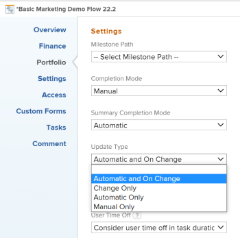
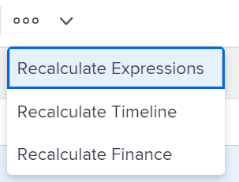

# Recalculate project timelines

<!--Audited: 06/2025-->

Recalculating Timelines allows managers to see how different factors related to the project are impacting the project's timeline. A project's timeline refers to planned and projected dates.

Making changes to schedules, personnel time off, and other items outside the scope of a project do not impact the project timeline immediately. The project timeline is impacted when the timeline is recalculated. External influences do not take effect on your project until the recalculation occurs.

This article describes the ways in which timeline recalculation happens.

Automatic timeline recalculation happens without special access for any of the users involved in working on the project. In addition, you can manually recalculate the timeline. 

## Access requirements

+++ Expand to view access requirements for the functionality in this article. 

<table style="table-layout:auto"> 
 <col> 
 <col> 
 <tbody> 
  <tr> 
   <td role="rowheader">Adobe Workfront plan</td> 
   <td> 
Any
 </td> 
  </tr> 
  <tr> 
   <td role="rowheader">Adobe Workfront license</td> 
   <td> 
New: Standard 
 
   Or
   
Current: Plan 

   </td> 
  </tr> 
  <tr> 
   <td role="rowheader">Access level configurations</td> 
   <td> 
Edit access to Projects
 
System administrator to recalculate timeline for all projects in the system
  </td> 
  </tr> 
  <tr> 
   <td role="rowheader">Object permissions</td> 
   <td> 
Manage permissions to a project
  </td> 
  </tr> 
 </tbody> 
</table>

For more detail about the information in this table, see [Access requirements in Workfront documentation](/help/quicksilver/administration-and-setup/add-users/access-levels-and-object-permissions/access-level-requirements-in-documentation.md).

+++

## Automatic recalculation

By default, project timelines are automatically recalculated daily when the project scope changes or every night. The Workfront administrator determines whether to automatically calculate timelines every night or with every scope change by managing the Timelines settings in the Project Preferences area of Setup. For more information, see [Configure timeline recalculations for projects](../../../administration-and-setup/set-up-workfront/configure-system-defaults/configure-timeline-recalculations-projects.md).

>[!NOTE]
>
>If the timeline of a project is longer than 15 years, the automatic recalculation is disabled for that project and you can only select a Manual update type. If you change the dates on the project to less than 15 years, you must manually recalculate your timeline one time before it is calculated automatically.

* [Automatic recalculation of project timelines](#automatic-recalculation-of-project-timelines) 
* [Actions that trigger an automatic recalculation of project timelines](#actions-that-trigger-an-automatic-recalculation-of-project-timelines)

>[!IMPORTANT]
>
>For the Preview and Custom Refresh Sandbox environments, the nightly recalculation is disabled and the project timelines aren't recalculated automatically. You must manually recalculate the project timeline for the Preview and the Custom Refresh Sandbox environments. 

### Automatic recalculation of project timelines {#automatic-recalculation-of-project-timelines}

Workfront recalculates timelines daily only for projects where all of the following conditions are met:

* Have a Current status.
* Project update type is set to Automatic or Automatic and On Change.

  For information, see [Project Update Type overview](../../../manage-work/projects/planning-a-project/project-update-type-overview.md).

* Have a Last Update Date within the past 3 months. A Workfront administrator can change this default functionality. For more information, see [Configure timeline recalculations for projects](../../../administration-and-setup/set-up-workfront/configure-system-defaults/configure-timeline-recalculations-projects.md).

* Last calculation date of the project timeline isn't within the current calendar day. This means that the last calculation date of the project timeline is before 00:00 of the current day.

You can configure how frequently the timeline for your project is updated. When the project timeline is updated, it's recalculated based on changes made to the project. 

<!--
<MadCap:conditionalText data-mc-conditions="QuicksilverOrClassic.Draft mode">
or changes made to another project that the timeline is dependent on
</MadCap:conditionalText>
-->

<!--

(NOTE: above, the last part is drafted because of this: I don't think this is right because we told people that in the case of cross-project predecessors, the timeline must be calculated manually for the successor to see the updates in the predecessor's project. Drafting for now.)

-->

For information, see [Select the project Update Type](../../../manage-work/projects/manage-projects/select-project-update-type.md).

<!--

(NOTE:&nbsp;content moved to the article linked above)

You can configure how the timeline for your project is updated:

<ol>
<li value="1">Go to the project for which you want to configure how the timeline is updated.</li>
<li value="2"> 
  Click the <strong>More</strong> icon  to the right of the project name, then click&nbsp; <strong>Edit</strong>. 
 
The <strong>Edit Project</strong> dialog box is displayed.
 </li>
<li value="3"> 
Click<strong>Settings.</strong> 
 </li>
<li value="4">In the <strong>Update Type</strong> drop-down list, select from the following options: <strong>- Automatic and On Change:</strong> (Default setting) The project timeline is updated each time a change occurs in the project or in another project that the timeline is dependent on. The project timeline is also updated each night.  This is the recommended setting for this field because it ensures that the project timeline is always up to date. When you update a task or the project and trigger a timeline recalculation, all available dates are immediately displayed, allowing you to continue working. On projects with more than 100 tasks, dates that require longer calculations are dimmed.

 This indicates that the recalculation is not yet finished, and the dates are subject to change.  <strong>- Change Only:</strong> The project timeline is updated each time a change occurs in the project or in another project that the timeline is dependent on; scheduled updates do not occur. You might want to select this option if changes rarely occur in the project or in other projects that the timeline is dependent on. <strong>- Automatic Only:</strong> The project timeline is updated each night; it is not updated immediately after changes are made. You might want to select this option if many changes occur each day in the project or in other projects that the timeline is dependent on. <note type="note">
A project does not automatically recalculate each night if it is in Planning status. It only recalculates on change.
</note> <strong>- Manual Only:</strong> The project timeline is updated only when you select the option to Recalculate Timelines, as described in <a href="#manual-recalculation" class="MCXref xref">Manual recalculation</a>. You might want to select this option if you are making many changes to the project at one time, and you want the timeline recalculation to occur after all of the changes have been made (rather than after each individual change). For more information about the project Update Type, see <a href="../../../manage-work/projects/manage-projects/select-project-update-type.md" class="MCXref xref">Select the project Update Type </a><note type="note">
If the timeline of a project is longer than 15 years, the automatic recalculation is disabled. If you change the dates on the project to less than 15 years, you must manually recalculate your timeline one time before it is calculated automatically.
</note></li>
<li value="5">Click <strong>Save Changes.</strong></li>
</ol>

-->

### Actions that trigger an automatic recalculation of project timelines {#actions-that-trigger-an-automatic-recalculation-of-project-timelines}

Various scope changes in the life of a project automatically recalculate the project timeline, including the following actions:

* Updating task status.
* Moving a task to a different project.
* Updating the Planned Date or Planned Completion Dates of the tasks. 
* Updating the Duration Type, Task Constraint, or the number of assignees on the tasks. 
* Updating task predecessor relationships. 
* Adding an approval to a task that also adds time to the Planned Completion Date of the task.   
  For more information about approval settings, see [Configure global approval settings](../../../administration-and-setup/customize-workfront/configure-approval-milestone-processes/establish-approval-settings.md).

## Manual recalculation {#manual-recalculation}

As a project owner, you can manually recalculate the timelines for individual projects. The Workfront administrator can manually recalculate all timelines in Workfront.

* [Recalculate timelines for individual projects or in bulk](#recalculate-timelines-for-individual-projects-or-in-bulk) 
* [Manually recalculate timelines in bulk in the Edit Projects box](#manually-recalculate-timelines-in-bulk-in-the-edit-projects-box) 
* [Recalculate timelines for all projects in the system (Workfront administrators only)](#recalculate-timelines-for-all-projects-in-the-system-workfront-administrators-only)

### Recalculate timelines for individual projects or in bulk {#recalculate-timelines-for-individual-projects-or-in-bulk}

You can recalculate the timeline of a project in Workfront from the project page or from a project list or report.

1. Go to the project you want to recalculate the timeline for and click the **More** icon  to the left of the project name.

   Or

   Go to a project list or report and select one or several projects, then click the **More** icon  at the top of the list.

   

   >[!TIP]
   >
   >Depending on the complexity of your projects, we recommend not selecting a large number of projects when recalculating their timelines in bulk to ensure optimum performance. Some things that could make a project too complex might be multiple dependencies or assignments, or a large number of custom fields.

1. Click&nbsp;**Recalculate Timeline**. The timeline recalculates and a success message displays on the screen.

   >[!TIP]
   >
   >Before the timeline recalculation is finished, some planned or projected dates might display as dimmed. This means that the recalculation is not yet finished, and the dates are subject to change.

### Manually recalculate timelines in bulk in the Edit Projects box {#manually-recalculate-timelines-in-bulk-in-the-edit-projects-box}

You can manually recalculate the timelines of several projects by editing them in bulk.

>[!TIP]
>
>Depending on the complexity of your projects, we recommend not selecting a large number of projects when editing them in bulk to ensure optimum performance. Some things that could make a project too complex might be multiple dependencies or assignments, or a large number of custom fields.

1. Go to a list of projects.
1. Select several projects in the list, then click **Edit**.
1. Click **Settings**, then select **Recalculate Timelines**.

1. Click **Save Changes**.

### Recalculate timelines for all projects in the system (Workfront administrators only) {#recalculate-timelines-for-all-projects-in-the-system-workfront-administrators-only}

Workfront administrators can run the Recalculate Timeline diagnostic to immediately recalculate all timelines in the Workfront system. This allows all Project Managers to see the influence of external changes immediately on both planned and projected dates.

For more information about recalculating timelines for the entire Workfront site, see the section Recalculate timelines for the entire Workfront instance in [Configure timeline recalculations for projects](../../../administration-and-setup/set-up-workfront/configure-system-defaults/configure-timeline-recalculations-projects.md).

<!--

<h2>Project Update Types</h2>

(NOTE: drafted and moved to thisa rticle: /Content/Manage work/Projects/Planning a Project/project-update-type-overview.htm)

For information about how to update the project's Update Type, see <a href="../../../manage-work/projects/manage-projects/select-project-update-type.md" class="MCXref xref">Select the project Update Type </a>. 
 <note type="important">
If the timeline of a project is longer than 15 years, Workfront does not calculate the timeline automatically or on change. The Update Type of a project longer than 15 years is always Manual.
</note>

You can select how each project calculates its timeline by choosing between the following Update Types:
 <note type="important">
If the timeline of a project is longer than 15 years, Workfront does not calculate the timeline automatically or on change. The Update Type of a project longer than 15 years is always Manual.
</note>
<ul>
<li> 
<strong>Automatic and On Change:</strong>&nbsp;This is the default setting. The project timeline is updated each time a change occurs&nbsp;in the project or in another project that the timeline is dependent on. The project timeline is also updated each night.&nbsp;  This is the recommended setting as it ensures that the project timeline is always up to date.
 
When you update a task or the project and trigger a timeline recalculation, all available dates are immediately displayed, allowing you to continue working. On projects with more than 100 tasks, dates that require longer calculations are dimmed. 
 
  
 
This indicates that the recalculation is not yet finished, and the dates are subject to change. 
 </li>
<li><strong>Change Only:</strong>&nbsp;The project timeline is updated each time a change occurs in the project or in another project that the timeline is dependent on; scheduled updates do not occur.  You might want to select this option if you are concerned about system performance and if&nbsp;changes rarely occur in the project or in other projects that the timeline is dependent on.</li>
<li> 
<strong>Automatic Only:</strong>&nbsp;The project timeline is updated each night; it is not updated immediately after changes are made. You might want to select this option if you are concerned about system performance and if many changes occur each day in the project or in other projects that the timeline is dependent on.
 <note type="note">
A project does not automatically recalculate each night if it is in Planning status. It only recalculates on change.
</note> </li>
<li><strong>Manual Only:</strong>&nbsp;The project timeline is updated only&nbsp;when you select the option to <strong>Recalculate Timelines</strong>, as described in the section "Manual Recalculation" in&nbsp;the article <a href="#" class="MCXref xref selected">Recalculate project timelines</a>. You might want to select this option if you are making many changes to the project at one time, and you want the timeline recalculation to occur after all of the changes have been made (rather than after each individual change).</li>
</ul>

-->
