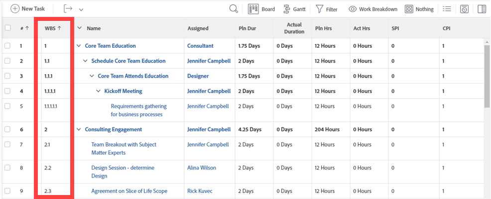

# Determine Work Breakdown Structure in a project

Defining a Work Breakdown Structure (WBS) for a project is a set of activities that ultimately outlines the project plan. The WBS divides the outcome of the project into manageable work elements, which can be used to define milestones and organize work assignments.

You must have a Plan license with Edit access to Projects to build the Work Breakdown Structure of a project. Additional access to other areas of Adobe Workfront might be needed, depending on how many activities you perform while building the WBS.

We recommend that you keep the project in a Planning status while you make changes to the Work Breakdown Structure, to avoid notifications to trigger to users on the Project Team.

## Define the project deliverables

The purpose of a project is to provide tangible deliverables to internal and external stakeholders. The deliverables of a project are the outcomes that you want to achieve by completing the project. Outcomes are almost always associated with at least one deliverable, and all deliverables should be associated with a project.

Project deliverables can be consumer goods, intellectual output (such as reports), or services. For example, if your project scope is to build a house, some of the deliverables may include:

* creating architectural plans
* completing plumbing
* electrical work
* pouring the foundation
* framing work
* closing the sale of the home.

Depending on its size and scope, a project can be made up of multiple deliverables.

Once you identify your deliverables, you can begin to break them down into tasks. Tasks are the output that you achieve in order to deliver your overall outcome for the project. When defining your tasks you take into account the following parameters:

* Amount of time required for completion.
* Budget required for completing the work.
* Required resources needed to complete the work.
* Scheduling of the resources based on the logical timeline of the tasks.

As you define tasks, ensure that you don't plan too much work for one individual task. If the work required on a task is more than 40 hours (a typical week of work), then you might need to break down that amount of work in subtasks. The completion of all subtasks will then complete the main task.

To define WBS outcomes and deliverables in Workfront, we recommend you perform the following activities to create a hierarchical view of project tasks:

* If you have not already done so, create a new project.  
  For information about creating a project, see the article [Create a project](../../../manage-work/projects/create-projects/create-project.md).

* Create tasks for all action items required to complete each outcome and deliverable.  
  For information about creating tasks, see the article [Create tasks in a project](../../../manage-work/tasks/create-tasks/create-tasks-in-project.md) .

* From the tasks you just created, identify which ones are major outcomes and associate them with milestones.  
  For information about creating milestone tasks, see the articles [Create a milestone path](../../../administration-and-setup/customize-workfront/configure-approval-milestone-processes/create-milestone-path.md) and [Associate milestones with tasks](../../../manage-work/tasks/manage-tasks/associate-milestones-with-tasks.md).

* Break down the tasks with too large a scope into subtasks. Associate them with the parent that defines your deliverable .  
  For information about creating subtasks, see the article [Create subtasks](../../../manage-work/tasks/create-tasks/create-subtasks.md).

* Identify dependency relationships between subtasks and between milestones.  
  In a dependency relationship, the start of a task is dependent upon the completion of another task or group of tasks.   
  For information about task dependencies, see the articles [Overview of task predecessors](../../../manage-work/tasks/use-prdcssrs/predecessors-overview.md) and [Create a predecessor relationship on the task list](../../../manage-work/tasks/use-prdcssrs/create-predecessors-on-task-list.md).

* Determine if at any point in the lifetime of the project, approvals and reviews are needed. Create approval processes to address this need.  
  For information about approvals, see the article [Create an approval process for work items](../../../administration-and-setup/customize-workfront/configure-approval-milestone-processes/create-approval-processes.md).

## Estimate work schedule and scheduling constraints

Once you create the basic milestone and task structure of the project, you can estimate the time it will take to complete the overall project by defining task constraints and durations.

Consider the following:

* Task constraints define when work on a task must begin or end.

  For information about defining task constraints, see the article [Task Constraint overview](../../../manage-work/tasks/task-constraints/task-constraint-overview.md).

* The Duration of a task is the timeframe available to complete a task. When estimating Duration, you may want to enter a value that takes into account the possibility of a delay. If similar projects have been completed in the past, you may have a good idea where to set this value.

  As duration is an estimate, be sure to set optimistic time values to account for factors that might affect the task, such as weather, power outages, supplier difficulties, or other unforeseen events. In addition, be sure to consider whether there are any associated predecessor or dependency tasks and how they may place constraints on work and affect task completion.

  Depending on the Duration Type of the task, you can modify the duration of a task during the lifetime of a project, but this will also affect the timeline of the project. For information about the Duration of a task, see the article [Overview of Task Duration and Duration Type](../../../manage-work/tasks/taskdurtn/task-duration-and-duration-type.md) .

## Assign tasks

After you have defined the duration and constraints of each task, you can determine who has the time and skills to accomplish the work. You can assign tasks to the following entities in Workfront:

* Users  
  Only users with a Planner or Worker access level can be assigned to tasks. Although you can assign tasks to Requestors and Reviewers, they cannot complete them. For this reason, we do not recommend assigning them tasks.

  For information about the access levels and how they define what users can do with Workfront objects, see [Access levels overview](../../../administration-and-setup/add-users/access-levels-and-object-permissions/access-levels-overview.md).

* Job Roles
* Teams

For information about assigning tasks, see the articles in the [Assign tasks](../../../manage-work/tasks/assign-tasks/assign-tasks-1.md) section.

## Manage resources

Resource Managing in Workfront allows you to determine whether there is adequate staff to complete the project. When users are added to a project, Workfront shows the utilization of each user. Resource Managers can see the total number of hours the person is assigned to other projects during the time frame of the project.

>[!NOTE]
>
>As long as the project has a status of Planning, tasks assigned to users do not appear in their task lists.

In the beginning of a fiscal year or quarter, you may want to manage your resources at a higher level, across multiple projects, without the knowledge of a specific Work Breakdown Structure.   
For information about planning the use of your resources at a higher level, see the article [Get started with Resource Planning](../../../resource-mgmt/resource-planning/get-started-resource-planning.md).

When you manage your resources in the context of building the Work Breakdown Structure of one project, and ensuring that each task is assigned to the correct resource, you are ready to schedule your resources for the work that needs to be done.   
For information about scheduling your resources, see the articles in the [The Workload Balancer: article index](../../../resource-mgmt/workload-balancer/workload-balancer.md) section.

## Estimate project finances

Workfront will calculate the planned costs for each task and the overall costs for a project. Planned costs for a task include all expenses of the task plus the cost of the employee or role assigned to the task. Hourly rates for the task, role, and employee are assigned during task, role, and user creation.

For information about project finances, see the section [Project finances: article index](../../../manage-work/projects/project-finances/project-finances-overview.md).

## Determine approval points for the project

By creating Approval Processes in Workfront, you can establish review points for the project in order to monitor progress and potential problem areas. Through the approval process Project Owners can discern which tasks are late and early, view audit trails that list who changed a task status, and see histories of issues, including how issues were resolved and when they were closed. Upon reviewing a project, Project Owners can determine what steps to take and update the project plan, if necessary.

For information about approvals, see the article [Create an approval process for work items](../../../administration-and-setup/customize-workfront/configure-approval-milestone-processes/create-approval-processes.md)

## View your WBS

To understand the WBS of a project, you want to view the following task elements:

* Task sequence and timeline (Planned Start and Completion Dates, and task Duration)
* Predecessor dependencies
* Child and parent relationship
* Assignments

Once you complete your WBS, you can view it in a task list at the project level or in a report.

* [View the WBS in a task list](#view-the-wbs-in-a-task-list) 
* [View the WBS in a task report](#view-the-wbs-in-a-task-report)

### View the WBS in a task list {#view-the-wbs-in-a-task-list}

You can view the task list at the project level.

1. Go to the project for which you want to see the Work Breakdown Structure.
1. Select the **Tasks** tab.
1. (Optional) Select **Nothing** in the **Grouping** drop-down menu.

   The Work Breakdown Structure does not display the indentation of the tasks in the WBS.

1. From the **View** drop-down menu, and select the **Work Breakdown** view.

   The Work Breakdown structure displays in the second column of the selected view.

   

### View the WBS in a task report {#view-the-wbs-in-a-task-report}

You can build a task report and display the WBS of the tasks by doing one of the following:

* Apply the existing Work Breakdown Structure view to the report.
* Add the Work Breakdown Structure column to any custom report.

>[!TIP]
>
>We recommend adding a Project grouping, to add clarity to what projects the tasks belong to. The indentation of the tasks does not display in a task report.

For information about building reports, see the article [Create a custom report](../../../reports-and-dashboards/reports/creating-and-managing-reports/create-custom-report.md).

## Save the WBS of a Project as a Template

If you work on other projects that follow work schedules similar to the WBS you just created, you may want to save the project as a template. A template will save time and effort when creating future related projects.

If your organization has little turnover, consider waiting until after user assignments are made to save the template. Regardless of when a project is saved as a template, user assignments or specific tasks can be removed during attaching the template to a new project.

The following elements of a Work Breakdown Structure can be saved in a template, for future use with another project:

* Predecessor Dependencies
* Assignments (including Project Owner, Sponsor, and Resource Manager)
* Approval Processes
* Task Constraints
* Documents
* Expenses and other Financial Information
* Goals
* Hour Types
* Request Queue structure
* Reminder Notifications
* Risks
* Billing Rates
* Sharing information
* Custom Forms

For information about saving projects as templates, see the article [Create template from project](../../../manage-work/projects/create-and-manage-templates/create-template-from-project.md) .
