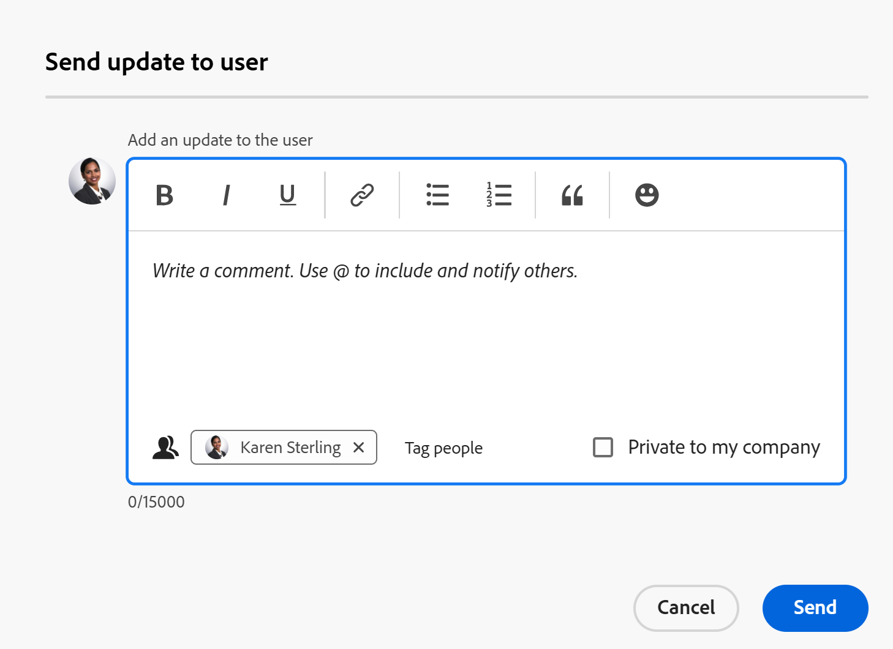
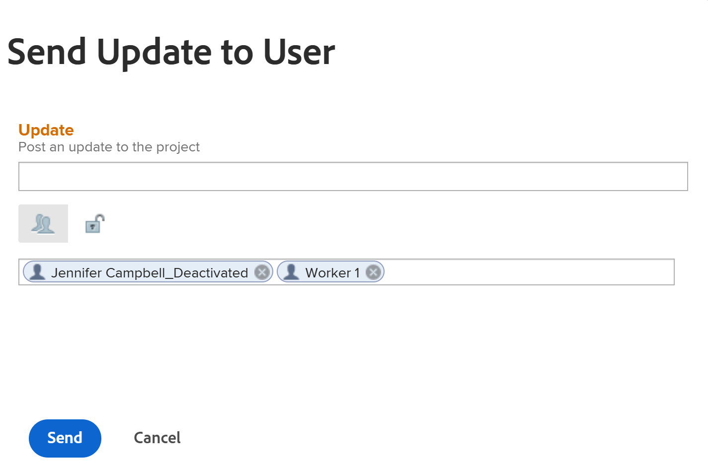
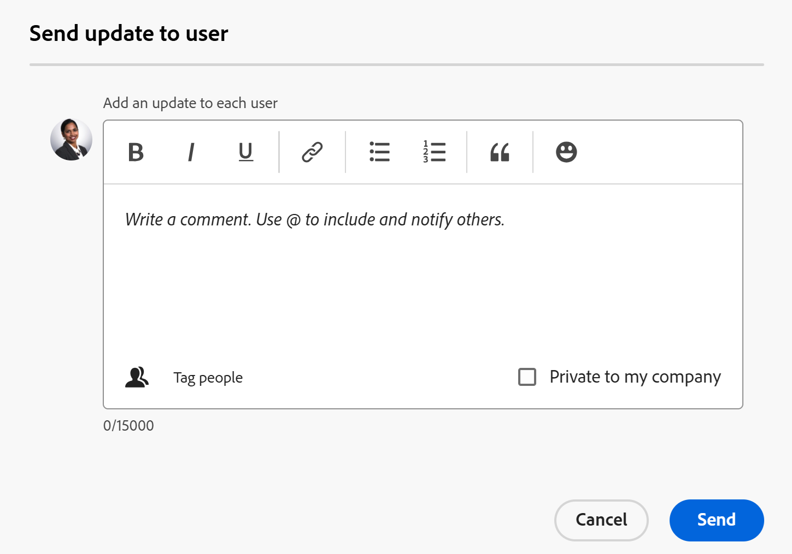

# Manage the Project Team

<!--take preview and production references out at production - August 7-->

<!--
 

The highlighted information on this page refers to functionality not yet generally available. It is available only in the Preview environment for all customers. The same features will also be available in the Production environment for all customers after a week from the Preview release.      

For more information, see [Interface modernization](/help/quicksilver/product-announcements/product-releases/interface-modernization/interface-modernization.md).  

-->

The Project Team consists of users who are associated with the project. For more information, see [Project Team overview](/help/quicksilver/manage-work/projects/planning-a-project/project-team-overview.md). 

The members of the Project Team display in the People section of the project.

The users displayed in the People section of a project template will become the project team after the project is created from the template. 

The following users are added automatically to the project team, for both projects and templates:

* Owner
* Sponsor
* Users assigned to tasks
* Users assigned to issues (only for a project)

Users in the project team receive notifications about the project. For more information, see [Event notification types](/help/quicksilver/administration-and-setup/manage-workfront/emails/event-notifications-available-in-wf.md). 

You can manage the users in the project and template's teams by adding them (only for the project), removing them, or sending them an update. 

## Access requirements

+++ Expand to view access requirements for the functionality in this article. 

<table style="table-layout:auto"> 
 <col> 
 <col> 
 <tbody> 
  <tr> 
   <td role="rowheader">Adobe Workfront package</td> 
   <td> 
Any
 </td> 
  </tr> 
  <tr> 
   <td role="rowheader">Adobe Workfront license</td> 
   <td> 
Standard

    
Plan

    </td> 
  </tr> 
  <tr> 
   <td role="rowheader">Access level configurations</td> 
   <td> 
Edit access to Projects and Templates
 
View or higher access to Users
 </td> 
  </tr> 
  <tr> 
   <td role="rowheader">Object permissions</td> 
   <td> 
View or higher permissions to a project or to a template
 </td> 
  </tr> 
 </tbody> 
</table>

For information, see [Access requirements in Workfront documentation](/help/quicksilver/administration-and-setup/add-users/access-levels-and-object-permissions/access-level-requirements-in-documentation.md).

+++

<!--Old access: 

<table style="table-layout:auto"> 
 <col> 
 <col> 
 <tbody> 
  <tr> 
   <td role="rowheader">Adobe Workfront plan*</td> 
   <td> 
Any
 </td> 
  </tr> 
  <tr> 
   <td role="rowheader">Adobe Workfront license*</td> 
   <td> 
Standard 

    
Plan 

    </td> 
  </tr> 
  <tr> 
   <td role="rowheader">Access level</td> 
   <td> 
Edit access to Projects and Templates
 
View or higher access to Users
 </td> 
  </tr> 
  <tr> 
   <td role="rowheader">Object permissions</td> 
   <td> 
View or higher permissions to a project or to a template
 </td> 
  </tr> 
 </tbody> 
</table>

*For information, see [Access requirements in Workfront documentation](/help/quicksilver/administration-and-setup/add-users/access-levels-and-object-permissions/access-level-requirements-in-documentation.md).

## Add users to a Project Team

When you add users to the project team, they gain View permissions on the project and the tasks, issues, and documents of the project. For more information, see the article [Project Team overview](../../../manage-work/projects/planning-a-project/project-team-overview.md).

>[!TIP]
>
>Users on the Project Team are not automatically added to the resource management tools for the project.

You can add users to the project team in the following ways:

* [Automatically add users to a Project Team](#automatically-add-users-to-a-project-team) 
* [Manually add users to a Project Team](#manually-add-users-to-a-project-team)

### Automatically add users to a Project Team {#automatically-add-users-to-a-project-team}

The users that fulfill the following roles on the project are automatically added to the project team and appear  in the People section when the project is created:

* The creator of the project
* The project owner
* The project sponsor

Users are also automatically added to the project team when they are assigned to the following:

* Tasks
* Issues

### Manually add users to a Project Team {#manually-add-users-to-a-project-team}

If users that don't fulfill any role on the project want to be notified about certain updates or changes during the life of the project, you can manually add them to the project team. 

 For more information about what notifications can be enabled for users on the project team, see [Event notification types](../../../administration-and-setup/manage-workfront/emails/event-notifications-available-in-wf.md). 

 <!--drafted - this used to be the case, in the note below but this limitation was removed on Jan 5, 2023 - as a patch, not a release feature:

>[!IMPORTANT]
>
>You can add to the Project Team only users that belong to the Group associated with the project. You cannot add users that belong to the Subgroups of the project's group. 

## Manage people on a project

1. Go to the project you want to manage the project team for.

   >[!TIP]
   >
   >You must have users assigned to tasks, issues or as stakeholders on the project to have them display in the People section.

1. Click **People** in the left panel. 

1. Click **Add users**. 

   The **Add users to Project Team** box displays.

   

1. In the **Add users** box, begin typing the name of an active Workfront user that you want to add to the project team, then click the name when it appears in the list.

   Repeat this step to add multiple users to the project team. The users must belong to the group associated with the project. 

   >[!TIP]
   >
   >* You cannot add users by adding their teams, groups, companies, or job roles.
   >* As you add the users, notice the avatar, the user's Primary Role, and their email address to distinguish between users with identical names. Users must be associated with at least one job role to view it as you add them.
   >
   >  You must have the View Contact Info setting enabled in your access level for Users to view users' emails. For information, see [Grant access to users](../../../administration-and-setup/add-users/configure-and-grant-access/grant-access-other-users.md).

1. Click **Add**.

   The users gain View permissions to the project and receive notifications about the project as part of the project team.

1. (Optional) If you want a user to receive a  notification when their job role is added to a task, issue, or project approval, click inside the **Job Role** column for the user, and select a job role that will be associated with the approval. 

   The users will receive notifications related to the approvals assigned to the selected job role. 

   For more information see the "Role-based approvals" section in the article [Project Team overview](/help/quicksilver/manage-work/projects/planning-a-project/project-team-overview.md).

1. Select one or several users in the list, then click the **Remove** icon  to remove them from the team. 
 
1. Click **Yes, Remove Selected Users** to confirm and remove the users.

   Users are removed and unassigned from incomplete work items.

   For more information, see the [Considerations for removing users from a project team](#considerations-for-removing-users-from-a-project-team) section in this article.
1. (Optional) To send an update for this project to users, click **Update All** to send the update to everyone on the team

   Or 

   Select one or multiple users in the list, then click **Send Update to User**.

   <!--update screen shot when they fix the bug - the text above the box needs to match the OLD box, below-->

   

   <!--Old UI for projects but the text above the comment box is right and matches the functionality):
   -->

   The **Send update to user** box opens.

1. Do one of the following:

   * Add an update for the selected users.
   * Click the lock icon to make the update private to the users in your company.
   * Tag additional users to receive the same update. 
   * Click **Send**. 

   The update is added to the **Updates** section of the project and all selected users display as tagged users. 

   Users might receive an email notification, if they are enabled for them, and they receive an in-app notification about the new update.

1. (Optional) Click the **Export** icon  to export the list of users to a file 
   
   Or 
   
   Select users, then click the **Export** icon to export only specific users. 

## Manage people on a template

1. Go to the template you want to manage the project team for. 

   >[!TIP]
   >
   >You must have users assigned to tasks or as  stakeholders on the template to have them display in the People section.

1. Click **People** in the left panel. 

1. Select one or several users in the list, then click the **Remove** icon to remove them from the team. 

1. Click **Yes, Remove Selected Users** to confirm and remove the users.

   Users are removed and unassigned from the template tasks.

   For more information, see the [Considerations for removing users from a project team](#considerations-for-removing-users-from-a-project-team) section in this article.

1. (Optional) To send an update to users, click **Update All** to send the update to all the users in the list 

   Or
   
   Select one or multiple users in the list, then click **Send Update to User**.

   <!--update screen shot for unshim production, notice the text above the box - it needs to say "Post an update to each person's profile"-->

   

   The **Send update to user** box opens.

1. Do the following:

      * Add an update for the selected users.
      * Click **Tag people** to tag additional users to receive the same update. 
      * Select the **Private to my company** option to to make the update private to the users in your company. 
      * Click **Send**. 

         >[!TIP]
         >
         >The **Private to my company** setting is only available only when your Workfront profile is associated with a company.

   The update is added to the **Updates** section of each tagged user's profile. 

   Users might receive an email notification, if they are enabled for them, and they receive an in-app notification about the new update.

1. Click the **Export** icon  to export the list of users to a file 
   
   Or 
   
   Select users, then click the **Export** icon to export only specific users.

## Considerations for removing users from a Project Team

When you remove users from their roles on the project, they remain part of the project team.

You must remove them from the project team, from the People section of the project, for them to stop receiving notifications sent to the project team. 

If you remove a user from the project team and the user is assigned to tasks or issues in the project, the user is unassigned from the tasks and issues that are not completed. In this case, the tasks and issues return to the Unassigned Work area in the Workload Balancer. 

Users who are assigned to completed tasks and issues remain assigned to the tasks and issues, even after you remove them from the project team. 

The following users are removed from their roles on the project when you remove them from the People section of a project or a template:

* Users assigned to incomplete tasks 
* Users assigned to incomplete issues

The following users are not removed from their roles on the project when you remove them from the People section of a project or a template:

* Owner
* Sponsor

For more information about removing users from the project team, see [Remove users from projects](../../../manage-work/projects/manage-projects/remove-users-from-projects.md).

