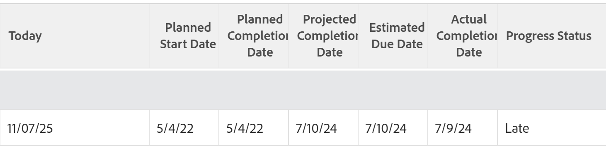

# Project Progress Status overview

<!--Audited: 12/2023-->

Adobe Workfront determines the Progress Status of a project by looking at the progression of the project across its timeline. You can configure Workfront to determine the Condition of a project based on the value of the Progress Status of the tasks. For more information about configuring the Condition of the project, see the article [Overview of Project Condition and Condition Type](../../../manage-work/projects/manage-projects/project-condition-and-condition-type.md).

The following are the Progress Statuses of projects in Workfront: 

<table style="table-layout:auto"> 
 <col> 
 <col> 
 <tbody> 
  <tr> 
   <td>On Time</td> 
   <td> The Progress Status of a project is <strong>On Time</strong> if:<ul><li>If both Projected and Estimated Due Dates are earlier than or equal to the project's Planned Completion Date 
  
</li></ul>  </td> 
  </tr> 
  <tr> 
   <td>At Risk</td> 
   <td> The Progress Status of a project is <strong>At Risk</strong> if <strong>all</strong> of the following are true:<ul><li>Both the Estimated and Projected Completion Dates are in the future</li><li> The Estimated Due Date is later than both the Planned Completion Date and the Projected Completion Date 
  
</li></ul> </td> 
  </tr> 
  <tr> 
   <td>Behind</td> 
   <td> The Progress Status of a project is <strong>Behind</strong> if <strong>all</strong> of the following are true:<ul><li>Both the Estimated and Projected Completion Dates are in the future</li><li> Both the Estimated and Projected Completion Dates are later than the Planned Completion Date of the project</li><li> The Estimated Due Date is not later than Projected Completion Date
   
  
</li></ul>  </td> 
  </tr> 
  <tr> 
   <td>Late</td> 
   <td> 
     The Progress Status of a project is <strong>Late</strong> if <strong>either</strong> of the following are true:<ul><li>The project is complete and the Actual Completion Date is later than the Planned Completion Date 
  
 </li> 
     <li> 
The project is not complete and the Planned Completion Date of the project is in the past 
  
 </li> 
    </ul> </td> 
  </tr> 
 </tbody> 
</table>

Consider the following:

* The Projected Completion Date of the project is driven by the task on the Critical Path with the latest Projected Completion Date.
* The Estimated Due Date of the project is driven by the task on the Critical Path with the latest Estimated Due Date.

For information about the project Critical Path, see [Overview of the project Critical Path](../../../manage-work/tasks/manage-tasks/critical-path.md).

For information about Projected Completion Dates, see [Overview of the Projected Completion Date for projects, tasks, and issues](../../../manage-work/projects/planning-a-project/project-projected-completion-date.md).
