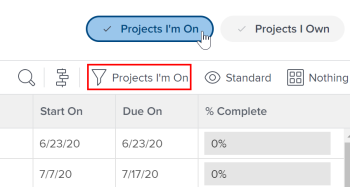

# Project Team overview

 <!-- Audited: 6/2025 -->

A project team consists of users that are associated with a project in some capacity. Users listed under the People area of a project make up the project team. For example, users who are assigned to work on the project or the project owner are part of the project team. 

Users associated with work on a project template or are the template owner or sponsor are part of the future project team after the project is created using the template. 

## Project Team members

You can assign users to a project team either manually or automatically. For more information, see the section Add users to a Project Team in the article [Manage the Project Team](../../../manage-work/projects/planning-a-project/manage-project-team.md).

When you add users to the Project Team manually, they receive View permissions to the project as well as the tasks, issues, and documents of the project. 

## Notifications to Project Team members

Depending on what email notifications your Adobe Workfront administrator enables, users on a project team are notified of various actions on a project. 

For more information, also see the following articles:

* [Event notification types](/help/quicksilver/administration-and-setup/manage-workfront/emails/event-notifications-available-in-wf.md)

* [Configure event notifications for everyone in the system](../../../administration-and-setup/manage-workfront/emails/configure-event-notifications-for-everyone-in-the-system.md)

>[!NOTE]
>
>Ensure you keep the project team membership updated in order to avoid sending notifications to users who don't need information about a project.

## Role-based approvals

To use role-based approvals on a project, users must be assigned to the project team and have the correct job role assigned in their user profile.

See the following articles for information on how to add a user to the project team and how to assign them a job role:

* [Manage the Project Team](../../../manage-work/projects/planning-a-project/manage-project-team.md) 
* [Edit a user's profile](../../../administration-and-setup/add-users/create-and-manage-users/edit-a-users-profile.md)

If you don't want to require the user to be on the project team for role-based approvals, you can control this in approval settings. For more information, see [Configure global approval settings](../../../administration-and-setup/customize-workfront/configure-approval-milestone-processes/establish-approval-settings.md).

## Projects I'm On filter

If a user is listed in the People area of a project, that project appears when they apply the Projects I'm On filter in a list of projects or project report.

You can see if the Projects I'm On filter is selected in the Projects area header. You can apply it from either the Filters panel or from the header.

>[!NOTE]
>
>If you are the creator of a project, the project remains listed in the Projects I'm On list, even if your name doesn't appear on the People area of the project or if your name has been removed from that list.
