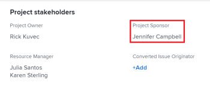

# Update project owners and sponsors

<!--Audited: 07/2024-->

When you create a project in Adobe Workfront, you are automatically set as the Project  Owner of the project. You can update this field with another user. You can also update the Project Sponsor field of a project.

For information about projects owners and sponsors, see [Overview of project owners and sponsors](../../../manage-work/projects/planning-a-project/project-owners-and-sponsors.md).

>[!TIP]
>
>You can identify an owner and a sponsor for a template. When you create a project from that template, the Template Owner becomes the Project Owner and the Template Sponsor becomes the Project Sponsor. 
>
>If the template does not have an Owner, the user who creates the project from the teamplate becomes the Project Owner.
>
>For information about editing templates, see [Edit project templates](../../../manage-work/projects/create-and-manage-templates/edit-templates.md).

## Access requirements

<!--drafted for P&P:

<table style="table-layout:auto"> 
 <col> 
 <col> 
 <tbody> 
  <tr> 
   <td role="rowheader">Adobe Workfront plan*</td> 
   <td> 
Any
 
  
 </td> 
  </tr> 
  <tr> 
   <td role="rowheader">Adobe Workfront license*</td> 
   <td> 
Current license: Standard 
 
   Or
   
Legacy license: Plan 
 
   </td> 
  </tr> 
  <tr> 
   <td role="rowheader">Access level configurations*</td> 
   <td> 
Edit access to Projects
 
<b>NOTE</b>
   
   If you still don't have access, ask your Workfront administrator if they set additional restrictions in your access level. For information on how a Workfront administrator can modify your access level, see <a href="../../../administration-and-setup/add-users/configure-and-grant-access/create-modify-access-levels.md" class="MCXref xref">Create or modify custom access levels</a>.
 </td> 
  </tr> 
  <tr> 
   <td role="rowheader">Object permissions</td> 
   <td> 
Edit permissions to a project
 
For information on requesting additional access, see <a href="../../../workfront-basics/grant-and-request-access-to-objects/request-access.md" class="MCXref xref">Request access to objects </a>.
 </td> 
  </tr> 
 </tbody> 
</table>
-->

+++ Expand to view access requirements for the functionality in this article. 

<table style="table-layout:auto"> 
 <col> 
 <col> 
 <tbody> 
  <tr> 
   <td role="rowheader">Adobe Workfront plan</td> 
   <td> 
Any
 
  
 </td> 
  </tr> 
  <tr> 
   <td role="rowheader">Adobe Workfront license*</td> 
   <td>
New: Standard
 
   
Current: Plan 
 </td> 
  </tr> 
  <tr> 
   <td role="rowheader">Access level configurations*</td> 
   <td> 
Edit access to Projects
 </td> 
  </tr> 
  <tr> 
   <td role="rowheader">Object permissions</td> 
   <td> 
Edit permissions to a project
 </td> 
  </tr> 
 </tbody> 
</table>

*For information, see [Access requirements in Workfront documentation](/help/quicksilver/administration-and-setup/add-users/access-levels-and-object-permissions/access-level-requirements-in-documentation.md).

+++

## Update the Project Owner of a project

When you add a user as the Project Owner of a project, Workfront automatically gives them permissions to view the project. 

1. Go to the project you want to update.
1. Click **Project Details** in the left panel. 
1. Click  the **Edit** icon  in the upper-right corner of the Project  Details area, then click  **Overview**.  

1. Specify the name of a user for the **Project Owner** field.

   Only active users can be specified as Project Owners.

1. Click  **Save Changes**.

   The Project Owner updates in the project header and in the Project  Details area.

   

## Update the Project Sponsor of a project

When you add a user as the Project Sponsor of a project, Workfront automatically gives them permissions to view the project. 

>[!TIP]
>
>If the user you add as a Project Sponsor is a System Administrator, they are not added to the Sharing list of the project. 

1. Go to the Project you want to update.
1. Click **Project Details** in the left panel. 
1. Click  the **Edit** icon  in the upper-right corner of the Project  Details area, then click  **Overview**.  

1. Specify the name of a user for the **Project Sponsor** field.

   Only active users can be specified as Project Sponsors.

1. Click  **Save Changes**.

   The Project  Sponsor updates in the Project  Details area.

   
