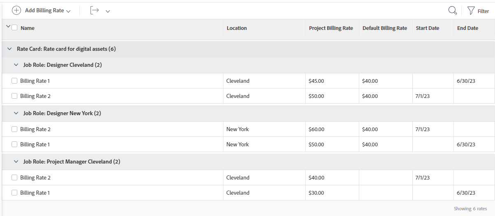

# Attach a rate card to a project

Rate cards store multiple billing rates per job role, based on location. You could have a job role of Designer based in Paris and a second Designer based in New York, each with different billing rates. However, a location is not required for job roles on a rate card. A billing rate for a job role (and possibly location) on a rate card can also include effective dates.

When you attach a rate card to a project, all of the roles by location and their associated billing rates are added to the project.

>[!NOTE]
>
>Attaching a rate card overrides any existing billing rates on the project.

You can edit the billing rates from the rate card directly in the project. This does not affect the rates stored on the default rate card.

For information about creating rate cards, see [Manage rate cards](/help/quicksilver/administration-and-setup/set-up-workfront/configure-system-defaults/manage-rate-cards.md).

For general information about overriding job role billing rates for projects and calculating project revenue, see [Overview of overriding Job Role Billing Rates and calculating Revenue on a project](/help/quicksilver/manage-work/projects/project-finances/override-role-billing-rates-and-calculate-project-revenue.md).

## Access requirements

You must have the following access to perform the steps in this article:

<table style="table-layout:auto"> 
 <col> 
 <col> 
 <tbody> 
  <tr> 
   <td role="rowheader">Adobe Workfront plan*</td> 
   <td> 
Any
 </td> 
  </tr> 
  <tr> 
   <td role="rowheader">Adobe Workfront license*</td> 
   <td> 
Current plan: Standard

Or

Legacy plan: Plan 
 </td> 
  </tr> 
  <tr> 
   <td role="rowheader">Access level configurations*</td> 
   <td> 
Edit access to Projects and Financial Data
 
Administrative access for Job&nbsp;roles
 
Note: If you still don't have access, ask your Workfront administrator if they set additional restrictions in your access level. For information on how a Workfront administrator can modify your access level, see <a href="../../../administration-and-setup/add-users/configure-and-grant-access/create-modify-access-levels.md" class="MCXref xref">Create or modify custom access levels</a>.
 </td> 
  </tr> 
  <tr> 
   <td role="rowheader">Object permissions</td> 
   <td> 
Manage permissions to the project with permissions to Manage Finance
 
For information on requesting additional access, see <a href="../../../workfront-basics/grant-and-request-access-to-objects/request-access.md" class="MCXref xref">Request access to objects </a>.
 </td> 
  </tr> 
 </tbody> 
</table>

&#42;To find out what plan, license type, or access you have, contact your Workfront administrator.

## Attach a rate card to a project

1. Go to the project.
1. Click **Billing Rates** in the left panel. You might have to first click **Show More**.
1. Click **Add Billing Rate > Attach a Rate Card**.
   
   The Attach a rate card page opens. For more information, see [Manage rate cards](/help/quicksilver/administration-and-setup/set-up-workfront/configure-system-defaults/manage-rate-cards.md).

1. Select the rate card to add to the project, and click **Attach**.

   The rate card and all of its job role rates are added to the billing rates list.

   

   >[!NOTE]
   >
   >On the billing rates list, you can remove one or more job roles that came from a rate card. Removing a job role billing rate from the project does not remove it from the default rate card.

