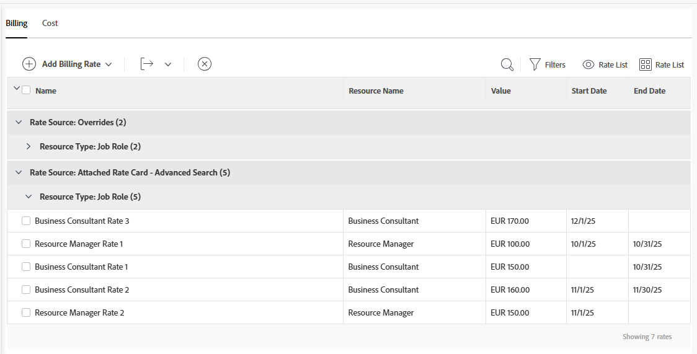

# Attach a rate card to a project

Rate cards store multiple billing rates per job role, based on attributes. For example, you could have a job role of Designer based in Paris for Agency A, another Designer based in Paris for Agency B, and a third Designer based in New York not assigned to an agency, each with different billing rates. However, attributes are not required for job roles on a rate card. The attributes serve as tools to establish more granular rates. A billing rate on a rate card can also be date effective, so that the rate starts and ends on specified dates.

When you attach a rate card to a project, all of the roles and their associated billing rates are added to the project.

>[!NOTE]
>
>Attaching a rate card overrides any existing rate card billing rates on the project. Billing rate overrides that were added directly to the project are not removed.

For information about creating rate cards, see [Manage rate cards](/help/quicksilver/administration-and-setup/manage-enterprise-operations/manage-rate-cards.md).

For general information about overriding job role billing rates for projects and calculating project revenue, see [Overview of overriding billing rates and calculating revenue on a project](/help/quicksilver/manage-work/projects/project-finances/override-role-billing-rates-and-calculate-project-revenue.md).

## Access requirements

+++ Expand to view access requirements for the functionality in this article.

<table style="table-layout:auto"> 
 <col> 
 <col> 
 <tbody> 
  <tr> 
   <td>Adobe Workfront package</td> 
   <td>Workflow Ultimate</td> 
  </tr> 
  <tr> 
   <td>Adobe Workfront license</td> 
   <td>Standard</td> 
  </tr> 
  <tr> 
   <td>Access level configurations</td> 
   <td>Edit access to Projects, Financial Data, and Rate Cards</td> 
  </tr> 
  <tr> 
   <td>Object permissions</td> 
   <td>Manage permissions to the project with permissions to Edit Billing Rates</td> 
  </tr> 
 </tbody> 
</table>

For information, see [Access requirements in Workfront documentation](/help/quicksilver/administration-and-setup/add-users/access-levels-and-object-permissions/access-level-requirements-in-documentation.md).

+++

## Attach a rate card to a project

1. Go to the project.
1. Click **Rates** in the left panel, then select **Billing**.
1. Click **Add Billing Rate > Attach a Rate Card**.
   
   The **Attach a rate card** box opens. You can search for a rate card in the list.

   

   >[!NOTE]
   >
   >The Group and Company on the rate cards are used as filters on this list. Because projects also include Group and Company fields, Workfront uses these values to narrow the list of available rate cards to those relevant to the project's context, and not all rate cards across the system.
   >
   >The match does not need to be exact. Rate cards with blank Group and/or Company values may still appear depending on the project's Group/Company configuration. For example, if a project has a Group selected but the Company is blank, you may see rate cards associated with that Group even if the rate card's Company is different or blank.

1. Select the rate card to add to the project, and click **Attach**.

   The rate card and all of its job role rates are added to the billing rates list.

   

## Remove a rate card from a project

When you remove a rate card from a project, all of its job role rates are removed. You cannot remove an individual rate from the project that comes from a rate card.

Billing rate overrides for users or job roles that were added directly to the project can be removed without removing the entire rate card.

1. Go to the project.
1. Click **Rates** in the left panel, then select **Billing**.
1. Click the **Remove** icon .
1. Click **Confirm** on the confirmation message to remove the rate card.

