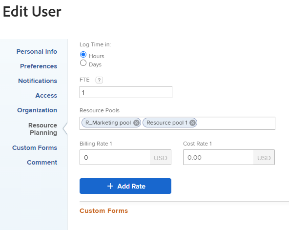
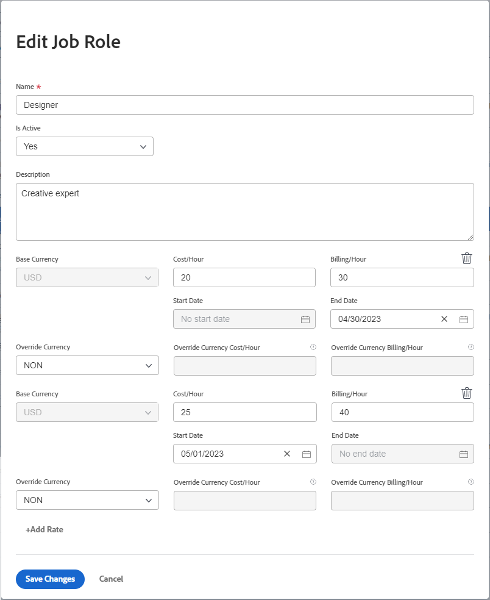

# Overview of Billing and Revenue

{{highlighted-preview}}

As a project manager, you can use billing rates to capture revenue on your projects.

This article describes tracking revenue for projects. Revenue is calculated differently in the Utilization Report. For information on Revenue calculations in the Utilization Report, see [View resource utilization information](../../../resource-mgmt/resource-utilization/view-utilization-information.md).

## Billing Rates overview

Consider the following when working with billing rates:

* You need a Plan license with Edit access to Financial Data in order to manage billing rates.   
  For more information about granting access to Financial Data, see [Grant access to financial data](../../../administration-and-setup/add-users/configure-and-grant-access/grant-access-financial.md).

* Billing rates are amounts of revenue per work unit associated with job roles or users.

  Multiplying the rates by the hours spent on work generates revenue for your projects.

* After establishing your billing rates, you can then track revenue by creating billing records to record what has and has not been billed.

  >[!TIP]
  >
  >When you mark a Billing Record as Billed, it can never be edited. This is important when your rates vary and you want to lock the revenue and expense information on your project. Adding it to a billing record and marking it as Billed prevents it from being updated when the rates update in your system.

  For more information about creating billing records, see the article [Create billing records](../../../manage-work/projects/project-finances/create-billing-records.md).

* You can create billing rates for users, job roles, or you can have a one-time billing rate for a project or task.

>[!IMPORTANT]
>
>The rates that calculate the revenue belong to the user who is logging the time or to their job roles.

* [User Billing Rates](#user-billing-rates) 
* [Job Role Billing Rates](#job-role-billing-rates) 
* [Fixed Billing Rates for projects or tasks](#fixed-billing-rates-for-projects-or-tasks) 
* [Override Billing Rates](#override-billing-rates)

### User Billing Rates {#user-billing-rates}

As a user administrator, when you create a user, you can associate them with date effective Billing Rates by specifying values for the Billing Per Hour fields and the dates for the rates.

For more information about creating users, see the article [Add users](../../../administration-and-setup/add-users/create-and-manage-users/add-users.md).

### Job Role Billing Rates {#job-role-billing-rates}

As an Adobe Workfront administrator, when you create a job role, you can associate it with date effective Billing Rates by specifying values for the Billing Per Hour fields and the dates for the rates.

You can define the value of a job role billing rate using the Base Currency of your Workfront system or using another custom currency.

For more information about creating job roles and overriding their currency, see the article [Create and manage job roles](../../../administration-and-setup/set-up-workfront/organizational-setup/create-manage-job-roles.md).

### Fixed Billing Rates for projects or tasks {#fixed-billing-rates-for-projects-or-tasks}

In addition to user and job role hourly rates, you can also have the following fixed billing rates:

* Fixed Amount for Fixed Hourly Revenue Type 
* Fixed Amount for Fixed Revenue Revenue Type

For more information about how the fixed billing rates are used to calculate revenue, see [Overview of task Revenue Types](#overview-of-task-revenue-types).

### Override Billing Rates {#override-billing-rates}

>[!IMPORTANT]
>
>You can override billing rates associated with job roles. You cannot override user billing rates or fixed rates.

You can override job role billing rates for:

* A specific Company

  For more information about creating job role billing rates specific to a company, see [Create and edit companies](../../../administration-and-setup/set-up-workfront/organizational-setup/create-and-edit-companies.md). 

* A specific Project

  For more information about creating job role billing rates specific to a project, see the article [Overview of overriding Job Role Billing Rates and calculating Revenue on a project](../../../manage-work/projects/project-finances/override-role-billing-rates-and-calculate-project-revenue.md).

## Track Revenue amounts

Workfront can track Planned Revenue automatically when tasks are created based on the Planned Hours of the tasks.

It can also track Actual Revenue automatically when Actual Hours are logged on the tasks, issues, and on the project.

The following table shows the types of revenue associated with tasks, issues, and projects. 

<table style="table-layout:auto"> 
 <col> 
 <col> 
 <tbody> 
  <tr> 
   <td role="rowheader">Planned Revenue</td> 
   <td> 
For tasks, this is the revenue associated with the Planned Hours of tasks. The Planned Hours from all tasks roll up to the Planned Hours of the project to contribute to the calculation of the project Planned Hours. 
 
For more information about Planned Hours in Workfront, see <a href="../../../manage-work/tasks/task-information/planned-hours.md" class="MCXref xref">Planned Hours overview</a>. 
 
Workfront calculates Planned Revenue for tasks using this formula:

   
<code>Task Planned Revenue = Planned Hours * Billing hourly rate</code>
 
<strong>NOTE</strong>  The billing hourly rate in the formula considers any date effective changes of the rate.
 
Workfront calculates Planned Revenue for projects using the following formula:
 
<code>Project Planned Revenue = SUM (All tasks Planned Revenue) + Fixed Revenue</code>

   
<b>NOTE</b>
   
   
The project Planned Revenue that displays in the Project Details area and in project reports differs from the Planned Revenue that displays in the Utilization report. 
 
The Planned Revenue in the Project Details area reflects the task revenue associated with the task Planned Hours as well as the Fixed Revenue of the project. The Planned Revenue in the Utilization Report displays Planned Revenue associated only with the Planned Hours from the task assignments on the project. 
 
     
Example: </b>"> 
      
If the project has 1 task with 10 hours, assigned to a Consultant with $20 hourly rate, and the project has $100 Fixed Revenue, the Utilization report displays $200 for Planned Revenue (the Planned Revenue associated with the hours on the task). The Project&nbsp;Details section displays $300 (the Planned Revenue from the task and the Fixed Revenue for the project.) 
 
     
 
 
Task Planned Revenue is calculated using the Billing hourly rates of the users or job roles assigned to the tasks. The Revenue Type of the tasks influences which rate (user or role) is used for calculating Planned Revenue. For more information, see the following sections in this article:
 
    <ul> 
     <li> 
<a href="#overview-of-task-revenue-types" class="MCXref xref">Overview of task Revenue Types</a> 
 </li> 
     <li> 
<a href="#revenue-calculations-for-tasks-based-on-user-and-role-assignments" class="MCXref xref">Revenue calculations for tasks based on User and Role assignments</a> 
 </li> 
    </ul> 
For information about Planned Revenue calculations in the Utilization report, see <a href="../../../resource-mgmt/resource-utilization/view-utilization-information.md" class="MCXref xref">View resource utilization information </a>. 
 </td> 
  </tr> 
  <tr> 
   <td role="rowheader">Actual Revenue*</td> 
   <td> 
Associated with the Actual Hours of tasks, issues, and projects. 
 
Generally, Workfront calculates Actual Revenue using this formula:
 
<code>Actual Revenue = Actual Hours * Billing rate</code> 
 
<strong>NOTE</strong>  The billing hourly rate in the formula considers any date effective changes of the rate.
 
For information on Actual Revenue calculations in the Utilization Report, see <a href="../../../resource-mgmt/resource-utilization/view-utilization-information.md" class="MCXref xref">View resource utilization information </a>. 
 
<b>TIP</b>
   
   You cannot view Actual Revenue at the issue level, but the revenue associated with the Actual Hours on the issues contribute to the Actual Revenue of the project. 
 </td> 
  </tr> 
 </tbody> 
</table>

*For Actual Hours, the user's rates always refer to the user who logs the hours or to the rates of their job roles. For information about when Workfront uses the rates of the user and when it uses the rates of their job roles, see the [Revenue calculations](#revenue-calculations) section in this article.

<!--Note from the table for Planned Revenue line: 
     
(the note below is duplicated in this article: /Content/Resource Mgmt/Resource utilization/view-utilization-information.htm and in the glossary)

    -->

For example, if a task with User Hourly Revenue Type is planned to take 2 hours and the user assigned to it has an hourly rate of $30 an hour, then the Planned Revenue of the task is $60. When the task is completed, if the user logs just 1.5 hours as the actual time spent to finish the task, the Actual Revenue amount is $45. If another user who is not assigned to the task logs the time, the Actual Revenue is calculated based on that user's Billing Rates.

You can record revenue in the following ways:

* By defining the Revenue Type of your tasks, and associating users or roles assigned to work items with billing rates. This calculates the revenue by the amount of Planned or Actual Hours on the work items. You can set a cap to the maximum amount charged for hourly rates, or not.  
  For more information about specifying the Revenue Type of a task, see the article [Edit tasks](../../../manage-work/tasks/manage-tasks/edit-tasks.md).

* By billing a flat Fixed Revenue rate for tasks or projects.  
  If you have tasks with Fixed Revenue, the Fixed Revenue amount will be added as the Planned Revenue of a task or a project, and the Planned Revenue of a task will be available to be added to a Billing Record as Fixed Revenue. 
* By setting a flat billing Fixed Revenue rate for a project, and then set hourly rates for the tasks within the project. Workfront adds the hourly rates for the tasks to the flat rate of the project.   
  For example, a mechanic using Workfront could enter a cost for parts as fixed revenue for the project, then bill hourly for the time spent fixing a car. Fixed Revenue on projects or tasks is then realized on completion.

You can also mark your tasks as "Not Billable," in which case there is no Planned or Actual Revenue associated with them.

## Overview of task Revenue Types {#overview-of-task-revenue-types}

By default, the Revenue Type of all new tasks is set according to the Task & Issue Preferences specified by your Workfront or group administrator.  
For more information about defining the task and issue preferences for your Workfront instance, see the article [Configure system-wide task and issue preferences](../../../administration-and-setup/set-up-workfront/configure-system-defaults/set-task-issue-preferences.md).

The Project Owner can modify the Revenue Type of tasks and the Fixed Revenue for projects.   
For more information about specifying the Fixed Revenue of a project, see the article [Edit projects](../../../manage-work/projects/manage-projects/edit-projects.md).  
For more information about specifying the Revenue Type of a task, see the article [Edit tasks](../../../manage-work/tasks/manage-tasks/edit-tasks.md).

You can apply the following Revenue Types to your tasks or projects: 

<table border="1" cellspacing="15"> 
 <col> 
 <col> 
 <thead> 
  <tr> 
   <th> 
<strong>Revenue Type</strong> 
 </th> 
   <th> 
<strong>Description</strong> 
 </th> 
  </tr> 
 </thead> 
 <tbody> 
  <tr> 
   <td> 
Fixed Revenue
 </td> 
   <td> 
This type can be used with projects and tasks. 
 
When attaching a template to a project, the Fixed Revenue from the template is added to the Fixed Revenue of the project.&nbsp;For information, see <a href="../../../manage-work/projects/create-and-manage-templates/attach-template-to-project-overview.md" class="MCXref xref">Overview of attaching a template to a project</a>. 
 
For tasks, regardless of the task assignments, the revenue on the task is always calculated using the Fixed Amount specified on the task. 
 
The Fixed Revenue from children tasks rolls up to the Revenue of the parent task and then to the revenue of the Project. If a fixed amount is defined on the parent task and/or the project, the amount is added to the planned revenue rolled up from any child tasks.
 
The amount of fixed revenue on tasks can be included in a Billing Record on the project.
 </td> 
  </tr> 
  <tr> 
   <td> 
User Hourly
 </td> 
   <td> 
This type can be used for tasks only. 
 
The billing rate that you set for a specific user multiplied by the number of the Planned Hours for that task becomes the Planned Revenue amount of the task. The billing rate that you set for a specific user multiplied by the number of hours that user logs against the task is the Actual Revenue amount of the task.  For example, when you create a user and you set $20 for their Billing Per Hour field, then if the user submits 5 hours for a task on the timesheet, then the Actual Billing amount of the task is $100.

   
A user profile can contain multiple billing rates with effective dates. For example, the first user billing rate of $20 ends on April 30, 2023 and the second user billing rate of $25 begins on May 1, 2023. If the user submits 2 hours on April 28 and 3 hours on May 2 for a task, then the Actual Billing amount of the task is $40 + $75 = $115.

   
<b>TIP</b> 
   
   This is the default Revenue Type when you create a task.
 </td> 
  </tr> 
  <tr> 
   <td> 
Role Hourly
 </td> 
   <td> 
This type can be used for tasks only.
 
This type is similar to User Hourly but uses job role rates rather than user rates.
 
<strong>NOTE</strong> A job role can also have multiple billing rates with effective dates.
</td> 
  </tr> 
  <tr> 
   <td> 
User Hourly with Cap
 </td> 
   <td> 
This type can be used for tasks only.
 
Tasks are billed hourly as in User Hourly, but they have a maximum Cap Amount that you can specify.  For example, if the billing rate of a user is $25, but the Cap Amount on the task is $20, and the user logs one hour, the Actual Revenue on the task is $20. 
 </td> 
  </tr> 
  <tr> 
   <td> 
Role Hourly with Cap
 </td> 
   <td> 
This type can be used for tasks only.
 
This type is similar to User Hourly with Cap but uses job role rates rather than user rates. 
 </td> 
  </tr> 
  <tr> 
   <td> 
User Hourly Plus Fixed
 </td> 
   <td> 
This type can be used for tasks only. 
 
Tasks are billed hourly as in User Hourly, but have a Fixed Amount that you can add to the user rate. The Fixed Amount specified on the task can be included in billing records for the project. The Fixed Amount does not get multiplied by the hours on the task. Only the user billing rate does. 
 </td> 
  </tr> 
  <tr> 
   <td> 
Role Hourly Plus Fixed
 </td> 
   <td> 
This type can be used for tasks only. 
 
Tasks are billed hourly as in Role Hourly, but have an additional Fixed Amount that you can add to the role rate. The Fixed Amount specified on the task can be included in billing records for the project. The Fixed Amount does not get multiplied by the hours on the task. Only the job role billing rate does. 
 </td> 
  </tr> 
  <tr> 
   <td> 
Fixed Hourly
 </td> 
   <td> 
This type can be used for tasks only.
 
The Cap or Fixed Amount that you set for the task multiplied by the number of hours entered against the task (regardless of user or their job roles) is the billing amount.
 </td> 
  </tr> 
  <tr> 
   <td> 
Not Billable
 </td> 
   <td> 
This type can be used for tasks only.
 
This Revenue Type has no effect on revenue. 
 
If a parent object has this setting, child tasks with a billing type will still apply normally.
 
When a user with No Access to Financial Data or a user with no financial permissions on a template creates a project from that template, this is the default Revenue Type for the tasks on the project.
 
For information about access to Financial Data, see the article <a href="../../../administration-and-setup/add-users/configure-and-grant-access/grant-access-financial.md" class="MCXref xref">Grant access to financial data</a>. For information about financial permissions on objects, see the article <a href="../../../workfront-basics/grant-and-request-access-to-objects/sharing-permissions-on-objects-overview.md" class="MCXref xref">Overview of sharing permissions on objects</a>. For information about creating projects from templates, see the article <a href="../../../manage-work/projects/create-projects/create-project-from-template.md" class="MCXref xref">Create a project using a template</a>. 
 </td> 
  </tr> 
 </tbody> 
</table>

## Overview of Revenue for parent tasks

If you change a standalone task with billing information on it into a parent, the new parent task still retains any billing information previously applied to it, along with the hours previously applied. Any billing information coming from hours logged to the children tasks will roll up as Actual Revenue to the new parent task.

The Planned Revenue from the children tasks also rolls up to the parent task.

## Overview of Revenue for issues

Issues do not have Planned or Actual Revenue amounts, but they can have Actual Cost.

If you log hours for an issue and you use an hour type which is marked as "Count As Revenue", then Workfront calculates an Actual Cost amount according to the rate of the user who is logging in the time. This number is added to the Actual Cost of the project. The hours can also be included in a billing record.

For more information about tracking costs, see the article [Track costs](../../../manage-work/projects/project-finances/track-costs.md).

For more information about hour types, see the article [Manage hour types](../../../administration-and-setup/set-up-workfront/configure-timesheets-schedules/hour-types.md).

## Revenue calculations

* [Revenue calculations for tasks based on User and Role assignments](#revenue-calculations-for-tasks-based-on-user-and-role-assignments)

### Revenue calculations for tasks based on User and Role assignments {#revenue-calculations-for-tasks-based-on-user-and-role-assignments}

When calculating revenue for a task, consider the following:

* If a user or a job role shows a rate of $0.00, Workfront reads that as a valid amount and it will multiply this amount by the number of hours on the task to calculate the revenue. If you want to show no revenue for your tasks, ensure that the field for the billing rate for your user or job role is empty.
* When job role billing rates apply, Workfront uses the override rate at the project level, instead of the billing rate for that role defined at the system level every time there is an override rate on the project.
* For Actual Revenue, if the user or job role has multiple billing rates with effective dates, the task revenue is the sum of the revenues of each time period in which the user has logged time. Planned Revenue is based on the planned hours for the time periods.
* In case of multiple assignees on the tasks, the scenarios outlined below apply for each assignee.

There is a hierarchy of which rate is used in revenue calculations based on task assignments.

If your Workfront administrator enabled the **Assign Job Roles to hour entries manually** setting in the Timesheets & Hours Preferences area, and the user logging time on the project selects a different role to associate with this time, the Actual Revenue of the task or project always calculates based on the role associated with the hour entry. For information about enabling logging time for a specific job role, see the article [Timesheet and Hour Preferences](../../../administration-and-setup/set-up-workfront/configure-timesheets-schedules/timesheet-and-hour-preferences.md).

The following scenarios exist when calculating task revenue based on the Revenue Type and the nature of the task assignment:

* **The Revenue Type of the task is User Hourly** 

  <table style="table-layout:auto"> 
   <col> 
   <col> 
   <col> 
   <col> 
   <tbody> 
    <tr> 
     <td role="rowheader">Billing per hour rate</td> 
     <td>No assignment</td> 
     <td>User assignment</td> 
     <td>Job role assignment</td> 
    </tr> 
    <tr> 
     <td role="rowheader">Billing per hour rate for Planned Revenue</td> 
     <td>$0.00</td> 
     <td> If a user has a billing rate in their profile, then that rate is used to calculate Planned Revenue. Otherwise, the system billing rate of their primary job role is used.  
<b>NOTE</b>  The user can be assigned to the task with one of their secondary job roles, but the rate of the primary job role is used here instead.

If the user's role has changed during the assignment, the correct rates are applied when the project finances are recalculated.
</td> 
     <td>
If a rate card is attached to the project, then the Planned Revenue is calculated based on the job role from the rate card.
 
The billing rates can be overridden at the project level.
</td> 
    </tr> 
    <tr> 
     <td role="rowheader">Billing per hour rate for Actual Revenue</td> 
     <td>If the user logging the hours has a billing rate in their profile, that rate is used. 
      When time is logged for a user or role that has a location-specific assignment in the advanced assignments, the location's rate is used.
      Otherwise, the billing rate of their primary job role is used. If there is no billing rate associated with the user or their primary role, the Actual Revenue is $0.00.  
<b>NOTE</b>
     
     Only the rates associated with the user logging the time are taken into account for the calculation, even when another user is assigned to the task.
</td> 
     <td>If the user logging the hours has a billing rate in their profile, that rate is used.  When time is logged for a user or role that has a location-specific assignment in the advanced assignments, the location's rate is used. Otherwise, the billing rate of their primary job role is used. If there is no billing rate associated with the user or their primary role, the Actual Revenue is $0.00.  
<b>NOTE</b>
     
     Only the rates associated with the user logging the time are taken into account for the calculation, even when another user is assigned to the task.
</td> 
     <td>If the user logging the hours has a billing rate in their profile, that rate is used. Otherwise, the billing rate of their primary job role is used. 
<b>NOTE</b>
     
     If the user logging time has no billing rate associated with them, and they do not have a job role or a billing rate for their job role, then the rate from the job role associated with the task is used. If there is no billing rate for this role, the revenue is $0.00
</td> 
    </tr> 
   </tbody> 
  </table>

* **The Revenue Type of the task is Role Hourly** 

  <table style="table-layout:auto"> 
   <col> 
   <col> 
   <col> 
   <col> 
   <tbody> 
    <tr> 
     <td role="rowheader">Billing per hour rate</td> 
     <td>No assignment</td> 
     <td>User assignment</td> 
     <td>Job role assignment</td> 
    </tr> 
    <tr> 
     <td role="rowheader">Billing per hour rate for Planned Revenue</td> 
     <td>$0.00</td> 
     <td>
Workfront looks at the job role that the user fulfills on the task to calculate the Planned Revenue.  If the user is not associated with any role on the task, the Revenue is $0.00.
 
<strong>NOTE</strong> If the user's role has changed during the assignment, the correct rates are applied when the project finances are recalculated.
 </td> 
     <td>
If a rate card is attached to the project, then the Planned Revenue is calculated based on the job role from the rate card.
 
The billing rates can be overridden at the project level.
</td> 
    </tr> 
    <tr> 
     <td role="rowheader">Billing per hour rate for Actual Revenue</td> 
     <td>Workfront uses the billing rate of the primary job role of the user logging the time.  When time is logged for a user or role that has a location-specific assignment in the advanced assignments, the location's rate is used.  If the user logging the time has no job role associated with them, or if the primary job role has no billing rate, the Actual Revenue is $0.00. </td> 
     <td> If the user logging the time is assigned to the task, the billing rate of the job role associated with the user on the task is used to calculate the Actual Revenue.  When time is logged for a user or role that has a location-specific assignment in the advanced assignments, the location's rate is used.  Otherwise, the billing rate of their primary job role is used. If the user has no primary job role or if their primary job role has no billing rate, the Actual Revenue is $0.00. </td> 
     <td>If one of the job roles of the user logging the time is assigned to the task, that job role rate is used. If the job role assigned to the task is not associated with the user logging the time, then the billing rate of the primary role of the user is used to calculate the Actual Revenue. If the user does not have a job role or there is no rate associated with their primary job role, then the rate of the job role assigned to the task is used. </td> 
    </tr> 
   </tbody> 
  </table>

<!--

Ideal table but does not come across Markdown

<table style="table-layout:auto">
<col>
<col>
<col>
<col>
<col>
<col>
<col>
<tbody>
<tr>
<td colspan="3">Revenue Type = User Hourly</td>
<td colspan="4">Revenue Type = Role Hourly</td>
</tr>
<tr>
<td> 
 
 </td>
<td> 
<strong>No Assignment</strong> 
 </td>
<td> 
<strong>User Assignment</strong> 
 </td>
<td> 
<strong>Job Role Assignment</strong> 
 </td>
<td> 
<strong>No Assignment</strong> 
 </td>
<td> 
<strong>User Assignment</strong> 
 </td>
<td> 
<strong>Job Role Assignment</strong> 
 </td>
</tr>
<tr>
<td> 
<strong>Billing per hour rate for Planned Revenue</strong> 
 </td>
<td> 
$0.00
 </td>
<td> 
 If a user has a billing rate in their profile, then that rate is used to calculate Planned Revenue. Otherwise, the system billing rate of their primary job role is used.  <note type="note">
The user can be assigned to the task with one of their secondary job roles, but the rate of the primary job role is used here instead.
</note>
 </td>
<td> 
 The system billing rate of the job role assigned to the task is used to calculate Planned Revenue. 
 </td>
<td> 
$0.00
 </td>
<td> 
Workfront looks at the job role that the user fulfills on the task to calculate the Planned Revenue.  If the user is not associated with any role on the task, the Revenue is $0.00. 
 </td>
<td> 
The billing rate of the job role assigned to the task is used to calculate Planned Revenue. 
 
 
 
 
 </td>
</tr>
<tr>
<td> 
<strong>Billing per hour rate for Actual Revenue</strong> 
 </td>
<td colspan="2"> 
If the user logging the hours has a billing rate in their profile, that rate is used.  Otherwise, the billing rate of their primary job role is used. If there is no billing rate associated with the user or their primary role, the Actual Revenue is $0.00.  <note type="note">
Only the rates associated with the user logging the time are taken into account for the calculation, even when another user is assigned to the task.
</note>
 </td>
<td> If the user logging the hours has a billing rate in their profile, that rate is used. Otherwise, the billing rate of their primary job role is used. <note type="note">
If the user logging time has no billing rate associated with them, and they do not have a job role or a billing rate for their job role, then the rate from the job role associated with the task is used. If there is no billing rate for this role, the revenue is $0.00
</note></td>
<td> 
Workfront uses the billing rate of the primary job role of the user logging the time.  If the user logging the time has no job role associated with them, or if the primary job role has no billing rate, the Actual Revenue is $0.00. 
 </td>
<td> 
 If the user logging the time is assigned to the task, the billing rate of the job role associated with the user on the task is used to calculate the Actual Revenue. Otherwise, the billing rate of their primary job role is used. If the user has no primary job role or if their primary job role has no billing rate, the Actual Revenue is $0.00. 
 </td>
<td> 
If one of the job roles of the user logging the time is assigned to the task, that job role rate is used. If the job role assigned to the task is not associated with the user logging the time, then the billing rate of the primary role of the user is used to calculate the Actual Revenue. If the user does not have a job role or there is no rate associated with their primary job role, then the rate of the job role assigned to the task is used. 
 </td>
</tr>
</tbody>
</table>

-->

### Revenue calculations for projects

You can track the following revenue types for projects:

* Planned Revenue for a project is calculated by the following formula:

  `Project Planned Revenue = SUM(Task Planned Revenue)+ Fixed Revenue`

  For information about how task Planned Revenue is calculated, see the [Revenue calculations for tasks based on User and Role assignments](#revenue-calculations-for-tasks-based-on-user-and-role-assignments) section in this article.

* Actual Revenue for a project is calculated by the following formula:

  `Project Actual Revenue = SUM (Task Actual Revenue) + (Hours logged for the project x User Billing per Hour Rate) + SUM (Hours logged for the issues x User Billing per Hour rate)`

For information about how task Actual Revenue is calculated, see the [Revenue calculations for tasks based on User and Role assignments](#revenue-calculations-for-tasks-based-on-user-and-role-assignments) section in this article.

For the Actual Revenue associated with the hours logged directly to the project or the issues, Workfront uses the Billing Rate of the user who logs the time on the project. If the user has no Billing Rate associated with their profile, Workfront uses the Billing Rate of their Primary Job Role. If both rates are zero, the Actual Revenue associated with the hours logged on the project or the issues is zero.
