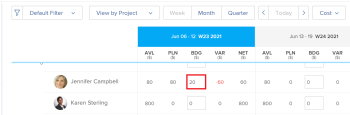

# Understand Budgeted Labor Cost and Budgeted Hours for projects

<!--
<(NOTE: Keep the structure of this article similar to Calculating Budgeted Cost)

-->

You can budget your resources for work using the Adobe Workfront Resource Planner.

As you budget your resources for work on projects, Workfront calculates the Budgeted Labor Cost for the roles, projects, and users based on cost per hour values.

The Resource Planner Budgeted Labor Cost of a project is a calculation between the cost associated with the job roles assigned to complete the work on the project and the amount of hours estimated (Resource Planner Budgeted Hours) that might take each role to complete the work.

>[!IMPORTANT]
>
>The Resource Planner Budgeted Labor Cost for users does not affect that of the project. Only the labor cost for job roles affects the cost of the project. 

## Overview of the Budgeted Labor Cost for Job Roles and the Project

Workfront uses the Budgeted Labor Cost of the job roles on the project to calculate the Budgeted Labor Cost of the project.

>[!TIP]
>
>The Budgeted Labor Cost of a project in the Business Case displays as Resource Planner Budgeted Labor Cost in reports and lists.

The **Budgeted Labor Cost** (or Resource Planner Budgeted Labor Cost) of a project is calculated by the following formula:

`Resource Planner Budgeted Labor Cost = SUM ( Resource Planner Budgeted Hours for each job role on the project * Cost per Hour rate of each job role on the project)`

The fields used in the calculation above refer to the following:

* The hours budgeted for job roles in the Resource Budgeting area of the project or the Resource Planner.

  For more information about budgeting resources in the Resource Planner, see the "Budgeting Resources in the Resource Planner" section in the article [Resource Planner overview](../../../resource-mgmt/resource-planning/get-started-resource-planner.md).

  For more information about budgeting resources in the Resource Budgeting area of the Business Case, see [Budget resources in the Business Case](../../../manage-work/projects/define-a-business-case/budget-resources-in-business-case.md).

* The **Cost per Hour rate of a job role** in the above calculation refers to the cost associated with each job role on the project.   
  For more information about creating and managing job roles and associating them with Cost rates, see the article [Create and manage job roles](../../../administration-and-setup/set-up-workfront/organizational-setup/create-manage-job-roles.md).

>[!NOTE]
>
>Workfront calculates all cost information using the currency of the project. If you specify Budgeted Hours for your resources in the Resource Planner, the option to change project currency is disabled.  
>For more information about changing the currency of a project, see the article [Change the project currency](../../../manage-work/projects/project-finances/change-project-currency.md).

## Overview of the Budgeted Labor Cost for Users

<!--

(NOTE: Update the following section in the Create a Business Case article, as well, when you update it here.)

-->

>[!IMPORTANT]
>
>The User Budgeted Labor Cost does not affect the Budgeted Labor Cost of the project. Only the labor cost of the job roles on a project affects the Resource Planner Budgeted Labor Cost of the project. 
> 
>The total of all labor costs of all users may or may not equal the Resource Planner Budgeted Labor Cost of the job roles associated with the users.
>
>If you estimate Budgeted Hours for users in the Resource Planner, the costs associated with them are those of the job roles associated with the users. They are not costs associated with the users or their rates.

If users are associated with the job roles on the project and their hours are budgeted in the Resource Planner, their Budgeted Labor Cost displays by the following names, depending on where you view them in Workfront:

* [!UICONTROL **Budgeted Labor Cost**]: The Resource Budgeting area of the Business Case under their respective roles.

  

* [!UICONTROL **BDG**]: The Resource Planner when viewing information in the Project and Role view by Cost.

  

Users display in the Resource Budgeting area of the Business Case under their respective roles or in the Resource Planner if they meet the following requirements:

* They are associated with one of the job roles on the project.
* They have Budgeted Hours specified in the Resource Planner.
* They have a Cost per Hour Rate associated with their profile.

  For more information about adding Cost per Hour rates to users, see the article [Edit a user's profile](../../../administration-and-setup/add-users/create-and-manage-users/edit-a-users-profile.md).

* The user is part of one of the Resource Pools associated with the project.

The Budgeted Labor Cost of a user is calculated by the following formula:

`User Budgeted Labor Cost = Budgeted hours for the user on the project * Cost per Hour rate of the user`

## Locate the Budgeted Labor Cost of a project

The Budgeted Labor Cost as reflected in the Resource Budgeting area of the Business Case or the Resource Planner displays in the following areas of Workfront under the following names:

  <table style="table-layout:auto"> 
   <col> 
   <col> 
   <tbody> 
    <tr> 
     <td><strong>Budgeted Labor Cost display name</strong></td> 
     <td><strong>Area of Workfront</strong></td> 
    </tr> 
    <tr> 
     <td>Budgeted Labor Cost</td> 
     <td>Resource Budgeting area of the Business Case</td> 
    </tr> 
    <tr> 
     <td>Budgeted Cost</td> 
     <td>
Utilization report Cost view

For more information, see <a href="../../../resource-mgmt/resource-utilization/view-utilization-information.md">View utilization information</a> .
</td> 
    </tr> 
    <tr> 
     <td>BDG </td> 
     <td>Resource Planner Project or Role views, by Cost</td> 
    </tr> 
    <tr> 
     <td>Resource Planner Project Budgeted Labor Cost</td> 
     <td> 
Project report
 
Project (Financial Data) report
 
Task report
 
Issue report
 
Budgeted Hour report
 
For information about creating a report, see the article <a href="../../../reports-and-dashboards/reports/creating-and-managing-reports/create-custom-report.md" class="MCXref xref">Create a custom report</a>.
 </td> 
    </tr> 
   </tbody> 
  </table>

>[!NOTE]
>
>If you use the Adobe Workfront Scenario Planner to budget project resources, the Budgeted Labor Cost in the Resource Budgeting area of the Business Case is the same as the People Costs of the initiative linked to the project. The Scenario Planner is available only in the new Adobe Workfront experience and requires an additional license. For information about the Workfront Scenario Planner, see [The Scenario Planner overview](../../../scenario-planner/scenario-planner-overview.md). For information about budgeting resources using the Scenario Planner, see [Budget resources in the Business Case using the Scenario Planner](../../../manage-work/projects/define-a-business-case/budget-resources-in-business-case-use-scenario-planner.md).

## Locate the Budgeted Hours of a project

<!--
(NOTE: Keep the structure of this article similar to Calculating Budgeted Cost)
-->

Budgeted Hours affect the value of the Budgeted Labor Cost (or the Resource Planner Budgeted Cost) of the project.

The Budgeted Labor Cost of a project is the cost associated with the job roles assigned to complete the work on the project and the amount of hours estimated (Budgeted Hours) that might take each role to complete the work.

You can view the Budgeted Hours in Workfront in the fields listed in the table below.

>[!NOTE]
>
>Any other mention of "Budgeted Hours" in Workfront refers to hours budgeted using deprecated features that have been removed from Workfront. These are view-only fields and do not update with current information when you use current resource budgeting tools.

The hours budgeted in the Resource Budgeting area of the Business Case or the Resource Planner display in the following areas of Workfront and under the following names:

* **Hours**: Resource Budgeting area of the Business Case
* **BDG**:Resource Planner viewed by Hours
* **Budgeted Hours**: Utilization report Hours view 
For information, see [View resource utilization information](../../../resource-mgmt/resource-utilization/view-utilization-information.md).
* **Bud. Hours**: Budgeted Hour report 

  The Budgeted Hour object in the Budgeted Hour report refers to information related to a deprecated resource management tool. Only the "Bud. Hours" field in this report refers to the hours budgeted in the Resource Planner or the Resource Budgeting area of the project's Business Case.
  
  For more information about creating a report, see the article **Create a custom report**.
* **Resource Planner Budgeted Hours**: in the following reports:
   
  * Project report
  * Project (Financial Data) report
  * Task report
  * Issue report
  * Budgeted Hour report
