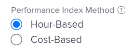

# Calculate Budgeted Cost of Work Scheduled (BCWS)

## Overview of Budgeted Cost of Work Scheduled (BCWS)

Also known as the Planned Value, the Budgeted Cost of Work Scheduled (BCWS) is a project performance metric that represents the amount of the task that should have completed at the time when this metric is calculated.

Adobe Workfront calculates the Budgeted Cost of Work Scheduled (BCWS) for both projects and tasks.

Consider the following when reviewing the values for the BCWS on a task or project:

* Workfront calculates the BCWS for a task based on your configuration for the Performance Index Method (PIM) of the project.

  You can configure your project to calculate the PIM using hours or cost and the BCWS is also calculated using the same values.

  For information about configuring how the BCWS is calculated, see the section [Configure how BCWS is calculated](#configure-how-bcws-is-calculated) in this article.

* Workfront calculates the BCWS for a project by adding all the BCWS values from all the parent tasks and individual tasks on the project.

  The values from children tasks are not added to the BCWS of the project.

## Access requirements

+++ Expand to view access requirements for the functionality in this article.

<table style="table-layout:auto"> 
 <col> 
 <col> 
 <tbody> 
  <tr> 
   <td>Adobe Workfront package</td> 
   <td>Any</td> 
  </tr> 
  <tr> 
   <td>Adobe Workfront license</td> 
   <td>
   <p>Standard</p>
   <p>Plan</p></td> 
  </tr> 
  <tr> 
   <td>Access level configurations</td> 
   <td>Edit access to Projects</td> 
  </tr> 
  <tr> 
   <td>Object permissions</td> 
   <td>Manage permissions to the project</td> 
  </tr> 
 </tbody> 
</table>

For information, see [Access requirements in Workfront documentation](/help/quicksilver/administration-and-setup/add-users/access-levels-and-object-permissions/access-level-requirements-in-documentation.md).

+++

## Configure how BCWS is calculated {#configure-how-bcws-is-calculated}

You can configure whether the BCWS is calculated in hours or costs by configuring how the Performance Index Method (PIM) of the project is calculated.

1. Go to a project and click **Project Details** in the left panel.
1. In the **Finance** area, locate the **Performance Index Method** field and double click it to edit it.

   

1. Select from the following options:

   |Option|How the calculation is performed|
   |---|---|
   | Hour-Based |Workfront calculates the BCWS using the Planned Hours of the tasks. |
   | Cost-Based |Workfront calculates the BCWS using the Planned Cost of the tasks. |

   
1. Click **Save Changes**.

   The BCWS of the tasks on the project is calculated using hours or costs.

## Calculate BCWS

Workfront calculates the Budgeted Cost of Work Scheduled (BCWS) for tasks or projects by using the following formulas:

  ```
  Task BCWS = Planned Percent Complete x Task Budget
  ```

  ```
  Project BCWS = SUM(BCWS values of all parent and individual tasks)
  ```

The following values are used in this calculation:

|Value used| Description of value used|
|---|---|
| Planned Percent Complete |This is what the percent complete of the task should be by looking at the amount of time passed between the beginning of the task and today. |
| Task Budget |This is the value for the Planned Hours or Planned Cost of the task. |

For example, if it is February 12 today, and a task is scheduled to last from February 10 to February 20, the task should be 20% complete today. If the Task Budget (Planned Cost) is $10,000, then the BCWS for the task is:

```
Task BCWS = 20% x $10,000 = $2,000
```

## Locate the BCWS for a project or a task

You can view the value of the Budgeted Cost of Work Scheduled in a report or list, by adding the BCWS column to your view.

1. Go to a list of tasks or projects.
1. Expand the **View** menu and select **New View** or **Customize View**.

1. Click **Add Column**.
1. In the **Show in this column:** field start typing **BCWS** and click to select it when it displays in the list.

   

1. Click **Save View**.
1. The **BCWS** field displays in the view.
