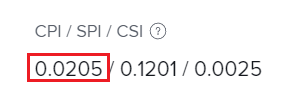

# Calculate Cost Performance Index (CPI)

 <!-- Audited: 5/2025 -->

<!--
<p data-mc-conditions="QuicksilverOrClassic.Draft mode">(NOTE: Linked to the product. Do not change link.)</p>
-->

The Cost Performance Index (CPI) describes the relationship at the project or task level between the planned cost and actual cost. Project Managers review this metric to identify tasks or projects currently tracking under or over cost at a given point. Cost can be measured in hours or dollars, depending on your Performance Index Method (PIM). For more information about setting the Performance Index Method, see [Set the Performance Index Method (PIM)](../../../manage-work/projects/project-finances/set-pim.md).

Only organizations that require time entry can use CPI. Furthermore, cost-based PIM values are accurate only in organizations that have defined cost rates for task assignees (job roles or users).

## Access requirements

+++ Expand to view access requirements for the functionality in this article.

You must have the following access to perform the steps in this article:

<table style="table-layout:auto"> 
 <col> 
 <col> 
 <tbody> 
  <tr> 
   <td role="rowheader">Adobe Workfront plan</td> 
   <td>Any</td> 
  </tr> 
  <tr> 
   <td role="rowheader">Adobe Workfront license</td> 
   <td>
   <p>New: Light or higher</p>
   <p>or</p>
   <p>Current: Review or higher</p></td>  
  </tr> 
  <tr> 
   <td role="rowheader">Access level configurations</td> 
   <td>View access to Projects and Financial Data</td> 
  </tr> 
  <tr> 
   <td role="rowheader">Object permissions</td> 
   <td>View or higher permissions to the project with permissions to View Finance</td> 
  </tr> 
 </tbody> 
</table>

For more detail about the information in this table, see [Access requirements in Workfront documentation](/help/quicksilver/administration-and-setup/add-users/access-levels-and-object-permissions/access-level-requirements-in-documentation.md).

+++

## Overview of the Cost Performance Index (CPI)

* [The CPI value](#the-cpi-value) 
* [How CPI is calculated](#how-cpi-is-calculated)

### The CPI value {#the-cpi-value}

Project managers understand that a CPI value of 1 means the project is exactly on budget. Values greater than 1 indicate a project is under budget (fewer hours or expenses have been recorded than originally planned), and values less than 1 mean a project is over budget (more hours or expenses have been recorded than originally planned). The further from 1, the greater deviation from the plan.

| **CPI Value** |**Indication on Budget** |
|---|---|
| 1 |On plan or budget |
| > 1 (greater than 1) |Under budget |
| < 1 (less than 1) |Over budget |


### How CPI is calculated {#how-cpi-is-calculated}

In Adobe Workfront, the calculation for CPI depends on the Performance Index Method selected for the project. For more information about setting the Performance Index Method, see [Set the Performance Index Method (PIM)](../../../manage-work/projects/project-finances/set-pim.md).

* [CPI calculations when using Hour-based PIM](#cpi-calculations-when-using-hour-based-pim) 
* [CPI Calculations when using Cost-based PIM](#cpi-calculations-when-using-cost-based-pim)

#### CPI calculations when using Hour-based PIM {#cpi-calculations-when-using-hour-based-pim}

If 

```
Actual Hours > 0 THEN CPI = Total Budgeted Cost Work Performed / Actual Hours
```

Otherwise 

```
CPI = 1
```

* **For a non-parent task:**

  ```
  Total Budgeted Cost Work Performed = Planned Hours * (Percent Complete / 100)
  ```

* **For a parent task:** 
  Total Budgeted Cost Work Performed = the sum of the Total Budgeted Cost Work Performed field for all direct child tasks.

* **For a project:** 
  Total Budgeted Cost Work Performed = the sum of the Total Budgeted Cost Work Performed field for all top level tasks (parents and standalone tasks).

For information about the total Budgeted Cost Work Performed (BCWP), see [Calculate Budgeted Cost Work Performed (BCWP)](../../../manage-work/projects/project-finances/calculate-bcwp.md).

#### CPI Calculations when using Cost-based PIM {#cpi-calculations-when-using-cost-based-pim}

<!--
<p data-mc-conditions="QuicksilverOrClassic.Draft mode"><code>CPI = (Planned Cost of Work Performed + Planned Cost of Incurred Expenses) / (Total Actual Cost + Actual Cost of Incurred Expenses) </code> </p>
-->

<!--
<p data-mc-conditions="QuicksilverOrClassic.Draft mode"><code>NOTE: this used to be here before - above - but Anna sent me the one below. I kept the other one, although she is still researching its validity - see this issue: https://hub.workfront.com/issue/5fc7b1cf00012aeebf9e822db8ea2513/overview)</code> </p>
-->

If 

```
Actual Labor Cost + Incurred Actual Expense Cost <> 0 THEN CPI = (Total Budgeted Cost Work Performed + Incurred Planned Expense Cost) / (Actual Labor Cost + Incurred Actual Expense Cost)
```


Otherwise 

```
CPI = 1
```

<!--
<p data-mc-conditions="QuicksilverOrClassic.Draft mode"><code>(NOTE: above: this used to say: CPI = CPI Labor, but Anna had me fix it on July 21, 2021)</code> </p>
-->

The fields in this calculation are described below:

  ```
  Total Actual Cost = Actual (logged) Hours * Hourly Rate of assignees
  ```

  ```
  Incurred Actual Expense Cost = Actual Cost
  ```

  Incurred Expense is the expense on which Actual Cost > 0

  ```
  Planned Cost of Incurred Expenses = Total of Planned Cost of all incurred expenses
  ```

  

  <!--
  <p data-mc-conditions="QuicksilverOrClassic.Draft mode">(NOTE: Old calculation - taken out by Lilit and replaced below: Planned Cost of Work Performed= (planned labor cost) * (percent complete) / 100 where planned labor cost is the planned hours allocated to assignees * their rates.)</p>
  -->

* Planned Cost of Work Performed is calculated by the following formula:

  ```
  Planned Cost of Work Performed = Planned cost * Percent Complete / 100
  ```

The Total Budgeted Cost Work Performed is calculated for the following:

* **For a non-parent task:**

  ```
  Total Budgeted Cost Work Performed = Planned Labor Cost * Percent Complete / 100
  ```

* **For a parent task:**

  ```
  Total Budgeted Cost Work Performed = SUM(Total Budgeted Cost Work Performed field from all direct child tasks)
  ```

* **For a project:**

  ```
  Total Budgeted Cost Work Performed = SUM(Total Budgeted Cost Work Performed field for all top level tasks)
  ```

  

## Locate CPI in a project or task

You can display the CPI of a project or a task in a project or task list or report. In addition, you can view it at the project or task level.

1. Go to the project or task where you want to view the CPI.
1. Expand **Project Details** or **Task Details** in the left panel, depending on whether you are viewing CPI for a project or task.

1. Click **Finance**. The CPI displays in the **CPI/ SPI/ CSI** field.

   
