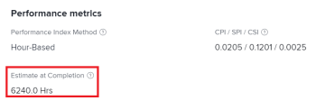

# Calculate Estimate At Completion (EAC)

<!--
<p data-mc-conditions="QuicksilverOrClassic.Draft mode">(NOTE: Linked to the product. Do not change link!) </p>
-->

As a performance metric, the Estimate at Completion (EAC) represents the projected total cost of your project or task when it completes.

As a setting, it allows you to define how the EAC value should be calculated.&nbsp;

## Access requirements

+++ Expand to view access requirements for the functionality in this article.

You must have the following access to perform the steps in this article:

<table style="table-layout:auto"> 
 <col> 
 <col> 
 <tbody> 
  <tr> 
   <td role="rowheader">Adobe Workfront plan</td> 
   <td>Any</td> 
  </tr> 
  <tr> 
   <td role="rowheader">Adobe Workfront license</td> 
   <td>
   <p>New: Light or higher</p>
   <p>or</p>
   <p>Current: Review or higher</p></td>  
  </tr> 
  <tr> 
   <td role="rowheader">Access level configurations</td> 
   <td>View access to Projects and Financial Data</td> 
  </tr> 
  <tr> 
   <td role="rowheader">Object permissions</td> 
   <td>View or higher permissions to the project with permissions to View Finance</td> 
  </tr> 
 </tbody> 
</table>

For more detail about the information in this table, see [Access requirements in Workfront documentation](/help/quicksilver/administration-and-setup/add-users/access-levels-and-object-permissions/access-level-requirements-in-documentation.md).

+++

## Define how to calculate EAC

As part of project system preferences, the Adobe Workfront administrator can define how&nbsp;to calculate the EAC. EAC can be calculated in one of the following two ways:

* [Calculate at the project level](#calculate-at-the-project-level) 
* [Roll up from tasks and subtasks](#roll-up-from-tasks-and-subtasks)

For more information about setting up project preferences in Workfront, including how to calculate the Estimate at Completion, see [Configure system-wide project preferences](../../../administration-and-setup/set-up-workfront/configure-system-defaults/set-project-preferences.md).

As a project manager, you can also change this preference at the project level, in the Finance sub-tab of the project. For more information about editing the Finance sub-tab of a project, see [Manage information in the project Finance area](../../../manage-work/projects/project-finances/manage-project-finance-area.md).

### Calculate at the project level {#calculate-at-the-project-level}

EAC for the parent task and project are determined by entering the actual hours/actual labor cost into the EAC Formulas. This calculation includes Actual Hours/ costs and expenses added directly to the parent task or project.

### Roll up from tasks and subtasks {#roll-up-from-tasks-and-subtasks}

EAC for the parent task and project are determined by summing up the EAC for each child task. This calculation excludes Actual Hours/ costs and expenses added directly to the parent task or project.

## How to calculate EAC based on the Performance Index Method (PIM)

In Workfront, the calculation for EAC depends on the selected&nbsp;Performance Index Method (PIM)&nbsp;of the project. For more information about setting the PIM for your system or for your project, see [Set the Performance Index Method (PIM)](../../../manage-work/projects/project-finances/set-pim.md).

* [Calculate EAC using Hour-based PIM](#calculate-eac-using-hour-based-pim) 
* [Calculate EAC using Cost-based PIM](#calculate-eac-using-cost-based-pim)

### Calculate EAC using Hour-based PIM {#calculate-eac-using-hour-based-pim}

```
EAC = Total Planned Hours / CPI*
```

&#42;If Cost Performance Index [Calculate Cost Performance Index (CPI)](../../../manage-work/projects/project-finances/calculate-cpi.md)&nbsp;= 0, EAC = Total Planned Hours + Actual Hours. This occurs when hours have been captured, but project/task is at 0% complete.

For more information about calculating CPI, see [Calculate Cost Performance Index (CPI)](../../../manage-work/projects/project-finances/calculate-cpi.md).

### Calculate EAC using Cost-based PIM {#calculate-eac-using-cost-based-pim}

The EAC of a project is calculated using the following formula:

```
EAC = EAC Labor + EAC Expense 
```

<pre>EAC Labor = &nbsp;<em>IF</em> CPI Labor <> 0 THEN EAC Labor = Planned Labor Cost / CPI Labor</pre><pre><em>ELSE</em> EAC &nbsp;Labor = Planned Labor Cost + Actual Labor Cost</pre><pre>CPI Labor = IF Actual Labor Cost <> 0 THEN CPI Labor = TotalBudgetedCostWorkPerformed / Actual Labor Cost</pre><pre>ELSE CPI Labor = 1&nbsp;</pre>The following fields are taken into account when calculating the EAC:

* Total Budgeted Cost Work Performed (BCWP) =&nbsp;The result of multiplying the budgeted cost of the work planned (budgeted cost) and the percent of the task that has been completed so far.

  For information about the total Budgeted Cost Work Performed (BCWP), see [Calculate Budgeted Cost Work Performed (BCWP)](../../../manage-work/projects/project-finances/calculate-bcwp.md).

   * **For a non-parent task:**

     ```   
     Total Budgeted Cost Work Performed = Planned Hours * (Percent Complete/100)
     ```

   * **For a parent task:** 
     Total Budgeted Cost Work Performed = the sum of the Total Budgeted Cost Work Performed field for all direct child tasks.
   
   * **For a project:** 
     Total Budgeted Cost Work Performed = the sum of the Total Budgeted Cost Work Performed field for all top level tasks (parents and standalone tasks).&nbsp;

* EAC&nbsp;Expense = the result of adding the Incurred Actual Expense Cost to the Not Incurred Planned Expense Cost. It is calculated by the following formula:

  ```
  EAC Expense = Incurred Actual Expense Cost + Not Incurred Planned Expense
  ```

   * Incurred Actual Expense Cost =&nbsp;The sum of the Planned Amount field for all expenses where the Actual Amount field > 0. For example, if you create an expense for Task 1 and enter $500.00 in the Planned Amount field and an amount > 0 in the Actual Amount field (i.e. $600.00), the Incurred Planned Expense Cost for this task is $500.00.
   * Not Incurred Planned Expense =&nbsp;The sum of the Planned Amount field for all expenses where the Actual Amount field = 0. For example, if you create two expenses for Task 1 where for the first expense the value in the Planned Amount field is $500.00 and the value in the Actual Amount is $600.00 and for the second expense, the value in the Planned Amount field is $300.00 and the value of the Actual Amount field is $0.00, the value of the Not Incurred Planned Expense for this task is $300.00.&nbsp;

## Locate the EAC in a project or a task

1. Go to the project or task where you want to view the EAC.
1. Expand **Project Details** or **Tasks Details** in the left panel of the project or task, depending on where you view the EAC.  

1. Click **Finance**.&nbsp;

   The EAC value displays in the **Estimate at Completion** field.

   
