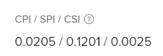

# Calculate Schedule Performance Index (SPI)

<!--
<p data-mc-conditions="QuicksilverOrClassic.Draft mode">(NOTE: Linked to the product. Do not change link.)</p>
-->

The Schedule Performance Index (SPI) describes the relationship between the planned schedule and actual schedule. Adobe Workfront calculates SPI at the project and task levels. Project managers review this metric to identify whether tasks or projects are currently tracking ahead of or behind schedule.

## Access requirements

+++ Expand to view access requirements for the functionality in this article.

You must have the following access to perform the steps in this article:

<table style="table-layout:auto"> 
 <col> 
 <col> 
 <tbody> 
  <tr> 
   <td role="rowheader">Adobe Workfront plan</td> 
   <td>Any</td> 
  </tr> 
  <tr> 
   <td role="rowheader">Adobe Workfront license</td> 
   <td>
   <p>New: Light or higher</p>
   <p>or</p>
   <p>Current: Review or higher</p></td>  
  </tr> 
  <tr> 
   <td role="rowheader">Access level configurations</td> 
   <td>View access to Projects and Financial Data</td> 
  </tr> 
  <tr> 
   <td role="rowheader">Object permissions</td> 
   <td>View or higher permissions to the project with permissions to View Finance</td> 
  </tr> 
 </tbody> 
</table>

For more detail about the information in this table, see [Access requirements in Workfront documentation](/help/quicksilver/administration-and-setup/add-users/access-levels-and-object-permissions/access-level-requirements-in-documentation.md).

+++

## Schedule Performance Index (SPI) overview

* [What the SPI value shows](#what-the-spi-value-shows) 
* [How Workfront calculates SPI](#how-workfront-calculates-spi)

### What the SPI&nbsp;value shows {#what-the-spi-value-shows}

Project managers understand that a SPI&nbsp;value of 1 means the project is on plan or on schedule. &nbsp;Values greater than 1 indicate a project is ahead of schedule, and values less than 1 mean a project is behind schedule. &nbsp;The further from 1, the greater deviation from the plan.

| **SPI Value** |**Indication of "On Schedule"** |
|---|---|
| 1 |On plan or on schedule |
| > 1 (greater than 1) |Ahead of schedule |
| < 1 (less than 1) |Behind schedule |

{style="table-layout:auto"}

### How Workfront calculates SPI  {#how-workfront-calculates-spi}

Workfront calculates SPI by the following formula:

```
SPI = (Total Planned Hours x % Complete) / Planned Hours Scheduled to Date*
```

*&#42;If Planned Hours Scheduled to Date = 0, SPI = 1*.

Planned Hours Schedule to Date are calculated at the minute when you perform&nbsp;the calculations. It shows the number of Planned Hours planned to the current date.&nbsp;It can be recalculated automatically when you change your finance data to be accurate. There is no&nbsp;field in Workfront that indicates&nbsp;this value.

For example, if you have a project with 1 task and the task has 10 planned hours and a 10-day Duration, the Planned Hours Schedule to Date on the 5th day are&nbsp;5.&nbsp;

## Locate SPI in a project or task

1. Go to the project or task where you want to view SPI.
1. Depending on whether you want to view SPI on a project or a task, do one of the following:

   1. Click **Project Details** in the left panel, then view the **Finance** area.
   
   1. Click **Task Details** in the left panel, then view the **Finance** area.

      

1. Find the **CPI/ SPI/ CSI** field.
