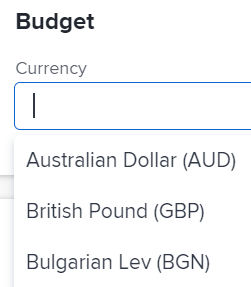

# Change the project currency

As a Project Manager, you can configure a project to use a currency other than the default currency for your Adobe Workfront system. This allows you to display financial information on your project in the desired currency when calculating labor costs and revenue.

Before you can use alternate currencies as described in this section, the Workfront administrator must first enable and configure multiple currencies, as described in the article [Set up exchange rates](../../../administration-and-setup/manage-workfront/exchange-rates/set-up-exchange-rates.md).

## Access requirements

You must have the following access to perform the steps in this article:

<table style="table-layout:auto"> 
 <col> 
 <col> 
 <tbody> 
  <tr> 
   <td role="rowheader">Adobe Workfront plan*</td> 
   <td> 
Any
 </td> 
  </tr> 
  <tr> 
   <td role="rowheader">Adobe Workfront license*</td> 
   <td> 
Plan 
 </td> 
  </tr> 
  <tr> 
   <td role="rowheader">Access level configurations*</td> 
   <td> 
Edit access to Projects
 
Note: If you still don't have access, ask your Workfront administrator if they set additional restrictions in your access level. For information on how a Workfront administrator can modify your access level, see <a href="../../../administration-and-setup/add-users/configure-and-grant-access/create-modify-access-levels.md" class="MCXref xref">Create or modify custom access levels</a>.
 </td> 
  </tr> 
  <tr> 
   <td role="rowheader">Object permissions</td> 
   <td> 
Manage permissions to a project
 
For information on requesting additional access, see <a href="../../../workfront-basics/grant-and-request-access-to-objects/request-access.md" class="MCXref xref">Request access to objects </a>.
 </td> 
  </tr> 
 </tbody> 
</table>

&#42;To find out what plan, license type, or access you have, contact your Workfront administrator.

## Considerations when changing a project's currency in Workfront

* You cannot change the currency of a project if there is any financial information in the project.
* Rates are used for Labor Costs; Revenue calculations and are used in the future for reporting purposes.
* If you do not specify a different currency for a project, Workfront assumes that the project's currency is the default currency of the system. For information on system-level default currency, see [Set up exchange rates](../../../administration-and-setup/manage-workfront/exchange-rates/set-up-exchange-rates.md).
* By default, all full license users have access to view currencies and exchange rates. The Workfront administrator needs to grant additional administrative access for **Exchange rates** to enable users to set specific rates on projects. 
* Exchange rates in Workfront are not dynamic. The value is set by an administrator and must be updated when changes in exchange rates occur. 
* When you create a report to reflect currency on a project, by default all reports are grouped by the project's default currency. If you create a report with multiple project's that have different exchange rates, then any groupings applied to the project reflect the default exchange rate at the system level. For more information, see the article [Create financial data reports with unique exchange rates](../../../reports-and-dashboards/reports/creating-and-managing-reports/create-financial-data-reports-unique-exchange-rates.md).

## Configure the currency for a project

1. Go to the project where you want to change the default currency.

   >[!TIP]
   >
   >Ensure that the project does not already have any financial information. For example, ensure there are no Planned or Actual Costs associated with the project.

1. Click **Project Details** in the left panel, then go to the **Finance** area. 
1. Click **Add** in the **Currency** field and select the currency that you want to use as the default currency for the project. All the currencies that your Workfront administrator set for your Workfront instance display.

   

1. (Conditional) If you select a currency other than the default currency that is set for your Workfront system, specify the rate for the currency that you selected, as it relates to the currency that is set as the base currency in the system.
1. Click **Save Changes**.

