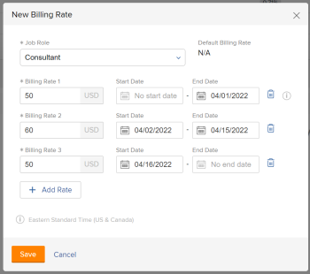

# Overview of overriding Job Role Billing Rates and calculating Revenue on a project

{{highlighted-preview}}

You can use billing rates to calculate revenue on your projects when you multiply them by the hours spent on the project. For more information about billing rates and revenue, see the article [Overview of Billing and Revenue](../../../manage-work/projects/project-finances/billing-and-revenue-overview.md).

<!--
<div data-mc-conditions="QuicksilverOrClassic.Draft mode">
<p>(NOTE: drafted because the only procedure here was moved to a different article.&nbsp;This stays as an overview)</p>
<h2>Access requirements</h2>
<p>You must have the following access to perform the steps in this article:</p>
<table style="table-layout:auto">
<col>
<col>
<tbody>
<tr>
<td role="rowheader">Adobe Workfront plan*</td>
<td> <p>Any</p> </td>
</tr>
<tr>
<td role="rowheader">Adobe Workfront license*</td>
<td> <p>Plan </p> </td>
</tr>
<tr>
<td role="rowheader">Access level configurations*</td>
<td> <p>Edit access to Projects and Financial&nbsp;Data</p> <note type="note">
If you still don't have access, ask your Workfront administrator if they set additional restrictions in your access level. For information on how a Workfront administrator can modify your access level, see
<a href="../../../administration-and-setup/add-users/configure-and-grant-access/create-modify-access-levels.md" class="MCXref xref">Create or modify custom access levels</a>.
</note> </td>
</tr>
<tr>
<td role="rowheader">Object permissions</td>
<td> <p>Manage permissions to the project with permissions to Manage Finance</p> <p>For information on requesting additional access, see <a href="../../../workfront-basics/grant-and-request-access-to-objects/request-access.md" class="MCXref xref">Request access to objects </a>.</p> </td>
</tr>
</tbody>
</table>
<p>*To find out what plan, license type, or access you have, contact your Workfront administrator.</p>
</div>
-->

## Overview of Job Role Billing Rates and Role Hourly Revenue Types

As an Adobe Workfront administrator, you can associate billing rates with both users and job roles.  
For more information about creating users and associating them with billing rates, see the article [Add users](../../../administration-and-setup/add-users/create-and-manage-users/add-users.md). For more information about creating job roles and associating them with billing rates, see the article [Create and manage job roles](../../../administration-and-setup/set-up-workfront/organizational-setup/create-manage-job-roles.md).

Billing rates associated with users cannot be overridden.

Billing rates associated with job roles can be overridden at the company or project level.

To calculate revenue on projects based on the billing rates of job roles, the **Revenue Type** of the tasks on the projects must be one of the following:

* Role Hourly
* Role Hourly w/Cap
* Role Hourly plus Fixed

For more information about **Revenue Type** and billing rates, see [Overview of Billing and Revenue](../../../manage-work/projects/project-finances/billing-and-revenue-overview.md).

## Hierarchy of Billing Rate overrides when calculating Revenue

A job role can have a billing rate associated with it in the following ways:

* As a Workfront administrator, you can define the system-level billing rate associated with a job role when you are creating that job role.  
  For more information about creating job roles, see [Create and manage job roles](../../../administration-and-setup/set-up-workfront/organizational-setup/create-manage-job-roles.md).

* As a Workfront administrator, you can define the company-level billing rate for the same job role when you create a company.  
  When Workfront calculates revenue for the projects associated with this company, the company billing rate is used when the role is assigned to tasks, instead of the system-level billing rate for this job role.  
  Job role rates changed at the company level will impact all projects associated with that company.

  >[!NOTE]
  >
  >If you need to update the Company billing rate, the rate on the project will not update automatically. You must remove the Company from the project, update the rate for the Company, then re-attach the Company to the project, before the new Company rate takes effect on the project. For instructions on attaching a Company to a project, see [Edit projects](../../../manage-work/projects/manage-projects/edit-projects.md).

  For more information about creating job role billing rates specific to a company, see [Create and edit companies](../../../administration-and-setup/set-up-workfront/organizational-setup/create-and-edit-companies.md). 

* As a Workfront administrator, you can enable an option when editing a project to apply changes to company-level billing rates to the project when users manually recalculate project finances.  
  For more information, see [Override Project-Level Billing Rates with Company-Level Billing Rates](../../../manage-work/projects/project-finances/override-project-level-with-company-level-billing-rates.md).

<div class="preview">

* As a Workfront administrator, you can define rate cards with multiple billing rates per role, based on location and date. When a rate card is attached to a project, all of the roles (by location, if locations are used) and their associated billing rates are added to the project's billing rates section. Attaching a rate card overrides any existing billing rates on the project.
  
  For more information, see [Manage rate cards](/help/quicksilver/administration-and-setup/set-up-workfront/configure-system-defaults/manage-rate-cards.md) and [Attach a rate card to a project](/help/quicksilver/manage-work/projects/project-finances/attach-rate-card-to-project.md).

</div>

* As a project manager, you can define the billing rate for the same job role at the project level.  
  Job role rates changed on the project will only impact that project.

  For information about overriding role rates for the project, see [Override Job Role Billing Rates at the project level](../../../manage-work/projects/project-finances/override-job-role-billing-rates-at-the-project-level.md).

>[!IMPORTANT]
>
>If a job role is associated with a billing rate at the system level, the Company level, and the project level, Workfront calculates the revenue of the tasks using the billing rate of the job role at the project level, when it uses the job role rates. The revenue from all the tasks rolls up to the revenue of the project.

## Override Job Role Billing Rates at the project level

As a project manager, you can specify what the billing rate is for a job role on a specific project. This project-level billing rate overrides the billing rate at the system level for this job role. Workfront uses the project-level billing rate of the job role to calculate revenue, instead of using the system-level billing rate.

<span class="preview">You can also attach a rate card to the project, which will import the job role billing rates from the rate card into the project.</span>

For information about how to override the Job Role Billing Rates at the project level, see [Override Job Role Billing Rates at the project level](../../../manage-work/projects/project-finances/override-job-role-billing-rates-at-the-project-level.md).

For more information about which job role is used to calculate revenue on the project, see the "Revenue calculations for tasks based on User and Role assignments" section in [Overview of Billing and Revenue](../../../manage-work/projects/project-finances/billing-and-revenue-overview.md). <span class="preview">For information about attaching a rate card to a project, see [Attach a rate card to a project](/help/quicksilver/manage-work/projects/project-finances/attach-rate-card-to-project.md).</span>

>[!NOTE]
>
>In the case of Actual Revenue, the billing rates applied to hours that are added to a Billing Record which is marked as Billed, should not be affected by billing rate overrides that occur after the Billing Record has been billed.

<!--
<div data-mc-conditions="QuicksilverOrClassic.Draft mode">
<p>(NOTE: drafted and linked above to the stand-alone article for overriding billing rates on projects.)</p>
<p>You can override the billing rate of a job role on a project in the following ways:</p>
<ul>
<li>One time, by selecting a new rate for the job role.<br>The new rate is used for the entire duration of the project, to calculate revenue. </li>
</ul>
<ul>
<li>Several times, by selecting several new rates for specific date ranges. <br>A different rate can be used during each specified date range.</li>
</ul>
<p>To override a billing rate for a project:</p>
<ol>
<li value="1">Go to the project you want to override billing rates for.</li>
<li value="2"> <p data-mc-conditions="QuicksilverOrClassic.Quicksilver">Click <strong>Billing Rates</strong> in the left panel. You might have to first click <strong>Show More</strong>. </p> </li>
<li value="3"> <p>Click <strong>Add Billing Rate</strong> > <strong>New Billing Rate</strong>.</p> <p>The New Billing Rate box opens</p> <p>  </p> <p> <br>The <strong>Default Billing Rate</strong> field displays the system-level rate for this job role.</p> </li>
<li value="4">In the <strong>Job Role</strong> field, select the job role you want to change the billing rate for.<br></li>
<li value="5">In the <strong>Billing Rates 1</strong> field, enter the one time billing rate override, then click <strong>Save</strong> to override the billing rate one time, <br>Or Click <strong>Add Rate</strong> to add more billing rate overrides.</li>
<li value="6">(Conditional) If you are adding more than one billing rate override, specify the following information:<br>- <strong>Billing Rates 1</strong>: the value of the Billing Rate from the beginning of the project to the first date of the first override. This is typically the same amount as the <strong>Default Rate</strong>.<br>- <strong>Start Date</strong>: this is the date when the Default Rate ends.<br>- <strong>End Date</strong>: the date when the new billing rate override ends. <br>Workfront applies the override job role rate to the hours that occur during the time frames specified when calculating revenue on the project.<br>There should be no gaps between the time frames of two override rates. The <strong>Start Date</strong> of an override rate should be the day immediately following the <strong>End Date</strong> of the previous override date.<br><note type="note">
You cannot specify a
<strong>Start Date</strong> for the first override rate, nor an
<strong>End Date</strong> for the last override rate. We recommend that you use the Default Rate for the first override rate.
<br>Workfront assumes that the first override rate is applied for all hours with a date older than the
<strong>End Date</strong> of the first override, and that the last override rate is applied for all hours with a date newer than the
<strong>Start Date</strong> of the last override.
<br>If an hour is logged before the Planned Start Date of the project the very first billing rate is used.
<br>If an hour is logged after the Planned Completion Date of the project the very last billing rate is used.
</note><br></li>
<li value="7">Click <strong>Save</strong>.</li>
</ol>
</div>
-->

## Overview of the Billing Rates section of a project

After you have specified the override billing rates for the job roles associated with the project, you can see all the job roles and their overrides in the **Billing Rates** tab of the project.

Notice the following information in the list of **Billing Rates**:

* [Job Role Grouping](#job-role-grouping) 
* [Project Billing Rate value](#project-billing-rate-value) 
* [Default Billing Rate value](#default-billing-rate-value) 
* [Company Billing Rate value](#company-billing-rate-value) 
* [Multiple Billing Rate values and timeframes](#multiple-billing-rate-values-and-timeframes)

### Job Role Grouping {#job-role-grouping}

Billing rates are grouped in the **Billing Rates** area by their respective job roles. <span class="preview">If a rate card is attached to the project, then the job roles are also grouped by rate card. If locations are applied to job roles, then the location name is included as part of the job role name. You could have the same job role listed for multiple locations.</span>

### Project Billing Rate value {#project-billing-rate-value}

In the grouping line corresponding to a job role, notice the billing rate for that job role at the project level in the **Project Billing Rate** column. If the job role has multiple override rates, the override rate corresponding to the current date is displayed in the grouping line in the **Project Billing Rate** column.

### Default Billing Rate value {#default-billing-rate-value}

In the grouping line of a job role, notice the billing rate for that job role at the system level in the **Default Billing Rate** column.

>[!NOTE]
>
>If there are project billing rates for a job role, the **Default Billing Rate** is never applied to calculating Revenue for the project. Only the **Project Billing Rates** are applied to calculate Revenue.

### Company Billing Rate value {#company-billing-rate-value}

In the grouping line of a job role, notice the billing rate for that job role at the company level in the **Company Billing Rate** column. This means that there is a company associated with this project, and this job role has a different billing rate for that company. The billing rate for the company displays, even if it is the same as the project rate.

>[!NOTE]
>
><span class="preview">When a rate card is attached to the project, the **Company Billing Rates** are not imported in the billing rates. The calculations are based on either rate card rates or company rates for the job roles.</span>
>
>If there are project billing rates for a job role, the **Company Billing Rate** is never applied to calculating revenue for the project. Only the **Project Billing Rates** are applied to calculate revenue.

### Multiple Billing Rate values and timeframes {#multiple-billing-rate-values-and-timeframes}

If you have multiple override billing rates for a specific job role, they are listed under the grouping for that job role. Using inline editing, you can change the override rates and the **Start** **Date** and **End Date** of the override billing rates on this tab.

>[!NOTE]
>
>You cannot specify a **Start Date** for the first override rate, and you cannot specify an **End Date** for the last override rate. Workfront assumes that the first override rate is applied for all hours with a date older than the **End Date** of the first override, and that the last override rate is applied for all hours with a date newer than the **Start Date** of the last override.  
>If an hour is logged before the Planned Start Date of the project the first billing rate is used.  
>If an hour is logged after the Planned Completion Date of the project the last billing rate is used.

## Calculate Planned Revenue

* [Calculate Planned Revenue based on a one-time Billing Rate override](#calculate-planned-revenue-based-on-a-one-time-billing-rate-override) 
* [Calculate Planned Revenue based on multiple Billing Rate overrides](#calculate-planned-revenue-based-on-multiple-billing-rate-overrides) 
* [Distribution of Planned Hours across the Duration of a task](#distribution-of-planned-hours-across-the-duration-of-a-task)

### Calculate Planned Revenue based on a one-time Billing Rate override {#calculate-planned-revenue-based-on-a-one-time-billing-rate-override}

Consider the following when calculating Planned Revenue based on a one-time Billing rate override:

* When the **Revenue Type** of a task is **Role Hourly**, Workfront multiplies the Planned Hours of a task by the billing rate of the job role associated with the task to calculate Planned Revenue on the task. 

* When the billing rate of the job role has been overridden at the project level, Workfront uses the override rate from the project to calculate Planned Revenue. 
* When a task has multiple assignments, the Planned Revenue is calculated by multiplying the billing rate of each assignment's job role and their respective Planned Hour allocation.

>[!NOTE]
>
>The Planned Hours per assignment is not the same as the Planned Hours for the task, in the case of multiple assignments.

For more information about which job role is used to calculate Planned Revenue, see the "Understanding Revenue Calculations for Tasks Based on User and Role Assignments" section in the article [Overview of Billing and Revenue](../../../manage-work/projects/project-finances/billing-and-revenue-overview.md).

### Calculate Planned Revenue based on multiple Billing Rate overrides {#calculate-planned-revenue-based-on-multiple-billing-rate-overrides}

Consider the following when calculating Planned Revenue based on multiple Billing Rate overrides:

* When the **Revenue Type** of a task is **Role Hourly**, Workfront multiplies the Planned Hours of a task by the billing rate of the job role associated with the task to calculate Planned Revenue on the task.

  For more information about which job role is used to calculate Planned Revenue, see the "Understanding Revenue Calculations for Tasks Based on User and Role Assignments" section in the article [Overview of Billing and Revenue](../../../manage-work/projects/project-finances/billing-and-revenue-overview.md).

* In case of multiple billing rate overrides, the rate by which the Planned Hours are multiplied changes during the duration of a task. By default, Workfront distributes the Planned Hours evenly across the duration of a task, allocating an equal number of hours for each day of the task. When calculating **Planned Revenue** for a task, Workfront multiplies the Planned Hour per Day by the billing rate of that day. In case of multiple billing rates, that rate could be different every day.

  For example, you have a task with a Role Hourly **Revenue Type**. The task has a duration of 5 days, and a Planned Hours value of 40 hours. The Planned Hours per Day is 8 hours. Assign a Project Manager job role to the task, and override the billing rate of this job role for the last 3 days of the task, so you will have a Rate 1 billing rate for the first two days, and Rate 2 billing rate for the remaining 3 days of the task for this job role.

  The formula which calculates the **Planned Revenue** of this task is:

  ```
  Planned Revenue = (Rate 1) * (Planned Hours for Day 1) + (Rate 1) * (Planned hours for Day 2) + (Rate 2) * (Planned hours for Day 3) + (Rate 2) * (Planned hours for Day 4) + (Rate 2) * (Planned hours for Day 5)
  ```

For more information about finding the Planned Hours per Day amount in Workfront, see the section [Distribution of Planned Hours across the Duration of a task](#distribution-of-planned-hours-across-the-duration-of-a-task) in this article.

>[!NOTE]
>
>If you have multiple assignees on the task, the amount of Planned Hours is first distributed to each assignee, and then to each day during the duration of the task. In this case, the Planned Revenue will calculate taking into account the amount of daily hours for each assignee and the billing rate of each job role which could change during the duration of the task, in case of multiple billing rates.

### Distribution of Planned Hours across the Duration of a task {#distribution-of-planned-hours-across-the-duration-of-a-task}

Consider the following when understanding the distribution of Planned Hours across the Duration of a task:

* By default, Workfront distributes the Planned Hours evenly across the Duration of a task, allocating an equal number of Planned Hours for each day of the task, based on the availability of the project schedule.

  For more information about understanding the distribution of Planned Hours across the Duration of a task, see the "Understanding the Distribution of Planned Hours Across the Duration of a Task" section in the article [Planned Hours overview](../../../manage-work/tasks/task-information/planned-hours.md).

  >[!NOTE]
  >
  >The Planned Hours per Day is the allocation of Planned Hours for each day during the Duration of the task. If the task has one assignment, then this number represents the Planned Hours per Day per assignment, as well. If the task has multiple assignments, the Planned Hours per Day per assignment is different than the Planned Hours per Day for the task. There is no visual representation in Workfront for the Planned Hours per Day per assignment, for tasks with multiple assignments.
  >
  >
  >The Planned Hours per Day are multiplied by the billing rate for the job role assigned to the task for that day to calculate the Planned Revenue per Day for that task. A sum of all daily Planned Revenues calculated this way equals to the Planned Revenue for that task.

## Calculate Actual Revenue

* [Calculate Actual Revenue based on a one-time Billing Rate override](#calculate-actual-revenue-based-on-a-one-time-billing-rate-override) 
* [Calculate Actual Revenue based on multiple Billing Rate overrides](#calculate-actual-revenue-based-on-multiple-billing-rate-overrides)

### Calculate Actual Revenue based on a one-time Billing Rate override {#calculate-actual-revenue-based-on-a-one-time-billing-rate-override}

Consider the following when calculating Actual Revenue based on a one-time Billing Rate override:

* When the **Revenue Type** of a task is **Role Hourly**, Workfront multiplies the **Actual Hours** of a task by the billing rate of the job role associated with the task to calculate **Actual Revenue** on the task. Actual Hours are hours logged directly to the task.

  For more information about which job role is used to calculate **Actual Revenue**, see the "Understanding Revenue Calculations for Tasks Based on User and Role Assignments" section in the article [Overview of Billing and Revenue](../../../manage-work/projects/project-finances/billing-and-revenue-overview.md).

* If the billing rate of the job role has been overridden at the project level, Workfront uses the override rate from the project to calculate Actual Revenue. When you override the billing rate of the job role on the project, the **Actual Revenue** of the project is recalculated automatically using the new adjusted rate.

  For information about overriding role rates for the project, see [Override Job Role Billing Rates at the project level](../../../manage-work/projects/project-finances/override-job-role-billing-rates-at-the-project-level.md).

>[!NOTE]
>
>If you want to keep the hours that you have already logged on the project before you overrode the original billing rate billed at the original rate, you must include them into a **Billing Record**, and you must mark the **Billing Record** as **Billed**. Otherwise, the **Actual Revenue** from the hours logged before the billing rate was overridden for the project will recalculate using the new rate when the finances of the projects are recalculated.   
>For more information about including hours in a billing record and marking it as **Billed**, see the article [Create billing records](../../../manage-work/projects/project-finances/create-billing-records.md).

### Calculate Actual Revenue based on multiple Billing Rate overrides {#calculate-actual-revenue-based-on-multiple-billing-rate-overrides}

Consider the following when calculating Actual Revenue based on multiple Billing Rate overrides:

* When the **Revenue Type** of a task is **Role Hourly**, Workfront multiplies the **Actual Hours** on the task with the billing rate of the job roles assigned to the task to calculate **Actual Revenue** on the task. Actual Hours are hours logged directly to the task. 

* In case of multiple billing rate overrides, the rate by which the **Actual Hours** are multiplied to calculate the **Actual Revenue** might change during the duration of a task. Workfront uses the billing rate of the job role whose time frame matches the **Entry Date** of the hours logged for the task to calculate **Actual Revenue.**

  For example, a task has the **Revenue Type** of **Role Hourly** and is assigned to the job role of Project Manager. Override the billing rate of this job role with Rate 1 for the dates between June 19 and June 25. Starting June 26, override the billing rate with Rate 2. Log 2 hours for June 20, and 3 hours for June 28.

  Workfront calculates the **Actual Revenue** for this task using the following formula:

  ```
  Actual Revenue = 2 * Rate 1 + 3 * Rate 2
  ```

  For more information about which job role is used to calculate **Actual Revenue**, see the "Understanding Revenue Calculations for Tasks Based on User and Role Assignments" section in the article [Overview of Billing and Revenue](../../../manage-work/projects/project-finances/billing-and-revenue-overview.md).

## The impact of Time Zones when calculating Revenue based on multiple Billing Rates

Users can see different Planned Hours per Day from other users, if time zone differences occur between them and other entities in Workfront. The following scenarios could skew the Planned Hours per Day information for a user from what another user sees:

* The two users might have their computers set for two different time zones
* The two user profiles in Workfront might be set to two different time zones
* The time zone associated with the user profile might be different than the system Time Zone in Workfront
* The time zone associated with the user profile might be different than the Time Zone of the schedule of the project.

In these cases, the number of Planned Hours per Day might be different between two users who do not share the same settings for time zones. They will also see different Planned Revenue numbers when using multiple billing rate overrides on a project.

* [Calculate Planned Revenue for users in different Time Zones](#calculate-planned-revenue-for-users-in-different-time-zones) 
* [Calculate Actual Revenue for users in different Time Zones](#calculate-actual-revenue-for-users-in-different-time-zones)

### Calculate Planned Revenue for users in different Time Zones {#calculate-planned-revenue-for-users-in-different-time-zones}

>[!NOTE]
>
>If you have users in different time zones working on the same projects, we recommend that you do not change the billing rate overrides for your projects during the week. Doing so can display an erroneous amount of Planned Revenue for your project, as a result of hour differences between the time zones in the schedule of the users and the Workfront system time zone . Most schedules allow for weekends to be excluded from the Planned Hours calculations. If a change happens in the billing rate override of a job role, it is better for it to occur during a weekend than in the middle of a week when it could coincide with the middle of the Duration of a task.

Consider the following when calculating Planned Revenue for users in different Time Zones:

* For tasks that have a **Revenue Type** of **Role Hourly** and are assigned to job roles, **Planned Revenue** is calculated by multiplying the **Planned Hours** of a task by the billing rate of the job role. 

* The **Planned Hours** are evenly distributed across the **Duration** of the task. 

* The **Duration** is the period of time between the **Planned Start** **Date** and the **Planned Completion Date** of the task. Because the**Planned Start Date** and **Planned Completion Date** of the tasks can differ depending on the time zones of the users viewing the task, the amount of Planned Hours per Day might be different for two users in two different time zones. 

* The amount of Planned Hours per Day does not change the Planned Revenue of a project if the billing rate of the job role is not changed, or when there is only one billing rate override. In this case, even if two users from two different timezones see different Planned Hours per Day, the overall Planned Revenue of the project is identical between the two users.

  However, in the case of multiple billing rate overrides, the overall **Planned Revenue** of the project might seem different for two users in two different timezones, because it relies on the amount of Planned Hours per Day (which could be different for the two users) and the billing rate override (which could be different for the same day, when each user is looking at the task in their own time zone). 

* The accurate **Planned Revenue** amount is the one seen by the user who has the same time zone as the Time Zone of your Workfront instance. Your Workfront administrator defines the Workfront Time Zone in the System Customer Info area.  
  For more information about defining the Time Zone for your system, see the article [Configure basic information for your system](../../../administration-and-setup/get-started-wf-administration/configure-basic-info.md).

### Calculate Actual Revenue for users in different Time Zones {#calculate-actual-revenue-for-users-in-different-time-zones}

Consider the following when calculating Actual Revenue for users in different Time Zones:

* When the **Revenue Type** of a task is **Role Hourly**, Workfront multiplies the **Actual Hours** on the task with the billing rate of the job roles assigned to the task to calculate the **Actual Revenue**. Actual Hours are hours logged directly to the task. 

* In case of multiple billing rate overrides, Workfront uses the billing rate of the job role whose time frame matches the **Entry Date** of the hours logged for the task to calculate **Actual Revenue**.

* Because there is no timestamp on the **Entry Date** of logged hours and there is no time stamp on the date ranges of multiple billing rate overrides, **Actual Revenue** calculations are not affected by the Time Zone associated with users.

For more information about which job role is used to calculate **Actual Revenue**, see the "Understanding Revenue Calculations for Tasks Based on User and Role Assignments" section in the article [Overview of Billing and Revenue](../../../manage-work/projects/project-finances/billing-and-revenue-overview.md).

## Recalculate Project Finances

Finances are calculated on a project as changes occur in the hours logged for the project.

If rates are changed during the life of a project, you can recalculate costs and revenues on the project manually, by using the Recalculate Finance option on a project. In addition, some actions trigger an automatic recalculation.

For more information about recalculating project finances, see the article [Recalculate project finances](../../../manage-work/projects/project-finances/recalculate-project-finances.md).

## Add a new Billing Rate using the API

To add a new billing rate for a job role using the API, you perform a *setRatesForRole* action for the **Rate** object using the *PUT method*. 
The action and the date fields on the **Rate** object are available in the API version 8.0. 
If you already have several billing rates defined for a job role on a project and you want to add a new billing rate for it with a new date range, you must include both the existing rate and the rate to be added in the same API call. This is similar to how you update collections on objects. 

The following API call is an example where **attachableID** is the **Project ID** of the project where you are adding the rate and **RoleID** is the **Job Role ID** for which you are adding the new billing rate.<pre>{</pre><pre>"attachableID":"593f01500000557d75fdd4fdfcc624f2",</pre><pre>"attachableObjCode":"PROJ",</pre><pre>"roleID":"544820df000014148cda5136d4b79d09", </pre><pre>"rates":[</pre><pre>         {"rateValue":"0.00","startDate":null,"endDate":"2017-06-11"},</pre><pre>         {"rateValue":"45.00","startDate":"2017-06-12","endDate":"2017-06-17"},</pre><pre>         {"rateValue":"95.00","startDate":"2017-06-21","endDate":null}</pre><pre>]</pre><pre>}</pre>For more information about using the Workfront API, see the article [API Basics](https://experience.workfront.com/s/article/API-Basics-638808549).
