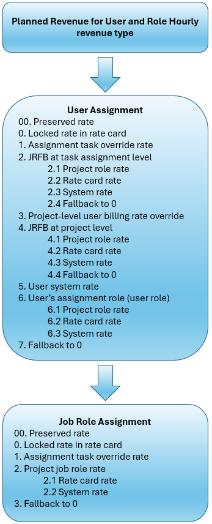
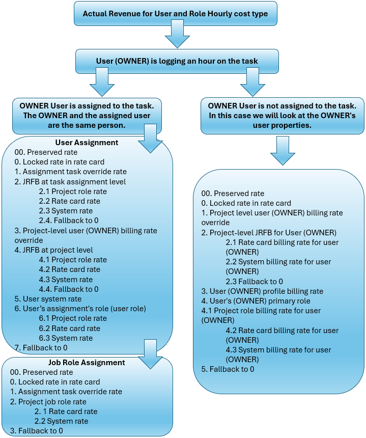
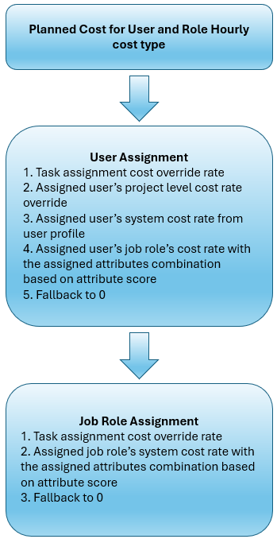
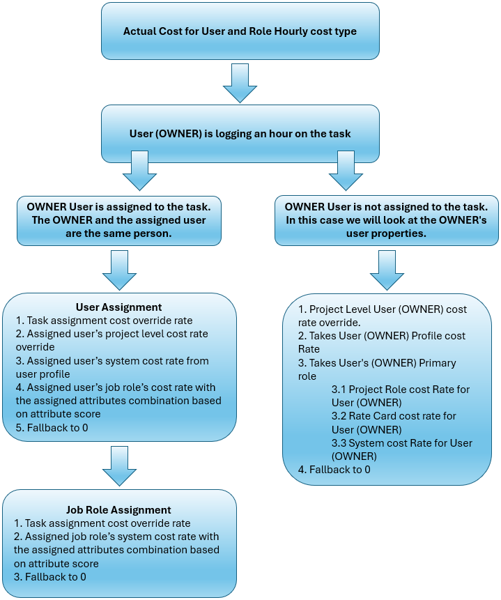

# Overview of revenue and cost hierarchy

{{highlighted-preview-article-level}}

{{ultimate-package}}

To provide precise financial calculations, Workfront uses the appropriate billing rates when calculating the revenue of a task or project. Job role and user rates must be well-defined at all levels to achieve accurate financial calculations.

The sections in this article outline the step-by-step process for determining the appropriate billing and cost rates for job roles and users for the User and Role Hourly revenue type and cost type.

For more information on billing rates, and revenue types and how revenue is calculated, see [Overview of Billing and Revenue](/help/quicksilver/manage-work/projects/project-finances/billing-and-revenue-overview.md).

## Overview of effective dates

Workfront administrators can optionally set effective dates that determine when billing rates, cost rates, and other financial attributes take effect in the system. For example, a job role or user might have a default billing rate of $50. With effective dates applied, that $50 rate could be set to expire on March 31, and a new rate of $55 would automatically begin on April 1.

For planned revenue calculations, the billing rates are based on the date for the planned hours. The planned hours are distributed evenly over the task duration. Using the previous example, hours planned for March 31 or earlier use the $50 rate, and hours planned for April 1 or later use the $55 rate.

For actual revenue calculations, the billing rates are based on the date for the logged hours. Using the previous example, hours logged on March 31 or earlier use the $50 rate, and hours logged on April 1 or later use the $55 rate.

>[!NOTE]
>
>Task assignments are not defined with effective dates. Instead, assignments pull the applicable rates from the system, whether from a rate card, user profile, or assignment-level override. Effective dates ensure that the correct rate is applied based on the timing of the work, but they do not directly define the assignments.

## Overview of job role for billing

A **job role for billing** is set for a user at the assignment level or the project level. It applies only to users and cannot be used on other job roles. For example, a user's primary job role is Designer, but on one task or project they are acting as a Senior Designer and the rate should reflect that.

An assignment-level job role for billing is only for that specific assignment and is not automatically applied to the user's other assignments. A project-level job role for billing applies to all of the user's assignments on that project. You can override it at the individual assignment level if needed.

When a job role for billing is applied at either the user assignment or the project level, the rate attached to the job role for billing may be used instead of the user or job role rates in revenue calculations. The job role for billing is only available when the User and Role Hourly revenue type is used.

>[!NOTE]
>
>While a user may act with a different role for billing purposes, cost calculations continue to use their primary job role. The job role for billing only impacts billing calculations.

For more information, see Set up a job role for billing.

## Overview of preserved rates

The **Preserve project billing rates information** flag on a project controls whether the system uses the billing information for assignments at the time when the rate card is finalized, or allows modifications based on changes during the course of the project. Any changes to the user's job role, salary, rate card, or other billing-related information will not affect the billing rates for assignments. The rates are preserved according to the final rate card a the time the project flag was activated. These assignment properties (such as job role and salary) are still updated, ensuring that the true cost of the assignment is accurate.

When the flag is turned on, the system locks the date-effective billing rates (set on the finalized rate card attached to the project) for the duration of the project.

The flag can be activated on a project when work has started and assignments and hours already exist. At that time:

* The final approved rate card rate becomes the source of billing rates for all project assignments.
* All past, current, and future assignments are recalculated using the final approved rates. 
* Actual and planned values are recalculated.

>[!NOTE]
>
>Once the flag is turned on to preserve the billing rates, it cannot be turned off unless the project has no assignments and no hours. This ensures that all financial reporting reflects the true contractual rates.
>When the flag is off, the system allows the billing rates to be recalculated or adjusted dynamically. Any updates to the user's role, salary, or billing rate are immediately reflected in the billing rate for the assignment.

For more information, see [Edit projects](/help/quicksilver/manage-work/projects/manage-projects/edit-projects.md).

## Planned revenue – User and Role Hourly

When the revenue type on the task is User and Role Hourly, Workfront uses both user and job role rate hierarchies to determine the billing rate for planned revenue.

This image shows the flow of the planned revenue hierarchy:

When a user is assigned to the task, Workfront searches according to this hierarchy:

1. The system first looks for a preserved rate on the assignment for the user.

   A preserved rate still follows the hierarchy, but the rate is frozen when the project is preserved. For more information, see [Overview of preserved rates](#overview-of-preserved-rates).

1. Next, the system looks for the billing rate on a rate card, for the primary job role or the job role for billing of the user assigned to the task. If a rate exists and it is locked, then that rate is used in the revenue calculation.

   If a rate exists on the rate card and it is unlocked, then the system does not use that rate and searches for the next rate in the hierarchy.

1. Next, the system looks for the assignment-level override rate for the user. This is a manually added rate tied to the specific assignment and overrides all other rates for the user on this assignment (except a rate card locked rate). If a rate is found, that rate is used in the revenue calculation.
1. Next, the system looks for a job role for billing at the task assignment level.

   The job role for billing is only for a specific assignment and applies to the assignment instead of the user's primary job role rate. For example, a user's primary job role is Designer, but on one task they are acting as a Senior Designer with a higher billing rate.

   Workfront looks for the job role for billing rate:

   * The system first looks for the billing rate of the job role for billing from the assignment (Senior Designer in the example), taking effective dates into account. You will see this on the Rates > Billing area of the project, in a **Rate Source: Overrides > Resource Type: Job Role** grouping. This is an override rate on the project.
   * Next, the system looks for the job role for billing rate from a rate card, taking effective dates into account. You will see this on the Rates > Billing area of the project, in a **Rate Source: Attached Rate Card > Resource Type: Job Role** grouping.
   * If the rate for the job role for billing is not on the project or on the rate card, the system looks for the system-level job role rate (Senior Designer in the example), taking effective dates into account.
   * If a job role for billing is assigned, and none of the rates from the previous steps are found, the billing rate is 0.

     >[!NOTE]
     >
     >When a job role for billing is assigned, but the billing rate is 0, this is an indicator to revisit the rate setup. A rate of 0 means that no rates for that job role (Senior Designer in the example) were set up in Workfront. You should either add rates for the job role, or delete the job role for billing from the assignment.
     >
     >Because tasks inherit job role rates from the project when those rates are available at the project level, any rates from a search for the job role for billing on the project would already have been located when Workfront searched on the job role for billing at the task assignment level. The project-level search for a job role for billing still remains in the search hierarchy.

1. If a job role for billing was not available at the task assignment level, the system then looks for the billing rate on the project, for the specific user assigned to the task, taking effective dates into account. You will see this on the Rates > Billing area of the project, in a **Rate Source: Overrides > Resource Type: User** grouping. This is an override rate on the project.
1. Next, the system looks for the system-level billing rate on the user's profile, taking effective dates into account.
1. Next, the system looks for the billing rate of the user's primary job role (Designer in the example).

   * The system first looks for the billing rate on the project, for the user's primary job role, taking effective dates into account. You will see this on the Rates > Billing area of the project, in a **Rate Source: Overrides > Resource Type: Job Role** grouping. This is an override rate on the project.
   * Next, the system looks for the job role rate from a rate card, taking effective dates into account. You will see this on the Rates > Billing area of the project, in a **Rate Source: Attached Rate Card > Resource Type: Job Role** grouping.
   * Next, the system looks for the system-level job role rate, taking effective dates into account.

1. If none of these rates are found, the billing rate is 0.

When a user is not assigned to the task, Workfront searches the job role rates according to this hierarchy:

1. The system first looks for a preserved rate on the assignment for the job role.
1. The system looks for the billing rate on a rate card, for the job role assigned to the task. If a rate exists and it is locked, then that rate is used in the revenue calculation.

   If a rate exists on the rate card and it is unlocked, then the system does not use that rate and searches for the next rate in the hierarchy.

1. Next, the system looks for the assignment task override rate for the job role. This is a manually added rate for the job role on the specific assignment and overrides all other rates for the job role on this task. If a rate is found, that rate is used in the revenue calculation.
1. Next, the system looks for the billing rate for the job role assigned to the task.

   * The system first looks for the billing rate on the project for the job role, taking effective dates into account. You will see this on the Rates > Billing area of the project, in a **Rate Source: Overrides > Resource Type: Job Role** grouping. This is an override rate on the project.
   * Next, the system looks for the job role rate from a rate card, taking effective dates into account. You will see this on the Rates > Billing area of the project, in a **Rate Source: Attached Rate Card > Resource Type: Job Role** grouping.
   * Next, the system looks for the system-level job role rate, taking effective dates into account.

1. If none of these rates are found, the billing rate is 0.

## Actual revenue – User and Role Hourly

When the revenue type on the task is User and Role Hourly, Workfront uses two hierarchies to determine the billing rate for actual revenue. The billing rate is based on the user logging hours on a task.

The "user" in the hierarchies is the person assigned to the task. The "owner" is the person whose time is logged against the task, even if they are not assigned to the task. For example, Michael is assigned to a task but Joanna completes the work because Michael was sick. The manager can log the time against the task and set the owner of the logged hours to Joanna. The Planned revenue values are based on Michael's assignment and rate in the hierarchy, but the Actual revenue values are based on Joanna's rate.

This image shows the flow of the actual revenue hierarchy:

### When the owner of the logged hours and the assigned user on the task are the same

Workfront searches first for a billing rate by the user assignment. If a user is not assigned to the task, then it searches for a billing rate by the job role assignment.

The hierarchy for this scenario is the same as the planned revenue hierarchy. See [Planned revenue – User and Role Hourly](#planned-revenue--user-and-role-hourly) for this workflow.

### When the owner of the logged hours is not the assigned user on the task

Workfront searches in the user properties of the owner according to this hierarchy:

1. The system first looks for a preserved rate on the assignment for the owner.
1. Next, the system looks for the billing rate on a rate card, for the primary job role of the owner. If a rate exists and it is locked, then that rate is used in the revenue calculation.

   If a rate exists on the rate card and it is unlocked, then the system does not use that rate and searches for the next rate in the hierarchy.

1. Next, the system looks for a job role for billing at the task assignment level.

   The job role for billing is only for a specific assignment and applies to the assignment instead of the owner's primary job role rate. For example, the owner's primary job role is Designer, but on one task they are acting as a Senior Designer with a higher billing rate.

   Workfront looks for the job role for billing rate:

     * The system first looks for the billing rate of the job role for billing from the assignment (Senior Designer in the example), taking effective dates into account. You will see this on the Rates > Billing area of the project, in a **Rate Source: Overrides > Resource Type: Job Role** grouping. This is an override rate on the project.
     * Next, the system looks for the job role for billing rate from a rate card, taking effective dates into account. You will see this on the Rates > Billing area of the project, in a **Rate Source: Attached Rate Card > Resource Type: Job Role** grouping.
     * If the rate for the job role for billing is not on the project or on the rate card, the system looks for the system-level job role rate (Senior Designer in the example), taking effective dates into account.
     * If a job role for billing is assigned, and none of the rates from the previous steps are found, the billing rate is 0.

        >[!NOTE]
        >
        >When a job role for billing is assigned, but the billing rate is 0, this is an indicator to revisit the rate setup. A rate of 0 means that no rates for that job role (Senior Designer in the example) were set up in Workfront. You should either add rates for the job role, or delete the job role for billing from the assignment.
        >
        >Because tasks inherit job role rates from the project when those rates are available at the project level, any rates from a search for the job role for billing on the project would already have been located when Workfront searched on the job role for billing at the task assignment level. The project-level search for a job role for billing still remains in the search hierarchy.

1. Next, the system looks for the billing rate on the project, for the owner, taking effective dates into account. You will see this on the Rates > Billing area of the project, in a Rate Source: Overrides > Resource Type: User grouping. This is an override rate on the project.
1. Next, the system looks for the system-level billing rate on the owner's user profile, taking effective dates into account.
1. Next, the system looks for the billing rate of the owner's primary job role (Designer in the example).

   * The system first looks for the billing rate on the project, for the owner's primary job role, taking effective dates into account. You will see this on the Rates > Billing area of the project, in a **Rate Source: Overrides > Resource Type: Job Role** grouping. This is an override rate on the project.
   * Next, the system looks for the job role rate from a rate card, taking effective dates into account. You will see this on the Rates > Billing area of the project, in a **Rate Source: Attached Rate Card > Resource Type: Job Role** grouping.
   * Next, the system looks for the system-level job role rate, taking effective dates into account.

1. If none of these rates are found, the billing rate is 0.

## Planned cost – User and Role Hourly

When the cost type on the task is User and Role Hourly, Workfront uses both user and job role rate hierarchies to determine the rate for planned cost.

This image shows the flow of the planned cost hierarchy:

When a user is assigned to the task, Workfront searches according to this hierarchy:

1. The system looks for the assignment task override rate for the user. This is a manually added rate for the user on the specific assignment and overrides all other rates for the user on this task. If a rate is found, that rate is used in the cost calculation.
1. Next, the system looks for the cost rate on the project, for the specific user assigned to the task, taking effective dates into account. You will see this on the Rates > Cost area of the project, in a **Rate Source: Overrides > Resource Type: User** grouping. This is an override rate on the project.
1. Next, the system looks for the system-level cost rate on the user's profile, taking effective dates into account.
1. Next, the system looks for the cost rate of the user's primary job role with the assigned attributes combination, based on the attribute score.
1. If none of these rates are found, the cost rate is 0.

When a user is not assigned to the task, Workfront searches the job role cost rates according to this hierarchy:

1. The system looks for the assignment task override rate for the job role. This is a manually added rate for the job role on the specific assignment and overrides all other rates for the job role on this task. If a rate is found, that rate is used in the cost calculation.
1. Next, the system looks for the system-level job role cost rate with the assigned attributes combination, based on the attribute score, taking effective dates into account.
1. If none of these rates are found, the cost rate is 0.

## Actual cost – User and Role Hourly

When the cost type on the task is User and Role Hourly, Workfront uses two hierarchies to determine the billing rate for actual cost. The billing rate is based on the user logging hours on a task.

The "user" in the hierarchies is the person assigned to the task. The "owner" is the person whose time is logged against the task, even if they are not assigned to the task. For example, Michael is assigned to a task but Joanna completes the work because Michael was sick. The manager can log the time against the task and set the owner of the logged hours to Joanna. The Planned revenue values are based on Michael's assignment and rate in the hierarchy, but the Actual revenue values are based on Joanna's rate.

This image shows the flow of the actual cost hierarchy:

### When the owner of the logged hours and the assigned user on the task are the same

Workfront searches first for a cost rate by the user assignment. If a user is not assigned to the task, then it searches for a cost rate by the job role assignment.

The hierarchy for this scenario is the same as the planned cost hierarchy. See [Planned cost – User and Role Hourly](#planned-cost--user-and-role-hourly) for this workflow.

### When the owner of the logged hours is not the assigned user on the task

Workfront searches in the user properties of the owner according to this hierarchy:

1. The system looks for the cost rate on the project, for the owner, taking effective dates into account. You will see this on the Rates > Cost area of the project, in a **Rate Source: Overrides > Resource Type: User** grouping. This is an override rate on the project.
1. Next, the system looks for the system-level cost rate on the owner's user profile, taking effective dates into account.
1. Next, the system looks for the cost rate of the owner's primary job role (Designer in the example).

   * The system first looks for the cost rate on the project, for the owner's primary job role, taking effective dates into account. You will see this on the Rates > Cost area of the project, in a **Rate Source: Overrides > Resource Type: Job Role** grouping. This is an override rate on the project.
   * Next, the system looks for the job role rate from a rate card, taking effective dates into account. You will see this on the Rates > Cost area of the project, in a **Rate Source: Attached Rate Card > Resource Type: Job Role** grouping.
   * Next, the system looks for the system-level job role rate, taking effective dates into account.

1. If none of these rates are found, the billing rate is 0.

