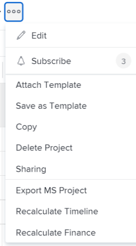

# Recalculate project finances

Finances are calculated on a project as changes occur in the hours logged for the project or in the rates used to calculate costs and revenue.

## Access requirements

You must have the following access to perform the steps in this article:

<table style="table-layout:auto"> 
 <col> 
 <col> 
 <tbody> 
  <tr> 
   <td role="rowheader">Adobe Workfront plan*</td> 
   <td> 
Any
 </td> 
  </tr> 
  <tr> 
   <td role="rowheader">Adobe Workfront license*</td> 
   <td> 
Plan 
 </td> 
  </tr> 
  <tr> 
   <td role="rowheader">Access level configurations*</td> 
   <td> 
Edit access to Projects and Financial Data
 
Note: If you still don't have access, ask your Workfront administrator if they set additional restrictions in your access level. For information on how a Workfront administrator can modify your access level, see <a href="../../../administration-and-setup/add-users/configure-and-grant-access/create-modify-access-levels.md" class="MCXref xref">Create or modify custom access levels</a>.
 </td> 
  </tr> 
  <tr> 
   <td role="rowheader">Object permissions</td> 
   <td> 
Manage permissions to the project with permissions to Manage Finance
 
For information on requesting additional access, see <a href="../../../workfront-basics/grant-and-request-access-to-objects/request-access.md" class="MCXref xref">Request access to objects </a>.
 </td> 
  </tr> 
 </tbody> 
</table>

&#42;To find out what plan, license type, or access you have, contact your Workfront administrator.

## Considerations about calculating finances in Adobe Workfront

Finances are calculated in Enhanced analytics in the following ways:

* You can manually recalculate costs and revenues on a project, by using the Recalculate Finance option on a project. 
* In addition, some actions trigger an automatic recalculation.

When the rate of a user or a role changes during the life of a project, the following can occur:

* When the change is made, the updated rate is used from that point on as hours are logged and the financial information is calculated. Changing the rate does not affect how things were calculated before the change was made. For all the existing hours logged, the old rate is used to calculate financial information. 
* You can force Adobe Workfront to use the new rate retroactively for all the hours logged so far, by using the Recalculate Finance option. This forces Workfront to retroactively recalculate all previously entered hours, planned costs, and revenues in accordance with the new rate information.

>[!CAUTION]
>
>Prior to manually recalculating finances for a given project, you may want to preserve any financial data that has already been calculated at a previous rate. We recommend using the Recalculate Finance option only when you are sure that you are not making changes to existing information, or only when such changes are desired.
>
>Note that running a Project (Finance Data) report performs a recalculation of your financial data, and as such you should make the same considerations before running the report.

## Preserve financial data for tasks with existing hours {#preserve-financial-data-for-tasks-with-existing-hours}

When financial data for a project is recalculated, Workfront retroactively recalculates all previously logged hours, planned, actual costs, and planned and actual revenue, in accordance with any new or updated financial information.

* [Preserve Project Revenue](#preserve-project-revenue) 
* [Preserve Project Cost](#preserve-project-cost)

### Preserve Project Revenue  {#preserve-project-revenue}

Revenue rates can change during the lifetime of a project.

For more information about billing rates and revenue, see the article [Overview of Billing and Revenue](../../../manage-work/projects/project-finances/billing-and-revenue-overview.md).

Revenue rates can change at the following levels:

* The system level (for job roles)  
  For more information about creating job roles with billing rates at the system level, see the article [Create and manage job roles](../../../administration-and-setup/set-up-workfront/organizational-setup/create-manage-job-roles.md).

* The user level  
  For more information about changing the billing rate information on users, see the article [Edit a user's profile](../../../administration-and-setup/add-users/create-and-manage-users/edit-a-users-profile.md).

* The Company level (for job roles)  
  For more information, see [Override job role billing rates at the company level](../../../administration-and-setup/set-up-workfront/organizational-setup/override-job-role-billing-rates-company-level.md).

* The Project level (for job roles)  
  For more information about overriding job role rates at the project level, see the article [Overview of overriding Job Role Billing Rates and calculating Revenue on a project](../../../manage-work/projects/project-finances/override-role-billing-rates-and-calculate-project-revenue.md).

For example, a user's billing rate changes during the course of a project from $50 to $75 an hour and you want all existing data to remain calculated at the old rate ($50 and hour). However, when the project finances are recalculated, tasks that already have existing financial data will have the revenue updated to reflect the new billing rate (of $75 an hour).

* [Preserve Project Revenue by creating a Billing Record](#preserve-project-revenue-by-creating-a-billing-record) 
* [Preserve Project Revenue by using multiple Billing Rate overrides](#preserve-project-revenue-by-using-multiple-billing-rate-overrides)

#### Preserve Project Revenue by creating a Billing Record {#preserve-project-revenue-by-creating-a-billing-record}

When billing rates change at any level mentioned above, you can preserve existing revenue which has already been calculated on the project by avoiding to use the manual Recalculate Finance option or by locking the time recorded on the project and calculated using the old rate into a billing record with a status of Billed.

When you do not recalculate finances on the project or when you lock the hours logged into a billed billing record, the hours logged after the rate changes will calculate with the new rate, and the hours logged before the cost rate changes remain calculated at the old rate.

For more information about creating billing records, see the article [Create billing records](../../../manage-work/projects/project-finances/create-billing-records.md).

#### Preserve Project Revenue by using multiple Billing Rate overrides {#preserve-project-revenue-by-using-multiple-billing-rate-overrides}

When billing rates change for job roles at the project level, you can preserve existing revenue which has already been calculated on the project by using multiple billing rates overrides which are locked within a specified time frame.

For more information about using multiple billing rates overrides, see the article [Overview of overriding Job Role Billing Rates and calculating Revenue on a project](../../../manage-work/projects/project-finances/override-role-billing-rates-and-calculate-project-revenue.md).

>[!NOTE]
>
>This only applies to job role billing rates that are changed at the project level.

### Preserve Project Cost {#preserve-project-cost}

Cost rates can change at the following levels:

* System level (for job roles)  
  For more information about creating job roles with cost rates at the system level, see the article [Create and manage job roles](../../../administration-and-setup/set-up-workfront/organizational-setup/create-manage-job-roles.md).  

* User level  
  For more information about changing the cost rate information on users, see the article [Edit a user's profile](../../../administration-and-setup/add-users/create-and-manage-users/edit-a-users-profile.md).

When billing rates change at any level mentioned above, you can preserve existing costs which have already been calculated on the project by locking the time recorded on the project and calculated using the old rate into a billing record with a status of Billed. For more information about creating billing records, see the article [Create billing records](../../../manage-work/projects/project-finances/create-billing-records.md).

You can also avoid using the manual Recalculate Finance option, if you don't want to create a billing record, as described in the section [Manually recalculate finances for a project](#manually-recalculate-finances-for-a-project) in this article.

When you do not recalculate finances on the project or when you lock the hours logged into a billed billing record, the hours logged after the rate changes will calculate with the new rate, and the hours logged before the cost rate changes remain calculated at the old rate.

## Manually recalculate finances for a project {#manually-recalculate-finances-for-a-project}

If your rates change during the life of a project and you want your cost and revenue calculations to reflect the new rates, you must manually recalculate the finances on the project.

>[!NOTE]
>
>You can prevent revenue values from updating to reflect the new rates when you manually recalculate finance by following the steps in the section [Preserve financial data for tasks with existing hours](#preserve-financial-data-for-tasks-with-existing-hours) of this article. Cost values are always updated to reflect the new rates when you manually recalculate the finances on a project.

You can recalculate the finances of projects in Workfront from the project page or from a project list or report.

You can recalculate the finances while editing them in bulk. For information, see the [Manually recalculate finances in bulk](#manually-recalculate-finances-in-bulk) section in this article.

1. Go to the project where you want to recalculate finances and click the **More** icon  to the right of the project name.

   

   Or

   Go to a project list or report and select one or several projects, then click the **More** icon  at the top of the list.

   

   >[!TIP]
   >
   >Depending on the complexity of your projects, we recommend not to select a large number of projects when recalculating their finances in bulk to ensure optimum performance. Some things that could make a project too complex might be multiple dependencies or assignments or a large number of custom fields.

1. Click **Recalculate Finance**.

   All planned costs and revenue on the project are recalculated with any new information.
  
   You should receive a confirmation at the top of the browser that the finances of the project have been recalculated successfully.
   Existing cost values and some revenue values which have not been locked update to reflect the new rates.

## Manually recalculate finances in bulk{#manually-recalculate-finances-in-bulk}

You can manually recalculate the finances of several projects by editing them in bulk. This causes the revenue on the projects to recalculate retroactively.

>[!IMPORTANT]
>
>You can prevent revenue values from updating to reflect the new rates when you manually recalculate finance by following the steps in the section [Preserve financial data for tasks with existing hours](#preserve-financial-data-for-tasks-with-existing-hours) of this article. Cost values are always updated to reflect the new rates when you manually recalculate the finances on projects.

To manually recalculate the finances of several projects:

1. Go to a list of projects.
1. Select several projects in the list, then click the **More** icon  at the top of the list.

   

   >[!TIP]
   >
   >Depending on the complexity of your projects, we recommend not to select a large number of projects when editing them in bulk to ensure optimum performance. Some things that could make a project too complex might be multiple dependencies or assignments or a large number of custom fields.

1. Click **Recalculate Finance**.

   All planned costs and revenue on the selected projects are recalculated with any new information.
  
   You should receive a confirmation at the top of the browser that the finances of the projects have been recalculated successfully.

## Actions that trigger an automatic recalculation of finances

The following actions trigger the financial recalculation of projects in Workfront:

* Changing task status
* Moving a task with hours to another project
* Changing the project status from Complete to an active status

>[!NOTE]
>
>When you change the project status, only the planned values are being recalculated.

You can also recalculate finances manually under the **More** menu  at the project level, by clicking **Recalculate Finances**.
