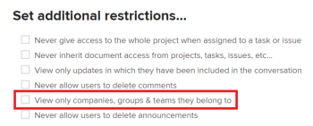

# Projects FAQs

The following are frequently-asked questions about projects.

## Why is Insert Task Above/ Below missing when I right-click on a task in the task list?

### Answer

In order to use the insert options, the task list must be sorted by number. To sort the column by number, click **#** in the column header to the left of **Task Name** to resort the task by number.

## What is the Actual Completion Date?

### Answer

The Actual Completion Date represents the date and time the work is completed. For more information, see [Overview of the project Actual Completion Date](../../../manage-work/projects/planning-a-project/project-actual-completion-date.md).

## Why is the indent/ outdent button missing?

### Answer

To use the indent/ outdent button, ensure the tasks are sorted by the task number and there are no Groupings applied.

## Why can I not change the project status to Complete?

I get the following error message when I try to mark my project complete:

### Answer

You cannot change the status of a project to complete if you have any of the following on your project:

* Incomplete tasks or issues
* Task or issues in pending approval status

## Why can I not change the project status from Complete to Current?

### Answer

If the project has the Completion Mode set to Automatic, once all the tasks and issues are completed, the status of the project automatically turns to Complete and you cannot modify it to any other status. The Completion&nbsp;Mode of the project must be set to Manual to be able to turn a complete project to Current. For information, see [Project status will not change from Complete to Current](../../../manage-work/projects/tips-tricks-and-troubleshooting/project-status-does-not-change-from-complete-to-current.md).

## Why can I not add a Project to a Portfolio, although I have the correct permissions to do so?

Although I have the correct permissions, the Add Projects button is missing on the Projects tab of the Portfolio.

### Answer

This is caused by the Portfolio Status being Inactive. To change the status of the Portfolio:

1. Click on **Portfolio Details > Overview**. 
1. Change the **Status** to **Active.**

1. Click **Save**.  
   The **Add Projects** button should now be visible on the **Projects** tab.

## What access does a Resource Manager receive when added to a project?

### Answer

Resource Managers automatically receive Manage access to projects. Removing the user from the Resource Manager role does not remove their Manage sharing access.

## Why does the project status change when I add a group?

### Answer

The project statuses change because of the default statuses of the Group. When you add a group to a project, it changes the list of statuses to the default statuses set for the group.

For more information, see the article [Create or edit a status](../../../administration-and-setup/customize-workfront/creating-custom-status-and-priority-labels/create-or-edit-a-status.md).

## What is Budget Status?

### Answer

Budget Status will show whether or not the project is currently added to the Capacity planner and if the budget calculation was completed.

The following are Budget Statuses:

* Not Included - The project is not added to the capacity planner.
* Included but Not Calculated - The project is added to the Capacity Planner but is excluded from the budget calculation.
* Included and Calculated - The project is added to the Capacity Planner and included in the budget calculation.

## Why can I not share a project for which I am the Owner and where I have Manage permissions with a Team? I simply cannot find the team in the sharing dialog box of the project.

### Answer

The Adobe Workfront administrator restricted you to viewing only Companies, Groups & Teams that you belong to in your Access Level of the. The team that the you are looking for is not one of the teams that you belong to.

For information about enabling a user to view all teams in the system, see [Create or modify custom access levels](../../../administration-and-setup/add-users/configure-and-grant-access/create-modify-access-levels.md).
