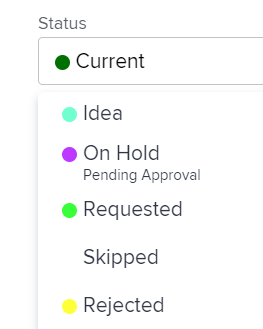

# Apply statuses to work that is associated with a group

<!--
Alina, I moved this out of an admin article about statuses (Create and customize statuses)
-->

If a project is associated with a group, you can apply both system-level statuses as well as a custom status associated with that group to the project, or tasks and issues on that project. For information about group statuses in Adobe Workfront, see [Create or edit a status](../../../administration-and-setup/customize-workfront/creating-custom-status-and-priority-labels/create-or-edit-a-status.md).

>[!TIP]
>
>You can associate only projects with groups. Issues and tasks inherit the group from the project they belong to.

## Access requirements

+++ Expand to view access requirements for the functionality in this article. 

<table style="table-layout:auto"> 
 <col> 
 <col> 
 <tbody> 
  <tr> 
   <td role="rowheader">Adobe Workfront package</td> 
   <td> 
Any
 </td> 
  </tr> 
  <tr> 
   <td role="rowheader">Adobe Workfront license</td> 
   <td> 
Standard

   
Plan
 </td> 
  </tr> 
  <tr> 
   <td role="rowheader">Access level configurations</td> 
   <td> 
Edit access to Projects
 </td> 
  </tr> 
  <tr> 
   <td role="rowheader">Object permissions</td> 
   <td> 
Manage permissions to the project
 </td> 
  </tr> 
 </tbody> 
</table>

For information, see [Access requirements in Workfront documentation](/help/quicksilver/administration-and-setup/add-users/access-levels-and-object-permissions/access-level-requirements-in-documentation.md).

+++

<!--Old:
<table style="table-layout:auto"> 
 <col> 
 <col> 
 <tbody> 
  <tr> 
   <td role="rowheader">Adobe Workfront plan*</td> 
   <td> 
Any
 </td> 
  </tr> 
  <tr> 
   <td role="rowheader">Adobe Workfront license*</td> 
   <td> 
Plan 
 </td> 
  </tr> 
  <tr> 
   <td role="rowheader">Access level configurations*</td> 
   <td> 
Edit access to Projects
 
<b>NOTE</b>
   
   If you still don't have access, ask your Workfront administrator if they set additional restrictions in your access level. For information on how a Workfront administrator can modify your access level, see <a href="../../../administration-and-setup/add-users/configure-and-grant-access/create-modify-access-levels.md" class="MCXref xref">Create or modify custom access levels</a>.
 </td> 
  </tr> 
  <tr> 
   <td role="rowheader">Object permissions</td> 
   <td> 
Manage permissions to the project
 
For information on requesting additional access, see <a href="../../../workfront-basics/grant-and-request-access-to-objects/request-access.md" class="MCXref xref">Request access to objects </a>.
 </td> 
  </tr> 
 </tbody> 
</table>-->

## Update Project Group and Status

When you update the Group for a project, the options available for the Status of tasks, issues, or the project change to match the group.

1. Go to a project, or create a new project, as described in [Create a project](../../../manage-work/projects/create-projects/create-project.md).
1. Click the **More** icon , then click **Edit**.

1. In the **Edit Project** box that displays, near the bottom of the **Overview** section, select the group in the **Group** drop-down menu.

1. In the **Status** drop-down menu, select the custom status.

   >[!NOTE]
   >
   >If you select a different group in the **Group** drop-down menu, the custom statuses in the **Status** menu change automatically to correlate with the new group.
   >
   >
   >   
   >

1. Select the status of the project. The custom statuses you created and applied to that group display in the list.
