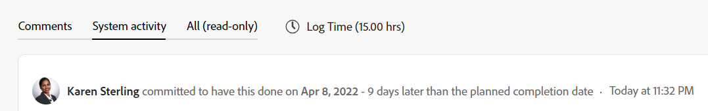

# Commit Date overview

The Commit Date is the date by which a user assigned to task or an issue commits to complete the task or the issue. 

This is different than the Planned Completion Date of a task or issue, as it is a more realistic estimate of the completion date given only by the user in charge of the work. 

For information about the Planned Completion Date, see [Overview of the task Planned Completion Date](../../../manage-work/tasks/task-information/task-planned-completion-date.md).

## Commit Date overview

Consider the following when working with commit dates:

* Only tasks and issues have a Commit Date.
* Commit dates are not automatically set by Adobe Workfront.  
  When you create a task or issue, there is no commit date assigned to the task or issue.
* If you are assigned to a task or issue, you can set the Commit Date by doing one of the following:

   * Let Workfront set the Commit Date to match the existing Planned Completion Date of the task or issue by clicking Work On It, Start Issue, or Start Task on the task or issue. For information about replacing the Work On It button with a Start button, see  [Replace the Work On It button with a Start button](../../../people-teams-and-groups/create-and-manage-teams/work-on-it-button-to-start-button.md).
   * Manually set the Commit Date yourself according to when you believe the task or issue might be completed. This is your estimation and commitment, as the assignee, to the Project Manager that you will have the task or issue completed by a particular date.
    For information, see [Update Commit Dates on tasks and issues](/help/quicksilver/manage-work/projects/updating-work-in-a-project/update-commit-date-on-tasks-and-issues.md). 

>[!NOTE]
>
>You must be the Task Owner of a task to change the Commit Date. The following users cannot change the Commit Date of a task:
>
>* Project Owner
>* Project Sponsor
>* Resource Manager
>* System Administrator
>* Any other assignee on the task
>* Any other user with permissions to the task.
>
>For more information about the Task Owner, see [Edit tasks](../../../manage-work/tasks/manage-tasks/edit-tasks.md).

## Notifications and updates triggered by changing the Commit Date {#notifications-and-updates-triggered-by-changing-the-commit-date}

When a task or issue assignee manually changes a Commit Date to a date that is different than the Planned Completion Date set by the Project Owner, there are a number of notifications and updates that alert the Project Owner and other users of this change.

>[!NOTE]
>
>Changes made to the Commit Date do not automatically change the planned dates, and changes made to the planned dates do not automatically change the Commit Date. 

Manually setting the Commit Date for a task or issue triggers the following changes:

* The Commit Date change populates in the System Activity and the All tabs of the Update section of the task or the issue.
        
  
        
  The change of the Commit Date displays in the Updates area of the task or issue when the Workfront administrator enables this update in the Updates Feeds area in Setup. For information, see [System-tracked updates](../../../administration-and-setup/set-up-workfront/system-tracked-update-feeds/system-tracked-update-feeds.md).

  If a Project Owner does not want to accept the change, we recommend that they comment back to the user proposing a new date using the Comments tab in the Updates section, to ask them to change the Commit Date back to the original Planned Date, or select a new date. If a Project Owner accepts the change, they can manually adjust the Planned Completion Date to match the Commit Date offered by the user assigned to the item by editing the task or the issue. 
  
  You must have access to manage the task or the issue to edit them. 

<!--this is no longer possible: 
>[!NOTE]
>
>If you want to see how the timeline of the project is affected by accepting to change the Planned Completion Date of the task, click **Project Timeline**. This opens the task list where you can evaluate the date changes and the project timeline.
>
>
>  >
>
-->

* The Projected Completion Date of the task or issue is set to the same date because the task now has a more accurate indication of when it is likely to be completed.

  For more information about the Projected Completion Date, see [Overview of the Projected Completion Date for projects, tasks, and issues](../../../manage-work/projects/planning-a-project/project-projected-completion-date.md).

  

* The Project Owner is notified in the Notifications area that a task or issue commit date changed. 

  

  <!--
  
(NOTE: the tip below is actually wrong and the updates feeds should not control this setting, but at this time it does, according to this issue in Hub: https://hub.workfront.com/issue/61e1aa5e0002a186fdd0a73a10db0fc3/updates?email-source=comm

  -->

  >[!TIP]
  >
  >The notification that the Commit Date has changed is sent to the Project Owner only when the Workfront administrator enables displaying the Commit Date in the Updates Feeds area in Setup. For information, see [System-tracked updates](../../../administration-and-setup/set-up-workfront/system-tracked-update-feeds/system-tracked-update-feeds.md).

For information about the additional functionality that is available when updating a work item, see  [Update work](../../../workfront-basics/updating-work-items-and-viewing-updates/update-work.md). 

For information about updating Commit Dates for tasks and issues, see [Update Commit Dates on tasks and issues](../../../manage-work/projects/updating-work-in-a-project/update-commit-date-on-tasks-and-issues.md).

<!--

<h2>Update Commit Dates on tasks and issues</h2>

(NOTE: moved to its own article) 

Updating the Commit Date is identical for tasks and issues.

<ol>
<li value="1"> 
Go to a task or issue that you are assigned to as the <strong>Task Owner</strong>.
 
For more information about finding out who the Task Owner for an issue or task is, see the section <a href="../../../manage-work/tasks/manage-tasks/edit-tasks.md#assignments" class="MCXref xref">Edit tasks</a> in the article <a href="../../../manage-work/tasks/manage-tasks/edit-tasks.md" class="MCXref xref">Edit tasks</a>.
 </li>
<li value="2"> 
Click Work on it in the task or issue header
 
Or
 
Click <strong>Start Task</strong> or <strong>Start Issue</strong> if the Work on it button has been customized in your environment to indicate that you are now working on the work item. 
 
At this time, the Commit Date and the Planned Completion Date of the task or issue are the same.
 </li>
<li value="3"> 
(Optional) If you clicked Start Task or Start Issue, click <strong>Undo</strong> in the lower-left corner of the screen. The Commit Date is removed. 
 
For information about replacing the Work On It button with a Start button, see <a href="../../../people-teams-and-groups/create-and-manage-teams/work-on-it-button-to-start-button.md" class="MCXref xref">Replace the Work On It button with a Start button</a>.
 <note type="tip">
The option to undo your selection to start your work is not available when you click
Work on it.
</note> </li>
<li value="4"> 
 Expand the <strong>This will be done by</strong> date picker, and select a new Commit Date.

Click <strong>Updates</strong> in the left panel, then click the <strong>Start a new update</strong>><strong>Commit Date</strong>

Or

Click <strong>Task Details</strong> or <strong>Issue Details</strong> in the left panel, then double click <strong>Commit Date</strong> and select a new date from calendar. 

The Commit Date and the Planned Completion date are no longer the same.

Instead, the Commit Date and the Projected Completion Date of the task or issue become the same.

The changes are saved automatically.

The Project Owner is notified that you have suggested a new Commit Date for the task or issue and can, at this time, update the Planned Completion Date of the task or issue to match the Commit Date you suggested. For information about the notifications and updates that are triggered by this change, see the section <a href="#notifications-and-updates-triggered-by-changing-the-commit-date" class="MCXref xref">Notifications and updates triggered by changing the Commit Date</a> in this article.

 </li>
</ol>

-->
