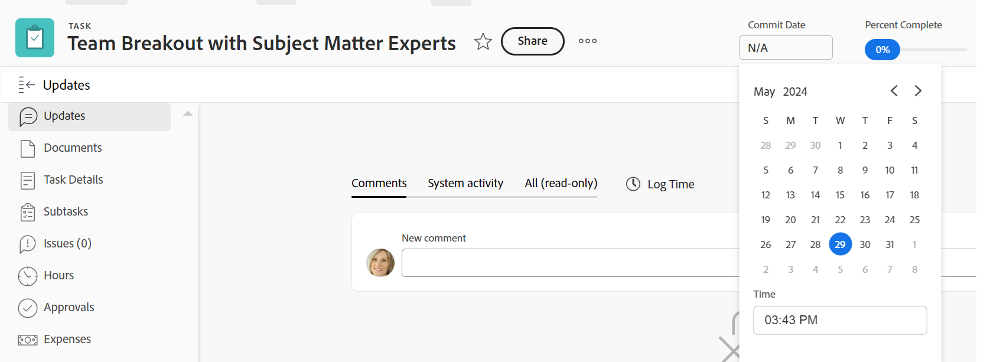
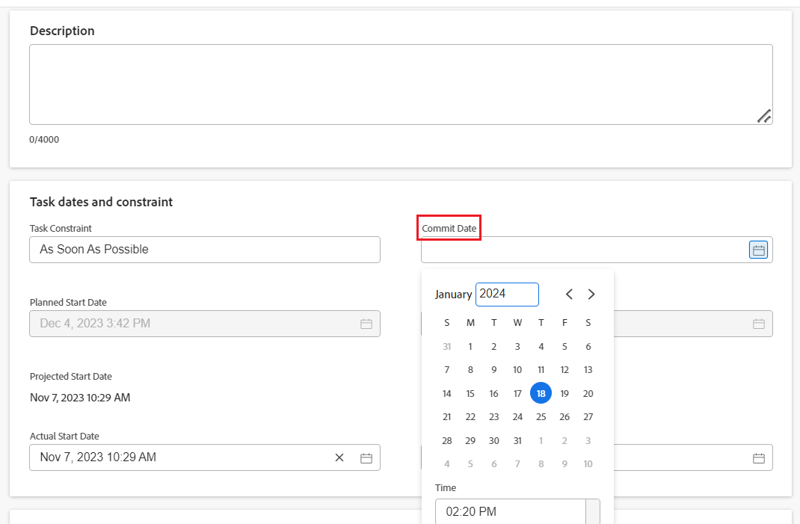

# Update Commit Dates on tasks and issues

<!--Audited: 07/2024-->

<!--The highlighted information on this page refers to functionality not yet generally available. It is available only in the Preview environment for all customers, or in the Production environment for customers who enabled fast releases.

For information about fast releases, see [Enable or disable fast releases for your organization](/help/quicksilver/administration-and-setup/set-up-workfront/configure-system-defaults/enable-fast-release-process.md).

For information about the current release, see [Third Quarter 2024 release overview](/help/quicksilver/product-announcements/product-releases/24-q3-release-activity/24-q3-release-overview.md).-->

You can manually update the Commit date of a task or an issue that you are assigned to. For more information about Commit Dates in Adobe Workfront, see [Commit Date overview](../../../manage-work/projects/updating-work-in-a-project/overview-of-commit-dates.md).

## Access requirements

<!--Audited: 01/2024-->

+++ Expand to view access requirements for the functionality in this article. 

<table style="table-layout:auto"> 
 <col> 
 <col> 
 <tbody> 
  <tr> 
   <td role="rowheader">Adobe Workfront plan</td> 
   <td> 
Any
 </td> 
  </tr> 
  <tr> 
   <td role="rowheader">Adobe Workfront license*</td> 
   <td> 
   New:
   <ul>
   <li>
Standard for tasks
 </li>
   <li>
Contributor or higher for issues
</li>
   </ul>
   Current:
<ul>
   <li>
Work or higher for tasks
</li> 
   <li>
Request or higher for issues
</li>
</ul>

   </td> 
  </tr> 
  <tr> 
   <td role="rowheader">Access level configurations</td> 
   <td> 
Edit access to Tasks and Issues
 </td> 
  </tr> 
  <tr> 
   <td role="rowheader">Object permissions</td> 
   <td> 
Manage permissions on the task or issue
 </td> 
  </tr> 
 </tbody> 
</table>

* For more information, see [Access requirements in Workfront documentation](/help/quicksilver/administration-and-setup/add-users/access-levels-and-object-permissions/access-level-requirements-in-documentation.md). 

+++

## Prerequisites

Before you can edit the Commit Date of a task or issue, you must be assigned to the task or issue whose Commit Date you need to update. 

## Update Commit Dates on tasks and issues

You can update the Commit Date of a task or issue in the following areas of Workfront:

* The Details section of a task or issue
* The task or issue header

   Your Workfront or group administrator must add the Commit Date to the task or issue header of your layout template to view it from the task or issue page. 
   For information, see [Customize object headers using a layout template](/help/quicksilver/administration-and-setup/customize-workfront/use-layout-templates/customize-object-headers.md).

Updating the Commit Date is identical for tasks and issues.

>[!NOTE]
>
>You can ask your system or group administrator to add the Commit Date field to your Summary panel, to make it easier to update it in various areas of Workfront. 
>
>For more information, see the following articles:
>
>* [Summary overview](/help/quicksilver/workfront-basics/the-new-workfront-experience/summary-overview.md)
>* [Customize Home and Summary using a layout template](/help/quicksilver/administration-and-setup/customize-workfront/use-layout-templates/customize-home-summary-layout-template.md). 

1. Go to a task or issue that you are assigned to as the **Owner**.

   For more information about finding out who the Task Owner for an issue or task is, see the section [Edit tasks](../../../manage-work/tasks/manage-tasks/edit-tasks.md#assignments) in the article [Edit tasks](../../../manage-work/tasks/manage-tasks/edit-tasks.md).

1. (Conditional and optional) If your Workfront or group administrator added the Commit Date to your task or issue header, click the **Commit Date** field in the header, then select a date from the calendar. If the Commit Date is not in the header, proceed with the following steps. 

   

1. Click **Task Details** or **Issue Details** in the left panel. 
1. Click **Overview** to expand it.
1. Update the **Commit Date** field.

   

1. Click **Save Changes**.

   The following happens after making this change:

   * The Commit Date and the Planned Completion date of the task or issue are no longer the same.

     Instead, the Commit Date and the Projected Completion Date of the task or issue become the same.

     

   * The Project Owner is notified in a Workfront in-app notification that you have suggested a new Commit Date for the task or issue. 
   * The Project Owner is notified in the Updates section that you have suggested a new Commit Date and they can, at this time, update the Planned Completion Date of the task or issue to match the Commit Date you suggested. 

      
      

     <!---->

     For information about the notifications and updates that are triggered by this change, see the section "Notifications and updates triggered by changing the Commit Date" in the article [Commit Date overview](/help/quicksilver/manage-work/projects/updating-work-in-a-project/overview-of-commit-dates.md).

<!--at the Production update stream when removing legacy - replace the last bullet with: The Project Owner is notified in the Systems Activity and the All tabs of the Updates section that you have suggested a new Commit Date. They can then update the Planned Completion Date accordingly by editing the task or the issue.-->