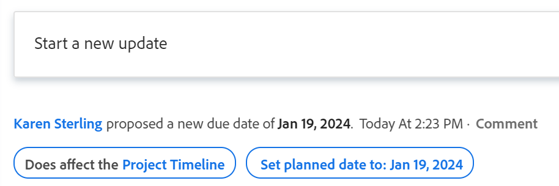

# Update Commit Dates on tasks and issues

You can manually update the Commit date of a task or an issue that you are assigned to. For more information about Commit Dates in&nbsp;Adobe Workfront, see [Commit Date overview](../../../manage-work/projects/updating-work-in-a-project/overview-of-commit-dates.md).

## Access requirements

You must have the following access to perform the steps in this article:

<table style="table-layout:auto"> 
 <col> 
 <col> 
 <tbody> 
  <tr> 
   <td role="rowheader">Adobe Workfront plan*</td> 
   <td> <p>Any</p> </td> 
  </tr> 
  <tr> 
   <td role="rowheader">Adobe Workfront license*</td> 
   <td> <p>Work or higher</p> </td> 
  </tr> 
  <tr> 
   <td role="rowheader">Access level configurations*</td> 
   <td> <p>Edit access to Tasks and Issues</p> <p>Note: If you still don't have access, ask your Workfront administrator if they set additional restrictions in your access level. For information on how a Workfront administrator can modify your access level, see <a href="../../../administration-and-setup/add-users/configure-and-grant-access/create-modify-access-levels.md" class="MCXref xref">Create or modify custom access levels</a>.</p> </td> 
  </tr> 
  <tr> 
   <td role="rowheader">Object permissions</td> 
   <td> <p>Manage permissions on the task or issue</p> <p>For information on requesting additional access, see <a href="../../../workfront-basics/grant-and-request-access-to-objects/request-access.md" class="MCXref xref">Request access to objects </a>.</p> </td> 
  </tr> 
 </tbody> 
</table>

&#42;To find out what plan, license type, or access you have, contact your Workfront administrator.

## Prerequisites

Before you begin, you must be assigned to the task or issue you need to update the Commit Date for.

## Update Commit Dates on tasks and issues

Updating the Commit Date is identical for tasks and issues.

1. Go to a task or issue that you are assigned to as the **Task Owner**.

   For more information about finding out who the Task Owner for an issue or task is, see the section [Edit tasks](../../../manage-work/tasks/manage-tasks/edit-tasks.md#assignments) in the article [Edit tasks](../../../manage-work/tasks/manage-tasks/edit-tasks.md).

1. Click Work on itin the task or issue header

   Or

   Click **Start Task** or **Start Issue** if the Work on it button has been customized in your environment to indicate that you are now working on the work item.

   At this time, the Commit Date and the Planned Completion Date of the task or issue are the same.

1. (Optional) If you clicked Start Task or Start Issue, click **Undo** in the lower-left corner of the screen. The Commit Date is removed.

   For information about replacing the Work On It button with a Start button, see ``` [Replace the Work On It button with a Start button](../../../people-teams-and-groups/create-and-manage-teams/work-on-it-button-to-start-button.md)```.

   >[!TIP]
   >
   >The option to undo your selection to start your work is not available when you click ```Work on it```.

1. Click **Updates** in the left panel, then click the **Start a new update** >**Commit Date**

   Or

   Click **Task Details** or **Issue Details** in the left panel, then double click&nbsp;**Commit Date** and select a new date from calendar, then click&nbsp;**Save Changes**. 
   

   The following things happen after making this change:&nbsp;

   * The Commit Date and the Planned Completion date are no longer the same.

     Instead, the Commit Date and the Projected Completion Date of the task or issue become the same.

     

   * The changes are saved automatically when you select a new date from the Updates area.
   * The Project Owner is notified that you have suggested a new Commit Date for the task or issue and can, at this time, update the Planned Completion Date of the task or issue to match the Commit Date you suggested.

     

     For information about the notifications and updates that are triggered by this change, see the section [Notifications and updates triggered by changing the Commit Date](../../../manage-work/projects/updating-work-in-a-project/overview-of-commit-dates.md#notifica) in the article [Commit Date overview](../../../manage-work/projects/updating-work-in-a-project/overview-of-commit-dates.md).

