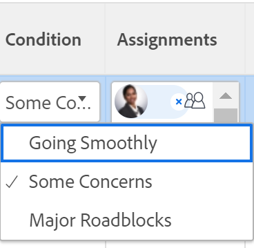
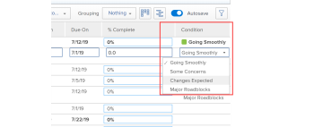

# Update Condition for tasks and issues

{{highlighted-preview}}

The Condition of a task or issue is a flag placed on it to indicate how it's going. This is different than the Status of the work item, which indicates the current stage of the development of the item.

You can set the Condition of a task or an issue either automatically or manually.

The Condition values that we refer to in this article are available in Workfront by default. Your Adobe Workfront administrator can create custom Conditions for your environment, as described in [Create or edit a custom condition](../../../administration-and-setup/customize-workfront/create-manage-custom-conditions/create-edit-custom-conditions.md). 

## Access requirements {#access-requirements}

You must have the following access to perform the steps in this article:

<table style="table-layout:auto"> 
 <col> 
 <col> 
 <tbody> 
  <tr> 
   <td role="rowheader">Adobe Workfront plan</td> 
   <td> 
Any
 </td> 
  </tr> 
  <tr> 
   <td role="rowheader">Adobe Workfront license*</td> 
   <td> 
   
   For the new licenses:
   <ul><li>
Standard for tasks
</li>
   <li>
Contributor or higher for issues
</li></ul>

   For current licenses:
   <ul><li>
Work or higher for tasks
</li>
   <li>
Request or higher for issues
</li></ul>
    </td> 
  </tr> 
  <tr> 
   <td role="rowheader">Access level configurations</td> 
   <td> 
View or higher access to projects
 
Edit access to tasks and issues 
</td> 
  </tr> 
  <tr> 
   <td role="rowheader">Object permissions</td> 
   <td> 
View or higher permissions on tasks and issues to view their Condition

   
Manage permissions on tasks and issues to update the Condition

  </td> 
  </tr> 
 </tbody> 
</table>

*To find out what plan, license type, or access you have, contact your Workfront administrator. For information, see [Access requirements in Workfront documentation](/help/quicksilver/administration-and-setup/add-users/access-levels-and-object-permissions/access-level-requirements-in-documentation.md). 

## Prerequisites

You must be assigned to a task or an issue to be able to manually update its Condition. 

## Locate the Condition of tasks and issues

Conditions display as a flag associated with tasks or issues. They can also be associated with a number which can display in reports instead of the label. For more information about associating conditions with numbers, see [Create or edit a custom condition](../../../administration-and-setup/customize-workfront/create-manage-custom-conditions/create-edit-custom-conditions.md). 

You can locate the Condition of tasks and issues in the following areas of Workfront:

* The Details page, after a Workfront or group administrator adds it to your layout template. For information, see [Customize the Details view using a layout template](/help/quicksilver/administration-and-setup/customize-workfront/use-layout-templates/customize-details-view-layout-template.md). 

* The header of a task or issue, after a Workfront or group administrator adds it to your layout template. For information, see [Customize object headers using a layout template](/help/quicksilver/administration-and-setup/customize-workfront/use-layout-templates/customize-object-headers.md). 

* The Summary panel, after a Workfront or group administrator adds it to your layout template. For information, see [Customize Home and Summary using a layout template](/help/quicksilver/administration-and-setup/customize-workfront/use-layout-templates/customize-home-summary-layout-template.md). 

* Reports and lists when you display the Condition field in a View or Grouping. 

     >[!NOTE]
     >
     >When the word "condition" displays in the Field Name field of a Journal Entry report, this indicates that the Condition of an item was updated. When the Condition field is tracked in Journal Entries reports, the New and Old Number Values display the number associated with the condition instead of its name. If a condition is originally not defined for a task or an issue and you later update it, the journal entry that captures the update will display the Old Number Value of the Condition field as -2,147,483,648.

## Automatically update the Condition by updating the status

When you are assigned a task or issue and you click **Work On It** , Start Task or Start Issue, or update its status, the Condition of the task or issue automatically changes to the default Condition associated with **Going Smoothly**.

For information about using a custom Condition as a default Condition, see the articles  [Set a custom condition as the default for tasks and issues](../../../administration-and-setup/customize-workfront/create-manage-custom-conditions/set-custom-condition-default-tasks-issues.md) and [Set a custom condition as the default for projects](../../../administration-and-setup/customize-workfront/create-manage-custom-conditions/set-custom-condition-default-projects.md).

For information about changing the task status, see [Update task status](../../../manage-work/projects/updating-work-in-a-project/update-task-status.md).

For information about changing the issue status, see [Update issue status](../../../manage-work/projects/updating-work-in-a-project/update-issue-status.md).

For information about setting the Work On It button to a Start Task or Start Issue button, see [Replace the Work On It button with a Start button](../../../people-teams-and-groups/create-and-manage-teams/work-on-it-button-to-start-button.md).

## Manually update the Condition

You must be assigned to a task or the issue or have Manage permissions to it to be able to set the Condition on it.

You can manually update the Condition of a task or issue in a task or issue report or list when  you display the Condition field in the view. 

>[!NOTE]
>
>You can ask your system or group administrator to add the Condition field to your Summary panel, to make it easier to update it in various areas of Workfront. 
>
>For more information, see the following articles:
>
>* [Summary overview](/help/quicksilver/workfront-basics/the-new-workfront-experience/summary-overview.md)
>* [Customize Home and Summary using a layout template](/help/quicksilver/administration-and-setup/customize-workfront/use-layout-templates/customize-home-summary-layout-template.md).

<!--old Condition update - in the commenting stream: 
Updating the Condition of a task or issue differs depending on whether you are assigned to it or not:

* If you are using the legacy commenting experience, you can update the Condition in the Updates tab or in a list of tasks or issues if you are assigned to them. This is not supported in the new commenting experience. For information, see [New commenting experience](/help/quicksilver/product-announcements/betas/new-commenting-experience-beta/unified-commenting-experience.md). 
* You can update the Condition in a list of tasks or issues if you are not assigned to them, only if you have Manage permissions to them. In this case, you cannot update the Condition in the Update tab of the task or issue. -->

To manually update the Condition of a task or an issue do one of the following:

1. To update the Condition of a task or issue in the task or issue header:

     1. (Conditional) If your Workfront or group administrator added the Condition field to the task or issue header of your layout template, click the **Condition** field in the header and select from the following options: 
          * Going Smoothly
          * Some Concerns
          * Major Roadblocks

          
     1. Click Enter to save the Condition. 

1. To update the Condition of a task or issue in the task or issue Details section:

     1. (Conditional) If your Workfront or group administrator added the Condition field to the Details section of a task or issue in your layout template, click **Details** in the left panel, then click the **Condition** field and select from the following options: 
          * Going Smoothly
          * Some Concerns
          * Major Roadblocks
1. Click **Save Changes**. The Condition of the task or issue is updated. 

To update the Condition of a task or issue in a report or list: 

1. Go to a list of tasks or issues that you have Manage permissions to. Ensure the **Condition** field is visible in the list's view. 

1. Update the **Condition** of the issue or task inline, by double-clicking the existing condition and selecting a new value from the drop-down menu. 

    

     >[!NOTE]
     >
     >Conditions can be customized for your environment, so you may find more than three options for Condition in your environment. The names of the Conditions might be different than the ones listed above. For information about customizing Conditions in Workfront, see [Create or edit a custom condition](../../../administration-and-setup/customize-workfront/create-manage-custom-conditions/create-edit-custom-conditions.md).

1. Press **Enter** on your keyboard, or click outside the Condition field to save the new task or issue Condition. 

<!--   
<li data-mc-conditions="QuicksilverOrClassic.Draft mode">
(NOTE: drafted because I can't do this anymore)

If you have Manage permissions to the task or issue but are not assigned to it, perhaps as a project manager, add the <strong>Condition</strong> column to any view you use in a task or issue list, then set the <strong>Condition</strong> in inline edit and press Enter.

For information about adding a column to a view, see <a href="../../../reports-and-dashboards/reports/reporting-elements/views-overview.md" class="MCXref xref">Views overview in Adobe Workfront</a>.
</li>   
     -->

