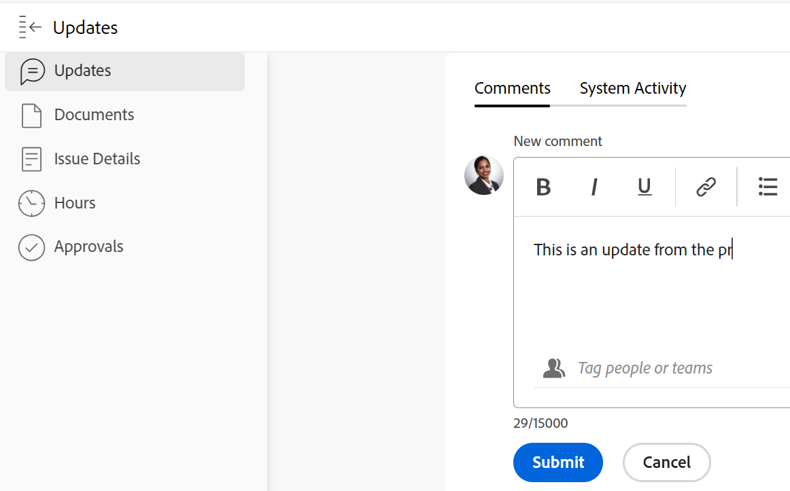
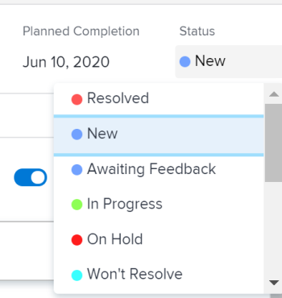

# Update issue status

<!--Audited: 01/2024-->

You can update the status of an issue to inform others about where the issue is and how it is progressing.

## Access requirements

You must have the following access to perform the steps in this article:

<table style="table-layout:auto"> 
 <col> 
 <col> 
 <tbody> 
  <tr> 
   <td role="rowheader">Adobe Workfront plan</td> 
   <td> 
Any
 </td> 
  </tr> 
  <tr> 
   <td role="rowheader">Adobe Workfront license*</td> 
   <td> 
New license: Contributor or higher

   Or
   
Current license: Request or higher

   </td> 
  </tr> 
  <tr> 
   <td role="rowheader">Access level configurations</td> 
   <td> 
Edit access to Issues
 </td> 
  </tr> 
  <tr> 
   <td role="rowheader">Object permissions</td> 
   <td> 
Manage permissions to the issue
 </td> 
  </tr> 
 </tbody> 
</table>

*To find out what plan, license type, or access you have, contact your Workfront administrator. For more information, see [Access requirements in Workfront documentation](/help/quicksilver/administration-and-setup/add-users/access-levels-and-object-permissions/access-level-requirements-in-documentation.md). 

## Issue statuses

The following are the default statuses for issues in Workfront:

* New
* In Progress
* Awaiting Feedback
* On Hold
* Won't Resolve
* Reopened
* Closed
* Resolved

Your Adobe Workfront administrator can add custom statuses for issues for your organization. They can also make statuses available depending on the issue type.

For more information about custom statuses and issue types, see the following articles:

* [Create or edit a status](../../../administration-and-setup/customize-workfront/creating-custom-status-and-priority-labels/create-or-edit-a-status.md) 
* [Create issues](../../../manage-work/issues/manage-issues/create-issues.md)

You can manually update issue statuses or you can let Workfront automatically update them when certain actions take place.

## Manually update issue status

You can update the issue status in the following areas of Workfront:

* The issue header on the task page.
* The Edit issue box, when editing an issue.
* The Details section on the issue page. 
* In an issue list or report, when the Status field is visible in the view. 
* In the Summary panel of the issue. 

To manually update the issue status in the issue header: 

1. Go to an issue for which you want to update the status.
1. Click the **Status** field in the issue header and select a new status. 
1. To provide a visual indication of issue completion, drag or double-click the bubble under **Percent Complete** in the header of the issue

   Or

   Click inside the bubble in the header of the issue to enter a percentage.

   

1. (Optional) Do any of the following to provide additional information about the update:

   * To add a note about the update, go to the **Updates** section and click **New comment**, then type a note.

     

   * To notify certain users about the update, type their names in the **Tag people or teams** field that appears when you type a comment. For more information, see [Tag others on updates](../../../workfront-basics/updating-work-items-and-viewing-updates/tag-others-on-updates.md). 
   * To update the Commit Date of the issue, click **Issue Details**, then edit the **Commit Date** field. For information, see [Edit issues](/help/quicksilver/manage-work/issues/manage-issues/edit-issues.md).  

   >[!IMPORTANT]
   >
   >  Only issue assignees can update the Commit Date. 

<!--Old instructions, in old commenting: 

When you are updating an issue status, you can also add an explanation about the new status and change other issue information such as the commit date.

1. Go to an issue that you are assigned to for which you want to update the status.
1. Click the **Status** field in the issue header and select a new status.

   

1. To provide a visual indication of issue completion, drag or double-click the bubble under **Percent Complete** in the header of the issue.

   Or

   Click inside the bubble in the header of the issue to enter a percentage.

   

-->

## Automatically update issue status

Workfront automatically updates the existing status of an issue to a different status when the actions listed in the table below occur.

>[!NOTE]
>
>The statuses in the following table are default system statuses. Your Workfront administrator or a group administrator can rename the statuses in your instance of Workfront. For information about creating and managing statuses in Workfront, see [Create or edit a status](../../../administration-and-setup/customize-workfront/creating-custom-status-and-priority-labels/create-or-edit-a-status.md).

<table style="table-layout:auto"> 
 <col> 
 <col> 
 <col> 
 <tbody> 
  <tr> 
   <td><b>Action</b></td> 
   <td><b>Original Status</b></td> 
   <td><b>New Status</b></td> 
  </tr> 
  <tr> 
   <td>Update the issue percent complete to 100%</td> 
   <td>New or In Progress</td> 
   <td>Closed</td> 
  </tr> 
  <tr> 
   <td>Update the issue percent complete from 100% to a lower number</td> 
   <td>Closed </td> 
   <td>In Progress</td> 
  </tr> 
  <tr> 
   <td>Update the status of a resolving object attached to the issue</td> 
   <td>Various statuses</td> 
   <td> 
Various statuses
 
For information about resolving objects and how they affect the status of issues, see the section "Synchronize the Status of the Resolvable Object with that of the Resolving Object" in the article <a href="../../../manage-work/issues/convert-issues/resolving-and-resolvable-objects.md" class="MCXref xref">Overview of Resolving and Resolvable Objects </a>.
 </td> 
  </tr> 
  <tr data-mc-conditions=""> 
   <td>Click the Start Issue button to accept working on an issue assigned to you </td> 
   <td>New </td> 
   <td> 
Any status associated with the Start Issue button in your Home Team settings. 
 
For information about replacing the Work On It button with a Start Issue button, see <a href="../../../people-teams-and-groups/create-and-manage-teams/work-on-it-button-to-start-button.md" class="MCXref xref">Replace the Work On It button with a Start button</a>. 
 
Tip: Clicking the Undo button after clicking Start Issue reverts the status to New. 
 </td> 
  </tr> 
 </tbody> 
</table>
