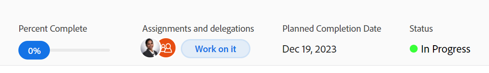
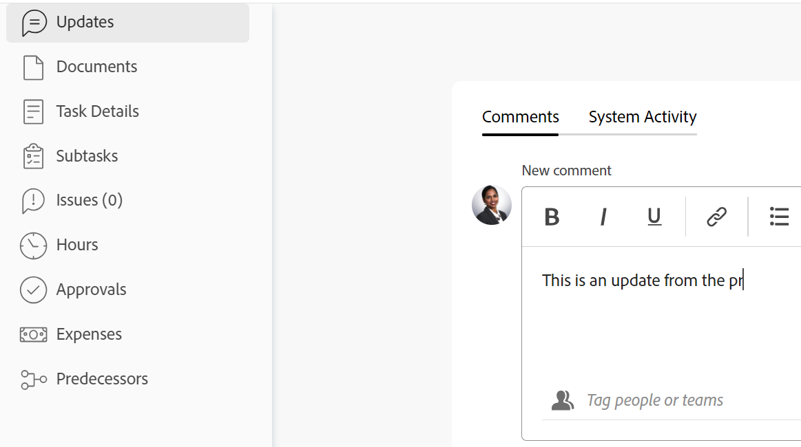

# Update task status

You can update a task's status to inform others about where the task is (and the overall project) and how it is progressing.

The default statuses are New, In Progress, and Complete. Your Adobe Workfront administrator can add custom statuses for your organization. For more information, see [Create or edit a status](../../../administration-and-setup/customize-workfront/creating-custom-status-and-priority-labels/create-or-edit-a-status.md).

You can manually update task statuses or you can let Workfront automatically update them when certain actions take place.

## Access requirements

You must have the following access to manually update tasks: 

<table style="table-layout:auto"> 
 <col> 
 <col> 
 <tbody> 
  <tr> 
   <td role="rowheader">Adobe Workfront plan</td> 
   <td> 
Any
 </td> 
  </tr> 
  <tr> 
   <td role="rowheader">Adobe Workfront license*</td> 
   <td> 
New: Standard
 
   Or
   
Current: Work or higher

   </td> 
  </tr> 
  <tr> 
   <td role="rowheader">Access level configurations</td> 
   <td> 
Edit access to Tasks
  </td> 
  </tr> 
  <tr> 
   <td role="rowheader">Object permissions</td> 
   <td> 
Manage permissions to the task
 </td> 
  </tr> 
 </tbody> 
</table>

*To find out what plan, license type, or access you have, contact your Workfront administrator. For more information, see [Access requirements in Workfront documentation](/help/quicksilver/administration-and-setup/add-users/access-levels-and-object-permissions/access-level-requirements-in-documentation.md). 

## Considerations about updating the Status of tasks

* When you mark a task as Complete, the percent complete of the task updates to 100%. 
* The following scenarios exist for parent tasks: 
  * You cannot update the Status of a parent task to Complete when the Summary Completion Mode of the project is set to Automatic and the subtasks are not completed.
  * You can update the Status of a parent task to Complete when the Summary Completion Mode of the project is set to Manual and the subtasks are completed or incomplete. 

  For more information, see [Edit projects](../manage-projects/edit-projects.md).

## Manually update task status

You can update the task status in the following areas of Workfront:

* The task header on the task page.
* The Edit task box, when editing a task.
* The Task Details section on the task page. 
* In a task list or report, when the Status field is visible in the view. 
* In the Summary panel of the task. 

To manually update the task status in the task header: 

1. Go to an task for which you want to update the status.
1. Click the **Status** field in the task header and select a new status. 
1. To provide a visual indication of task completion, drag or double-click the bubble under **Percent Complete** in the header of the task

   Or

   Click inside the bubble in the header of the task to enter a percentage.

   

1. (Optional) Do any of the following to provide additional information about the update:

   * To add a note about the update, go to the **Updates** section and click **New comment**, then type a note.

     

   * To notify certain users about the update, type their names in the **Tag people or teams** field that appears when you type a comment. For more information, see [Tag others on updates](/help/quicksilver/workfront-basics/updating-work-items-and-viewing-updates/tag-others-on-updates.md).
   * To update the Commit Date of the task, click **Task Details**, then edit the **Commit Date** field. For information, see [Edit tasks](/help/quicksilver/manage-work/tasks/manage-tasks/edit-tasks.md).   

   >[!IMPORTANT]
   >
   >  Only task assignees can update the Commit Date.

<!--old functionality in old commenting: 

1. Go to a task that you are assigned to for which you want to update the status.
1. Click the **Status** field in the task header and select a new status. 
1. (Optional) Do any of the following to provide additional information about the update, then click **Update** or, if the task has the **Complete** status, click **Done:**

   * To add a note about the update, go to the **Updates** area and click **Start a new update**, then type your note.  

   * To notify certain users about the update, type their names in the **Notify** box that appears when you type a note about the update. For more information, see [Tag others on updates](../../../workfront-basics/updating-work-items-and-viewing-updates/tag-others-on-updates.md). 
   * To update the condition of the task, click **Select Condition** to the right of the **Notify** box (these appear when you type a note about the update), then select the condition that best reflects the current condition of the task.
   
   * To update the Commit Date of the task, expand the **Commit Date** drop-down calendar, and select a new Commit Date. 
   * To provide a visual indication of task completion, drag the bubble under Percent Complete or double-click it to enter a percent value.   
     -->

## Automatically update task status

Workfront automatically updates the existing status of a task to a different status when the actions listed in the table below occur.

>[!NOTE]
>
>The statuses in the following table are default system statuses. Your Workfront administrator or a group administrator can rename the statuses in your instance of Workfront. For information about creating and managing statuses in Workfront, see [Create or edit a status](../../../administration-and-setup/customize-workfront/creating-custom-status-and-priority-labels/create-or-edit-a-status.md).

<table style="table-layout:auto"> 
 <col> 
 <col> 
 <col> 
 <tbody> 
  <tr> 
   <td><b>Action</b></td> 
   <td><b>Original Status</b></td> 
   <td><b>New Status</b></td> 
  </tr> 
  <tr> 
   <td>Update the task percent complete to 100%</td> 
   <td>New or In Progress</td> 
   <td>Complete</td> 
  </tr> 
  <tr> 
   <td>Update the task percent complete from 100% to a lower number</td> 
   <td>Complete</td> 
   <td>In Progress</td> 
  </tr> 
  <tr data-mc-conditions=""> 
   <td>Click the Start Task button to accept working on a task assigned to you </td> 
   <td>New </td> 
   <td> 
Any status associated with the Start Task button in your Home Team settings.
 
For information about replacing the Work On It button with a Start Task button, see <a href="../../../people-teams-and-groups/create-and-manage-teams/work-on-it-button-to-start-button.md" class="MCXref xref">Replace the Work On It button with a Start button</a>.
 
Tip: Clicking the Undo buttonafter clicking Start Task reverts the status to New. 
 </td> 
  </tr> 
 </tbody> 
</table>
