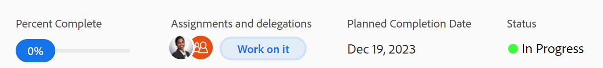

# View and update Percent Complete for tasks

<!--Audited:01/2024-->

You can update the percent complete of a task to indicate the progress that you have made on the task towards completing it. 

## Access Requirements

You must have the following access to manually update tasks: 

<table style="table-layout:auto"> 
 <col> 
 <col> 
 <tbody> 
  <tr> 
   <td role="rowheader">Adobe Workfront plan</td> 
   <td> 
Any
 </td> 
  </tr> 
  <tr> 
   <td role="rowheader">Adobe Workfront license*</td> 
   <td> 
New license: Standard
 
   Or
   
Current license: Work or higher

   </td> 
  </tr> 
  <tr> 
   <td role="rowheader">Access level configurations</td> 
   <td> 
Edit access to Tasks
 </td> 
  </tr> 
  <tr> 
   <td role="rowheader">Object permissions</td> 
   <td> 
Manage permissions to the task
  </td> 
  </tr> 
 </tbody> 
</table>

*To find out what plan, license type, or access you have, contact your Workfront administrator. For information, see [Access requirements in Workfront documentation](/help/quicksilver/administration-and-setup/add-users/access-levels-and-object-permissions/access-level-requirements-in-documentation.md). 

## Areas where you can update the percent complete of a task

You can update the percent complete for a task in any of the following areas:

* **In a task list**: You can update the percent complete of a task when the Percent Complete column is displayed.  
  For more information about inline editing, see [Inline edit items in a list in Adobe Workfront](../../../workfront-basics/navigate-workfront/use-lists/inline-edit-objects.md).

* **In the Milestone view**: You can update the percent complete of a task when using the Milestone view on a project list or a project report. For more information, see [Use the Milestone view](../../../reports-and-dashboards/reports/reporting-elements/use-milestone-view.md).

<!--only in legacy commenting: 
* **As you update the task**:  You can update the percent complete option of a task when adding an update to the task.

  >[!IMPORTANT]
  >
  >This option displays only after you enable the Show Percent Complete option.  
  >To enable the percent complete update bar for tasks, do the following:   
  >
  >1. Go to the **Main** menu>your name>**More** icon next to your name >**Edit** > select **Show percent complete on update status**.   
  >  >-->

* **In the task header**: You can update the percent complete of a task in the task header. For information, see [Edit tasks](../../tasks/manage-tasks/edit-tasks.md).

  

## Considerations about updating the percent complete of a task

* When you mark a task as 100% complete, the task Status updates to Complete. 
* The following scenarios exist for parent tasks: 
  * You cannot update the percent complete of a parent task to 100% when the Summary Completion Mode of the project is set to Automatic and the subtasks are not completed.
  * You can update the percent complete of a parent task to 100% when the Summary Completion Mode of the project is set to Manual and the subtasks are completed or incomplete. 

  For more information, see [Edit projects](../manage-projects/edit-projects.md).

## Update the percent complete of a task

1. Go to any of the following areas in Workfront:

    * A task list
    * A list of projects and apply the Milestone view
    * A task, by accessing the task page
1. Locate the **Percent Complete** field for the task whose percent complete you want to update. 
1. Click inside the Percent Complete field and type a number between 0 and 100
    
    Or

    Click and drag the **Percent Complete** bar to the necessary number to indicate how much of the task you completed, when available.

    >[!NOTE]
    >
    >When you indicate that 100% of the task is completed, the status of the task is also updated to Complete.

1. Press Enter in your keyboard to save the percent complete. 

  The Percent Complete of the project is also automatically updated. 

