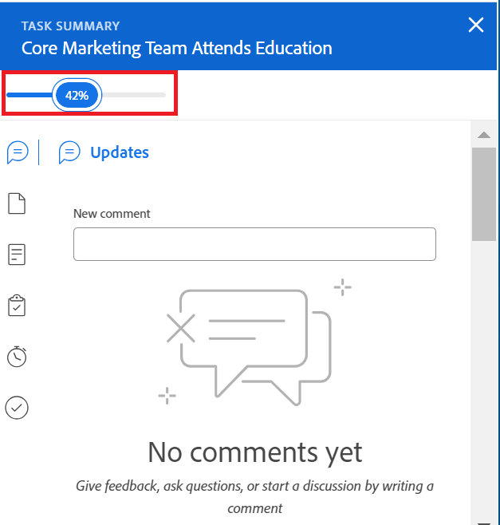

# View and update Percent Complete for tasks

<!--Audited: 05/2025-->

You can update the percent complete of a task to indicate the progress that you have made on the task towards completing it. 

Updating the percent complete for issues is similar to updating it for a task. This article describes how to update the percent complete of a task. 

## Access Requirements

+++ Expand to view access requirements for the functionality in this article. 

<table style="table-layout:auto"> 
 <col> 
 <col> 
 <tbody> 
  <tr> 
   <td role="rowheader">Adobe Workfront package</td> 
   <td> 
Any
 </td> 
  </tr> 
  <tr> 
   <td role="rowheader">Adobe Workfront license</td> 
   <td> 
Standard
 
   
Work or higher

   </td> 
  </tr> 
  <tr> 
   <td role="rowheader">Access level configurations</td> 
   <td> 
Edit access to Tasks
 </td> 
  </tr> 
  <tr> 
   <td role="rowheader">Object permissions</td> 
   <td> 
Manage permissions to the task
  </td> 
  </tr> 
 </tbody> 
</table>

For more information, see [Access requirements in Workfront documentation](/help/quicksilver/administration-and-setup/add-users/access-levels-and-object-permissions/access-level-requirements-in-documentation.md).

+++

<!--Old:
<table style="table-layout:auto"> 
 <col> 
 <col> 
 <tbody> 
  <tr> 
   <td role="rowheader">Adobe Workfront plan</td> 
   <td> 
Any
 </td> 
  </tr> 
  <tr> 
   <td role="rowheader">Adobe Workfront license*</td> 
   <td> 
New license: Standard
 
   Or
   
Current license: Work or higher

   </td> 
  </tr> 
  <tr> 
   <td role="rowheader">Access level configurations</td> 
   <td> 
Edit access to Tasks
 </td> 
  </tr> 
  <tr> 
   <td role="rowheader">Object permissions</td> 
   <td> 
Manage permissions to the task
  </td> 
  </tr> 
 </tbody> 
</table>-->

## Areas where you can update the percent complete of a task

You can update the percent complete for a task in any of the following areas:

* **In a task list**: You can update the percent complete of a task when the Percent Complete column displays. 

  For more information about inline editing, see [Inline edit items in a list in Adobe Workfront](../../../workfront-basics/navigate-workfront/use-lists/inline-edit-objects.md).

* **In the Milestone view**: You can update the percent complete of a task when using the Milestone view on a project list or a project report. 

  >[!TIP]
  >
  >  You cannot update the percent complete of issues in the Milestone view. 

  For more information, see [Use the Milestone view](../../../reports-and-dashboards/reports/reporting-elements/use-milestone-view.md).

* **In the task header**: You can update the percent complete of a task in the task header. 

  

* **In the Summary panel of a task**: You can update the percent complete of a task at the top of the Summary panel when viewing the task in the following areas: 

  * Task list or report
  * Timesheet
  * Workload Balancer

  
  
  For more information, see [Summary overview](/help/quicksilver/workfront-basics/the-new-workfront-experience/summary-overview.md)

* **Home**: You can update the percent complete of a task or issue from the Summary panel in the Home area, or from the My Work widget. 

  For information, see  [Getting started with Home](/help/quicksilver/workfront-basics/using-home/using-the-home-area/get-started-with-home.md). 

## Considerations about updating the percent complete of a task

* When you mark a task as 100% complete, the task Status updates to Complete. An issue's status updates to Closed.
* Completing a task also updates the percent complete of the parent and of the project. 
* The following scenarios exist for parent tasks and projects: 
  * You cannot update the percent complete of a parent task to 100% when the Summary Completion Mode of the project is set to Automatic and the subtasks are not completed.
  * You can update the percent complete of a parent task or of a project to 100% when the Summary Completion Mode of the project is set to Manual and the subtasks are completed or incomplete. 

  For more information, see [Edit projects](../manage-projects/edit-projects.md).

## Update the percent complete of a task

1. Go to any of the areas where you want to update the percent complete of a task. 

    For information, see the section [Areas where you can update the percent complete of a task](#areas-where-you-can-update-the-percent-complete-of-a-task) in this article. 
    
1. Locate the **Percent Complete** field for the task whose percent complete you want to update. 

    >[!TIP]
    >
    >The Percent Complete field always displays at the top of the Summary panel.

1. Click inside the **Percent Complete** field and type a number between 0 and 100
    
    Or

    Click and drag the **Percent Complete** blue bubble to the necessary number to indicate how much of the task you completed, when available.

    >[!NOTE]
    >
    >    * You cannot enter a decimal number when you click inside the Percent Complete bubble.
    >    * When you drag and drop the blue bubble in the Summary panel, the Percent Complete updates in one point increments.
    >
    >    * When you drag and drop the blue bubble in the task header, the Percent Complete updates in 5 point increments.

1. Press Enter on your keyboard to save the percent complete. 

    The Percent Complete of the project or any parent tasks might also automatically update. 

    The status of the task or of the issue also updates. 

